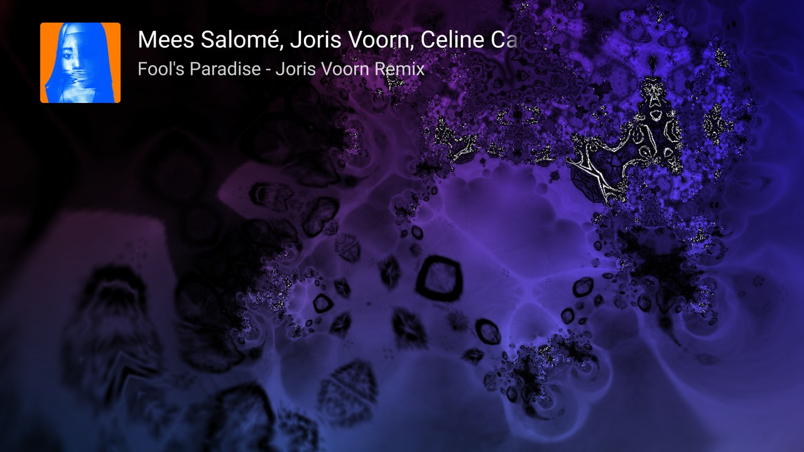
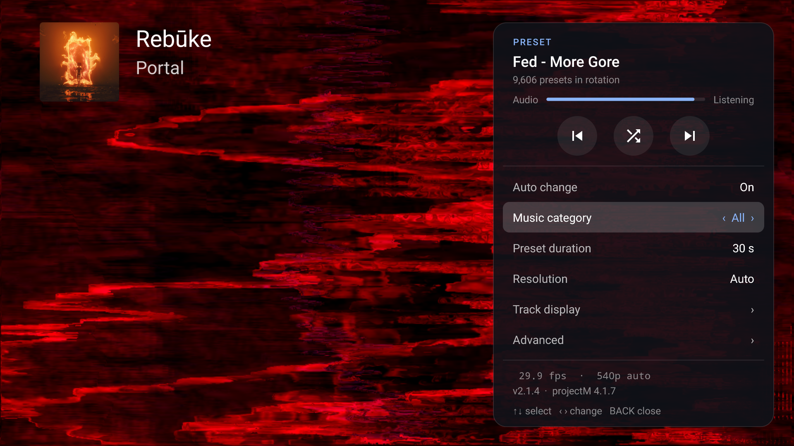
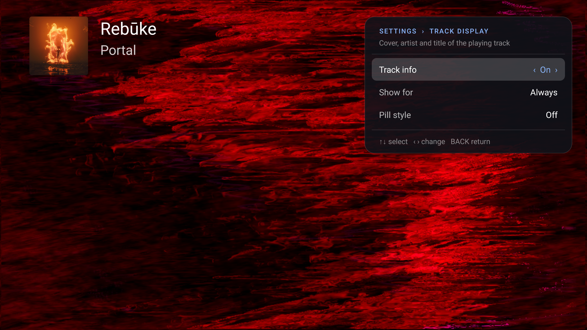
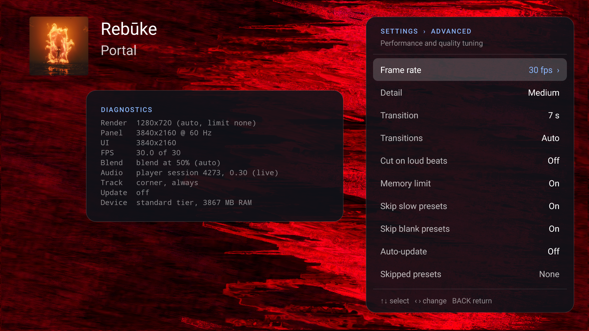

# ProjectM TV

[](https://github.com/johnneerdael/ProjectM-TV/actions/workflows/android.yml)

ProjectM TV is a music visualizer for Android TV, powered by **ProjectM TV Engine**, our extensively modified fork of [projectM](https://github.com/projectM-visualizer/projectm), the open-source reimplementation of Winamp's MilkDrop. Based on upstream version 4.1.7, the engine combines upstream backports with this project's shader and equation compatibility fixes, rendering optimizations, resolution-scaled lines and authored-scale feedback alongside native-resolution geometry and composite output, up to 4K. It ships with 9,606 presets from Jason Fletcher's *Cream of the Crop* collection. It visualizes the music another app plays on the TV, such as SoundCloud. It is not a music player itself.

The engine is designed to preserve the authored look as resolution increases; some presets still differ from MilkDrop or have known visual defects. See [picture limits](#what-it-does-not-do-and-known-limits) and the [patch inventory and upstream attribution](docs/THIRD_PARTY.md), including this project's [shader remainder and operator-precedence fix](https://github.com/projectM-visualizer/projectm/pull/1031) merged upstream.

> **Install on your TV with the Downloader app: code `4821216`**
>
> Install *Downloader* by AFTVnews on the TV, open it, enter **4821216** and install the APK it downloads. The code always points to the newest stable release. Details under [Install](#install).

**Based on testing, at least 2 GB of RAM is highly recommended.** This README describes the current source. The APK and published `:core` library use the Native renderer with Standard trails. Resolution is always automatic: the controller targets the selected frame rate, uses live memory headroom, and can reach the panel’s native 4K size.

<p align="center">
  
</p>
<p align="center">
  
  
  
</p>

## User guide

The [ProjectM TV user guide](https://johnneerdael.github.io/ProjectM-TV/) covers installation, remote controls, settings and troubleshooting. The technical section explains [how the predictive collections work](https://johnneerdael.github.io/ProjectM-TV/predictive-collections/).

## Highlights

- **9,606 curated MilkDrop presets** with smooth blends between them
- **Predictive preset engine (beta):** choose **Chill**, **Normal** or **Intense** by predicted visual activity. **All** remains the default and keeps the full library available.
- **Corrected shader maths** restores colours and detail in presets affected by projectM translator bugs; [proof and upstream contribution](https://github.com/projectM-visualizer/projectm/pull/1031)
- **More presets run their own shaders:** 102 bundled presets that fell back to the default shader because of translator errors (flat array initializers, `sampler_state` blocks) now run as written, and shaders that change `q` variables or `time` start from their real values instead of undefined ones
- **Additional shader compatibility fixes:** presets using a local named `sample`, declaration or statement macros, or swizzles after parenthesized constructors can use their authored shaders. GPU driver acceptance and visual fidelity remain device-dependent.
- **Audio detected about 1 second after launch**, from the music app's own audio session
- **Cover, artist and title** of the playing track on screen, as in Milkbeat
- **No freezes at preset switches**: upcoming presets are prepared in the background, with cached shaders
- **Adaptive resolution** that holds the frame rate, also during blends, without interrupting the picture
- **Optimised projectM**: batched shape drawing (70–90% faster on shape-heavy presets), less memory traffic per frame (on a Mali-G52 10–26% more frames per second on presets with a composite shader, up to twice as many on presets without one), reused picture buffers, fewer redundant GL calls, a faster shader parser
- **Memory-aware**: adjusts resolution to leave headroom for the music app
- **Skips presets that stay black**
- **Optional auto-update**: downloads new releases in the background and offers to install them (off by default)
- **Private by design**: no network access unless you switch on auto-update; audio is analysed in memory only
- **Remote-only control** with a settings panel and live diagnostics

## What it does

- **Visualizes music from another app.** Play music in a music app, then start ProjectM TV. The visuals usually react to the music within a second or two of launch, and within a few seconds after you pause and resume. The app only looks for the music while Android reports that music is playing.
- **Shows 9,606 presets in shuffled order, with smooth blends.** Every 30 seconds by default it blends the old preset into the new one over 7 seconds. The next preset's shaders are compiled in the background beforehand, so the switch does not freeze the picture, and the blend adapts its resolution to keep the frame rate up. Left and Right on the remote cut straight to a random or the previous preset.
- **Offers Chill, Normal and Intense collections.** Open the settings panel and set *Preset mood*. The beta predictor ranks activity from 1 to 100: Chill 1–30, Normal 25–75 and Intense 70–100. The ranges overlap. Automatic changes, Random and Previous stay within your saved collection, subject to existing skip rules. *All* remains the default. Saved Dance selections return to All. [How the predictive collections work](https://johnneerdael.github.io/ProjectM-TV/predictive-collections/).
- **Shows the track that is playing.** The cover, artist and title of the playing track appear in the upper left for as long as it plays (taken from the music app's media session); *Settings › Track display* shows them for 10–60 s per track instead, in the small lower-left pill, or not at all. Covers have only been verified with Spotify and [Milkbeat](https://github.com/johnneerdael/Milkbeat). SoundCloud and SmartTube have been verified to show the artist and title only, without a cover. No other music apps have been verified. This needs *notification access*, see [Track titles](#track-titles) below; without it, nothing is shown. The preset name is in the settings panel.
- **Replaces presets that stay black.** If a preset shows only black for about 7 seconds while music plays, the app moves on. A preset that is black a second time is skipped from then on. Since 1.9.5, the presets that used to be black render; this rule remains as a safety net (details under *Presets* below).
- **Automatic resolution up to native 4K.** The render size follows the target frame rate and live memory headroom. Standard trails keep feedback at an authored canvas while drawing new geometry and the composite at native resolution. Medium and High add more native trail detail when the current render size supports it.
- **Budgets memory for playback.** Automatic resolution uses live available memory and estimates the rendering allocations of trails and transitions. It reserves headroom before growth and lowers resolution under memory pressure. Installed RAM does not impose a fixed 1260p cap; Android/vendor process policies can still reclaim background apps.
- **Starts quickly.** The first preset appears a few seconds after launch.
- **Updates itself, if you want.** With *Settings › Advanced › Auto-update* on, the app checks GitHub for a new release at every launch and every 6 hours while it is open, downloads it in the background, and offers to install it: a notice in the lower left, and an *Install* row at the top of the settings panel. Android's installer asks you to confirm. The first time, it asks you to allow installs from ProjectM TV instead; Android then restarts the app, and you select *Install* once more. Off by default; apps installed from F-Droid are updated by F-Droid.
- **Shows its own measurements.** *Settings › Advanced › Diagnostics* shows the render size, frame rate, audio source and audio level.

## Remote control

| Key | Action |
|---|---|
| Right, Next, Fast forward | Random preset (instant cut) |
| Left, Previous, Rewind | Previous preset (instant cut) |
| Up, Down, Info | Show the current track again (with notification access) |
| Center, Enter, Menu | Open the settings panel |
| Back | Exit the app |

In the panel, Up and Down move between rows, Left and Right change a value, and Center cycles a value or runs an action. Back closes the panel (in *Advanced*, it returns to the main panel), Menu closes it, and it hides itself after 10 seconds without input.

## Settings

The main panel shows the current preset and a live audio level (*Listening*, *Very quiet*, *No sound* or *No access*).

<p align="center">
  
  
  
</p>

These settings captures use an earlier isolated test installation on an Ugoos AM6; the current collection row is named Preset mood. The [setup walkthrough](https://johnneerdael.github.io/ProjectM-TV/getting-started/) shows audio permission and notification access step by step.

| Setting | Values | Default |
|---|---|---|
| Auto change | Off, On | On |
| Preset mood | All, Chill, Normal, Intense | All |
| Preset duration | 10, 15, 20, 30, 45, 60, 90 s | 30 s |

*Track display ›* opens a panel for the playing track:

| Setting | What it does | Default |
|---|---|---|
| Track info | Shows the cover, artist and title of the playing track in the upper left, as Milkbeat does; *Off · Allow* while notification access is missing, select it for how to allow it (see [Track titles](#track-titles)) | On |
| Show for | 10, 20, 30 or 60 s from the start of each track, or *Always* while music plays (it goes when playback stops or pauses) | Always |
| Pill style | Shows the track as one line (*Title — Artist*) in the small pill in the lower left instead | Off |

*Advanced ›* opens a second panel:

| Setting | What it does | Default |
|---|---|---|
| Frame rate | The TV's refresh rate, half or a quarter of it, at least 24 fps (e.g. 30 or 60 fps at 60 Hz) | Half the refresh rate: 30 fps at 60 Hz, 25 at 50 Hz |
| Detail | Mesh detail for preset motion: Minimal, Low, Medium, High, Ultra | Depends on the device |
| Native trails | Standard, Medium, High; active at supported render sizes above 1330p. Medium and High add sharper trail detail and run the same additional passes | Standard |
| Transition | How long the blend from one preset to the next takes: Instant, 1–10 s | 7 s (2 s on low-end devices) |
| Transitions | *Auto* blends the two running presets and keeps the frame rate up: when the GPU is the limit, both render at a lower resolution during the blend (75% to start, down to 50%, back up when there is headroom); when the CPU is the limit, the outgoing preset renders every second frame. *Classic* always blends at full resolution. *Lightweight* fades a still image of the old preset for at most 3 s. | Auto |
| Cut on loud beats | Lets projectM cut to the next preset on a loud beat, like MilkDrop, instead of only blending | Off |
| Skip slow presets | Skips presets that stay below half the target frame rate even at the lowest resolution, or that a lower resolution does not help (limited by the CPU); such a preset is skipped for good on this TV | On |
| Skip blank presets | Moves on from presets that stay black while music plays; skips them for good the second time | On |
| Auto-update | Checks GitHub for a new release at every launch and every 6 hours while open, and downloads it; an *Install* row then appears at the top of the settings panel. *Via F-Droid* when the app was installed from F-Droid | Off |
| Skipped presets | Shows how many presets are skipped; select it to reset the list | – |
| Diagnostics | Render size, panel, UI size, frame rate, Native trails level/canvas or fallback, blend (style and resolution), audio source and level, track display (access, corner or pill, how long), update status, device tier | – |

## What it does not do, and known limits

**Devices.** Based on testing, at least 2 GB of RAM is highly recommended: projectM and the music app together need more than a 1 GB device has. Frame rates and available memory headroom differ per device; measurements from the NVIDIA SHIELD are in the [appendix](#appendix-measurements-on-the-nvidia-shield).

**Audio**
- The app does not play music, and it has no microphone or line-in input. It can only visualize audio that another app plays on the same TV.
- The app listens to the audio session of the app that plays music, which it finds by itself once music plays. It tries the session it found last first, so the visuals usually react within a second or two. If it finds nothing while music plays, it tries again once when the next track starts (with notification access, see [Track titles](#track-titles)), and otherwise once a minute. It does not depend on the TV's audio output setting, such as Dolby or passthrough. It has been verified with Spotify, SoundCloud, SmartTube and [Milkbeat](https://github.com/johnneerdael/Milkbeat); **no other music apps have been verified**.
- Audio that reaches the TV already encoded (for example Dolby bitstreams from a video app) cannot be visualized.
- The audio the visualizer receives is 8-bit mono, which is what Android's visualizer API provides.

**Picture and performance**
- **A preset change is only smooth when it was prepared.** The next preset, and the ones *Random* and *Previous* on the remote would pick, are prepared in the background, so a switch takes a few hundredths of a second. For 20 seconds after Android reports low memory, and while less than 15% of the memory is free, nothing is prepared; a switch then pauses the picture for up to about half a second.
- **Blending two heavy presets is slow.** A blend renders both presets at once. With presets whose equations run for many points or shapes per frame, the CPU is the limit, and the frame rate drops for the length of the blend.
- **Resolution stays automatic.** The controller lowers or raises resolution for the target frame rate and available memory, up to the panel’s native size. The manual Resolution and Memory limit controls are removed; their saved values no longer force a render size or static RAM cap. Standard keeps authored-scale feedback with native new geometry and composite output. Medium and High retain more native trail detail and require more GPU work and texture memory; Medium is a lower gain, not a cheaper mode.
- **One Native core is published.** `projectM-TV-core.aar` and its versioned filename now contain the Native renderer. The separate capped 1330 AAR is retired. At supported render sizes above 1330p, Native trails replaces the old feedback pre-pass. Smaller render sizes or incompatible canvases retain the existing diffusion path. Driver shader/resource failures use the documented fallback, shown in Diagnostics. Waves and shapes now preserve authored feedback behavior while remaining sharp at native resolution; their equations still run once per frame.
- **Memory protection is automatic.** Resolution growth must leave memory headroom for other apps, and memory pressure lowers the render size and pauses preset prewarming. Available memory and estimated rendering allocations guide this decision; Android/vendor process-killing behavior still varies.
- projectM is a reimplementation of MilkDrop. Some presets look different from MilkDrop on Windows, or still render incorrectly.

**Presets**
- 189 of the 9,795 *Cream of the Crop* presets are not included: 116 that cannot react to music, 73 that use images with text, logos or people (one preset is in both groups), and 1 whose texture could not be found.
- You can select All, Chill, Normal or Intense, but cannot search for an individual preset or build custom playlists. Presets play in shuffled order within the selected collection.
- The predictive engine is **beta**. Scores order activity within this library under a short shared quiet/melodic/kick probe using the published core AAR. They are not accuracy percentages or guarantees of calmness. Different songs, random inputs, render sizes and GPUs can change behaviour. Effects with no visible activity in the probe remain in All and are excluded from the curated groups. Device-specific skips can reduce the available counts. The [technical guide](https://johnneerdael.github.io/ProjectM-TV/predictive-collections/) records the protocol and limits.
- The black-preset check has limits. It judges each preset only in the first 20 seconds or so after it starts, and only after 3 seconds of uninterrupted music. "Black" means every sampled pixel is at or below about 8% brightness, so a very dark preset can count as black. After 3 black presets in a row it stops acting until a preset shows something, in case the fault is the renderer rather than the presets.
- Random-image samplers keep their selected image when a preset uses it in both rendering stages, including aliases requesting different filtering or edge wrapping. Short aliases use the same image as their full filename-filtered form. The image is chosen anew for each preset load, so revisiting a preset can look different.
- Versions before 1.9.5 marked some presets as black that now render. If you used an earlier version, reset the skip list: *Settings › Advanced › Skipped presets*.
- Presets whose equations MilkDrop accepts now load: code split across numbered lines, a lone `.` as the number 0, and a stray `;` inside parentheses. Equation code that does not compile in MilkDrop either is left out, as MilkDrop does, and the rest of the preset plays. Earlier versions skipped 27 bundled presets for this reason. If you used an earlier version, reset the skip list to bring them back.

**Other**
- There is no touch or phone support. The app requires Android TV (Leanback).

## Requirements

- An Android TV device with Android 5.0 (API 21) or later
- OpenGL ES 3.0
- At least 2 GB of RAM, highly recommended
- A music app that plays on the same device

## Permissions

The app opens no network connection unless you switch on *Auto-update*, and then only to GitHub, to check for and download a new release. Nothing it hears or reads leaves the TV: audio is analysed in memory for the visuals and never recorded or stored, and track titles are only shown.

| Permission | Why | When it is asked |
|---|---|---|
| Record audio (`RECORD_AUDIO`) | Android's audio visualizer counts as recording. The app attaches it only to the music app's audio session, to animate the presets; the microphone is not used. | At first launch |
| Internet (`INTERNET`) | Only for *Auto-update* (off by default): at every launch and every 6 hours while open, the app asks GitHub for the newest release and downloads it. While *Auto-update* is off, the app makes no connection. Android grants this permission at install and has no switch for it, which is why the app's own setting controls it. | Granted at install |
| Install apps (`REQUEST_INSTALL_PACKAGES`) | Only for *Auto-update*: hands a downloaded update to Android's installer, which asks you to confirm. | The first time you install an update, Android asks you to allow installs from ProjectM TV |
| Notification access (special access) | Only to read which track the music app is playing (its media session), for the track titles. The app reads no notifications. | You switch it on in the TV's settings (*Apps › Special app access › Notification access*); the startup dialog offers Configure to open Android settings and Dismiss to permanently hide the reminder. Optional: without it no titles are shown |

## Install

**On the TV, with Downloader (easiest)**
1. Install *Downloader* by AFTVnews from the TV's app store.
2. Allow it to install apps: Android TV asks for this the first time (*Install unknown apps* for Downloader).
3. Open Downloader, enter the code **4821216** and select *Go*. It downloads the newest stable release; confirm the installation.

The code is an AFTVnews short link to https://github.com/johnneerdael/ProjectM-TV/releases/latest/download/projectM-TV.apk, which always points to the newest stable release. Specific versions (`projectM-TV-<version>.apk`) are under [Releases](https://github.com/johnneerdael/ProjectM-TV/releases).

**From a computer, with adb**
```bash
curl -LO https://github.com/johnneerdael/ProjectM-TV/releases/latest/download/projectM-TV.apk
adb install -r projectM-TV.apk
```

**Then:** start the music in your music app and open ProjectM TV. Android asks for permission to record audio; the app needs it to receive the music (see [Permissions](#permissions)). It then explains how to allow notification access, which lets it show track titles.

To get new versions automatically, switch on *Settings › Advanced › Auto-update* (from 1.9.19). From 1.9.7 on, updates install over the previous version and keep your settings. Two one-time steps if you used an earlier version:
- **1.9.7 changed the app ID** to `nl.neerdael.projectmtv`. It installs as a new app next to the old one; uninstall the old *ProjectM Visualizer* (`com.example.projectm.visualizer`) afterwards.
- Versions up to 1.9.5 were each signed with a different temporary key; 1.9.6 and later use one permanent key.

A version you built yourself is signed with your own debug key: uninstall it before installing a release (this resets the settings).

## Troubleshooting

**The visuals don't react to the music.** If music plays at launch but the app finds no audio, the lower left shows *No audio detected*; the app looks again when the next track starts, and otherwise once a minute. Open *Settings › Advanced* and look at the *Audio* line under *Diagnostics*.
- *no player session found yet* or *silent / no data* right after launch: wait a few seconds while the app looks for the music app's audio session.
- Still silent: the music app may send encoded audio, or it may not have been verified (see *Audio* above). Try one of the verified apps, such as Spotify or SoundCloud, to confirm the setup works.

**It stutters.** Keep *Resolution* and *Advanced › Transitions* on *Auto* and *Advanced › Frame rate* at half the refresh rate (the default, 30 fps at 60 Hz), and lower *Detail* in *Advanced*. *Detail* sets how much per-vertex work every preset does on the CPU, which is often what limits blends. Native holds the panel height rather than lowering it for a slow preset; switch back to Auto if playback stutters or the music app closes.

<a id="track-titles"></a>**No track titles.** Android only shares the playing track with apps that have *notification access* (the app reads no notifications, it needs the access for the media session). Switch it on in the TV's settings under *Apps › Special app access › Notification access › ProjectM TV* (on the NVIDIA SHIELD: *Settings › Device Preferences › Apps › Special app access › Notification access*). Select **Configure** in the startup dialog to open the closest supported Android notification-access page. **Dismiss** permanently hides the automatic reminder. *Settings › Track display › Track info* always reopens setup, and *Diagnostics* shows whether access is granted. See the [screenshot walkthrough](https://johnneerdael.github.io/ProjectM-TV/getting-started/#track-titles).

**The music app closes while the visualizer runs.** Resolution and memory budgeting are always automatic. Use Standard trails and shorter transitions to reduce rendering allocations, and check actual render size and memory status in Diagnostics. Other apps and vendor process policies also affect playback; there is no manual memory-limit switch.

**A preset is black.** The app moves on by itself after about 7 seconds of music, as long as *Skip blank presets* is on. To bring back presets skipped earlier, reset *Skipped presets* in *Advanced*.

## For developers

### Build

```bash
git clone --recurse-submodules https://github.com/johnneerdael/ProjectM-TV.git
# in an existing clone: git submodule update --init --recursive
./gradlew assembleRelease     # non-debuggable APK, signed with your local debug key
adb install -r app/build/outputs/apk/release/app-release.apk
```

Release builds on GitHub are signed with the release key; see [docs/RELEASING.md](docs/RELEASING.md). CI skips feature-branch pushes. PRs targeting `main` run the full build suite after a completed Codex or human review of the latest commit, with all review threads resolved and no outstanding review requests or changes requested. Review evidence must identify the full commit SHA; abbreviated Codex completion text alone does not unlock builds. Each successfully tested merge to `main` publishes a new version. The guide can also be published manually from `main`; both publishing paths share a queue and skip older source revisions. Public release notes come from the PR’s `Release notes` section; CI adds the current Downloader code and download links.

The engine is the `:core` module, which the open-source music streamer [Milkbeat](https://github.com/johnneerdael/Milkbeat) also uses.

Older presets with plain uninitialized shader globals now retain those values as
external inputs; unbound inputs start at zero, and shader writes use initialized
copies for each invocation. Local variables keep their authored initialization
requirements. See [shader initialization analysis](tools/milk-analyzer/README.md)
for the target policy and its legacy-compatibility limits.

Shader translation preserves parsed finite float32 constants, including coefficients
that need more than six significant digits. Earlier builds rounded these values
again when generating GLSL, which could change a preset’s output. The preset files
remain unchanged; GPU arithmetic and full MilkDrop appearance can still differ.
Nonfinite shader literals are rejected through the existing shader fallback path.

### Core rendering policies

Build the single Native `:core` with `./gradlew :core:assembleRelease`. Canonical
`projectM-TV-core.aar` and versioned core downloads contain the same Native-capable
AAR as the APK. Separate capped and `core-native` artifacts are retired for new
releases; old releases remain immutable. The legacy `native` build-property
spelling is accepted, while `capped` is rejected.

The shared QualityController always chooses resolution automatically up to the
panel, using target FPS and live memory headroom. Its legacy fixed-resolution and
static-RAM inputs normalize to Auto. Standard trails is the Android core default;
Medium and High add more trail detail with the same extra passes. Managed clients
review trails/transition together with `setRenderAllocationSettings`, publish
budget-approved dimensions/settings coherently, and acknowledge fresh memory checks
on context recreation. Call `revalidateForAllocationChange` after invalidating the
old FPS generation. The controller compares the resulting tuple against the
allocation before the settings edit, including any height change during that edit:
confirmed reductions wait for the new tuple to render before
sampling memory pressure; net growth and pending allocations receive a full review.
Visibility resumes still use `revalidateForResume`. See [architecture](docs/ARCHITECTURE.md),
[release workflow](docs/RELEASING.md) and [profiling](docs/PROFILING.md).

### projectM

**ProjectM TV Engine** is the maintained fork embedded in both the app and the core AAR used by Milkbeat. The settings panel identifies it by name and labels 4.1.7 as its upstream base. The core AAR shares the app's release version; `ProjectMJNI.getVersion()` continues to report the upstream projectM version for existing consumers. The upstream number alone does not identify the patched engine: use the release version, source revision and artifact checksum when comparing builds.

projectM is built from source with the app. The git submodule `third_party/projectm` is pinned to the 4.1.7 release; the app's CMake applies the patches in `tools/projectm-patches/` (a transition fix from upstream; rendering into the app's own framebuffer, keeping the presets' frames when the render size changes, caches of linked and translated shader programs, fewer redundant GL calls, batched drawing of custom shapes, reuse of framebuffer textures between presets, a faster HLSL parser on Android, corrected floating-point/vector remainder and shader operator precedence, and less memory traffic per frame on tile-based GPUs: discarded render-target contents, fewer full-screen copies, one indexed draw for the warp mesh, the final image drawn straight to the screen; and lines drawn as quads that keep their share of the picture at every render size ([#682](https://github.com/projectM-visualizer/projectm/issues/682)); and shader translation fixes for presets that assign to uniform values such as `q18` or `time`, fill arrays from flat value lists, or declare `sampler_state` blocks; and MilkDrop's equation loading: numbered code lines joined and line comments removed when the code does not compile otherwise, a lone `.` read as 0, and code blocks that do not compile left out instead of failing the preset). The transition fix, the PCM buffer size, parenthesized constructor expressions, the HLSL parser's number scan ([#1030](https://github.com/projectM-visualizer/projectm/pull/1030)), the projectm-eval 1.0.7 evaluator and the remainder/precedence fix ([#1031](https://github.com/projectM-visualizer/projectm/pull/1031), from this project) are already on upstream master for 4.1.8; the rest are specific to this app. The build links projectM statically into `libprojectmtv.so`, for armeabi-v7a and arm64-v8a. The first build per ABI takes a few minutes longer; later builds reuse it. There are no prebuilt binaries in the repository. After pulling a change to one of the patches, reset the submodule first (`git submodule foreach --recursive git checkout -- .`) so the new version applies.

Blur texture allocation now preserves the active render targets on first use and resize. This fixes the host framebuffer error in `midgitstraights of majillaen - featy sweet.milk`; see the [diagnosis and validation](docs/superpowers/evidence/midgit-framebuffer/README.md) for device and appearance limits.

### Tests

```bash
core/src/test/native/run_native_tests.sh   # engine tests and patched projectM regressions (ASan/UBSan)
./gradlew testReleaseUnitTest             # JVM tests
```

### On-device diagnostics

```bash
tools/tv-diagnostics.sh <tv-ip>:5555 --no-install --duration 180
```

The example observes the version already installed without reinstalling it. Omit `--no-install` to build this checkout and install it on the TV. To test the profile build, use `--package nl.neerdael.projectmtv.profile` with `--apk app/build/outputs/apk/profile/app-profile.apk` or `--no-install`. Alternate package IDs are rejected when building or using `--release`, which install `nl.neerdael.projectmtv`. It measures a real cold start (it briefly disallows the app's notification listener, which would otherwise restart the app right after it is stopped, and allows it again), frame rate and actual automatic render sizes, audio source and level, preset load times and memory, and writes a Markdown summary. See [docs/DIAGNOSTICS.md](docs/DIAGNOSTICS.md).

### Documentation

- [docs/ARCHITECTURE.md](docs/ARCHITECTURE.md): design, threading, preset skipping and measurements
- [docs/DIAGNOSTICS.md](docs/DIAGNOSTICS.md): the diagnostics script
- [docs/RELEASING.md](docs/RELEASING.md): signing and releases
- [docs/THIRD_PARTY.md](docs/THIRD_PARTY.md): sources and licences of bundled content
- [RELEASE_NOTES.md](RELEASE_NOTES.md): changes per version

## Credits and third-party content

- [projectM](https://github.com/projectM-visualizer/projectm), the visualization engine (LGPL 2.1)
- *Cream of the Crop* presets, curated by Jason Fletcher (ISOSCELES), via [presets-cream-of-the-crop](https://github.com/projectM-visualizer/presets-cream-of-the-crop)
- The MilkDrop texture pack, and textures from the community *MilkDrop 135k+ Presets MegaPack* collected by Incubo_
- The authors of the MilkDrop presets

projectM is LGPL 2.1; the presets and textures are distributed under CC0 1.0 (see *License*). Sources are listed in [docs/THIRD_PARTY.md](docs/THIRD_PARTY.md).

## License

The app's own code is licensed under the GNU Lesser General Public License, version 2.1; see [LICENSE](LICENSE). This matches projectM.

The bundled presets and textures are distributed under CC0 1.0 ([LICENSES/CC0-1.0.txt](LICENSES/CC0-1.0.txt)): free for any use. The presets and textures themselves were freely released by their authors; authors who want their work removed can open an issue. Details in [docs/THIRD_PARTY.md](docs/THIRD_PARTY.md).

## Appendix: measurements on the NVIDIA SHIELD

These historical figures were measured before the current always-Auto/live-budget policy; they are not current resource limits. They come from two NVIDIA SHIELD Android TVs with Android 11: the 2019 SHIELD TV (`sif`, 2 GB RAM, runs the app 32-bit) and the 2019 SHIELD TV Pro (`mdarcy`, 3 GB RAM, 64-bit). Other devices differ.

- **Startup:** 3–6 seconds from launch to the first preset.
- **Audio:** the visuals react about 1 second after launch (about 5 seconds the very first time). With Dolby or passthrough output, Android's visualizer on the TV's main output (session 0) and Android's playback capture both hear nothing; the music app's own session does. Details in [docs/ARCHITECTURE.md](docs/ARCHITECTURE.md#audio-source).
- **Memory:** Android often reports low memory shortly after launch; *Auto* resolution then stays at 720p for that session. With *Memory limit* on, the 2 GB SHIELD stays at or below 1260p.
- **Frame rate:** heavy presets drop below 60 fps, sometimes to about 20 fps, even at 720p. Blending two heavy presets can drop to 20–30 fps for the length of the blend. At a fixed 4K the SHIELD averaged about 30 fps.
- **Preset switches:** a prepared switch takes a few hundredths of a second; an unprepared one (after a low-memory report) pauses the picture for up to about half a second.
