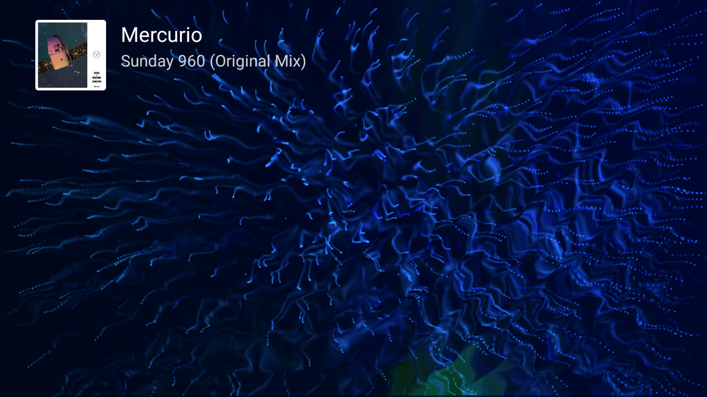
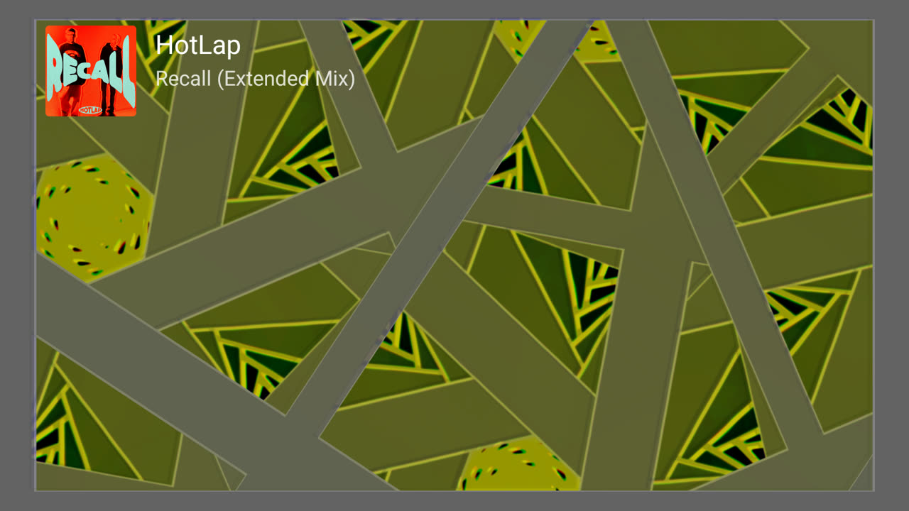
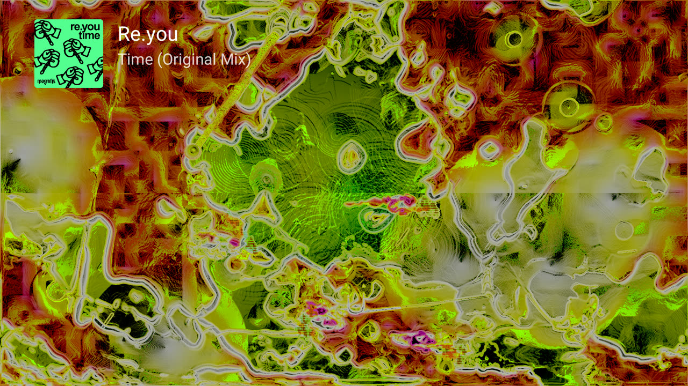

# ProjectM TV

[](https://github.com/johnneerdael/ProjectM-TV/actions/workflows/android.yml)

ProjectM TV is a music visualizer for Android TV. It turns the music another app plays on the TV into MilkDrop visuals, at up to 4K, with 9,606 presets from Jason Fletcher's *Cream of the Crop* collection. It is not a music player itself.

It runs **ProjectM TV Engine**: [projectM](https://github.com/projectM-visualizer/projectm), the open-source reimplementation of Winamp's MilkDrop, based on unreleased projectM 4.2 master (commit `6f6480746`) plus 33 ordered patches. The patches restore MilkDrop 2's behaviour where projectM differs, keep presets at their authored scale on 4K screens, and make preset changes smooth on TV hardware.

> **Install on your TV with the Downloader app: code `4821216`**
>
> Install *Downloader* by AFTVnews on the TV, open it, enter **4821216** and install the APK it downloads. The code always points to the newest stable release. Details under [Install](#install).

<p align="center">
  
</p>
<p align="center">
  
  
  
</p>

## User guide

**[johnneerdael.github.io/ProjectM-TV](https://johnneerdael.github.io/ProjectM-TV/)** covers:

- **Using the app:** installation, remote controls, every setting, [preset moods](https://johnneerdael.github.io/ProjectM-TV/predictive-collections/), custom packs, picture quality and troubleshooting.
- **[ProjectM TV Engine](https://johnneerdael.github.io/ProjectM-TV/engine/):** every patch with before/after proof images, and how 4K rendering keeps the authored look (including the resolution-scaling part of [projectM #682](https://github.com/projectM-visualizer/projectm/issues/682)), and how a frame reaches the TV.
- **[Writing presets](https://johnneerdael.github.io/ProjectM-TV/authoring/):** a source-level guide to how `.milk` presets execute, drawn from MilkDrop 2's code and the analysis of thousands of presets.

## Highlights

- **9,606 MilkDrop presets** with smooth blends, shuffled within the mood you choose.
- **Preset moods (beta):** **All**, **Chill**, **Normal** and **Intense**, from a measured activity score; [predicting presets from their source](https://johnneerdael.github.io/ProjectM-TV/predictor/) is in development.
- **Presets that work as on MilkDrop 2:** equation code MilkDrop tolerated, HLSL its compiler accepted, Direct3D pixel and texel rules, live per-frame waveform and display controls, legacy colour shading and spirals, huge rotations and negative zoom. [Patch catalog](https://johnneerdael.github.io/ProjectM-TV/engine/patches/).
- **4K without the darkness:** lines, blur and texel steps scale with resolution; Native trails keeps feedback at an authored-scale canvas with sharp native geometry on top.
- **No freezes at preset changes:** upcoming presets are compiled in the background.
- **Adaptive quality:** resolution follows the target frame rate and live memory headroom, up to the panel's native size.
- **Track titles:** cover, artist and title of the playing track, from the music app's media session.
- **Custom preset packs:** upload up to 50,000 presets and textures from a phone by scanning a QR code.
- **Private:** audio is analysed in memory only. Network use is the opt-in auto-update and the temporary local upload page.
- **Remote-only control** with a settings panel and live diagnostics.

## Remote control

| Key | Action |
|---|---|
| Right, Next, Fast forward | Random preset (instant cut) |
| Left, Previous, Rewind | Previous preset (instant cut) |
| Up, Down, Info | Show the current track again (with notification access) |
| Center, Enter, Menu | Open the settings panel |
| Back | Exit the app |

In the panel, Up and Down move between rows, Left and Right change a value, and Center cycles a value or runs an action. Back closes the panel (from *Advanced* or *Track display* it returns to the main panel), Menu closes it, and it hides itself after 10 seconds without input.

## Settings

<p align="center">
  
  
  
</p>

| Setting | Values | Default |
|---|---|---|
| Auto change | Off, On | On |
| Preset mood | All, Chill, Normal, Intense, Custom (after upload) | All; Custom after an upload |
| Preset duration | 10, 15, 20, 30, 45, 60, 90 s | 30 s |

*Track display ›*

| Setting | What it does | Default |
|---|---|---|
| Track info | Cover, artist and title in the upper left; *Off · Allow* while notification access is missing | On |
| Show for | 10, 20, 30 or 60 s from the start of each track, or *Always* while music plays | Always |
| Pill style | One line (*Title — Artist*) in the lower-left pill instead | Off |

*Advanced ›*

| Setting | What it does | Default |
|---|---|---|
| Resolution | Auto; fixed 720p, 1080p, 1440p, 4K up to the panel; Native. Memory protection stays active | Auto |
| Frame rate | The refresh rate, half or a quarter of it, at least 24 fps | About 30 fps (30 at 60 Hz, 25 at 50 Hz) |
| Detail | Warp mesh: Minimal, Low, Medium, High, Ultra | High on SHIELD/Tegra, Low on low-RAM devices, otherwise Medium |
| Native trails | Standard, Medium, High; active above 1330p | Standard |
| Transition | Instant, 1–10 s | 7 s (2 s on low-RAM devices) |
| Transitions | Auto, Lightweight, Classic | Auto |
| Cut on loud beats | Lets projectM cut to the next preset on a loud beat | Off |
| Skip slow presets | In Auto resolution, skips presets that cannot reach half the target frame rate | On |
| Skip blank presets | Moves on from presets that stay black while music plays; skips them for good the second time | On |
| Auto-update | Checks GitHub for new stable releases; *Via F-Droid* for F-Droid installs | Off |
| Custom preset pack | Upload one ZIP from a phone or computer on the same network | No pack |
| Skipped presets | Count of skipped presets; select to reset | – |

Opening *Advanced* also shows a **Diagnostics** card: render size, memory status, panel and UI size, frame rate, Native trails state, blend, audio source and level, track display, update status and device tier. The [settings reference](https://johnneerdael.github.io/ProjectM-TV/settings/) explains every value.

## Requirements and limits

- Android TV or Google TV, Android 5.0 (API 21) or later, OpenGL ES 3.0. No touch or phone support.
- At least 2 GB of RAM is highly recommended.
- A music app playing **on the same device**. Verified: Spotify, SoundCloud, SmartTube and [Milkbeat](https://github.com/johnneerdael/Milkbeat). The app has no microphone or line-in input, and audio that reaches the TV already Dolby-encoded cannot be visualized. The visualizer receives 8-bit mono audio.
- Preset moods are a beta prediction from one short measurement per preset; they will be improved. Chill is not a guarantee of no flashing.
- Some presets still look different from MilkDrop on Windows: random textures change per load, chaotic presets diverge, and GPU drivers differ in undefined arithmetic. Negative warp zoom follows MilkDrop 2’s CPU power calculation for valid integer nested exponents; fractional negative powers still have nonfinite coordinates with no portable appearance guarantee.
- 189 of the 9,795 *Cream of the Crop* presets are not included: 116 cannot react to music, 73 use images with text, logos or people (one is in both groups), and 1 has a missing texture.

## Permissions

| Permission | Why | When |
|---|---|---|
| Record audio | Android's audio visualizer counts as recording. The app attaches only to the music app's audio session; the microphone is never used | First launch |
| Internet | Auto-update (off by default) and the local custom-pack upload page while its dialog is open | Granted at install |
| Install apps | Only for auto-update: hands a downloaded update to Android's installer | The first time you install an update |
| Notification access | Only to read the music app's media session for track titles; no notifications are read | Optional, via *Track display › Track info* |

Nothing the app hears or reads leaves the TV.

## Install

**On the TV, with Downloader**

1. Install *Downloader* by AFTVnews from the TV's app store and allow it to install apps.
2. Open Downloader, enter **4821216** and confirm the installation.

The code links to https://github.com/johnneerdael/ProjectM-TV/releases/latest/download/projectM-TV.apk. Every version is under [Releases](https://github.com/johnneerdael/ProjectM-TV/releases).

**From a computer**

```bash
curl -LO https://github.com/johnneerdael/ProjectM-TV/releases/latest/download/projectM-TV.apk
adb install -r projectM-TV.apk
```

Start music on the TV, open ProjectM TV and allow audio recording. The [getting-started guide](https://johnneerdael.github.io/ProjectM-TV/getting-started/) walks through permissions and track titles with screenshots. Releases are signed with one permanent key; a build signed with your own debug key must be uninstalled before installing a release.

<a id="track-titles"></a>For troubleshooting audio, track titles, stutter and black presets, see the [troubleshooting guide](https://johnneerdael.github.io/ProjectM-TV/troubleshooting/).

## For developers

```bash
git clone --recurse-submodules https://github.com/johnneerdael/ProjectM-TV.git
./gradlew assembleRelease                    # APK + core AAR (signed with your local debug key)
./gradlew testDebugUnitTest                  # JVM tests
core/src/test/native/run_native_tests.sh     # native engine and projectM regression controls
```

- **Engine:** the `:core` module builds projectM from the submodule `third_party/projectm`, pinned to `6f64807467e312034883a4389e6aa80a675458bc`, and applies [`tools/projectm-patches/`](tools/projectm-patches) at configure time. Never edit the submodule; add a patch. CMake reports `4.2.0`, but upstream has not released this snapshot as 4.2. `ProjectMJNI.getVersion()` reports that upstream number; identify a build by release version, source revision and artifact checksum.
- **Core library:** each release publishes `projectM-TV-core-<version>.aar` (and the alias `projectM-TV-core.aar`), which [Milkbeat](https://github.com/johnneerdael/Milkbeat) consumes.
- **Contributing:** pull requests to `main` run the full build after a completed review of their latest commit. Each tested merge publishes a new version automatically, with release notes from the PR's `## Release notes` section.

Further reading: [build and test guide](https://johnneerdael.github.io/ProjectM-TV/development/), [architecture](docs/ARCHITECTURE.md), [patch assessment](docs/UPSTREAM_PATCH_VALUE.md), [releasing](docs/RELEASING.md), [diagnostics](docs/DIAGNOSTICS.md), [profiling](docs/PROFILING.md).

## Credits and third-party content

- [projectM](https://github.com/projectM-visualizer/projectm), the visualization engine (LGPL 2.1), including this project's [shader remainder and precedence fix](https://github.com/projectM-visualizer/projectm/pull/1031) merged upstream
- *Cream of the Crop* presets, curated by Jason Fletcher (ISOSCELES), via [presets-cream-of-the-crop](https://github.com/projectM-visualizer/presets-cream-of-the-crop)
- The MilkDrop texture pack, and textures from the community *MilkDrop 135k+ Presets MegaPack* collected by Incubo_
- The authors of the MilkDrop presets

Sources and licences are listed in [docs/THIRD_PARTY.md](docs/THIRD_PARTY.md).

## License

The app's own code is licensed under the GNU Lesser General Public License, version 2.1; see [LICENSE](LICENSE). This matches projectM.

The bundled presets and textures are distributed under CC0 1.0 ([LICENSES/CC0-1.0.txt](LICENSES/CC0-1.0.txt)): free for any use. The presets and textures themselves were freely released by their authors; authors who want their work removed can open an issue. Details in [docs/THIRD_PARTY.md](docs/THIRD_PARTY.md).
