# What our current projectM patches change

This page compares upstream projectM 4.2 development with our library. Each section
shows the rendered difference and explains its cause. The locked 15 current patches are
listed in build order; older patch history is kept in the evidence archive.

## Single-page comparison overview

Images use a GPU-accelerated Android TV emulator with matched preset, textures,
audio, time and seed. Zooms enlarge the same pixels without changing brightness.
A middle column, where present, removes one patch to isolate its effect. Generated
controls are labeled; a rejected render is an error panel, not a black screenshot.

Earlier images use our 13-patch snapshot `654815d8`; 0014 uses the current 14-patch
snapshot `41ec3fc1`. The publication scope is locked to main `120547f3`, including0015. Earlier captures retain their original snapshot identities;0003,0011 and0015 now have locked15-patch comparisons.
The upstream renderer matches master `e98fca85`; capture adjustments and source
identities are recorded in the [evidence record](superpowers/evidence/current-patch-proof/README.md).

## 0001 — TV rendering and preset compatibility

This consolidated patch contains several changes. The examples below cover
line scaling, equation loading and resource handling separately.

### Lines at 4K

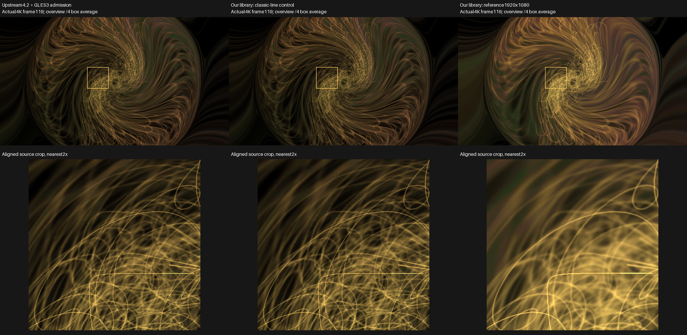

In **Geiss — 3D — Shockwaves**, upstream's thin loops fade into the background at 4K.
Our classic-line control looks almost the same. Enabling reference-scaled lines
keeps the loops broader and more visible; the close-up shows the stroke difference.

Fixed one-pixel lines shrink relative to the picture as resolution increases.
Our optional quad renderer scales their width from a chosen reference size.
This addresses the scaling requested in [upstream #682](https://github.com/projectM-visualizer/projectm/issues/682).
It uses miter joins and flat ends; rounded joins/caps are not implemented.
[Line evidence](superpowers/evidence/current-patch-proof/components/lines/README.md).

### Presets that fail to load

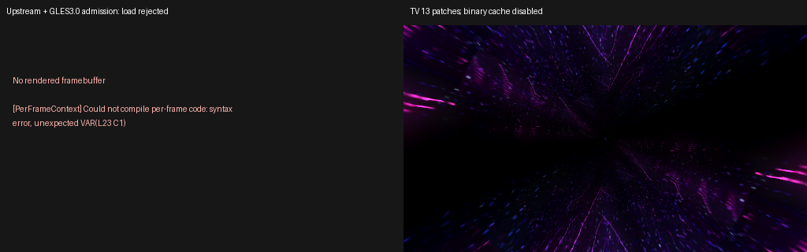

Upstream rejects **161.milk** before producing a frame. Our library accepts its
legacy split equation records and renders the preset. The reader retries those
records using MilkDrop-compatible joining rules; genuinely rejected code remains
reported. The left panel is the load error, not rendered output.

### Shader cleanup and texture initialization

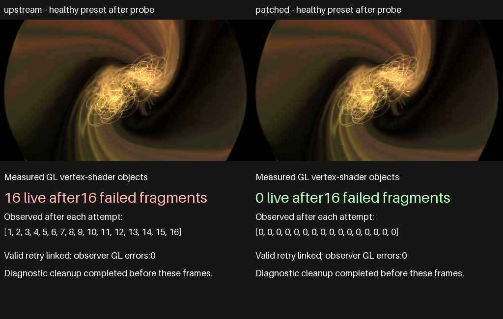

After 16 intentionally rejected fragment compilations, upstream leaves 16 vertex
shaders alive; ours leaves none. The vertex shader succeeded before the fragment
failed, so the patch deletes that unattached object before rethrowing the error.
The normal preset pictures show rendering still works; the counters show the fix.
[Shader evidence](superpowers/evidence/current-patch-proof/components/shader-lifetime/README.md).

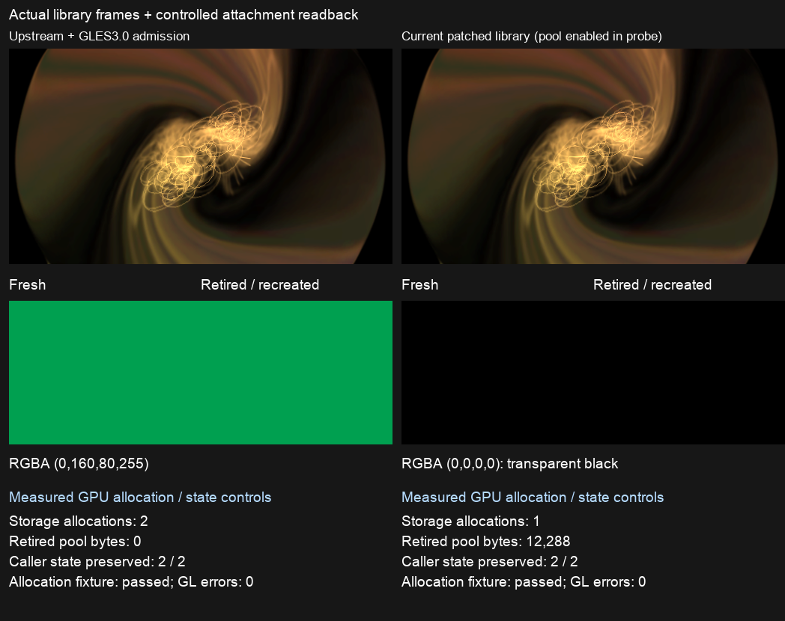

The lower panels test first-read texture contents. A shared allocator deliberately
fills new storage green: upstream leaves it there, while ours clears fresh and
reused attachments to transparent black. This is a labeled diagnostic, not a
naturally green artist preset. With pooling enabled, ours reuses one allocation
instead of making two. Pooling retains storage and is off by default.
[Texture evidence](superpowers/evidence/current-patch-proof/components/texture-history/README.md).

Batching, caches, pass reductions and Native-trails replay also remain in 0001.
Their deeper optimization/lifecycle comparisons are deferred to a follow-up.
[Patch source](../tools/projectm-patches/0001-tv-rendering-and-preset-compatibility.patch).

## 0002 — HLSL compatibility and finite float round trips

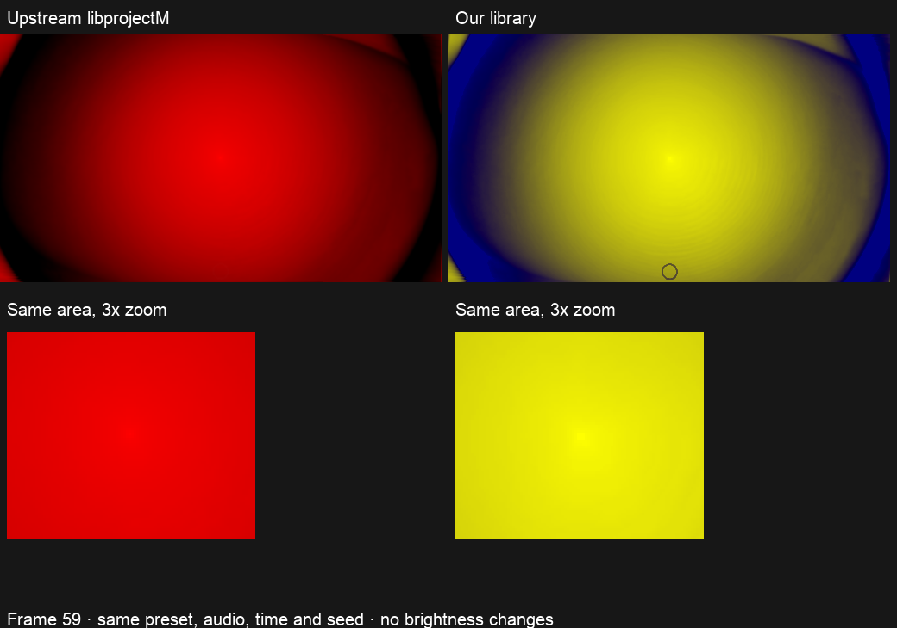

**Flexi — madness portal** becomes a plain red disc in upstream. Ours runs the
artist's yellow/blue composite with its fine circular detail. The shader declares
a local variable named `sample`; the old parser treats it as a reserved word,
rejects the shader and uses a fallback. The contextual-identifier fix allows it.
[Single-patch control](superpowers/evidence/current-patch-proof/0002-clear-original.png).

### Array layout

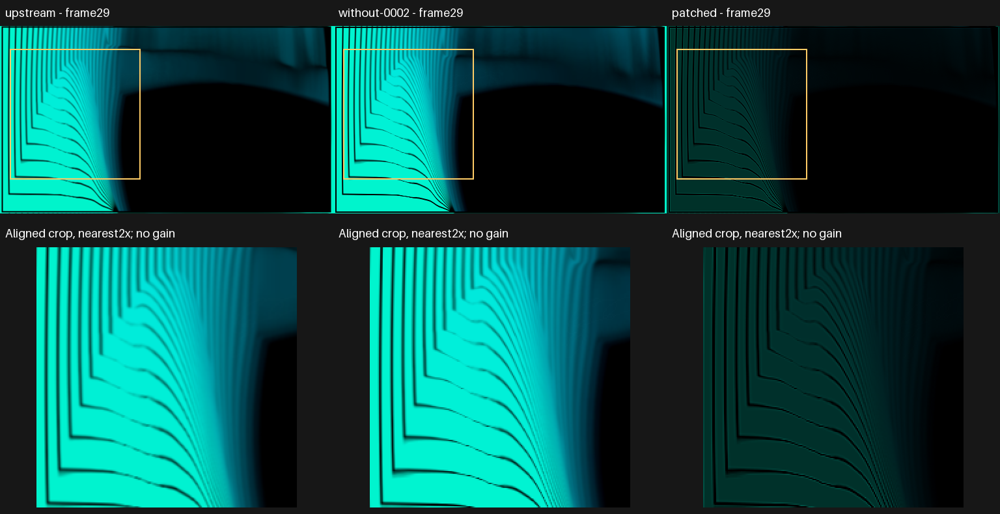

In **ORB — Quicksand Lab**, upstream uses the brighter cyan fallback. Our library
runs the authored five-tap filter, producing dimmer regions and stronger edges.
The shader fills five `float4` elements from 20 scalar values; the translator must
group those values into vectors and initialize the array correctly.
[Original-preset evidence](superpowers/evidence/current-patch-proof/components/arrays-quicksand/README.md).

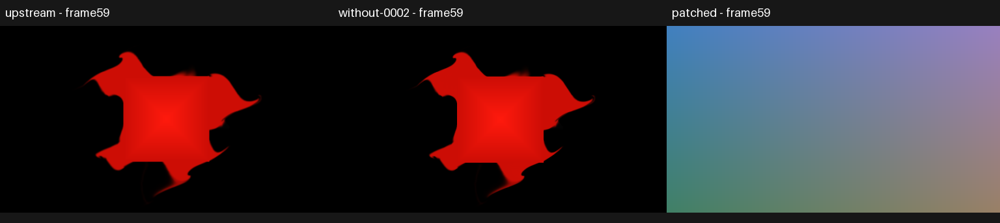

This generated local-array control shows the same issue inside a function:
a red fallback becomes the intended gradient. It tests local layout separately
from Quicksand's global array.

### Writes to shader inputs

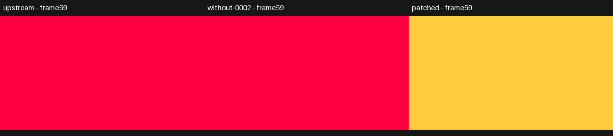

The generated control writes `q18` but still needs incoming `q19=0.8`.
Upstream loses the green component; ours preserves it. The writable copy now
starts from the whole incoming uniform bank instead of uninitialized storage.

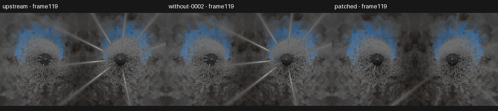

In **Martin — QBikal — Surface Turbulence**, the shader scales `time` before star
helpers read it. Our initialized copy is shared with those helpers, restoring the
authored star/ray arrangement. The preset itself is unchanged.
[Uniform evidence](superpowers/evidence/current-patch-proof/components/uniform-time-helper/README.md).

0002 also preserves float32 constants when emitting GLSL and supports the retained
macro/postfix and implicit-input rules.
[Patch source](../tools/projectm-patches/0002-hlsl-compatibility-and-float-roundtrip.patch).

## 0003 — Evaluator random state and lone-dot numbers

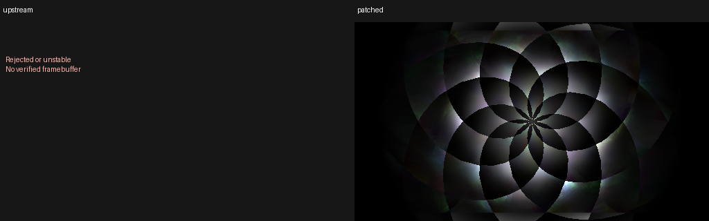

**Stahlregen — funky Blur** uses a lone `.` in its zoom equation. Upstream rejects
it; a tolerant loader without 0003 omits that code and produces a different pattern.
Ours reads the dot as zero, matching the equation language's intended behavior.

The patch also gives each evaluator thread its own random state, preventing
background preparation from advancing the foreground stream. That part is checked
with thread/stream controls, rather than inferred from this picture.
[Evidence](superpowers/evidence/current-patch-proof/reproduction-validation.json) ·
[Patch source](../tools/projectm-patches/0003-evaluator-thread-local-rand-and-lone-dot.patch).
[Locked15 image/failure receipts](superpowers/evidence/current-patch-proof/components/locked15-lone-dot/README.md)
and [complete evaluator control](superpowers/evidence/current-patch-proof/components/locked15-evaluator/README.md).

## 0004 — Main-textured shape sampler ownership

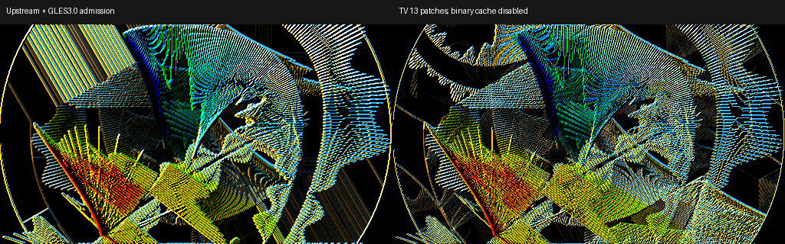

In **widest swing**, look at the large yellow/blue textured shape toward the top
left. Its feedback sampling changes when a sampler left on texture unit zero
interferes with the shape. Ours explicitly owns repeat/linear sampling for each
main-textured fill, including replayed geometry.
[Single-patch comparison](superpowers/evidence/current-patch-proof/0004-sampler-isolated.png) ·
[Patch source](../tools/projectm-patches/0004-textured-shape-sampler.patch).

## 0005 — Safe blur intervals

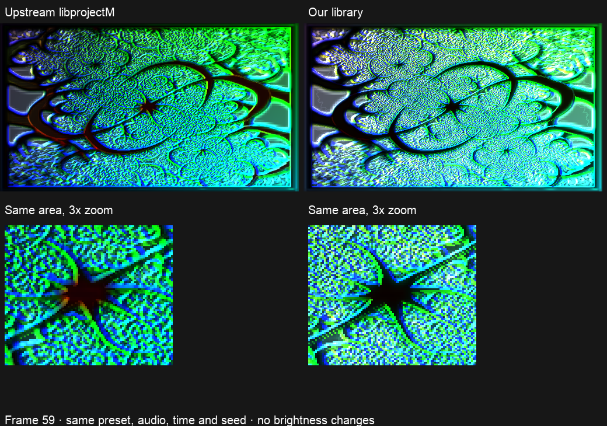

In **Flexi — a julia fractal for hexcollie embossed (Jelly)**, our image has different
relief and highlights around the same fractal. The zoom makes the changed shading
visible around the dark central shape.

The authored blur bounds become a narrow/inverted interval after clamping.
A typo moved both repaired bounds downward, collapsing the interval and allowing
division by zero. Ours moves the upper bound upward and keeps blur storage and
decoding consistent; the artist's shader stays unchanged.
[Single-patch comparison](superpowers/evidence/current-patch-proof/0005-clear-original.png) ·
[Patch source](../tools/projectm-patches/0005-blur-range-interval.patch).

## 0006 — Signed unit-exponent zoom

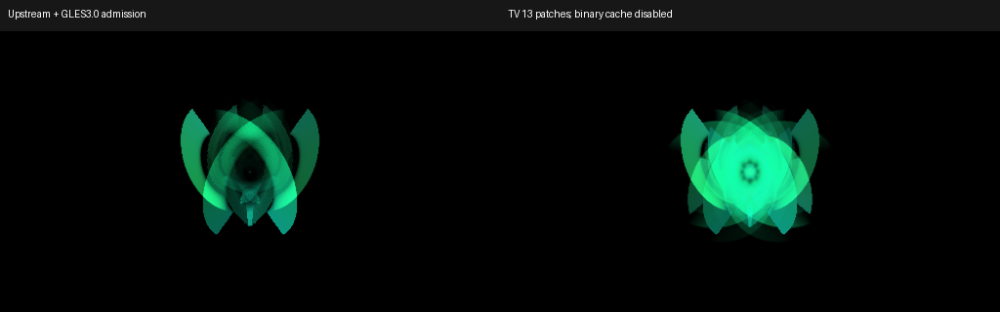

**Hexcollie — This is where we begin stripped** develops a different green center
and feedback structure. It uses negative zoom with exponent one. Sending that to
GLSL `pow` is undefined even though the intended result is simply the signed base.
Ours preserves that signed base and the reflected transform. Patch0015 carries this case into its broader CPU-power path.
[Single-patch comparison](superpowers/evidence/current-patch-proof/0006-zoom-isolated.png) ·
[Patch source](../tools/projectm-patches/0006-fixed-warp-signed-unit-zoom.patch).

## 0007 — Evaluated built-in waveform controls

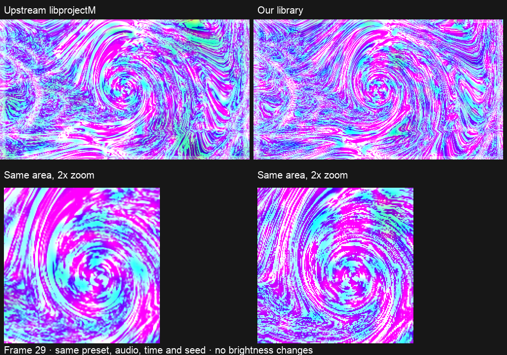

The **Hexcollie — now entering the wormhole2** preset sets one initial wave mode,
then changes it through `wave_mode=q8%7`. The old renderer kept drawing the initial
mode. Ours follows the evaluated mode, changing the wave geometry and the feedback
it leaves behind. The matching zoom shows the changed structure.
[Upstream/current frames](superpowers/evidence/current-patch-proof/0007-wormhole.png) ·
[Patch source](../tools/projectm-patches/0007-live-builtin-wave-controls.patch).

## 0008 — Evaluated legacy display controls

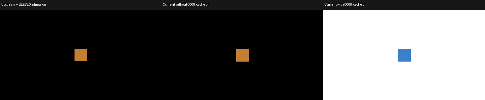

This generated control turns inversion on through an equation. Upstream keeps
the orange shape on black; ours changes to the inverted blue shape on white.
The renderer now consumes evaluated gamma, echo and filter flags each frame,
including filters that start disabled. Custom composite shaders keep their own
presentation rules.
[Patch source](../tools/projectm-patches/0008-live-legacy-display-controls.patch).

## 0009 — User-texture premultiplication bytes

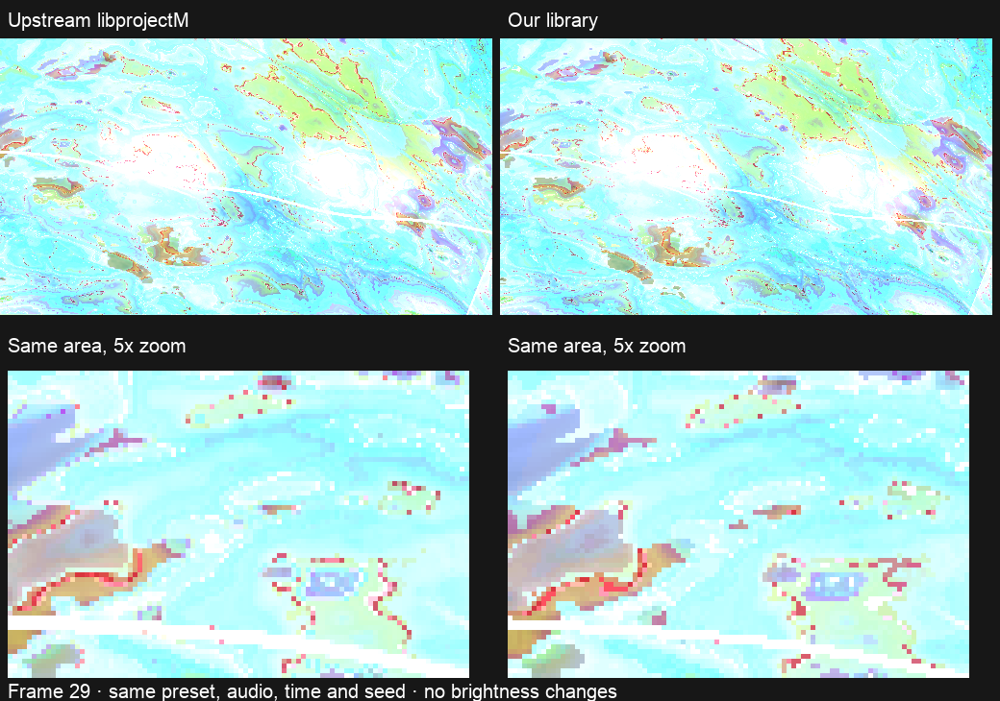

In **Suksma — chemosynthetic nosferatu — rand tritex**, compare the colored
contours in the zoom. Small texture-upload byte differences grow through feedback.
Our loader preserves the released SOIL2 premultiplication/rounding bytes, including
opaque-channel rounding. This is a texture compatibility choice, not a general
brightness boost.
[Byte and frame evidence](superpowers/evidence/current-patch-proof/visibility-figures.json) ·
[Patch source](../tools/projectm-patches/0009-user-texture-premultiplication.patch).

## 0010 — Per-preset texture search-path ownership

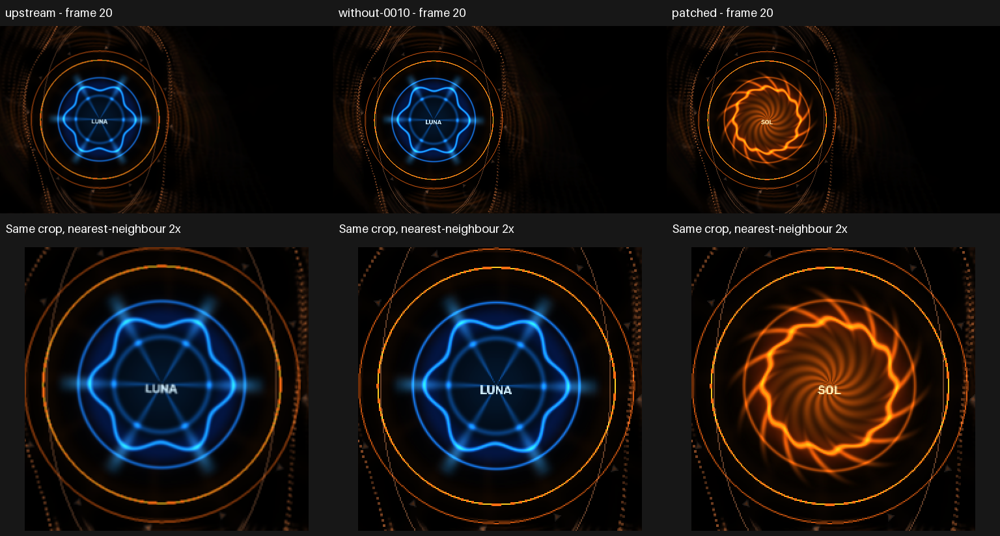

This is an **enhancement for hosts switching custom packs**. Both generated packs
contain `aurora_ownership_core.png`, but in separate texture directories: SOL's
image is orange and LUNA's is blue. At frame 20 the host changes directories before
loading LUNA. Upstream replaces SOL's emblem; ours keeps SOL's image until the
preset retires, including during a fade/reset.

Upstream uses the current global texture lookup. Ours retains the lookup that
belonged to each preset when it loaded. Ordinary Cream of the Crop switching uses
one shared directory and does not trigger this case. It is not a MilkDrop bug.
[Pack sequence and evidence](superpowers/evidence/current-patch-proof/aurora-ownership/README.md) ·
[Patch source](../tools/projectm-patches/0010-preset-texture-search-path-ownership.patch).

## 0011 — CPU warp rotation trigonometry

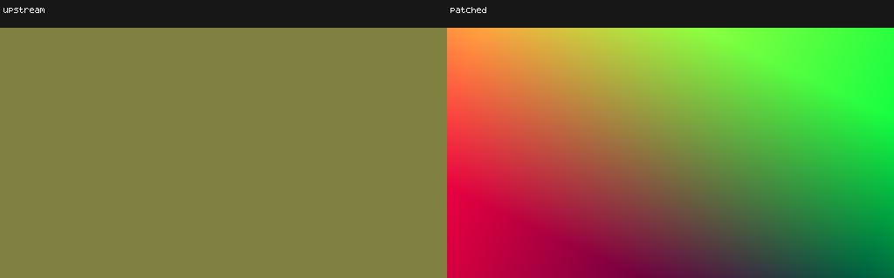

The **EoS/Phat/PeterP/Sentinel/Aware** witness uses `rot=10000000`. This labeled
coordinate-color control uses the same angle: upstream collapses the field to one
color, while ours preserves the rotation. GPU sine/cosine lost the transform on
the tested driver; ours computes both on the CPU after float conversion.

The [original preset image](superpowers/evidence/current-patch-proof/0011-rotation.png)
is dark and upstream also rejects an equation, so it is kept as supporting evidence.
The clear control above is generated, not the original artwork.
[Locked-source verification](superpowers/evidence/current-patch-proof/components/locked15-rotation/README.md) ·
[Patch source](../tools/projectm-patches/0011-cpu-warp-rotation-trig.patch).

## 0012 — Custom-shape pixel centres

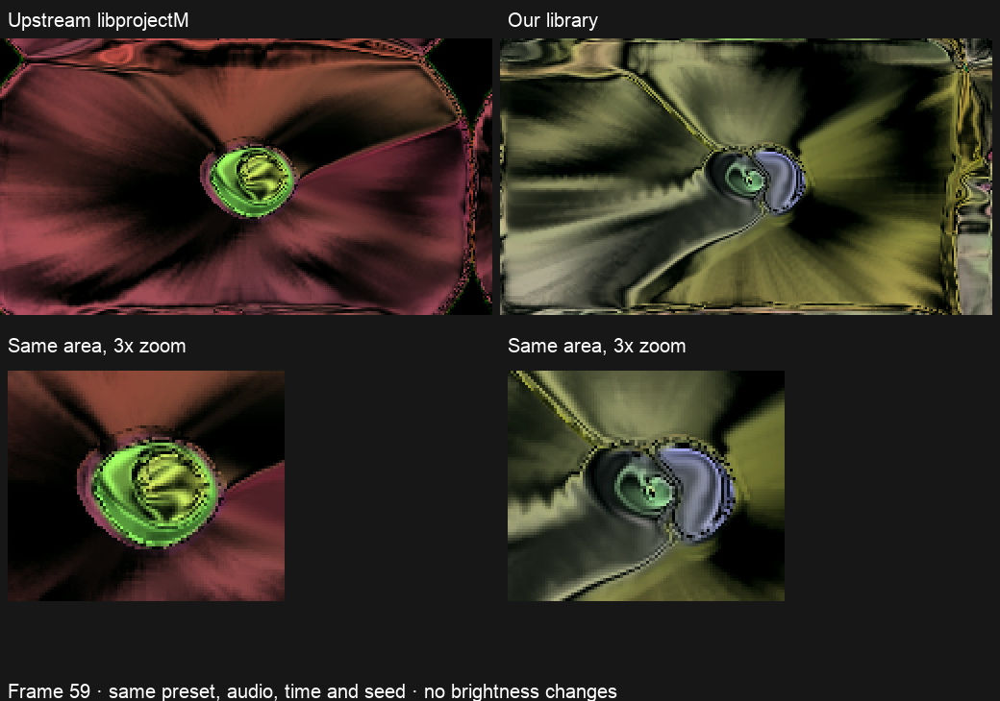

In **Amandio C — the green machine … btbam covers sepultura**, pink/brown wedges
become a green/yellow curved structure. Tiny custom shapes seed a gradient-driven
feedback shader, so a small coverage error grows into a large pattern difference.

D3D9 and GLES sample different pixel-center grids. Ours translates each shape draw
by half a destination pixel, preserving the authored position, radius and colors.
The [isolated comparison](superpowers/evidence/current-patch-proof/0012-visible-original.png)
separates this correction from other changes in the full library.
[Patch source](../tools/projectm-patches/0012-shape-pixel-centers.patch).

## 0013 — Custom-composite texel centres

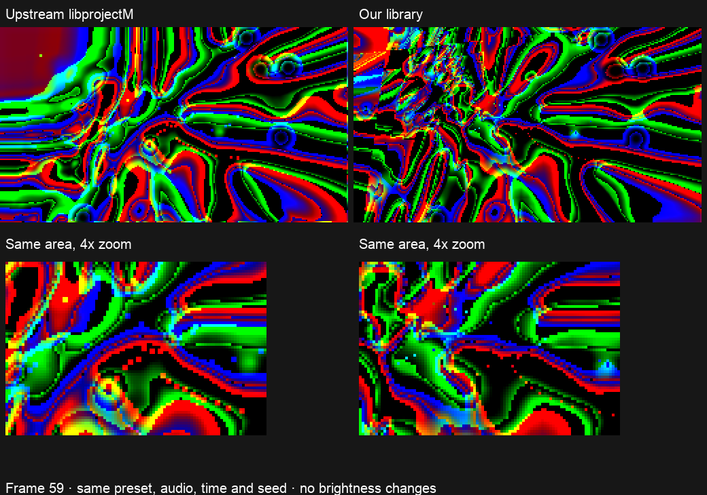

In **DemonLD — Toxic water diffusion**, compare the green/cyan contour rims and
their neighboring colors in the zoom. An extra half-texel offset made GLES read
between texels and blend colors that the shader expected to sample at their centers.
Its nonlinear color operations amplify that unwanted averaging.

Ours removes the redundant offset. The [single-patch comparison](superpowers/evidence/current-patch-proof/0013-visible-original.png)
shows the contour change without other patch effects; the [impulse control](superpowers/evidence/current-patch-proof/0013-composite-impulse-zoom.png)
shows one bright texel staying intact instead of spreading across four.
[Patch source](../tools/projectm-patches/0013-composite-texel-centers.patch).

## 0014 — Legacy tint and mode-1 waveform

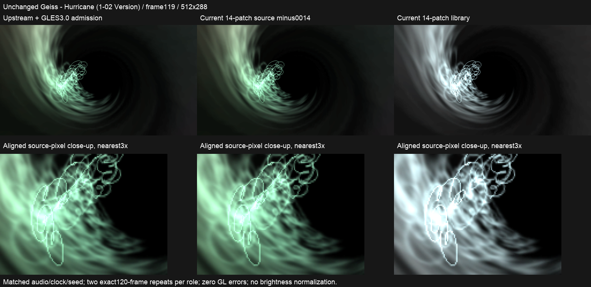

In **Geiss — Hurricane**, upstream and current-minus-0014 add a green cast despite
`fShader=0`. Ours respects the disabled tint, giving cooler, nearly neutral trails.
The patch also restores mode 1's alpha multiplier and open spiral, removing the
extra line that connected its ends.

The [constant-color controls](superpowers/evidence/current-patch-proof/components/legacy14-hue/README.md)
check disabled, half and full tint separately. The [spiral close-up](superpowers/evidence/current-patch-proof/components/legacy14-mode1/README.md)
isolates the waveform change from tint.
[Current-source evidence](superpowers/evidence/current-patch-proof/components/legacy14-hurricane/README.md) ·
[Patch source](../tools/projectm-patches/0014-legacy-tint-and-mode1-waveform.patch).

## 0015 — Negative warp powers on the CPU

This generated control uses negative zoom with finite integer nested powers.
Upstream collapses the coordinate field; ours preserves its gradient. GLSL `pow`
is undefined for negative bases even when the CPU expression has a valid answer.
The patch evaluates that expression on the CPU after float conversion and reuses
its result when drawing the prepared mesh. Positive zoom is unchanged.

The original **Great Tulip Majesty** still enters fractional negative-power domains
and its recorded frames remain unchanged. It must not be presented as fixed.
[Locked-source comparison and checks](superpowers/evidence/current-patch-proof/components/locked15-power/README.md) ·
[Patch source](../tools/projectm-patches/0015-warp-negative-zoom-cpu-power.patch).

## Supporting evidence and remaining work

[Full-resolution images, inputs and verification](superpowers/evidence/current-patch-proof/README.md)
retain repeated-frame checks, source/binary identities and failed attempts.
The [original PR input map](superpowers/evidence/current-patch-proof/original-evidence-inputs/README.md)
provides the preset names and activation profiles used to guide remaining captures.
The [detailed working assessment](superpowers/evidence/current-patch-proof/expanded-assessment.md)
keeps the component inventory and technical notes out of this review page.

The15 patch sections now have matched comparison evidence. Deeper optimization/lifecycle checks are deferred by agreement; final review and CI remain required before publication.
The upstream capture admits GLES 3.0; our image workers disable the emulator's broken
program-binary export. No original Windows/MilkDrop GPU screenshot was produced.
