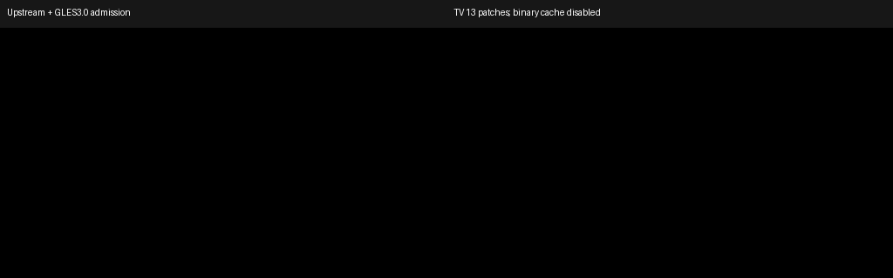
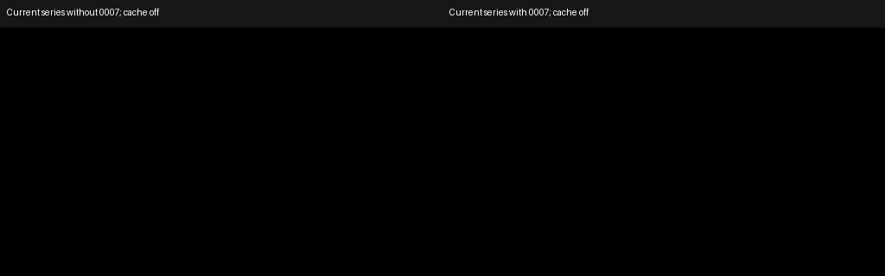
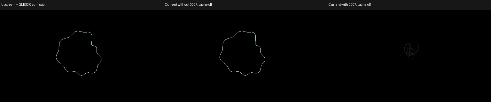
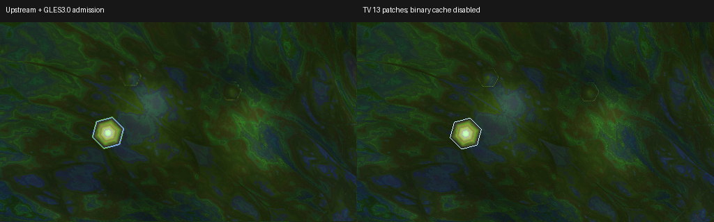
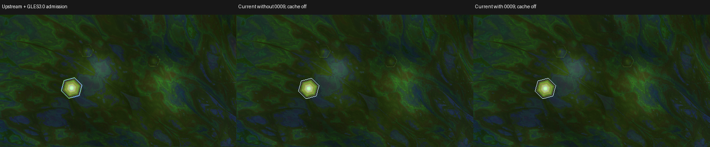
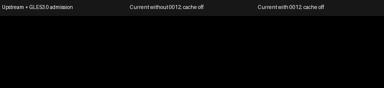

# Current patches against upstream projectM 4.2 master

This reference covers the **13 current patches**, in build order, over upstream
[`6f64807467e312034883a4389e6aa80a675458bc`](https://github.com/projectM-visualizer/projectm/tree/6f64807467e312034883a4389e6aa80a675458bc).
That pin reports CMake version 4.2.0 and is an **unreleased development snapshot**.
The evaluator pin is `22fb0cfd8f2dfbcd2b68f2443e7f44e19b32c09a`.
Assessment source: ProjectM TV `654815d8`, 2026-10-07. The
[ordered series manifest](superpowers/evidence/current-patch-proof/series.json)
records each patch's SHA-256. Reassess after changing a pin or patch.
Observed upstream master is `e98fca85e57802d27a6d11499642de2a1d5e994e`. Its only
change from the app pin is the GLES3.0 admission adjustment used in these captures;
[byte-verified equivalence](superpowers/evidence/current-patch-proof/upstream-master-equivalence.json)
establishes that the baseline renderer source matches current master before
the shared deterministic instrumentation.

This is a reference for libprojectM maintainers evaluating behavior, compatibility
limits and possible contributions. A contribution candidate is not a submitted or
accepted upstream change. The old migration assessment and attribution remain in a
[separate archive](superpowers/evidence/current-patch-proof/pre-rewrite-assessment.md).
Patch numbers below always refer to the current series.

## Reading the image evidence

The requested comparison is **the pinned upstream renderer versus the current
patched renderer**, with identical preset bytes, textures, audio, clock, dimensions
and seeds. Existing migration fidelity images compare two patched ProjectM TV
engines and do not provide that comparison.

The new [image-proof record](superpowers/evidence/current-patch-proof/README.md)
tracks GPU Android TV captures and their status. The baseline discloses a
**GLES 3.0 admission adjustment**: the emulator exposes GLES 3.0 while unmodified
upstream requires GLES 3.2. Lowering only the admission check allows rendering
comparisons without importing preset compatibility or image fixes. It is labeled
**upstream + GLES 3.0 admission**, not an untouched stock binary.
The patched capture variant disables program-binary caching because the API36
guest reports binary-export GL errors. The exact adjustments and failed initial
attempts are retained in the image-proof record. These images do not validate caches.

A full-series comparison demonstrates the combined library change. An adjacent
before/after or single-patch ablation is needed to attribute a difference to one
patch. Preserve load failures, equation omissions, shader fallbacks and GL errors
beside images. A failed renderer has no valid screenshot; an error panel must not
be represented as its rendered output.

MilkDrop 2 source and D3D9 specifications explain intended operations. They are
not screenshots from Windows. Label numerical oracles, altered diagnostic presets
and reference-size projectM captures separately from real MilkDrop 2/D3DX renders.
No original Windows appearance is certified here.

## 0001 — TV rendering and preset compatibility

Source: `0001-tv-rendering-and-preset-compatibility.patch`. This is a consolidated
patch, not one independently attributable defect. Split its general correctness
changes from host policy and optimizations for upstream proposals.

| Area | Current behavior and activation | Potential upstream value and limits |
|---|---|---|
| GLES integration | Admit GLES 3.0 through the current GLAD resolver. | Already present in observed master e98fca85; this retained portion is redundant against that revision. Runtime checks still matter. |
| Resize and GL ownership | Preserve feedback history, caller read/draw bindings around blur allocation and required texture contents across passes. | General state correctness. Exercise first use, resize and distinct caller targets. |
| Sampling and user textures | Preserve explicit sampler aliases and random-slot image identity; parse sampler identifiers; ignore `sampler_state` blocks without shifting source offsets. | General preset compatibility. Authored sampler-state fields remain unsupported; random binding repair is not a new seeding policy. |
| Equation compatibility | Retry rejected legacy records across preset/wave/shape phases; omit still-rejected blocks with defined state and an initialization-warning callback. | Preserve accepted programs. Tolerant loading can hide authored errors if a host ignores warnings. |
| Lines and geometry | Draw reference-scaled quad lines, batch shapes in authored order and replay evaluated geometry without rerunning equations or RNG. | Separate reusable primitives from TV defaults. Check blend order, dots, borders and stateful equations. |
| Native trails | Maintain authored feedback with optional bounded native detail and diffusion fallback. Standard/Medium/High are host choices. | Product policy rather than an unconditional appearance default. Additional targets, shader restrictions, memory and driver cost matter. |
| Pass and cache work | Retain translated GLSL/program caches, texture pooling, optional pass elimination, direct output and reduced outgoing-preset cadence. | Evaluate context/driver identity, bounds, failed-load fallback and retirement. Reduced cadence changes animation. No current-driver speedup is established. |

Named candidates include `161.milk` and `430.milk` for rejected equations;
`midgitstraights of majillaen - featy sweet.milk` for blur/texture paths; and
`Fumbling_Foo & Flexi, Martin, Orb - Acid Mandala v1c.milk` for feedback policy.
The [regression inventory](superpowers/evidence/upstream-master-4-2/patch-regressions/README.md)
provides their source evidence. Historical issue membership does not establish a
current upstream failure. Capture separate equation/sampler and high-resolution
trails cases. A still image cannot establish cache correctness, concurrent
preparation, context loss, retirement or performance.

Upstream rejects the unchanged preset in both runs; the left panel quotes its load error. The patched role repeats all 120 frames exactly. This panel is a full-series comparison; the separate ablation addresses single-patch causality.

## 0002 — HLSL compatibility and finite float round trips

Source: `0002-hlsl-compatibility-and-float-roundtrip.patch`. Preserve classic-locale
emission and finite float32 round trips with `max_digits10`, integral-float/signed-zero
spelling and rejection of nonfinite AST literals. Initialize writable copies from
incoming uniforms while preserving other components. Retain compatible modulo
handling, contextual identifiers, macro token spacing and parenthesized postfix
expressions. Plain uninitialized scalar/vector float globals become external
uniforms; static, const, initialized and local storage retain their rules.

General translator correctness value; longer generated source is a tradeoff.
Unbound GLES uniforms start at zero, which does not reproduce arbitrary D3D9
register history. Independently test each language change before combining proposals.
Witness candidates include `Flexi - dimension window.milk`,
`EVET + Flexi - Rainbox Splash Poolz.milk`, `martin - organic light.milk` and
`Serge + martin - crystal palace tunnel003.milk`. The hash-pinned
`float-literal-control.milk` is synthetic, not an unchanged bundled preset.
Retain translation errors and active shader status beside pixels.

Frame 119, 512×288, fixed synthetic audio/clock/seed; two exact 120-frame repeats per successful role. Full-series comparison; use the adjacent ablation/activation controls for single-patch attribution.

Unchanged bundled preset; upstream/current-minus-patch/current columns. Removing only 0002 changes 120/120 RGB frames under these inputs. All successful roles repeat exactly with zero GL-error frames; rejected roles are explicitly labeled.

## 0003 — Evaluator random state and lone-dot numbers

Source: `0003-evaluator-thread-local-rand-and-lone-dot.patch`. Make Mersenne Twister
state thread-local so background evaluation does not advance the foreground stream.
Accept a lone `.` as zero, matching NS-EEL, while preserving ordinary numbers and
invalid-code rejection. Keep `Scanner.l` and checked-in `Scanner.c` synchronized.

Submit evaluator changes to projectm-eval. Each thread begins the same fixed-seed
stream; this changes cross-thread coupling, not the generator algorithm. A
single-thread screenshot cannot prove isolation. Use the fresh-thread random-stream
control plus an explicit lone-dot fixture. A fresh source search recovered two bundled positive matches: the base and `nz+`
versions of `Stahlregen - funky Blur (lotus mix) the genius in me lies right at the heart of the flacc.milk`.
Both contain `zoom=zoom+.10*sin(rad+.+15.15)` in per-pixel code. This establishes
current source membership; it does not identify the original private issue report.

Synthetic activation fixture, not an unchanged bundled preset: 120/120 RGB frames differ when removing only 0003. Successful roles repeat exactly; zero GL-error frames.

Unchanged bundled preset; upstream/current-minus-patch/current columns. Removing only 0003 changes 120/120 RGB frames under these inputs. All successful roles repeat exactly with zero GL-error frames; rejected roles are explicitly labeled.

## 0004 — Main-textured shape sampler ownership

Source: `0004-textured-shape-sampler.patch`. Bind an instance-owned repeat/linear
sampler for every main-textured fill, including geometry replay. A sampler left on
unit zero could override texture state; unbinding could expose nearest filtering.
Preserve named-image descriptor qualifiers instead of mutating shared texture state.

`widest swing.milk` is the recovered exact production witness. Compare repeated
instances and edge-crossing samples, with a separate analytical bilinear fixture.
General sampler correctness with one sampler per shape instance; no new quality setting.

Frame 119, 512×288, fixed synthetic audio/clock/seed; two exact 120-frame repeats per successful role. Full-series comparison; use the adjacent ablation/activation controls for single-patch attribution.

Isolated removal of 0004, same inputs: 119/120 RGB frames differ; both roles repeat exactly with zero GL-error frames.

## 0005 — Safe blur intervals

Source: `0005-blur-range-interval.patch`. Expand the upper bound upward when a range
collapses. Preserve clamp-then-expand ordering and ordinary float32 arithmetic.
Reject nonfinite, unrepresentable or progressively degenerate normalization domains
with coherent `[0,1]` defaults for all levels and their decoding coefficients.

Defensive numerical correctness. The reference has the same upper-bound typo;
this is not a backport of an already-correct reference implementation. Candidates
include `Cope - The Cloud.milk`, `Mig_015.milk` and `$$$ Royal - Mashup (29).milk`.
`EVET - Scanazoic --- Isosceles edit.milk` is a negative control. Record evaluated
bounds/coefficients: a historical blur witness had unchanged pixels despite its
reported unsafe domain. Do not promise a visible improvement for every fixture.

Synthetic activation fixture, not an unchanged bundled preset: 119/120 RGB frames differ when removing only 0005. Successful roles repeat exactly; zero GL-error frames.

Unchanged bundled preset; upstream/current-minus-patch/current columns. Removing only 0005 changes 0/120 RGB frames under these inputs. This is a preservation control for this input, not a visible benefit. All successful roles repeat exactly with zero GL-error frames; rejected roles are explicitly labeled.

## 0006 — Signed unit-exponent zoom

Source: `0006-fixed-warp-signed-unit-zoom.patch`. For finite negative zoom and an
exponent exactly one, use the signed base directly in the shared warp vertex shader.
GLSL `pow` has an undefined negative-base domain even for exponent one. This reflects
UV displacement around the warp centre; positive zoom and other exponent paths remain.

`Hexcollie - This is where we begin stripped.milk` is the exact recovered witness.
Narrow compatibility correction, not arbitrary negative-base power support. Retain a
UV readback oracle beside the preset image.

Frame 119, 512×288, fixed synthetic audio/clock/seed; two exact 120-frame repeats per successful role. Full-series comparison; use the adjacent ablation/activation controls for single-patch attribution.

Isolated removal of 0006, same inputs: 119/120 RGB frames differ; both roles repeat exactly with zero GL-error frames.

## 0007 — Evaluated built-in waveform controls

Source: `0007-live-builtin-wave-controls.patch`. Consume evaluated mode, dots,
thickness and additive blending without overwriting defaults. Rebuild mode math
when the evaluated mode changes; retain integer truncation, signed remainder and
projectM's 16-mode extension. Reuse prepared geometry for the second draw.

Witnesses: `319.milk`, `idiot - Forty Six and 2 (pushit!).milk` and
`Hexcollie - now entering the wormhole2 - mash0000 - if you like this, maybe you, like me, are insane.milk`.
Use multiple timestamps to show an authored mode/flag change. General compatibility;
not all 16 modes belong to original MilkDrop 2.

Frame 119, 512×288, fixed synthetic audio/clock/seed; two exact 120-frame repeats per successful role. Full-series comparison; use the adjacent ablation/activation controls for single-patch attribution.

Isolated removal of 0007, same inputs: 0/120 RGB frames differ; both roles repeat exactly with zero GL-error frames. This selected input does not activate a visible difference from this patch.

Synthetic activation fixture, not an unchanged bundled preset: 60/120 RGB frames differ when removing only 0007. Successful roles repeat exactly; zero GL-error frames.

## 0008 — Evaluated legacy display controls

Source: `0008-live-legacy-display-controls.patch`. Consume evaluated gamma, echo
and legacy filter flags, including equation-only activation. Preserve configuration
defaults, Mesh/ShaderCache ownership and custom-composite policy. Custom composites
do not gain legacy effects through this patch.

Use the same three live-control witnesses, plus an equation-only filter fixture to
separate this change from 0007. Record active display values and selected timestamps;
do not attribute every full-series difference to this patch.

Frame 119, 512×288, fixed synthetic audio/clock/seed; two exact 120-frame repeats per successful role. Full-series comparison; use the adjacent ablation/activation controls for single-patch attribution.

Isolated removal of 0008, same inputs: 0/120 RGB frames differ; both roles repeat exactly with zero GL-error frames. This selected input does not activate a visible difference from this patch.

Synthetic activation fixture, not an unchanged bundled preset: 60/120 RGB frames differ when removing only 0008. Successful roles repeat exactly; zero GL-error frames.

## 0009 — User-texture premultiplication bytes

Source: `0009-user-texture-premultiplication.patch`. Apply
`(rgb * alpha + 128) >> 8` before stbi-backed RGBA upload, preserving alpha. This
includes opaque-channel rounding. Internal generated textures are a separate path.

`suksma - chemosynthetic nosferatu - gdy patent pending free energy devices - rand tritex - inv play.milk` is the recovered witness. Retain a known-byte upload
control beside its image. Upstream value is an explicit user-texture alpha policy;
exact SOIL rounding is a compatibility choice rather than a universal loader rule.

Frame 119, 512×288, fixed synthetic audio/clock/seed; two exact 120-frame repeats per successful role. Full-series comparison; use the adjacent ablation/activation controls for single-patch attribution.

Unchanged bundled preset; upstream/current-minus-patch/current columns. Removing only 0009 changes 120/120 RGB frames under these inputs. All successful roles repeat exactly with zero GL-error frames; rejected roles are explicitly labeled.

## 0010 — Per-preset texture search-path ownership

Source: `0010-preset-texture-search-path-ownership.patch`. New roots apply to newly
loaded presets; live incoming/outgoing presets retain their own texture manager
through soft cuts. Reset reloads live image caches using their original paths and
preserves feedback. Retain callbacks and strong descriptor/ShaderCache ownership.

General host integration and lifetime correctness. Use two controlled packs with
the same image name and different pixels; capture fade, reset and retirement.
No unique bundled preset can demonstrate a host changing its roots. ZIP upload,
QR codes and category UI are app features outside this patch.

Controlled duplicate-name shape textures, a root change at frame 20, a soft cut at21
and reset at40. Removing only 0010 changes 59/120 frames. All roles repeat exactly,
with zero GL errors. An earlier static shader-binding control produced no difference;
its result is retained separately. This scene activates repeated shape-image lookup.

## 0011 — CPU warp rotation trigonometry

Source: `0011-cpu-warp-rotation-trig.patch`. Convert evaluated rotation to float,
then compute CPU sine/cosine as MilkDrop 2 does. Reuse sine and supply cosine through
an instance-owned four-byte VertexBuffer at attribute 8. Preserve prepared-mesh
replay and authored/nonfinite equation values.

Witness: `EoS_Phat_PeterP_Sentinel_Aware_6 EoS edit slice into your beautiful love.milk`,
whose per-pixel code sets `rot=10000000`. On the observed Apple GLES translator,
GPU sine/cosine became zero, collapsing feedback to the rotation centre. Higher
precision did not repair that observation. CPU libm covers maximum finite float
angles where a rounded `2π` remainder is insufficient.

General compatibility value, with CPU trig and another buffer/attribute as costs.
Other custom shader trig is unchanged. Keep a UV oracle and distinguish a
rotation-only diagnostic variant from the original preset. No universal driver
failure or speedup is claimed.

Upstream rejects the unchanged preset in both runs; the left panel quotes its load error. The patched role repeats all 120 frames exactly. This panel is a full-series comparison; the separate ablation addresses single-patch causality.

Isolated removal of 0011, same inputs: 118/120 RGB frames differ; both roles repeat exactly with zero GL-error frames. This removes the upstream equation-load failure as a confounder and exposes the rotation correction.

## 0012 — Custom-shape pixel centres

Source: `0012-shape-pixel-centers.patch`. Translate fills/outlines by half a
destination pixel in each authored/native target, restoring shared shader matrices.
Preserve equations, radii, colours, UVs and assets. D3D9 samples integer pixel centres;
GLES samples half-integers, so copying coordinates alone can lose subpixel shapes.

Use sample 06 identified by exact hash in the
[dark-preset investigation](superpowers/evidence/dark-presets-06-10/README.md), plus
the `rad=.002`, `x=y=.5` diagnostic shape. Compare textured/untextured draws and
different target dimensions. A D3D9 coverage oracle is not a MilkDrop 2 screenshot.

Synthetic activation fixture, not an unchanged bundled preset: 120/120 RGB frames differ when removing only 0012. Successful roles repeat exactly; zero GL-error frames. Removing the patch loses all subpixel shape coverage; the current renderer produces nonzero pixels.

Unchanged bundled preset; upstream/current-minus-patch/current columns. Removing only 0012 changes 120/120 RGB frames under these inputs. All successful roles repeat exactly with zero GL-error frames; rejected roles are explicitly labeled.

## 0013 — Custom-composite texel centres

Source: `0013-composite-texel-centers.patch`. Remove a redundant half-texel UV bias.
MilkDrop 2 shifts its D3D9 mesh positions by half a pixel while retaining UVs. GLES
already interpolates the unbiased mesh at texel centres; another UV offset dilutes
an impulse over four pixels.

Compare original sample 06/10 and a pass-through impulse/asymmetric-pattern fixture.
Expected output is one full-bright texel rather than four quarter-bright pixels.
Retain resize/repeated-draw controls and unchanged warp offsets. Sampling correctness,
not a brightness setting or speedup; the original presets remain authored sparse/dark.

Synthetic activation fixture, not an unchanged bundled preset: 120/120 RGB frames differ when removing only 0013. Successful roles repeat exactly; zero GL-error frames. The isolated old composite spreads the impulse into four RGB8≤64 pixels; corrected output is one pixel with maximum 255. The lower row enlarges an identical 8×8 centre crop 16× with nearest sampling; it changes no brightness.

Removing only 0013 changes all 120 RGB frames for this unchanged sample06 preset.
All three roles repeat exactly with zero GL-error frames. This is a256×144
source control under the recorded input, not a Windows appearance prediction.

## Contribution order and acceptance boundaries

Start with narrow evaluator, translator and renderer correctness proposals whose
controls distinguish each change from upstream. Separate 0001's correctness from
cache/resource optimizations and Native trails policy. Preserve upstream Mesh,
VertexBuffer, ShaderCache and texture-descriptor ownership in proposals.

Images need exact input, source, binary, instrumentation and GPU identities plus
same-role repeats. Numerical/lifecycle controls remain necessary where images
cannot show the contract. Captures do not certify every preset, other seeds,
physical TVs, Windows/D3DX appearance or a performance gain.
