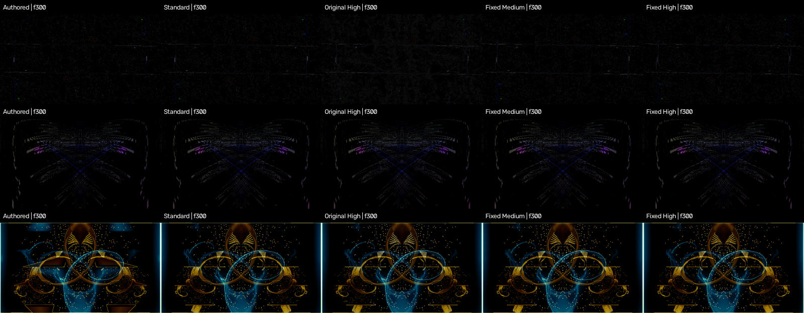

# Centered feedback-detail clipping fix

The corrected prototype subtracts each S×S detail band's actual mean and
applies one headroom-limited gain per block/channel. Its output is in [0,1]
before storage, so RGBA8 cannot remove a negative lobe and leave a positive
detail bias. The block mean equals the bilinearly reconstructed authored base
before quantization. Standard bypasses the neighborhood scans.

This is the implementation/evidence branch, not a production APK/AAR port.
The owner treats likeness percentages as diagnostics, accepts Standard's
roughly 13% and targeted Medium's roughly 14.3% differences, and requires the
clipping fix to preserve preset character. Remaining brightness differences
are a separate investigation.

## Recorded screen

All configurations used the same generated 16-second PCM, seed 12345,
30 fps lab clock, 480 rendered frames and the historical eight capture picks.
Authored is 1280×720; Standard, Medium and High are 3840×2160 with a
1280×720 line reference. Metrics resize to 1182×665, as the historical screen
did. GPU: Apple M4 Pro, desktop OpenGL 4.1 Metal - 89.4.

| Configuration | Median MAE | Median brightness ratio | New >1.10× presets versus Standard |
|---|---:|---:|---:|
| Standard | 0.00581 | 0.99943 | — |
| Fixed Medium | 0.00631 | 0.99921 | 0 |
| Fixed High | 0.00791 | 0.99909 | 0 |

The 68-preset run completed 272 jobs, each with 480 frames and zero GL error
frames. Standard, Medium and High share the same three >1.10× presets:
ADAMFX Creation, Geometry 101 and Geiss Motion Blur. These remaining
differences are recorded, not described as clipping failures or universal
fidelity acceptance. Per-preset results and the actual worker/prototype/PCM
identities are in `broad/`; aggregate values are in `summary.json`.

The targeted original/fixed comparison completed 21 additional jobs, retained
all 168 selected temporal PNGs locally, and verified identical Standard
capture digests before/after on all three presets. Its protocol also identifies
preset/texture inputs. Only compact contact sheets are committed; full local
captures remain under ignored `build/detail-clipping/targeted-final/`.

| Preset | Standard | Original Medium | Fixed Medium | Original High | Fixed High |
|---|---:|---:|---:|---:|---:|
| ADAMFX Creation | 1.106× | 1.287× | 1.143× | 2.107× | 1.106× |
| Geometry 101 | 1.134× | 1.175× | 1.130× | 1.331× | 1.127× |
| Mandala Chasers | 0.941× | 0.942× | 0.938× | 0.943× | 0.939× |

The original PCM is unavailable. **This synthetic signal does not reproduce
Mandala Chasers' historical 1.58× over-brightening**, so these renders do not
prove that original visual case was replayed. The actual-shader regression
directly reproduces signed-band clipping on black and verifies its removal;
the full Mandala run exercises the corrected engine and preserves its overall
blue/gold structures across the eight selected frames. Original historical
results remain in `../broad-main/` and have not been replaced.

Visual inspection of the targeted temporal contact sheets shows the original
ADAMFX High's extra gray haze removed, with its sparse colored structures
retained. Geometry 101 keeps its colored line patterns, and Mandala Chasers
keeps its evolving symmetric shapes and palette. This is a desktop sample,
not an all-presets, all-audio or device certification.

- [ADAMFX: eight temporal captures](images/3-temporal.png)
- [Geometry 101: eight temporal captures](images/38-temporal.png)
- [Mandala Chasers: eight temporal captures](images/40-temporal.png)

## Reproduce and inspect

Install the pinned Preset Lab dependencies and initialize recursive submodules.
Run the commands in `../../README.md` from the repository root. Use empty
output directories; the runner rejects reuse and verifies worker hashes. Add
`--indices 3,38,40 --before --save-frames` for the temporal controls.

`broad/protocol.json` records the exact prototype from commit `ca8baa65` used
for that run. Later edits only corrected its comments; its recorded combine
shader SHA-256 matches the final executable shader source. The targeted run
rebuilt the final comment-corrected prototype and records that source identity.
The eight captured frames originate in the shared `lab/capture_frames.py`
contract, embedded into the generated worker predicate and checked by the
reader.

The GPU check extracts the prototype's actual GLSL and executes 39 cases:
RGBA8 black/white headroom, float output bounds and block means, bilinear
reconstruction, retained sparse detail, and 32-frame colored feedback at scales
2 and 3. The original shader fails the black/Medium case. Eight runner tests
cover checksum mismatch, capture metadata mismatch/order, existing-output
preservation, truncated output, queued cancellation, hung children and the
builder's nonempty-work-directory guard. CI executes both suites.

No new GPU frame-time measurement was made. Medium/High add two block scans
per native pixel; historical combine timings do not measure this shader.
GLSL ES 3.00 links, but device execution and the shipping patch/API/UI port
remain separate implementation-plan tasks.
