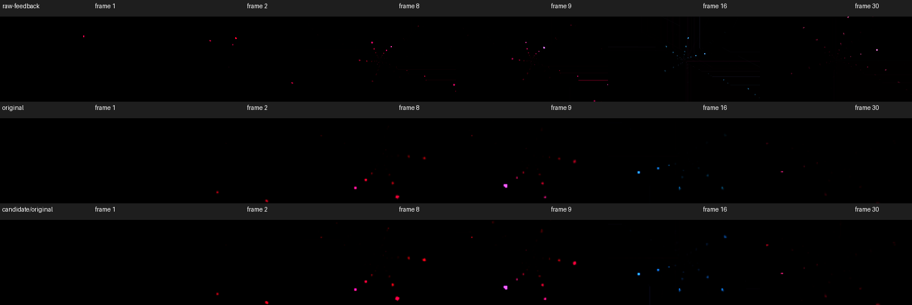

# BrainStain legacy-renderer investigation

The original `BrainStain- boiling-mix2(redi jedi full carb mix).milk` remains
unchanged (SHA256 `fb9465f0f3d78d9fc32c473f0163c443bbadbbc2855ead1bd020689ee9601019`).
Research on 2026-10-08 found three source-defined compatibility defects, corrected
by patch 0014. The preset still produces sparse, dark output with the supplied
mono audio; the correction does not replace its authored echo or darken filter.

## Reproduction and cause

The supplied v2.3.23/v2.3.22 AAR has SHA256
`c8b93297aa84e6e5c1e860b7ef136fb84deb1ef946c4f66dd1863f1bd9379d65`.
Its unchanged JNI path reproduces all 30 supplied RGB frames exactly, including
the black first frame. A second cold capture repeats every byte. Input is mono
44,100 Hz, 30 Hz rendering, 256×144, mesh 48×32, seed 12345 and the supplied
one-second transport PCM (SHA256
`0640617ef6dcdf81f9af180ebb827c88ae8d570ec0abc96bf6f52f00bcab488c`).
The owned API34 ARM64 emulator reports Apple M4 Pro/GLES 3.0. Standard trails
is inactive at 144p. Automatic changes, beat cuts and blank skipping are disabled.

The predictor's agreement was insufficient: its compatibility assumptions shared
these mistakes. Comparing the original MilkDrop 2.25c `vis_milk2/milkdropfs.cpp`
with the pinned projectM 4.2 plus existing patches establishes:

| Stage | Original MilkDrop | Baseline projectM | Correction |
|---|---|---|---|
| Legacy hue, lines 4117–4144 | White modulation when `fShader <= .001`; otherwise mix animated shade with white by `fShader` | Full animated shade regardless of `fShader` | Respect the authored amount and threshold |
| Mode-1 waveform, lines 2927–2946 | Multiply alpha by 1.25, then volume modulation and clamp | Multiplier omitted | Restore multiplier before final clamp, preserving volume modulation |
| Mode-1 topology, lines 3359–3365 | Open line strip | Closed line loop | Remove the extra closing segment |

Both sources draw shapes before the waveform. The viewport-covering textured
shape does not simply erase the newly drawn waveform. `tex_capture` has no
renderer implementation in either inspected MilkDrop2 source checkout; its
assignments remain untouched and are not treated as a newly supported setting.

The first frame contains bright pre-composite feedback at x=140–141, y=32–34
(top-origin, peak RGB8 255). With authored echo alpha 1, the unzoomed contribution
is zero. Echo zoom 2.169307 samples only UV 0.269512–0.730488 in both axes and
orientation 3 reflects both axes. The first-frame waveform is outside this crop;
the final frame is exactly black before and after the correction.
The final darken operation multiplies the destination by itself, as specified by
[D3D9 destination-colour blending](https://learn.microsoft.com/en-us/windows/win32/direct3d9/d3dblend).

## Diagnostic controls

Each diagnostic starts cold with identical input and changes one setting: darken
off, echo alpha zero, echo zoom one, each shape disabled, both shapes disabled,
wave parameter zero, or wave mode zero. These are separate copies, not repaired
assets. Mode zero produces a large circle and much brighter output; it is not
used as a fix. Disabling echo or shapes does not uniformly increase brightness.
The results support interactions between sparse geometry, feedback and the final
crop rather than a universal brightness multiplier.

A separate pass-through custom composite captures the pre-composite feedback.
It declares preset version 201, warp shader version zero and composite version
three. An earlier attempt omitted the preset-version declaration and therefore
still used the legacy composite; that attempt is excluded from the stage evidence.
The corrected diagnostic changes final presentation only and does not turn off
the original feedback geometry, warp, shapes or audio equations.

| Original preset replay | Baseline mean luma (0–1) | Corrected mean luma (0–1) |
|---|---:|---:|
| Original 30 frames | 0.000557626 | 0.000816955 |
| 600 frames, original PCM repeated twenty times | 0.000738310 | 0.001455620 |

Both windows contain only one exactly black frame, the first. These measurements
describe this input and GPU; they do not certify permanent darkness, arbitrary
music, stereo behaviour or original Windows appearance. No Windows/D3DX GPU run
was performed. The baseline's first frame contradicts the frozen narrative's
claim of faint traces; the original handoff and its claims were not overwritten.

## Validation and identities

Three independent GL controls fail on the baseline and pass after correction:
constant RGB 64/128/192 with disabled/fractional hue, observed mode-1 alpha .4→.5
and .9→1, and actual open-strip draw topology. They do not derive the disabled-hue
or waveform expectations from the baseline renderer.

- Normal and ASan/UBSan renderer suites: 37/37 controls each pass.
  The separate EGL/GLES transition overlay skips on macOS without those libraries.
- Host engine suite: 329/329 pass.
- Android release core, both ARM ABIs, APK and 137 JVM tests pass.
- Six original-preset frames at 2560×1440 exercise active Standard trails with
  the reported 1280×720 authored canvas for both artifacts.
- All 9,691 AAR asset entries are byte-identical across artifacts.
- All 14 patches apply to a clean export of the immutable upstream pin.
- Fresh recursive checkout debug-core build (both ABIs) and strict MkDocs pass.

Candidate AAR SHA256:
`09851b84878e357bd413bc2fe9fb4ea6ca0762a3f14c233d9334e40335b1cd59`.
This is a local research artifact, not a published release. Source references,
per-case hashes, runtime metadata and bounded controls are in [results.json](results.json).
Raw captures, clock helper, harness and logs are retained under the task worktree's
`build/brainstain/`; raw audio and frame streams are not committed.
CI, Codex review, merge, publication and Milkbeat update are separate gates until
their results are recorded.
