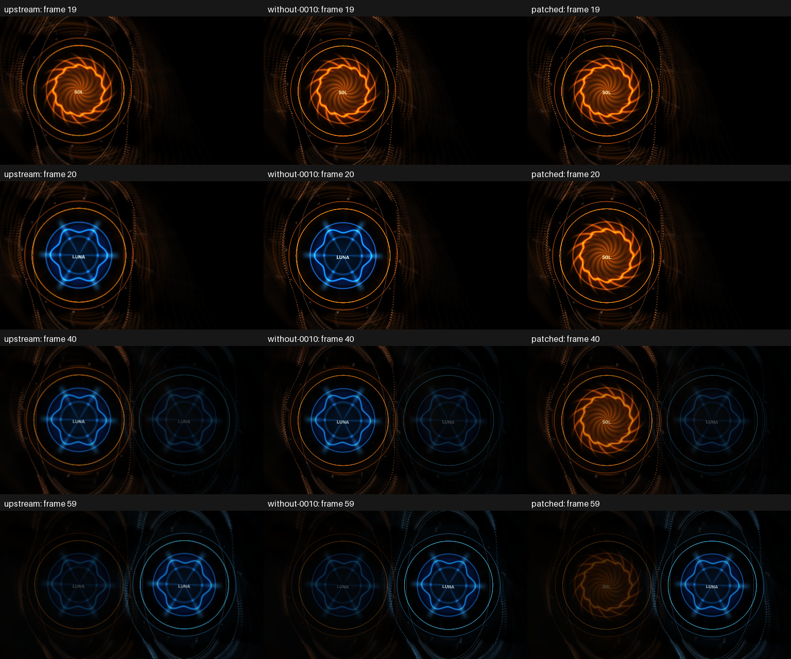

# Aurora Ownership — predictor witness for patch 0010

The user supplied two animated diagnostic packs, SOL and LUNA, from
`/Users/jneerdael/Downloads/projectm-patch-0010-aurora-witness-2026-10-08/`.
The test froze a copy before rendering. The presets and PNG textures here are
those exact tested bytes; later changes in Downloads do not change this result.
These generated assets are test evidence, outside the shipping preset collection.


At frame 20, changing roots alone replaces SOL with LUNA in upstream and the
engine with only 0010 removed. SOL's orange rings and animation remain active.
The patched engine retains the orange SOL image. No transition has started yet.
The bug is therefore visible without interpreting a blended transition frame.

The old `ProjectM::SetTexturePaths` replaces the global texture manager, and the
next `CustomShape::PrepareFrame` resolves its `m_image` through that new manager.
Patch 0010 retains a manager for each live preset and supplies it in that preset's
render context. New LUNA uses pack B while outgoing SOL keeps pack A.

The [forecast](predicted-host-sequence.json) was supplied before the GPU run.
It predicted the frame-20 replacement and retained per-preset ownership with the
patch; it deliberately did not predict exact RGB values during the fade. Those
ownership predictions are supported by the capture. Source-only preview quality,
the claimed 24% audio pulse and later visual refinements were not tested here.

The frozen host sequence is:

Keep the packs in separate directories. The two images have the same filename
but different full paths:

```text
pack-a/
  presets/Aurora Ownership - SOL.milk
  textures/aurora_ownership_core.png       # orange SOL image
pack-b/
  presets/Aurora Ownership - LUNA.milk
  textures/aurora_ownership_core.png       # blue LUNA image
```

Initially the host calls `SetTexturePaths({packA + "/textures"})` and loads SOL.
At frame 20 it replaces that search root with `SetTexturePaths({packB + "/textures"})`
while SOL is still running. LUNA is loaded at frame 21. Each preset requests the
same filename; the bug concerns which pack's directory supplies it. The files
are never placed together in one directory. This requires host API calls; a
`.milk` preset cannot switch those roots itself.

The bundled Cream of the Crop collection has a different layout: all 9,606
presets share one flat `presets/` directory and 74 images share one flat
`textures/` directory. A scan found no nonempty `shapecode_<n>_image` fields in
those presets. Ordinary switching within that bundled collection does not
change pack roots. Aurora demonstrates custom-pack texture ownership, rather
than a failure during ordinary bundled-preset switching.

1. Load SOL using pack A's texture root.
2. Before rendering frame 20, set the root to pack B.
3. Before frame 21, load LUNA with a two-second soft cut.
4. Before frame 40, reset textures.
5. Continue through frame 119.



Frame 19 is identical in the causal pair. Frame 20 is the first difference;
100 of 120 frames differ. At frame 40 the patched fade contains SOL from A and
LUNA from B. The final [patched frame 119](frames/patched/119.png) contains LUNA.
The unpatched [frame 119](frames/without-0010/119.png) also contains LUNA; residual
feedback differences do not imply that SOL remains alive after the fade.

Two fresh-process repeats for each of upstream, without-0010 and patched match
all 120 RGB frames exactly. All six runs complete without warnings or GL errors.
The separate patched no-reset control also repeats exactly and matches every
frame of the reset sequence. See [results](results.json), [audit](audit.json),
[no-reset results](no-reset-control-results.json) and [input hashes](asset-hashes.json).

Captures use the task-owned API36 Android TV ARM64 emulator, Apple M4 Pro host
GPU, GLES3.0, 512×288, mesh48×32, seed12345, frame/30.0 and frozen synthetic
44100Hz mono float32 PCM. Alpha is excluded. Before/after pixels are untouched;
the figure adds labels and an aligned nearest-neighbour 2× crop only. Worker
source, binary and harness identities are recorded in `results.json`. The shared
capture adjustments described in the [parent protocol](../README.md) apply.

These are direct-source EGL worker captures, not production AAR/JNI, ZIP-import
or physical-TV validation. The archived `capture-checkpoint.py` and
`no-reset-capture-checkpoint.py` preserve the executed local producer recipes;
their absolute paths are historical, not portable commands. Per-run host inputs
are retained in `jobs/`. Raw streams and worker binaries remain in the private
build directory and are not committed.
