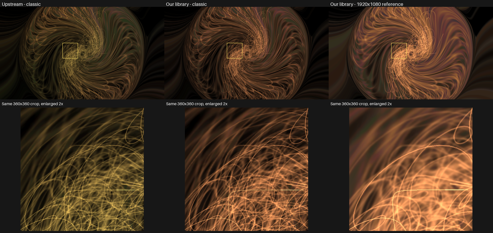

# Locked15 reference-line comparison at4K

Unchanged **Geiss – 3D – Shockwaves** renders3840×2160 with matched preset,
textures, frozen PCM, seed12345 and frame/30 time. Each configuration runs twice
for120frames on the owned API36 GPU TV emulator. All repeats are exact, with
zero GL-error frames. The source is locked main120547f3/all15 patches.

Upstream and our classic control have thin loops. Enabling the1920×1080 reference
path makes those loops and feedback trails broader and brighter. The same360×360
crop is enlarged2× below every panel; no brightness gain is applied. The overview
uses identical4× BOX reduction and a marked crop rectangle.

Our classic control also includes0014’s legacy tint correction: this preset has
fShader=0. Comparing our two controls isolates the reference policy within the
same current library. That policy covers line geometry and associated sampling/
feedback, not AA alone; AA is off. The render/reference area ratio gives line
scale2. This addresses [upstream682](https://github.com/projectM-visualizer/projectm/issues/682)
as an optional enhancement; fixed1px original lines are not called a compatibility
bug. At frame119, upstream/current-classic RGB8 MAE is3.992175; current-classic/
reference MAE is22.232687. These are image differences, not performance results.

Rendered manifests bind effective controls independently of job/host metadata:

| Role | Applied reference size | AA | Feedback override |
|---|---|---|---|
| Upstream | 0×0 | Off | Disabled |
| Our classic control | 0×0 | Off | Disabled |
| Our reference path | 1920×1080 | Off | Disabled |

Upstream lacks the TV control API, so its paired job’s reference request remains
ignored and the manifest reports classic defaults. Worker/helper source and
canonical NDK binaries, retained inputs/exits, applied controls, all720 full RGB
frames and public PNG pixels are independently verified. [Reference results](reference-results.json)
and [verification](reference-verification.json); [classic results](classic-results.json)
and [verification](classic-verification.json); [figure audit](figure-audit.json).
Full-resolution originals: [upstream](upstream.png), [our classic](our-classic-control.png),
[our reference path](our-reference-lines.png).

The [original13-patch line evidence](../lines/README.md) stays unchanged. The new
current reference pixels differ from that earlier endpoint; its images/receipts
are not relabeled. Full streams/workers remain in ignored
build/patch-proof/locked15-lines-reference-4k-v1, locked15-lines-classic-4k-v1 and
current15-control-bound-workers-v1. These are direct instrumented library frames,
not production AAR/JNI, original Windows frames or physical-TV measurements.
