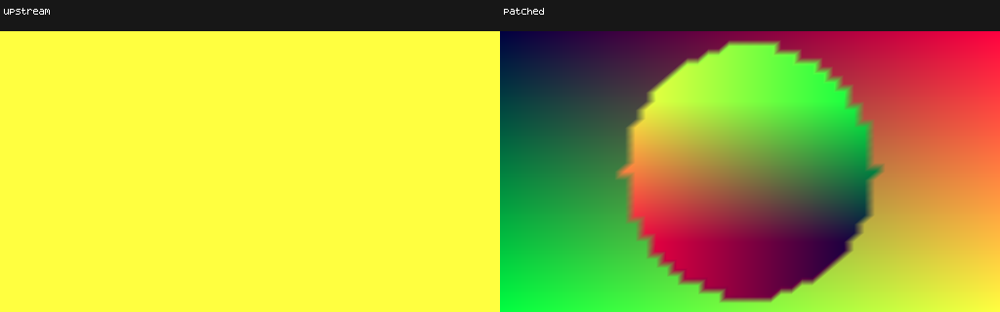

# Locked15: defined negative integer-power control

This is a generated diagnostic, not an edited Tulip preset. It sets zoom−0.5,
with authored exponent0 outside radius0.5 and exponent1 inside. The resulting
CPU nested powers are exactly0/1: effective zoom is1 outside and−0.5 inside.
All vertices therefore have a finite defined CPU power. Red/green visualize warp
UV coordinates; constant blue64 proves the requested shaders remain active.

Upstream's field collapses to RGB255/255/64. The current-minus0015 control already
has0006's unit-exponent specialization: the center works, but the outer area still
collapses. Current0015 preserves the coordinate field across both regions.
The actual [control frame](without-0015.png) remains separately labeled.

Patch0015 computes negative powers after float conversion in PerPixelMesh and
passes the result through attribute9. Positive bases retain shader arithmetic;
fractional negative domains retain their nonfinite results. The original Tulip
is not fixed by this control and is not substituted with these diagnostic bytes.
Its unchanged/nonfinite observations remain in the [original investigation](../../../tulip-negative-zoom-power/README.md).

Independent checks verify all120 corrected first-repeat frames: corners are
RGB0/0/64,255/0/64,0/255/64,255/255/64, and center127/127/64. All roles retain blue64
at every pixel/frame. [Pixel checks](pixel-checks.json) supplement source/binary
verification; they do not claim arbitrary original Windows pixels.

All three roles run twice,120frames,512×288, seed12345/frame30 and frozen mono PCM,
on the owned API36 GPU TV emulator5630/M4 Pro/GLES3.0. Every repeat is exact;
there are no GL errors or shader warnings. The source is the locked15-patch
main120547f3; upstream has the GLES admission adjustment and current/control
suppress API36 binary-cache export. Source reconstruction, canonical NDK rebuild
and all720 decoded RGB frames verify: [results](results.json),
[verification](verification.json), [figure audit](figure-audit.json).
The [diagnostic source](negative-integer-zero-power.milk) is preserved.
Complete streams/workers remain under ignored build/patch-proof/locked15-negative-power-v3
and current15-job-bound-workers-v2. Raw display pixels are unchanged.

This replay uses the job-bound seed/input harness: inputs are retained, job paths
bind to the recorded owned workspace, and the validated job seed initializes
the worker RNGs. The exact validated worker is retained and uploaded with a
device-side hash check; verification rebuilds that retained binary and enforces
the trusted waveform and supported 16:9 dimensions. All720 RGB frames match the preserved v1 capture; published
images and figure hashes remain unchanged. Original v1 streams/workers remain
available separately under their prior ignored build paths.
