<!-- Detailed working assessment retained when the main page was simplified, 2026-10-08. -->
# Current patches against upstream projectM 4.2 master

This preserved assessment covers the **14-patch snapshot**, in build order, over upstream
[`6f64807467e312034883a4389e6aa80a675458bc`](https://github.com/projectM-visualizer/projectm/tree/6f64807467e312034883a4389e6aa80a675458bc).
That pin reports CMake version 4.2.0 and is an **unreleased development snapshot**.
The evaluator pin is `22fb0cfd8f2dfbcd2b68f2443e7f44e19b32c09a`.
Assessment source: main `41ec3fc1` (PR #57), 2026-10-08. The
[14-patch manifest](current14-series.json)
records all 14 patch hashes. Earlier GPU figures were produced from ProjectM TV
`654815d8`, the 13-patch snapshot, with its immutable
[capture manifest](series.json). Their
identities remain unchanged; they do not certify the newly added 0014 or the full
14-patch endpoint. The 0014 Hurricane comparison uses that snapshot; revalidation of affected earlier witnesses remains pending.
The active [patch reference](../../../UPSTREAM_PATCH_VALUE.md) covers the locked
15-patch publication inventory at `120547f3` in [current-series.json](current-series.json).
This assessment retains its earlier 14-patch conclusions and capture identities;
deeper optimization and lifecycle comparisons are deferred to a follow-up.
Observed upstream master is `e98fca85e57802d27a6d11499642de2a1d5e994e`. Its only
change from the app pin is the GLES3.0 admission adjustment used in these captures;
[byte-verified equivalence](upstream-master-equivalence.json)
establishes that the baseline renderer source matches current master before
the shared deterministic instrumentation.

This is a reference for libprojectM maintainers evaluating behavior, compatibility
limits and possible contributions. A contribution candidate is not a submitted or
accepted upstream change. The old migration assessment and attribution remain in a
[separate archive](pre-rewrite-assessment.md).
Patch numbers below always refer to this preserved 14-patch series.

## Single-page comparison overview

This page consolidates the 14-patch assessments, comparison images, visual
differences and code-level explanations. The linked evidence folders provide
full-resolution frames and source/binary/payload verification; they are supporting
records, not additional patch assessments that readers must assemble themselves.

All 14 patch sections from that snapshot are present. Patch 0014 has a matched upstream/control/current14 TV comparison; affected earlier witnesses still need 14-patch endpoint revalidation. The retained-component expansion below
records incomplete coverage; an existing patch-level image does not prove every component
inside consolidated 0001–0003. Status is recorded here rather than presenting
pending components as completed contributions.

| Retained component | Upstream/current comparison status |
|---|---|
| [High-resolution reference lines (#682)](#retained-high-resolution-line-enhancement-upstream-682) | Published: actual 4K original, current classic control and source-pixel zoom. Low/reference/AA coverage is not yet complete. |
| Reference sample/fade/blur/canvas policy | Visible in the combined reference-path example; independent subcomponent controls pending. |
| [Fragment-failure shader cleanup](#fragment-failure-shader-cleanup) | Published: healthy library frames plus actual 16-versus-0 live shader counts. |
| [Fresh/reused feedback initialization and caller-state preservation](#freshreused-feedback-initialization-and-pooling) | Published: actual controlled first-read pixels, transparent-black clear and preserved caller state. Context-recreation coverage pending. |
| [Texture pooling](#freshreused-feedback-initialization-and-pooling) | Published: one-versus-two storage allocations and 12,288 retained bytes. Default-off/external/pressure/context controls pending. |
| Qualified warp sampler unit-zero reservation | Component-specific comparison pending. |
| Ordered batching and evaluate-once replay | Images and measured draw/evaluation counts pending. |
| Translation/program caches and uniform/bind caches | Component-specific operation/resource comparisons pending; API36 binary-export limitation remains explicit. |
| Flip reuse, direct blur, vector UV gating and final-orientation echo | Component-specific pass/preservation comparisons pending. |
| Discard/blur-read timing and direct-output switch history | Component-specific pixel/state controls pending. |
| [Global flat-array layout and whole-array assignment](#global-flat-array-layout) | Published: unchanged Quicksand original with logged baseline fallback and restored authored filter. |
| [Local flat-array layout](#local-flat-array-layout) | Published: labeled diagnostic, red fallback versus authored gradient. |
| [Initialized writable uniform-bank copies](#initialized-writable-uniform-bank-copies) | Published: nonzero-component control, actual RGB `(255,0,64)` versus expected `(255,204,64)`. |
| [Compound uniform writes shared with helpers](#compound-uniform-writes-shared-with-helpers) | Published: unchanged Martin original's star/ray pattern at matched source time. |
| [Legacy tint and mode-1 waveform (0014)](#0014-legacy-tint-and-mode-1-waveform) | Published: unchanged Hurricane plus disabled/half/full tint and isolated mode-1 controls on upstream/current-minus0014/current14 TV. |
| Other 0002 language/numeric components and 0003 thread isolation | Existing patch-level images/numerical controls are retained; the expanded component matrix tracks remaining activation coverage. |

The [component capture matrix](../../plans/2026-10-08-retained-component-proof.md)
tracks the remaining work. No whole-corpus, universal appearance or current-driver
performance claim follows from these scoped comparisons.

### Original PR inputs guide the remaining captures

The [23-component input map](original-evidence-inputs/README.md)
now joins the original PRs/commit records to exact preset identities where
available, preset types, activation settings and source-bound controls. These
records guide fresh current4.2 proof; their historical screenshots and timings
retain their original identities.

| Current component | Previously tested input/profile to reuse |
|---|---|
| Reference lines and sample decisions | [PR14's Royal103 sampling control](https://github.com/johnneerdael/ProjectM-TV/pull/14#issuecomment-5971576653): original1024×768 reference, bass-0.30 and separate low/1080/4K modes. Royal191 covers four-pass thick waves. |
| Blur sizing and shader canvas policy | [PR14's blur controls](https://github.com/johnneerdael/ProjectM-TV/pull/14#issuecomment-5971576796): Nuclear; virtual texsize has sawtooth grin/penattrition controls. Exact short-name variants require their linked JSON. |
| Blur caller ownership | [PR34](https://github.com/johnneerdael/ProjectM-TV/pull/34): unchanged midgit, known TGA inputs, first allocation/unchanged size/resize and distinct read/draw targets. |
| Evaluated geometry replay | [PR40](https://github.com/johnneerdael/ProjectM-TV/pull/40): Waltra - Heaven Liquid and Hexcollie - Julian Shader Wars4 nz+ sports fart; authored/off/Standard/Medium/High controls at3840×2160. |
| Arrays, uniform writes and parser behavior | [PR26](https://github.com/johnneerdael/ProjectM-TV/pull/26) names Glass Ocean/Arctic Chill and Royal324; [PR29](https://github.com/johnneerdael/ProjectM-TV/pull/29) supplies16 hashed parser originals and distinct numerical controls. |
| Pooling, batching and pass/caches | Early optimization commits supply pool-off/on, multiple instances, shape-heavy ordered draws, cold/warm shaders, vector visibility, clip/blur reads and switch-history contracts. Several exact benchmark names are absent; the map labels that gap. |

The present capture harness does not yet expose every original reference/native
profile or event sequence. Implement those explicit controls before claiming that
a healthy preset screenshot activates a cache, replay or pass optimization.

## Reading the image evidence

The requested comparison is **the pinned upstream renderer versus the current
patched renderer**, with identical preset bytes, textures, audio, clock, dimensions
and seeds. Existing migration fidelity images compare two patched ProjectM TV
engines and do not provide that comparison.

The new [image-proof record](README.md)
tracks GPU Android TV captures and their status. The baseline discloses a
**GLES 3.0 admission adjustment**: the emulator exposes GLES 3.0 while unmodified
upstream requires GLES 3.2. Lowering only the admission check allows rendering
comparisons without importing preset compatibility or image fixes. It is labeled
**upstream + GLES 3.0 admission**, not an untouched stock binary.
The patched capture variant disables program-binary caching because the API36
guest reports binary-export GL errors. The exact adjustments and failed initial
attempts are retained in the image-proof record. These images do not validate caches.

A full-series comparison demonstrates the combined library change. An adjacent
before/after or single-patch ablation is needed to attribute a difference to one
patch. Preserve load failures, equation omissions, shader fallbacks and GL errors
beside images. A failed renderer has no valid screenshot; an error panel must not
be represented as its rendered output.

MilkDrop 2 source and D3D9 specifications explain intended operations. They are
not screenshots from Windows. Label numerical oracles, altered diagnostic presets
and reference-size projectM captures separately from real MilkDrop 2/D3DX renders.
No original Windows appearance is certified here.

## 0001 — TV rendering and preset compatibility

Source: [0001-tv-rendering-and-preset-compatibility.patch](../../../../tools/projectm-patches/0001-tv-rendering-and-preset-compatibility.patch). This is a consolidated
patch, not one independently attributable defect. Split its general correctness
changes from host policy and optimizations for upstream proposals.

| Area | Current behavior and activation | Potential upstream value and limits |
|---|---|---|
| GLES integration | Admit GLES 3.0 through the current GLAD resolver. | Already present in observed master e98fca85; this retained portion is redundant against that revision. Runtime checks still matter. |
| Resize and GL ownership | Preserve feedback history, caller read/draw bindings around blur allocation and required texture contents across passes. | General state correctness. Exercise first use, resize and distinct caller targets. |
| Sampling and user textures | Preserve explicit sampler aliases and random-slot image identity; parse sampler identifiers; ignore `sampler_state` blocks without shifting source offsets. | General preset compatibility. Authored sampler-state fields remain unsupported; random binding repair is not a new seeding policy. |
| Equation compatibility | Retry rejected legacy records across preset/wave/shape phases; omit still-rejected blocks with defined state and an initialization-warning callback. | Preserve accepted programs. Tolerant loading can hide authored errors if a host ignores warnings. |
| Lines and geometry | Draw reference-scaled quad lines, batch shapes in authored order and replay evaluated geometry without rerunning equations or RNG. | Separate reusable primitives from TV defaults. Check blend order, dots, borders and stateful equations. |
| Native trails | Maintain authored feedback with optional bounded native detail and diffusion fallback. Standard/Medium/High are host choices. | Product policy rather than an unconditional appearance default. Additional targets, shader restrictions, memory and driver cost matter. |
| Pass and cache work | Retain translated GLSL/program caches, texture pooling, optional pass elimination, direct output and reduced outgoing-preset cadence. | Evaluate context/driver identity, bounds, failed-load fallback and retirement. Reduced cadence changes animation. No current-driver speedup is established. |

### Retained high-resolution line enhancement — upstream #682

[Upstream #682](https://github.com/projectM-visualizer/projectm/issues/682) requests
resolution-scaled line rendering and anti-aliasing because fixed-width lines occupy
a smaller fraction of the image at high resolutions. The issue remains an open
enhancement. This work is retained inside current 0001; consolidation did not remove it.

`MilkdropPreset/LineGeometry` and `LineRenderer` implement an opt-in quad-segment
renderer for main/custom waveforms, shape outlines and motion vectors. With
`projectm_opengl_set_line_reference_size`, width scales by the square root of
render/reference pixel area above the reference, with a one-pixel minimum at or
below it. Thick lines retain four offset passes to preserve hit/alpha behavior;
waveform dots retain GL points with scaled size and fractional-area compensation.
Edges are hard by default, with optional one-pixel anti-aliasing through
`projectm_opengl_set_line_antialiasing` and a GL-line fallback if its shader fails.

The contribution has boundaries: joins are miters and open ends are flat, while
#682 also suggests round waveform joins and caps. The retained path therefore
addresses the high-resolution/scaling portion without completing every suggested
detail. Its associated reference-size policy also changes sample decisions,
dense-wave fading, blur source/LOD and reported shader canvas dimensions; those
must be reviewed separately from the quad primitive itself.

The [historical quad-line experiments](../quad-follow-up-verification/README.md)
provide prior geometry and device evidence with their original 4.1.7 identities.
They are not current 4.2 certification. Current-source `LineGeometryTest` controls
remain part of 0001; no present-driver performance gain or complete #682
implementation is claimed.

**What to look for:** unchanged `Geiss - 3D - Shockwaves.milk` renders dimmer thin
loops and trails in upstream at3840×2160. Our classic-line control is almost
visually identical to upstream. Enabling our1920×1080 reference-size path keeps
the loops and trails broader and brighter at4K. The source crop makes the stroke
difference legible without changing brightness. The top overview is identically
BOX-reduced4×; full4K PNGs are linked in the [capture and verification record](components/lines/README.md).

**Why the enhancement changes it:** fixed1px lines occupy less of a high-resolution
image. The enabled path uses2× line scale for these dimensions, together with its
reference-size sampling/feedback policy. This is an optional host capability,
not a new unconditional appearance default. AA is off in this comparison; the
panels do not separately prove the AA or individual reference-policy components.

All three configurations repeat all120 frames exactly with zero GL errors and
no shader warnings/errors. At frame119, upstream versus our classic control has
RGB8 MAE0.005962, while our classic control versus the enabled path has MAE19.675516.
The earlier512×288 equation panel is separate evidence for equation compatibility.

### Other retained components with separate upstream value

These are components of current 0001, rather than additional active patches.
Each deserves its own proposal scope and validation:

| Component and source | Classification and upstream value | Acceptance boundary |
|---|---|---|
| Fragment-failure cleanup, `Renderer/Shader::CompileProgram` | Correctness: delete the successful, still-unattached vertex shader when fragment compilation throws, then preserve the original exception. | `ShaderFailureTest` covers rejection, repeated failures and retry. Upstream already owns the `ShaderException::what()` behavior; do not claim it again. |
| Defined fresh/reused feedback, `TextureAttachment::ReplaceTexture` / `ClearPooledTexture` | Correctness: initialize fresh and pooled color attachments to transparent black before their first read. | Use a context-local scratch FBO and restore caller bindings, clear color, mask and scissor. `TextureHistoryTest` includes recreated-context FBO-name controls; no new allocation-time measurement is implied. |
| Qualified warp samplers, `MilkdropShader::LoadTexturesAndCompile` | Correctness: reserve warp unit zero for unqualified `main`, so the fixed bind cannot overwrite an earlier-sorting point/filter/wrap alias. | `WarpSamplerTest` checks mixed aliases and packed point state. Preserve random-slot identity and strong descriptor ownership separately. |
| Ordered shape batching and evaluated-geometry replay | Optimization and reusable primitive: reduce draws while preserving authored evaluation/draw order; replay prepared geometry for another target without rerunning equations or RNG. | Preserve blending and persistent state. Extra CPU geometry storage must be bounded; no current-driver speedup is established. |
| Color-attachment pool, `Renderer/Texture` | Opt-in resource enhancement/optimization: byte-limited storage belongs to the calling thread's current GL context and is disabled by default. | Exclude externally owned textures, define clears, support pressure release and forget old context names. Retained GPU memory is a cost. |
| Translation/program caches and uniform/bind caches, `MilkdropShader` / `Renderer/Shader` | Optimization: identify translated-source caching, driver program binaries, uniform-location caching and redundant program-bind suppression as distinct mechanisms. | Review keys, context/driver identity, bounds and failure paths. The current image protocol disables binary export and cannot validate its benefit. Reduced outgoing-frame cadence is a separate host policy. |
| Flip reuse, direct blur, visibility-gated motion-vector UV output and final-orientation echo | Optimization: retain individually identifiable pass reductions instead of treating them as one generic performance change. | Invalidate reused history on resize, motion-vector drawing and external edits; direct blur needs an attachment-completeness fallback. Preserve echo orientation, shade and alpha. |
| Discard-aware targets, blur-read timing and opt-in direct composite output | Correctness prerequisites and host capability: preserve prior target contents and the authored frame that a blur read sees; `SetOutputTarget` can draw directly into the caller target. | Store a frame before host-initiated switches, and retain safe clip/discard behavior. The existing caller-FBO API alone does not provide those history guarantees. |

Historical provenance and the already-upstream/omitted dispositions remain in the
archive. Only work still present in this current patch is assessed above; previous
measurements keep their original source and backend identities.

### Fragment-failure shader cleanup

**What changed:** sixteen intentionally rejected fragment compilations leave16
live unattached vertex shaders in upstream and0 in current. The shared observer
uses the actual linked `Renderer::Shader` and driver `glIsShader` queries. Current
catches the later fragment failure, deletes the successful vertex shader and
preserves the original exception. A valid retry links in both roles.

The healthy preset images above the counters remain almost visually identical;
the lifetime fix is shown by the measured data below them. The diagnostic cleans
its leaked objects before rendering, restores the GL entry point, and records no
GL API errors. All observations and120-frame images repeat; the current-minus0002
control also has0 leaks, separating this0001 fix from translator changes.
[Source/binary-bound GPU resource proof](components/shader-lifetime/README.md).

### Fresh/reused feedback initialization and pooling

**What to look for:** the lower panels show actual 64×48 attachment readback,
enlarged 4× without brightness changes. A shared allocation fixture fills fresh
storage green. Upstream leaves those pixels unchanged; our library initializes
both fresh and reused storage to transparent black. Retired storage was filled
blue before reuse, and the complete readback confirms that none of it survives.
Green is controlled initial storage, not a naturally observed artist-preset bug.

**How current0001 changes it:** `TextureAttachment::ReplaceTexture` clears color
attachments through `ClearPooledTexture`, including newly allocated storage. Its
scratch FBO and temporary full-channel, unscissored clear preserve the caller's
framebuffer and raster state. Both constructor observations preserve the probe's
nondefault state. With pooling explicitly enabled, our same-size second attachment
uses the retired storage: one measured allocation rather than upstream's two,
with 12,288 bytes retained after retirement. Pooling is off by default and keeps
storage resident; these counts do not establish a timing or GPU-memory benefit.

The unchanged Geiss frames above the diagnostics are normal renders after the
probe, with RGB MAE 0.001429. Two processes per role repeat all120 frames and all
readbacks/counts exactly, with zero GL errors and no shader warnings/errors.
[Source/binary-bound proof and full pixel records](components/texture-history/README.md).
Default-off, external ownership, pressure release and context recreation remain
separate pending controls.

Named candidates include `161.milk` and `430.milk` for rejected equations;
`midgitstraights of majillaen - featy sweet.milk` for blur/texture paths; and
`Fumbling_Foo & Flexi, Martin, Orb - Acid Mandala v1c.milk` for feedback policy.
The [regression inventory](../upstream-master-4-2/patch-regressions/README.md)
provides their source evidence. Historical issue membership does not establish a
current upstream failure. Capture separate equation/sampler and high-resolution
trails cases. A still image cannot establish cache correctness, concurrent
preparation, context loss, retirement or performance.

Upstream rejects the unchanged preset in both runs; the left panel quotes its load error. The patched role repeats all 120 frames exactly. This panel is a full-series comparison; the separate ablation addresses single-patch causality.

## 0002 — HLSL compatibility and finite float round trips

Source: [0002-hlsl-compatibility-and-float-roundtrip.patch](../../../../tools/projectm-patches/0002-hlsl-compatibility-and-float-roundtrip.patch). Preserve classic-locale
emission and finite float32 round trips with `max_digits10`, integral-float/signed-zero
spelling and rejection of nonfinite AST literals. Initialize writable copies from
incoming uniforms while preserving other components. Retain contextual identifiers,
macro token spacing and parenthesized postfix
expressions. Plain uninitialized scalar/vector float globals become external
uniforms; static, const, initialized and local storage retain their rules.

Retain `GLSLGenerator::OutputArrayInitializer`: translate flat scalar/vector array
initializer lists into correctly typed GLSL elements, preserve local/global layout
and assign global arrays as whole arrays. Reject incomplete or cross-element vector
layouts instead of guessing. `ArrayInitializerTest` and the real-GL
`FlatGlobalArrayInitializerKeepsTheAuthoredShader` /
`FlatLocalArrayInitializerKeepsTheAuthoredShader` controls identify this component;
the reserved-identifier screenshot below does not independently prove array layout.

### Global flat-array layout

**What to look for:** in unchanged `ORB - Quicksand Lab.milk`, upstream and
current-minus0002 use a brighter cyan fallback composite. Our library runs the
authored five-tap filter and produces dimmer cyan regions with edge emphasis.
The filter's weights sum to0.2 after its authored multiplier, so the darker
appearance is expected; no screenshot brightness gain or correction is applied.

**How the retained array work changes it:** the source initializes five `float4`
elements from twenty scalars. GLSL needs typed vector constructors and a whole-array
assignment. Both baseline roles report array index/constructor/type errors and
explicit composite fallback. Current compiles the authored shader without those
warnings. All three roles repeat all120 frames exactly with zero GL errors;
source/binary and complete decoded-stream verification pass. This establishes
global flat layout; local flat layout remains a separate control.
[Original bytes, shader cause and capture receipts](components/arrays-quicksand/README.md).

### Local flat-array layout

The labeled [local-array diagnostic](components/arrays-local/README.md)
initializes two `float2` elements from four scalars inside the function. Baseline
roles use a red-shape fallback after array-constructor rejection; current runs the
authored gradient. It is a generated control, not an unchanged artist preset.

### Initialized writable uniform-bank copies

The [nonzero bank control](components/uniform-bank/README.md)
sets incoming `q19=0.8`, writes only `q18`, and outputs both. Baseline roles lose the
green component, rendering `(255,0,64)`; current preserves it, rendering the expected
`(255,204,64)`. This demonstrates initialization of the whole writable bank before
a partial write; all roles compile without shader warnings.

### Compound uniform writes shared with helpers

In unchanged `Martin - QBikal - Surface Turbulence IIeeeee hakanh mash-up k10.milk`,
the shader scales `time` by0.6 before star helpers read it. The matched frame119
shows a different star/ray pattern when the initialized copy is shared correctly.
This is the authored state change, not an added effect. [Source operation and receipts](components/uniform-time-helper/README.md).
All three comparisons above have source/executable/full-stream checks, two exact
120-frame repeats per role and zero GL errors.

Modulo type, precedence and emission compatibility is supplied by upstream
[PR #1031](https://github.com/projectM-visualizer/projectm/pull/1031), rather than a
separate retained modulo implementation in current 0002.

General translator correctness value; longer generated source is a tradeoff.
Unbound GLES uniforms start at zero, which does not reproduce arbitrary D3D9
register history. Independently test each language change before combining proposals.
Witness candidates include `Flexi - dimension window.milk`,
`EVET + Flexi - Rainbox Splash Poolz.milk`, `martin - organic light.milk` and
`Serge + martin - crystal palace tunnel003.milk`. The hash-pinned
`float-literal-control.milk` is synthetic, not an unchanged bundled preset.
Retain translation errors and active shader status beside pixels.
A fresh logging replay of the original `Flexi - dimension window.milk` confirms
that upstream and the no-0002 role use a fallback composite shader; the patched
role emits no such warning. All 120 frames match the prior image evidence.
See the [reproduction receipt](reproduction-validation.json).

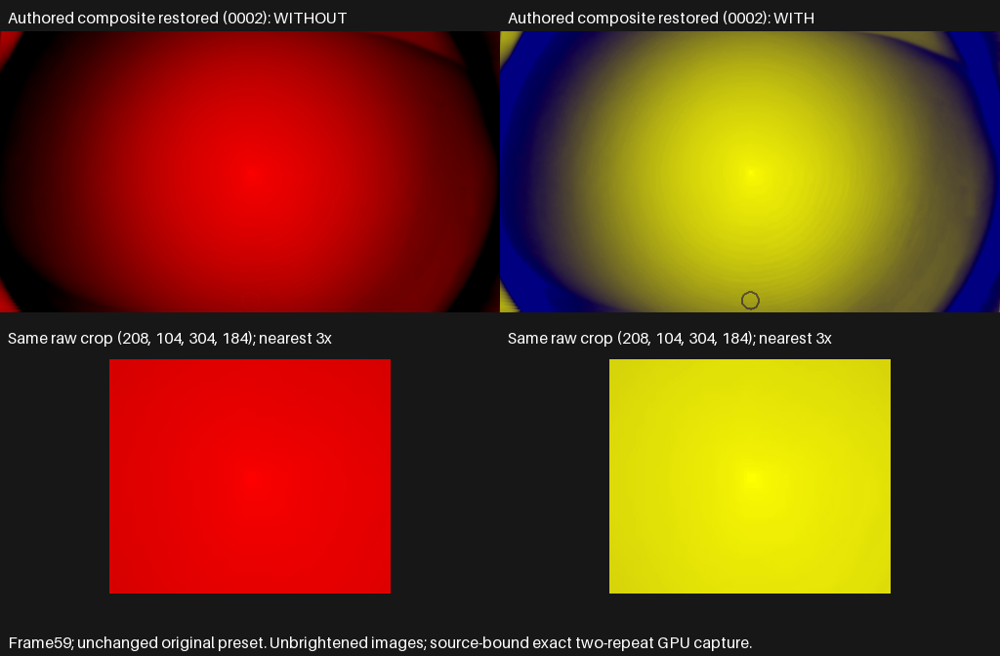

**What to look for:** `Flexi - madness portal.milk` becomes a plain red disc with
black surroundings when its authored composite cannot compile. With 0002, the
same original preset renders its yellow/blue composite and coloured surround.
The full frame and aligned, unbrightened close-up show the change directly.

**How the bug causes it:** the preset declares a local HLSL variable named `sample`
and uses it while computing the output colours. The translator must preserve that
identifier during contextual-type lookahead and map it to a safe GLSL name.
The older path fails to compile the composite and uses the generic fallback,
so the preset's colour operations are absent. Patch 0002 retains the required
parser/name-emission compatibility. This is restored authored shader execution,
not an added colour filter.

Removing only 0002 changes all 120 frames; both roles repeat exactly, with zero GL
errors. The selected frame 59 is 512×288 and has RGB8 mean absolute difference 54.102.
[Raw upstream/current-minus0002/current panel](0002-15e7552b07.png).

Earlier controls below retain other translator paths and their scope.

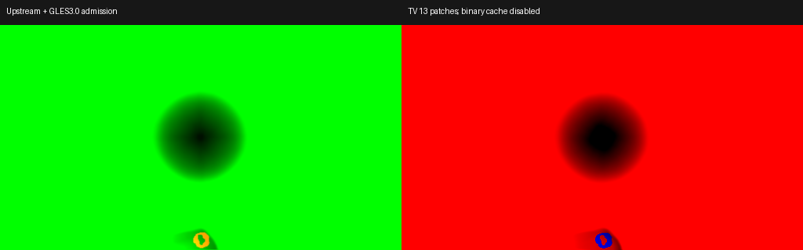

Frame 119, 512×288, fixed synthetic audio/clock/seed; two exact 120-frame repeats per successful role. Full-series comparison; use the adjacent ablation/activation controls for single-patch attribution.

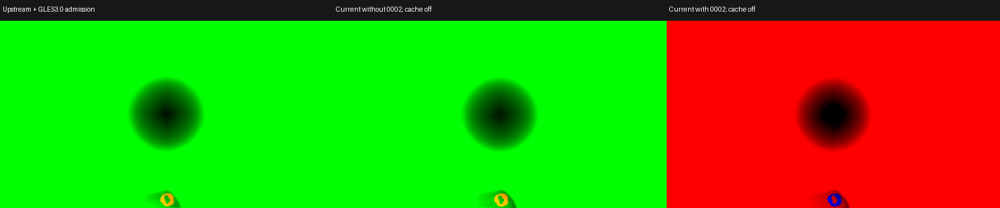

Unchanged bundled preset; upstream/current-minus-patch/current columns. Removing only 0002 changes 120/120 RGB frames under these inputs. All successful roles repeat exactly with zero GL-error frames; rejected roles are explicitly labeled.

## 0003 — Evaluator random state and lone-dot numbers

Source: [0003-evaluator-thread-local-rand-and-lone-dot.patch](../../../../tools/projectm-patches/0003-evaluator-thread-local-rand-and-lone-dot.patch). Make Mersenne Twister
state thread-local so background evaluation does not advance the foreground stream.
Accept a lone `.` as zero, matching NS-EEL, while preserving ordinary numbers and
invalid-code rejection. Keep `Scanner.l` and checked-in `Scanner.c` synchronized.

Fresh evaluator controls also distinguish the non-image contract: patched fresh
threads produce independent identical streams and a lone dot executes as zero.
Upstream and the no-0003 role retain shared stream progression and reject the dot.
Both runs repeat; see the [source/binary-bound reproduction receipt](reproduction-validation.json).

Submit evaluator changes to projectm-eval. Each thread begins the same fixed-seed
stream; this changes cross-thread coupling, not the generator algorithm. A
single-thread screenshot cannot prove isolation. Use the fresh-thread random-stream
control plus an explicit lone-dot fixture. A fresh source search recovered two bundled positive matches: the base and `nz+`
versions of `Stahlregen - funky Blur (lotus mix) the genius in me lies right at the heart of the flacc.milk`.
Both contain `zoom=zoom+.10*sin(rad+.+15.15)` in per-pixel code. This establishes
current source membership; it does not identify the original private issue report.

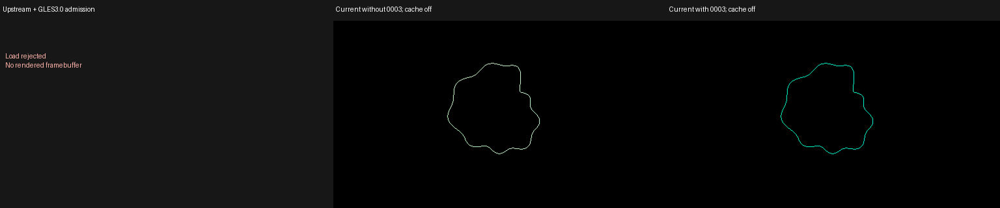

Synthetic activation fixture, not an unchanged bundled preset: 120/120 RGB frames differ when removing only 0003. Successful roles repeat exactly; zero GL-error frames.

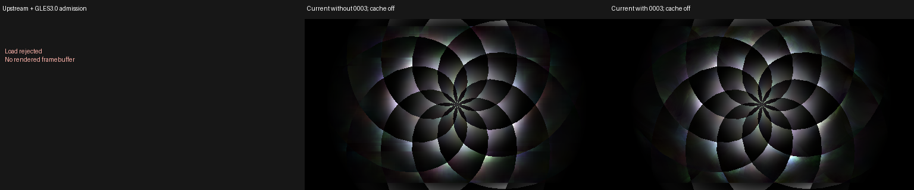

Unchanged bundled preset; upstream/current-minus-patch/current columns. Removing only 0003 changes 120/120 RGB frames under these inputs. All successful roles repeat exactly with zero GL-error frames; rejected roles are explicitly labeled.

## 0004 — Main-textured shape sampler ownership

Source: [0004-textured-shape-sampler.patch](../../../../tools/projectm-patches/0004-textured-shape-sampler.patch). Bind an instance-owned repeat/linear
sampler for every main-textured fill, including geometry replay. A sampler left on
unit zero could override texture state; unbinding could expose nearest filtering.
Preserve named-image descriptor qualifiers instead of mutating shared texture state.

`widest swing.milk` is the recovered exact production witness. Compare repeated
instances and edge-crossing samples, with a separate analytical bilinear fixture.
General sampler correctness with one sampler per shape instance; no new quality setting.

Frame 119, 512×288, fixed synthetic audio/clock/seed; two exact 120-frame repeats per successful role. Full-series comparison; use the adjacent ablation/activation controls for single-patch attribution.

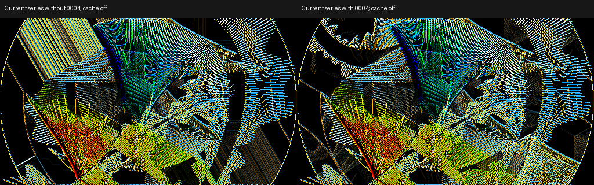

Isolated removal of 0004, same inputs: 119/120 RGB frames differ; both roles repeat exactly with zero GL-error frames.

## 0005 — Safe blur intervals

Source: [0005-blur-range-interval.patch](../../../../tools/projectm-patches/0005-blur-range-interval.patch). Expand the upper bound upward when a range
collapses. Preserve clamp-then-expand ordering and ordinary float32 arithmetic.
Reject nonfinite, unrepresentable or progressively degenerate normalization domains
with coherent `[0,1]` defaults for all levels and their decoding coefficients.

Defensive numerical correctness. The reference has the same upper-bound typo;
this is not a backport of an already-correct reference implementation. Candidates
include `Cope - The Cloud.milk`, `Mig_015.milk` and `$$$ Royal - Mashup (29).milk`.
`EVET - Scanazoic --- Isosceles edit.milk` is a negative control. Record evaluated
bounds/coefficients: a historical blur witness had unchanged pixels despite its
reported unsafe domain. Do not promise a visible improvement for every fixture.

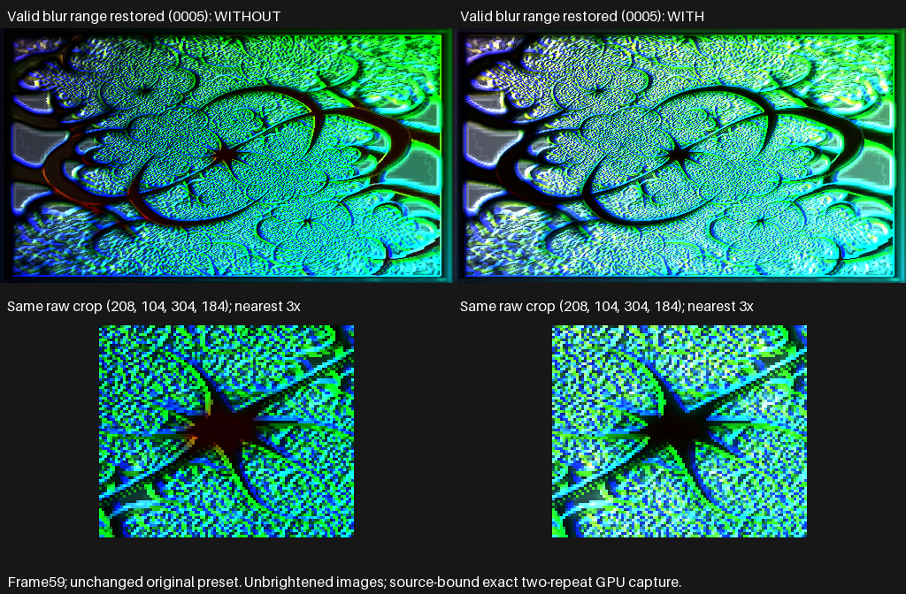

**What to look for:** in `flexi - a julia fractal for hexcollie embossed (Jelly).milk`,
the uncorrected frame has darker, altered embossed shading. The corrected frame
has different bright relief and highlights across the same fractal structure.
The close-up uses the identical source region and no brightness adjustment.

**How the bug causes it:** this preset sets third-level blur bounds to 0.49 and 0.52,
while the preceding level uses 0.78 and 0.91. The legacy clamp-then-expand logic has
to repair the resulting narrow/inverted interval. Its typo sets both the lower
and upper bound to `avg - 0.05`, collapsing the range. The progressive scale/bias
calculation can then divide by zero. The preset combines `GetBlur3` with other
blur levels to calculate normals and embossed colour, so a bad third-level blur
changes its visible lighting. Patch 0005 expands the upper bound upward and keeps
storage/decoding coefficients coherent; it does not change the artist's shader.

All 120 frames differ when removing only 0005, and both roles repeat exactly with
zero GL errors. Frame 59 at 512×288 has RGB8 mean absolute difference 38.541.
[Raw upstream/current-minus0005/current panel](0005-b9b0b89b38.png).
The earlier zero-effect original and synthetic boundary controls remain below.

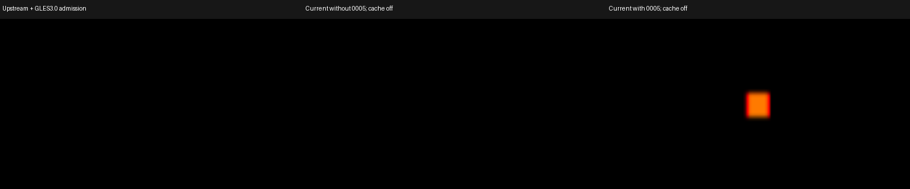

Synthetic activation fixture, not an unchanged bundled preset: 119/120 RGB frames differ when removing only 0005. Successful roles repeat exactly; zero GL-error frames.

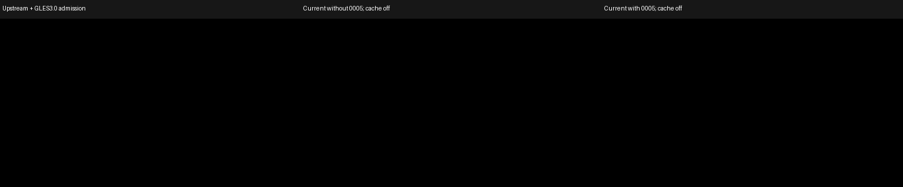

Unchanged bundled preset; upstream/current-minus-patch/current columns. Removing only 0005 changes 0/120 RGB frames under these inputs. This is a preservation control for this input, not a visible benefit. All successful roles repeat exactly with zero GL-error frames; rejected roles are explicitly labeled.

## 0006 — Signed unit-exponent zoom

Source: [0006-fixed-warp-signed-unit-zoom.patch](../../../../tools/projectm-patches/0006-fixed-warp-signed-unit-zoom.patch). For finite negative zoom and an
exponent exactly one, use the signed base directly in the shared warp vertex shader.
GLSL `pow` has an undefined negative-base domain even for exponent one. This reflects
UV displacement around the warp centre; positive zoom and other exponent paths remain.

`Hexcollie - This is where we begin stripped.milk` is the exact recovered witness.
Narrow compatibility correction, not arbitrary negative-base power support. Retain a
UV readback oracle beside the preset image.

Frame 119, 512×288, fixed synthetic audio/clock/seed; two exact 120-frame repeats per successful role. Full-series comparison; use the adjacent ablation/activation controls for single-patch attribution.

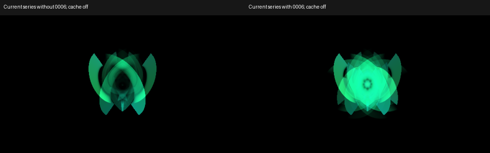

Isolated removal of 0006, same inputs: 119/120 RGB frames differ; both roles repeat exactly with zero GL-error frames.

## 0007 — Evaluated built-in waveform controls

Source: [0007-live-builtin-wave-controls.patch](../../../../tools/projectm-patches/0007-live-builtin-wave-controls.patch). Consume evaluated mode, dots,
thickness and additive blending without overwriting defaults. Rebuild mode math
when the evaluated mode changes; retain integer truncation, signed remainder and
projectM's 16-mode extension. Reuse prepared geometry for the second draw.

Witness candidates: `idiot - Forty Six and 2 (pushit!).milk` and
`Hexcollie - now entering the wormhole2 - mash0000 - if you like this, maybe you, like me, are insane.milk`.
Use multiple timestamps to show an authored mode/flag change. General compatibility;
not all 16 modes belong to original MilkDrop 2.

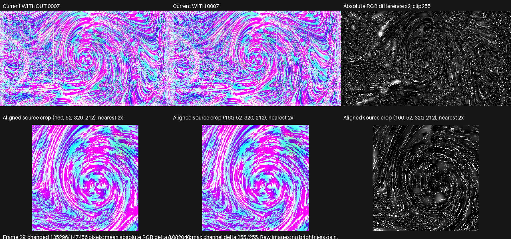

This original Hexcollie wormhole preset has `nWaveMode=3` but evaluates
`wave_mode=q8%7` every frame. Removing only 0007 changes all 120 frames; both roles
repeat exactly with zero GL errors. At frame 29,135,296/147,456 pixels differ through
waveform geometry and feedback. The raw images/crops retain brightness; the right
column is a labeled ×2 absolute-difference map. [Raw upstream/no0007/current panel](0007-wormhole.png).

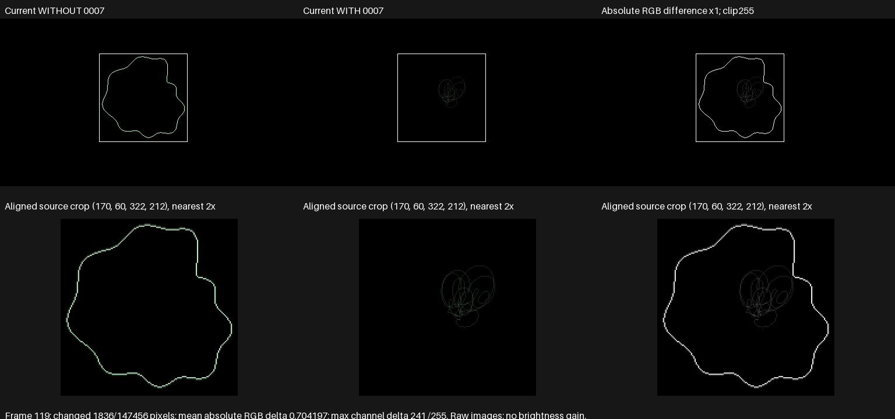

The synthetic mode switch changes 60 frames after frame 60. Its aligned crops show
the waveform geometry directly; it is labeled as a diagnostic rather than an
original artist preset.

`319.milk` sets `wave_a=0`, so it is **not a visual waveform-fix witness**. Its earlier
[zero-effect ablation](0007-wave-isolated.png)
remains a preservation record, but receives no positive 0007 proof credit.

## 0008 — Evaluated legacy display controls

Source: [0008-live-legacy-display-controls.patch](../../../../tools/projectm-patches/0008-live-legacy-display-controls.patch). Consume evaluated gamma, echo
and legacy filter flags, including equation-only activation. Preserve configuration
defaults, Mesh/ShaderCache ownership and custom-composite policy. Custom composites
do not gain legacy effects through this patch.

Use the same three live-control witnesses, plus an equation-only filter fixture to
separate this change from 0007. Record active display values and selected timestamps;
do not attribute every full-series difference to this patch.

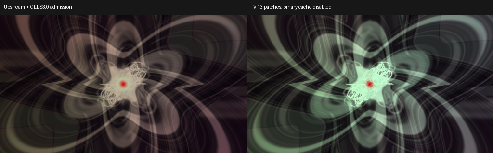

Frame 119, 512×288, fixed synthetic audio/clock/seed; two exact 120-frame repeats per successful role. Full-series comparison; use the adjacent ablation/activation controls for single-patch attribution.

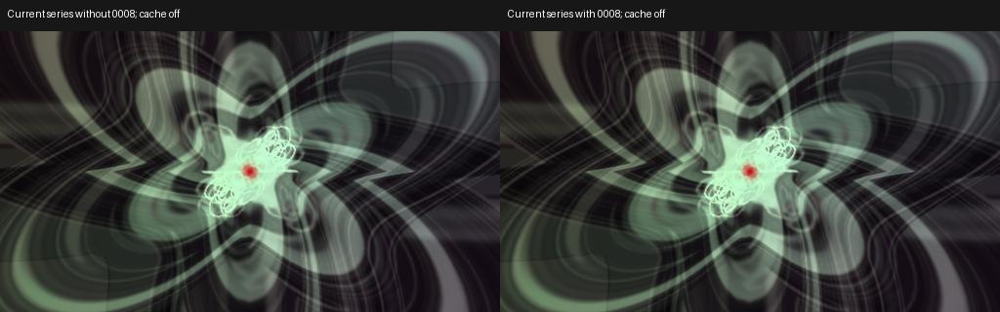

Isolated removal of 0008, same inputs: 0/120 RGB frames differ; both roles repeat exactly with zero GL-error frames. This selected input does not activate a visible difference from this patch.

Synthetic activation fixture, not an unchanged bundled preset: 60/120 RGB frames differ when removing only 0008. Successful roles repeat exactly; zero GL-error frames.

## 0009 — User-texture premultiplication bytes

Source: [0009-user-texture-premultiplication.patch](../../../../tools/projectm-patches/0009-user-texture-premultiplication.patch). Apply
`(rgb * alpha + 128) >> 8` before stbi-backed RGBA upload, preserving alpha. This
includes opaque-channel rounding. Internal generated textures are a separate path.

`suksma - chemosynthetic nosferatu - gdy patent pending free energy devices - rand tritex - inv play.milk` is the recovered witness. Retain a known-byte upload
control beside its image. Upstream value is an explicit user-texture alpha policy;
exact SOIL rounding is a compatibility choice rather than a universal loader rule.

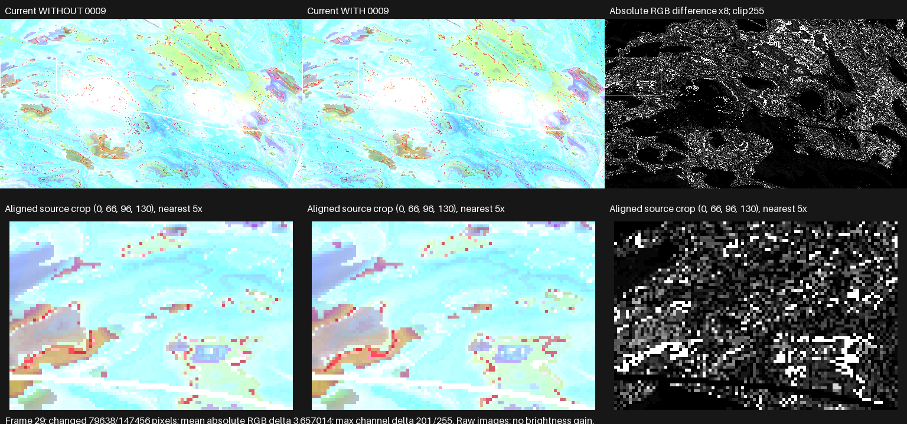

Frame 29 isolates only 0009. The outlined rectangle marks the same source crop in
both raw images; lower crops use nearest enlargement with **no brightness gain**.
The right column is **max absolute RGB difference ×8, clipped at 255**, not rendered
appearance. 79,638/147,456 pixels change, mean RGB8 absolute difference 3.657 and
maximum channel difference 201. Small upload-byte changes can amplify through
feedback; this is compatibility evidence, not a Windows appearance claim.

[Raw upstream/current comparison](0009-texture.png)
and [raw upstream/no 0009/current endpoint](0009-original.png)
remain available. At frame 119 the difference is quieter (mean RGB8 delta 0.485);
the previous full-frame endpoint alone was poor visual presentation.

## 0010 — Per-preset texture search-path ownership

**Classification: host-integration enhancement.** Upstream documents changing
texture search paths as clearing/reloading its global texture cache. Redirecting
subsequent lookups to those new paths is consistent with that existing contract.
Patch 0010 intentionally adds a different contract: each live preset retains the
lookup from its load, while new paths apply to subsequently loaded presets. This
supports independent custom packs during transitions and cache resets.
See the [upstream texture-path contract](https://github.com/projectM-visualizer/projectm/blob/6f64807467e312034883a4389e6aa80a675458bc/src/libprojectM/ProjectM.hpp#L114).

Source: [0010-preset-texture-search-path-ownership.patch](../../../../tools/projectm-patches/0010-preset-texture-search-path-ownership.patch). New roots apply to newly
loaded presets; live incoming/outgoing presets retain their own texture manager
through soft cuts. Reset reloads live image caches using their original paths and
preserves feedback. Retain callbacks and strong descriptor/ShaderCache ownership.

Evaluate as a per-preset ownership enhancement for hosts that switch pack roots.
Use two controlled packs with
the same image name and different pixels; capture fade, reset and retirement.
No unique bundled preset can demonstrate a host changing its roots. ZIP upload,
QR codes and category UI are app features outside this patch.

**Bundled-collection relevance:** Cream of the Crop uses one shared texture
directory for all 9,606 bundled presets (74 image files). Ordinary switching
within that collection keeps the same roots. No bundled preset has a nonempty
named-image custom-shape field. The witness below tests a host changing between
custom packs, each with its own texture directory. Ordinary switching within
Cream of the Crop does not exercise this enhancement.

Original MilkDrop 2.25 custom shapes use the previous frame as their texture;
Aurora's named-image shape is a projectM capability. MilkDrop's shared image cache
also does not provide this per-pack ownership contract. The comparison evaluates
the added host capability; it is not a MilkDrop rendering-compatibility repair.
See [MilkDrop's shape documentation](https://www.geisswerks.com/hosted/milkdrop2/milkdrop_preset_authoring.html).

**What to look for:** the orange portal belongs to SOL. At frame 20 the host has
changed texture roots to the LUNA pack but has not loaded LUNA yet. Upstream and
the engine with only 0010 removed replace its orange SOL emblem with the blue
LUNA emblem. The patched engine keeps SOL. The full frames and aligned 2× crops
use the captured pixels without brightness changes.

These animated SOL/LUNA presets and images were created by the user's predictor
specifically to demonstrate this ownership enhancement. Its written forecast
preceded the GPU test and correctly identified frame 20 as the first visible
ownership difference. Both packs use
`shapecode_0_image=aurora_ownership_core.png`, with different image bytes. This is
a generated diagnostic witness, separate from the unchanged artist presets used
for other patches. All three roles repeat all 120 frames exactly with zero GL
errors. The causal pair first differs at frame 20; 100 frames differ overall.
After the two-second fade, both show LUNA, while their earlier feedback histories
can still differ. A separate patched replay without the frame-40 reset matches
the reset replay across all 120 frames. See the [forecast, frozen packs, frame
sequence and audit](aurora-ownership/README.md).

The earlier bundled-image fixture remains a separate control:

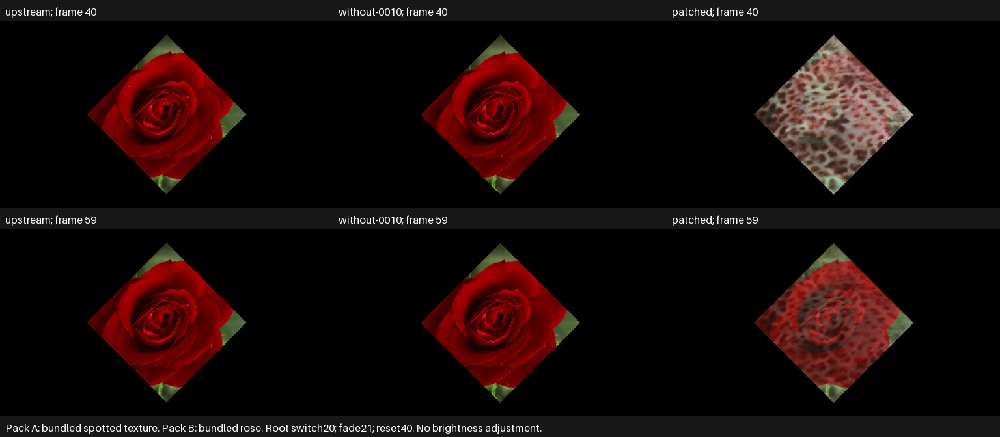

**What to look for:** Pack A contains the bundled spotted texture `onefish.jpg`;
Pack B contains the bundled rose photograph. Both are named `shared.jpg` in the
test packs. Without 0010, the outgoing shape displays the rose after the
host switches roots. With 0010, it retains the spotted image while the incoming
preset uses the rose. The row at frame 40 includes the reset during the fade;
frame 59 shows a later transition sample. No brightness gain is applied.

**Why the enhancement changes the image:** upstream gives every live preset the current
process-wide texture manager. Changing roots replaces that manager. Custom shapes
resolve named images while preparing each frame, so the outgoing preset's next
lookup can come from the incoming pack. Patch 0010 retains each live preset's
original manager and uses that manager for rendering and reset.

This is a host-level diagnostic fixture using unchanged bundled image bytes,
not an unchanged artist preset. The bundle has no named-image shape keys, and a
static shader binding can retain its image and show no ownership difference. Root switch,
soft cut and reset must be driven by the host. Upstream/no 0010/current each repeat
all 120 frames exactly with zero GL errors; only 0010 is removed in the causal pair.
[Fixture and source image hashes](clearer-02-05-10-figures.json).
The original colour-square journey remains a simpler numerical control below.

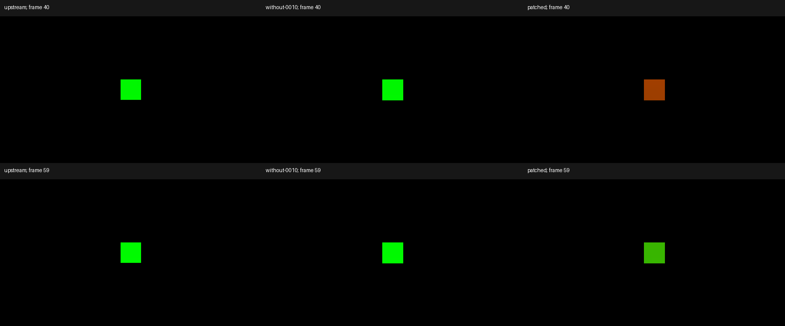

Controlled duplicate-name shape textures, a root change at frame 20, a soft cut at21
and reset at40. Removing only 0010 changes 59/120 frames. All roles repeat exactly,
with zero GL errors. An earlier static shader-binding control produced no difference;
its result is retained separately. This scene activates repeated shape-image lookup.

## 0011 — CPU warp rotation trigonometry

Source: [0011-cpu-warp-rotation-trig.patch](../../../../tools/projectm-patches/0011-cpu-warp-rotation-trig.patch). Convert evaluated rotation to float,
then compute CPU sine/cosine as MilkDrop 2 does. Reuse sine and supply cosine through
an instance-owned four-byte VertexBuffer at attribute 8. Preserve prepared-mesh
replay and authored/nonfinite equation values.

Witness: `EoS_Phat_PeterP_Sentinel_Aware_6 EoS edit slice into your beautiful love.milk`,
whose per-pixel code sets `rot=10000000`. On the observed Apple GLES translator,
GPU sine/cosine became zero, collapsing feedback to the rotation centre. Higher
precision did not repair that observation. CPU libm covers maximum finite float
angles where a rounded `2π` remainder is insufficient.

General compatibility value, with CPU trig and another buffer/attribute as costs.
Other custom shader trig is unchanged. Keep a UV oracle and distinguish a
rotation-only diagnostic variant from the original preset. No universal driver
failure or speedup is claimed.

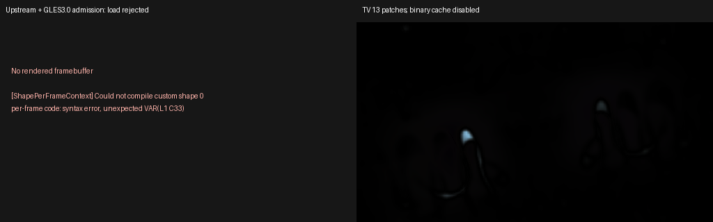

Upstream rejects the unchanged preset in both runs; the left panel quotes its load error. The patched role repeats all 120 frames exactly. This panel is a full-series comparison; the separate ablation addresses single-patch causality.

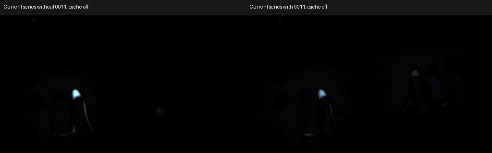

Isolated removal of 0011, same inputs: 118/120 RGB frames differ; both roles repeat exactly with zero GL-error frames. This removes the upstream equation-load failure as a confounder and exposes the rotation correction.

## 0012 — Custom-shape pixel centres

Source: [0012-shape-pixel-centers.patch](../../../../tools/projectm-patches/0012-shape-pixel-centers.patch). Translate fills/outlines by half a
destination pixel in each authored/native target, restoring shared shader matrices.
Preserve equations, radii, colours, UVs and assets. D3D9 samples integer pixel centres;
GLES samples half-integers, so copying coordinates alone can lose subpixel shapes.

Use sample 06 identified by exact hash in the
[dark-preset investigation](../dark-presets-06-10/README.md), plus
the `rad=.002`, `x=y=.5` diagnostic shape. Compare textured/untextured draws and
different target dimensions. A D3D9 coverage oracle is not a MilkDrop 2 screenshot.

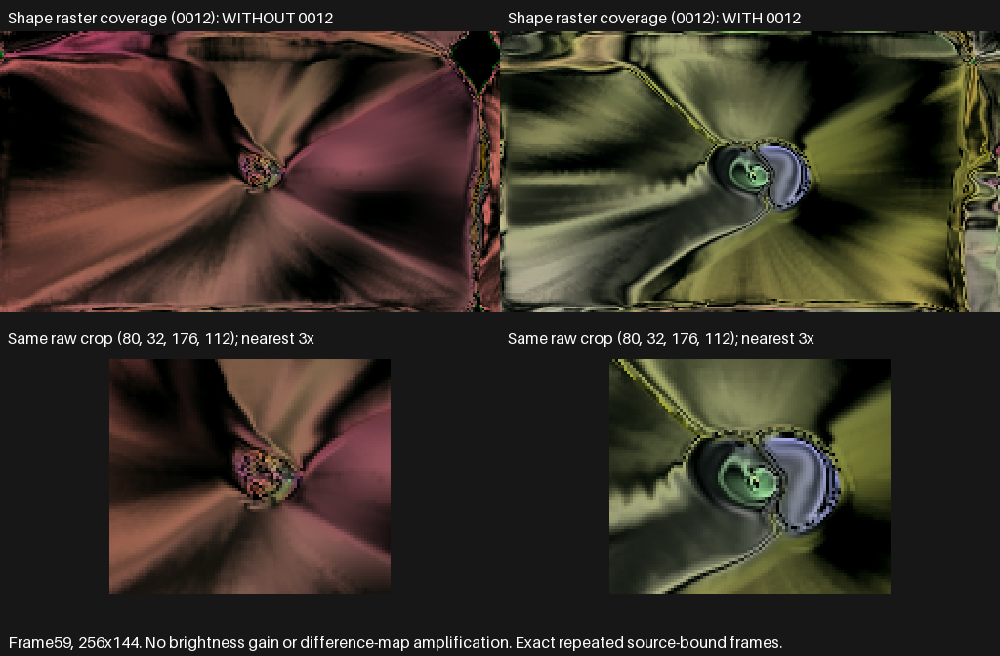

**What to look for:** in the unchanged `amandio c - the green machine … btbam
covers sepultura` preset, the uncorrected frame has pink/brown radial wedges and
a small centre; the corrected frame develops a green/yellow curved structure
around the centre. This is visible in the full frame, without a difference map.
The lower row shows the same source region enlarged with nearest sampling and
no brightness adjustment.

**How the bug causes it:** this preset draws thousands of very small custom shapes
and uses the resulting image in a gradient-driven feedback shader. Copying D3D9
shape coordinates directly into GLES places them against a different pixel-centre
grid. The wrong coverage changes which tiny shape fragments seed the feedback;
that difference grows into the different pattern and colours shown here.
Patch 0012 translates each shape draw by half a destination pixel, preserving its
authored position/radius/colour equations. This corrects raster sampling rather
than applying a colour or brightness filter.

At frame 59 and 256×144, removing only 0012 changes all 120 recorded frames; both
roles repeat exactly with zero GL errors. The selected frame's RGB8 mean absolute
difference is 44.837, with 34,365/36,864 pixels differing by more than 16 in at least
one channel. These are scoped observations, not a whole-library appearance claim.
[Raw upstream/current-minus0012/current panel](0012-c767a5b893.png).

The earlier dark-preset crops below remain secondary coverage records.

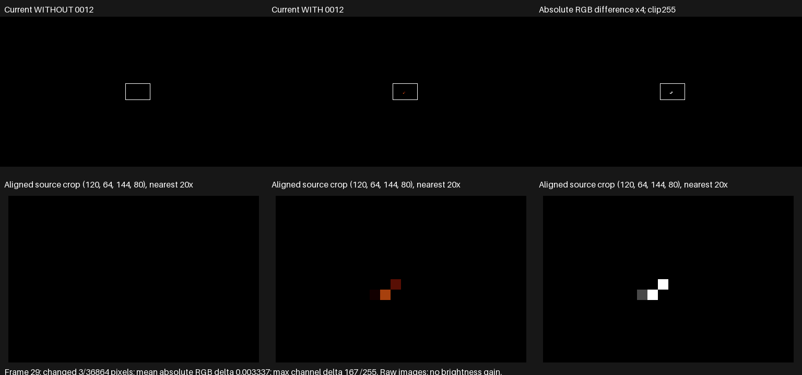

The original stays dark. At frame 29, removing only 0012 changes **three pixels**,
with maximum channel difference 167/255. The same 24×16 source rectangle is enlarged
20× with nearest sampling and **no brightness gain**. The right column is a
labeled ×4 absolute-difference map. This shows restored subpixel seed coverage,
not a broadly brightened preset. [Raw three-role endpoint](0012-original.png).

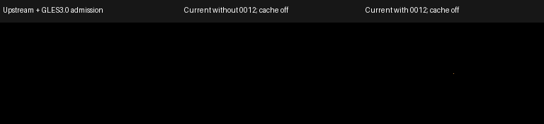

The separate diagnostic loses all shape coverage without 0012 and produces nonzero
pixels with it. Its dimensions, source and hashes are retained; it is not the
unchanged original preset or a MilkDrop 2 screenshot.

## 0013 — Custom-composite texel centres

Source: [0013-composite-texel-centers.patch](../../../../tools/projectm-patches/0013-composite-texel-centers.patch). Remove a redundant half-texel UV bias.
MilkDrop 2 shifts its D3D9 mesh positions by half a pixel while retaining UVs. GLES
already interpolates the unbiased mesh at texel centres; another UV offset dilutes
an impulse over four pixels.

Compare original sample 06/10 and a pass-through impulse/asymmetric-pattern fixture.
Expected output is one full-bright texel rather than four quarter-bright pixels.
Retain resize/repeated-draw controls and unchanged warp offsets. Sampling correctness,
not a brightness setting or speedup; the original presets remain authored sparse/dark.

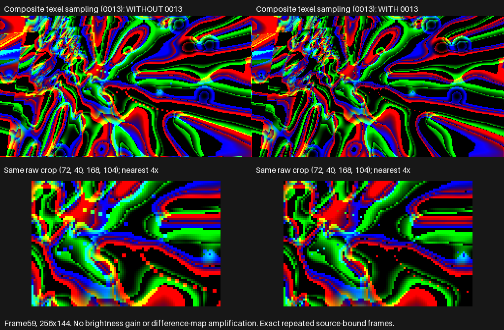

**What to look for:** the unchanged `DemonLD – Toxic water diffusion` preset has
bright green/cyan contour rims around its red and blue regions. Without 0013,
those rims and their nearby colours are sampled differently and the frame is
brighter. With 0013, the contour intensities change while the underlying scene and
motion remain the same. The lower row provides an aligned close-up, with no
brightness gain or amplified difference map.

**How the bug causes it:** GLES already interpolates the composite mesh at texel
centres. The extra half-texel UV offset moved the reads between neighbouring texels,
so linear filtering mixed their colours. This preset then adds a nearby sample,
multiplies the result by its fractional part (`ret *= frac(ret)`), and subtracts
blur. Those nonlinear colour operations turn the unwanted mixtures into different
contour brightness and colour. Removing the extra UV bias restores the centre
sampling; the preset's own shader code and blur remain unchanged.

At frame 59 and 256×144, mean luma is 57.02 without 0013 and 48.39 with it: the bugged
frame is about 18% brighter in this measured window. The RGB8 mean absolute
difference is 25.846. Both roles repeat every one of 120 frames exactly, with zero
GL errors. This does not imply that the patch always darkens a preset or certifies
original Windows appearance. [Raw upstream/current-minus0013/current panel](0013-6d2783a426.png).

The direct impulse control below explains the same sampling error numerically;
it is a supporting diagnostic rather than a replacement for the artist preset.

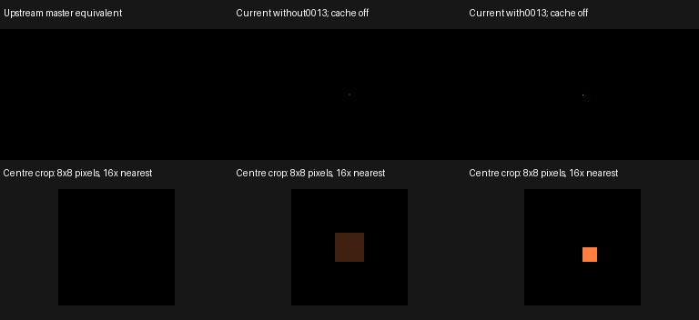

**The clearest sampling control:** without 0013, one impulse becomes four pixels
with maximum RGB8=64; with 0013, it remains one pixel at 255. The lower row enlarges
an identical 8×8 centre crop 16× using nearest sampling; brightness is unchanged.
This diagnostic directly exposes the redundant half-texel bias.

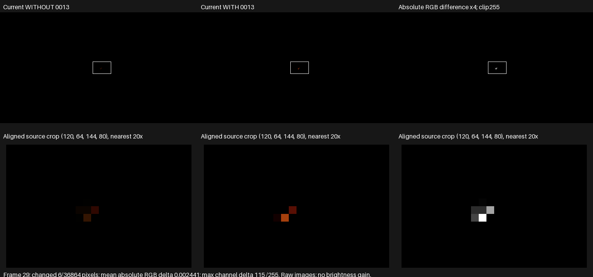

For the unchanged original at frame 29, only **six pixels** change, maximum channel
difference 115/255. Raw aligned crops are enlarged20× without brightness gain;
the right column is a labeled ×4 absolute-difference map. This is a small sampled
seed change, not a large whole-scene improvement.
[Raw original three-role endpoint](0013-original.png).

## 0014 — Legacy tint and mode-1 waveform

Source: [0014-legacy-tint-and-mode1-waveform.patch](../../../../tools/projectm-patches/0014-legacy-tint-and-mode1-waveform.patch). It restores MilkDrop 2.25c's `fShader`
threshold and white/animated-shade mix in legacy video echo and gamma output.
It also restores mode 1's 1.25 alpha multiplier and open line strip. Source
attribution is `vis_milk2/milkdropfs.cpp`, lines 2927–2946, 3359–3365 and 4117–4144.
Custom composite hue behaviour, authored equations, echo, gamma, darken and assets
stay unchanged. These are general compatibility corrections suitable for an
independent upstream proposal. The [focused evidence](../brainstain-dark-output/README.md)
separates corrected suppression from the original preset's remaining sparse
output and records independently failing GL controls. No universal brightness,
Windows appearance or performance claim is made.

**What to look for:** unchanged `Geiss - Hurricane (1-02 Version).milk` has an
unwanted green cast in upstream and current-minus0014. With0014 its trails are
cooler and nearly neutral, and the spiral traces change. An aligned3× close-up
preserves the source pixels and brightness. The preset sets `fShader=0`, mode1
and wave alpha0.3: ours now honors disabled tint, uses0.375 alpha before clamping,
and removes the extra closing line segment. This comparison shows the combined
patch, not independent per-pixel attribution to each subcomponent.

Upstream/control RGB MAE at119 is0.000321; control/current is9.386165. Each role
has two exact120-frame repeats, zero GL errors and no shader warnings/errors.
[Current-source, rebuilt-binary and full-stream verification](components/legacy14-hurricane/README.md)
uses the synchronized14-patch source `41ec3fc1`. Earlier13-patch images retain
their original identities; affected-witness revalidation remains pending.

### Independent tint and mode-1 controls

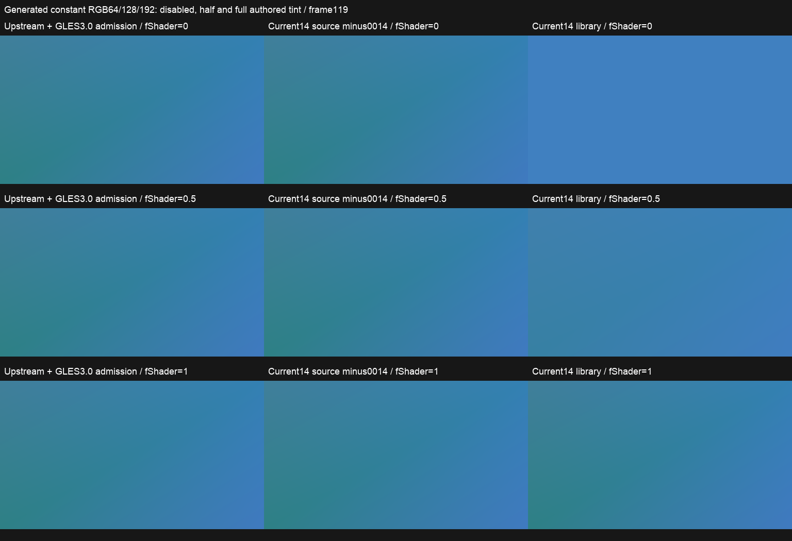

A labeled constant-color diagnostic separates the tint correction. Upstream and
current-minus0014 render center RGB `(49,128,156)` at `fShader=0`,0.5 and1.
Current preserves input `(64,128,192)` at zero, gives `(56,128,174)` at half, and
preserves `(49,128,156)` at full. The [complete-pixel oracle and source receipts](components/legacy14-hue/README.md)
check all120 frames per configuration/role; two repeats and all2160 decoded
frames verify. No screenshot brightness scaling is used.

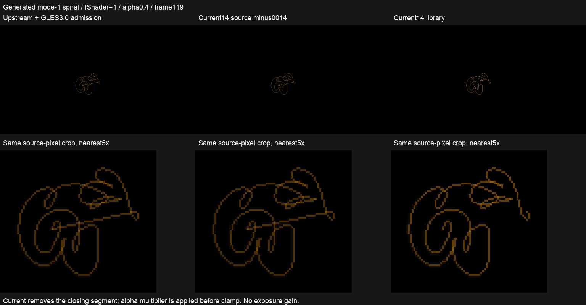

The generated mode-1 fixture keeps full tint and excludes persistent feedback,
so the crop isolates the waveform change. The baseline's extra connecting segment
is removed. Alpha0.4 becomes0.5 before clamping; blend overlap and final shade
prevent interpreting this as a uniform25% image gain. The [matched-frame/source audit](components/legacy14-mode1/README.md)
verifies all720 frames, two exact repeats, zero GL errors and no shader warnings.
Both control groups use the current14-patch snapshot and remain explicitly
separate from unchanged Hurricane and BrainStain artist presets.

The linked BrainStain investigation is supporting previous-AAR/corrected-AAR and
source/GL evidence, distinct from the new upstream/control/current TV comparison.
Its original first-frame black output follows the authored echo crop; the fix
does not promise to make every dark frame bright.

## Contribution order and acceptance boundaries

Start with narrow evaluator, translator and renderer correctness proposals whose
controls distinguish each change from upstream. Separate 0001's correctness from
cache/resource optimizations and Native trails policy. Preserve upstream Mesh,
VertexBuffer, ShaderCache and texture-descriptor ownership in proposals.
Present 0010 separately as a host-integration enhancement with an explicit API
contract change, rather than grouping it with renderer compatibility corrections.

Images need exact input, source, binary, instrumentation and GPU identities plus
same-role repeats. Numerical/lifecycle controls remain necessary where images
cannot show the contract. Captures do not certify every preset, other seeds,
physical TVs, Windows/D3DX appearance or a performance gain.
