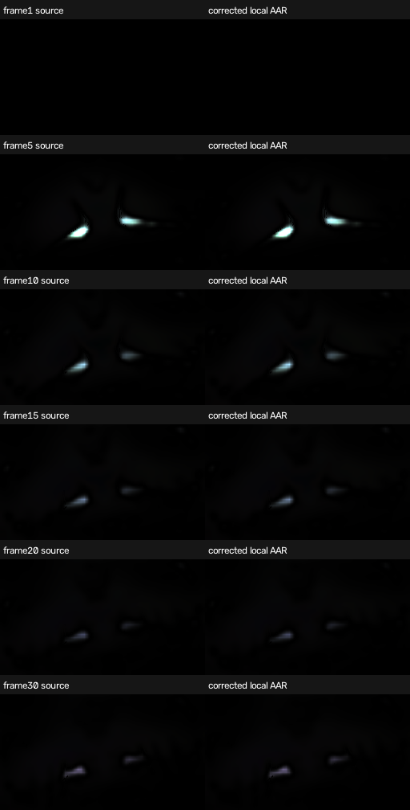

# Large warp rotation: production correction

Investigation base: `dd59a791fd2af6b7ad2fffcb389e0bc178905959` (published2.3.16),
projectM4.1.7 plus patches0001–0050. The supplied handoff is
`projectm-tv-aar-large-rotation-trig-2026-10-07/report.md` in Downloads.

The unchanged witness is `EoS_Phat_PeterP_Sentinel_Aware_6 EoS edit slice into your beautiful love.milk`,
SHA256 `591567f0029068f4f1f7ec3b50d7a8fabd8c1658ece6c981a7f60cfd6f3317ea`.
Its per-pixel equations end with `rot=10000000` after `zoom=.9999;sy=-.99`.
The handoff's isolated GLES vertex probe reports both sin/cos zero, including highp.
Active-program and hue/feedback controls isolate the rotation path; total
cross-thread random counts do not establish a random-binding defect.

Patch0051 follows MilkDrop2 `milkdropfs.cpp`'s `sinf(fRot)`/`cosf(fRot)` after float
conversion. CPU libm avoids GPU trig range reduction and an inaccurate rounded
2pi modulus for very large angles. It changes only the internal mesh/vertex shader,
not authored equations, assets, custom shader trig or the C/Java/JNI interface.
The vertex gains one float (56 to60 bytes) and one attribute (six to seven).
No performance improvement is claimed; physical measurements below are limited to the matched witness.

## Verified checkpoint (2026-10-07)

- RED: production mesh draw/readback on Apple M4 Pro CGL with the old series:
  `rotation=10000000 UV axis=0 actual=0.501961 expected=0.735156`.
- GREEN: real legacy/custom warp draws with both per-frame and per-pixel input,
  signed/moderate/large/max-finite float controls, varying per-vertex rotation,
  nonfinite input recovery, and four feedback frames pass on macOS CGL and the
  task-owned API34 ARM64 GLES3 emulator (`emulator-5630`, Apple M4 Pro translator).
  Nonfinite controls verify no GL error and unchanged equation state, not image fidelity.
- `tools/check-patch-series.sh`: all51 patches apply to a clean pinned export.
- `tools/projectm-host-tests.sh`:261/261 pass.
- Initial ASan/UBSan projectM regression run:28/28 pass. The expanded rotation test
  separately passes; the expanded final full native runner also passes28/28, JNI engine/Native policy tests pass; the separate transition overlay is skipped on macOS without EGL/GLES.
- `./gradlew :core:assembleDebug :app:assembleDebug testDebugUnitTest`: BUILD SUCCESSFUL.

Raw build/test logs are ignored under `build/large-rotation/`. No published artifact
or original-preset appearance claim is made by these numerical controls. Linux
Mesa and published-AAR retest remain pending. Final Codex review, CI, merge,
publication and Milkbeat update are required before completion.

## Documentation assessment

Evaluated README, user-guide troubleshooting/development/settings and the linked
Pages source, ARCHITECTURE, THIRD_PARTY, RELEASING, PR template and existing engine
regression documentation. Updated README, troubleshooting, development,
architecture, patch attribution and AGENTS for the rotation behavior and internal
layout. Installation, UI/settings, public APIs, release/version rules and historical
predictor scores are unaffected. Strict MkDocs1.6.1 validation passes.

## Unchanged original preset, full local AAR

A new isolated emulator reproduced the old published2.3.16 capture byte-for-byte
(pixel hash `b8ba88d5ffa47017f2d9b8a9ada017343d34dba056e07fc9eba8077f4803d610`).
The same full preset hash,48×32 mesh,256×144 output,30frames,30Hz clock,
float PCM hash `0640617ef6dcdf81f9af180ebb827c88ae8d570ec0abc96bf6f52f00bcab488c`
and seed12345 were used with the corrected full local release AAR. Only the core
AAR/native library changed; the runner's frozen classes/clock identities match
the handoff. Its one-entry index overlay selects the preset without replacing it.
All30 completed native renders are indexed/verified, with zero skips and Standard
trails correctly inactive at144p. Artifact identities and numeric reports are
adjacent JSON files. The local AAR is not a newly published release.

| Relative error vs frozen source prediction | Old AAR | Corrected local AAR |
|---|---:|---:|
| Median motion |33.47%|1.52%|
| P95 motion |47.68%|0.457%|
| Mean luma |49.68%|0.0122%|
| Saturation |76.38%|0.0266%|
| Peak luma jump |37.07%|0.181%|

All five corrected metrics pass the handoff's5% allowance. Peak brightness changes
on frames2→3 instead of1→2, matching the frozen prediction; coherent transition
counts remain zero. RGB MAE falls from0.00971336 to0.0000157737 (~616×).
This is a30-frame witness result, not universal appearance certification, fresh
predictor random/streak credit or a physical-TV performance claim.

## Authored/native 4K paths

The full local release AAR renders the unchanged witness at3840×2160 for30frames
in Off/Standard/Medium/High, retaining the48×32 mesh, frozen clock/PCM and seed.
A diagnostic-only variant replaces just the literal rotation with its small-angle
equivalent; no production preset asset is edited. RGBA output is scaled on-GPU to
256×144 for byte transport. Both source hashes and every capture hash/status are
recorded in `highres-validation.json` and adjacent metadata. Standard/Medium/High
report the1280×720 authored canvas, with no fallback. Original-versus-small-angle
mean RGB errors range from4.49e-8 to2.72e-7; the final frames retain spatial detail.
These controls exercise the shared prepared mesh in both authored feedback and
native warp paths; downscaled readback does not certify full-resolution edge
fidelity or physical-TV frame rates.

## Physical AM6/Mali-G52

The user authorized AM6 if awake. Android user0 and awake/ON state were checked
before every run; no TV was awakened and no installed app, preference or debug
property was changed. The matched ARMv7 control binary passes all signed/moderate/
large/max-finite, varying per-pixel and multi-frame checks on Mali-G52. Its fixture
uses explicit RGBA8 storage matching the RGBA seed upload/readback and checks the
upload error immediately; the original permissive RGB allocation is corrected.

The unchanged preset renders30frames at1280×720 through each full AAR using the
same frozen clock, PCM, seed and48×32 mesh, Standard inactive. Corrected output
matches a same-core small-angle diagnostic control **byte-for-byte**; baseline RGB
MAE against that control is0.00588746. Three alternating baseline/corrected runs
repeat each pixel hash. See `am6-validation.json` and raw frame-time metadata.

| Synchronized unpaced throughput, three runs | Range | Median frame-time range |
|---|---:|---:|
| Old2.3.16 AAR |27.90–29.74 fps|34.00–36.36ms|
| Corrected local AAR |28.70–29.51 fps|33.80–35.22ms|

Each timing covers `onDrawFrame` plus `glFinish`, excludes readback and discards
frames1–5. This is headless EGL renderer throughput, not on-screen app FPS or a
player/audio-capture journey. Background/thermal variation and changed output
workload prevent attributing the timing difference solely to CPU trig. No broad
performance guarantee or improvement is claimed. The corrected full local AAR
and all instrumented helper identities are recorded separately from production.
