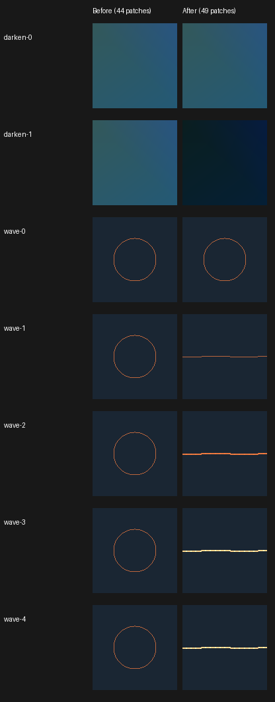
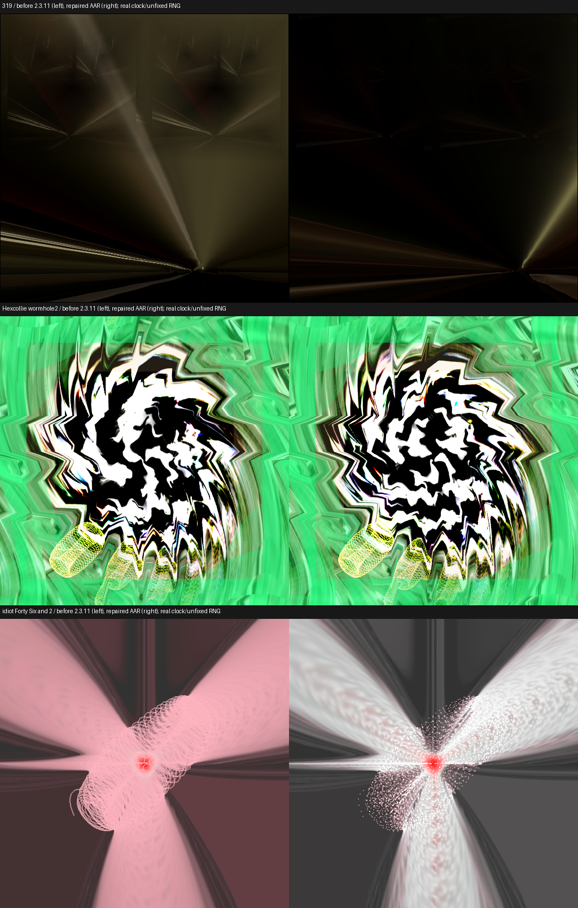

# Live native controls — live-controls-v1

Patches 0048–0049 repair the built-in waveform and legacy display paths. The
original evidence bundles dated 2026-10-06 remain unchanged in Downloads.
All seven affected source hashes match the supplied 44-patch identities on
current main (47 patches). The downloaded published 2.3.11 AAR (`b1bb994dbfaa04159630570cd9b2c255b173a6bd`) matches
`3bc37560a87000ec7ac446895fee8ad09e93b5c83a601014b5fc396bd1f3e6d6`; its ARM64
library matches `8bb82903af3825e16b734ceddf7316ba83da43509fb3fa3614537749a5c124f0`
(the exact verified library identity is recorded in the validation manifest).

The existing 23 native regressions passed before modification. New regressions
failed before the repair: dynamic dots produced different pixels from static
dots, and equation-only darken did not produce the independently predicted
squared colour. After the repair, all three focused controls pass on macOS
OpenGL with ASan/UBSan. Android debug APK/core and debug JVM tests also pass.

`dynamic-wave-controls` checks all 16 modes and mode switches, truncation,
positive wrap, negative/undefined input handling, dots, thickness and blending
against static controls with matching per-mode smoothing history. It compares draw counts/primitives/blend state
and rendered pixels on GL-line, quad-line and paired authored/native targets.
`dynamic-display-controls` uses a known constant surface to independently
predict each filter and their order, including defaults off and return to off.
Gamma/echo cases compare unchanged static branches, fractional gamma redraws,
the echo threshold, zoom and all orientations. Conditional equations verify
frame reset defaults. `dynamic-original-presets` checks original hashes at
configure time, equation compilation, selected composite path and full draws
for 319, Hexcollie's wormhole2 and idiot's Forty Six and 2 under declared
synthetic audio and clocks in Off/Standard/Medium/High detail paths. These
controls are source/native evidence, not a Windows visual comparison.

The user waived physical-TV checks and requested a dedicated emulator on the
Metal M4 GPU. The dedicated `emulator-5620` uses emulator37.1.11, Android14/API34
ARM64 and `-gpu host`. Its driver reports Apple M4 Pro and OpenGL ES3.0
(4.1 Metal -89.4). All focused native controls pass there, including original
presets across Off/Standard/Medium/High. Physical-TV validation remains waived. No shared corpus, shared devices or preset files are modified;
no full-corpus render is run. No performance or affected-preset-count claim
follows from the candidate inventories (45 waveform, 647 broad display).
Historical predictor policy, collection scores and audits remain unchanged.

## Before/after evidence

The native standalone capture protocol is `dynamic-controls-regressions capture
<new-output-directory>`. Before is pinned upstream plus patches0001–0044; after
is patches0001–0049. Both use the same128×128 RGBA8 target, declared sine/cosine
frame-audio arrays, time0.5, fixed hue offsets, gamma1 and unchanged preset
defaults. The original handoff's seven source hashes match the before export.
These standalone controls are not AAR captures. `identity.json` pins source,
artifact, raw PPM and exported PNG identities.

- `darken-0/1`: equation output0/1 with source-default0. Before pixels stay equal;
  after the active filter gives squared colour.
- `wave-0/1`: evaluated modes0/6. Before keeps a circle; after selects circle/line.
- `wave-2/3/4`: add dots, additive blending and thickness. Effective primitive,
  counts and blend state are in the captured logs. Main-wave dots always draw
  thick, so the last thickness toggle intentionally preserves those pixels;
  the automated thin/thick line controls check thickness independently.

`aar-summary.json` and `aar-manifests/` record six actual production-JNI AAR
smokes: three original presets, each480 frames,512×512, the same16-second
110Hz/6kHz amplitude-alternating PCM (`d6e4054db81613a755c78a89464ef5d65fc223391174eadc459ab1b50eb6449e`).
The worker verifies exact preset identity on every frame, GL errors, PNG captures
and release/EGL cleanup. It uses production real clocks and unfixed RNG;
before/after pictures are smoke evidence rather than synchronized visual
agreement or proof attributable solely to these two patches (the released
baseline also lacks previously merged0045–0047). Historical audits stay intact.

| Original witness | Before delivered fps | After delivered fps |
|---|---:|---:|
| 319 |29.886|29.942|
| Hexcollie wormhole2 |29.869|29.888|
| idiot Forty Six and 2 |29.880|29.897|

These rates are paced delivery including captures, not maximum-throughput
benchmarks or physical-TV performance claims. Candidate AAR identity is
separate from the source-only controls and the exact published baseline.

## Reproduce and limitations

Run `bash tools/check-patch-series.sh`, `bash core/src/test/native/run_native_tests.sh`
and `bash tools/projectm-host-tests.sh` from a recursive task checkout. The native
runner passes26 projectM controls plus JNI/policy tests with ASan/UBSan; the
host engine suite passes261 tests. The macOS fade-overlay EGL check is skipped
because that development library is unavailable. Android debug APK/core,
release core and debug JVM tests pass; `mkdocs build --strict` passes.

Build the ARM64 focused executable by configuring its existing CMake harness
with the NDK toolchain, `ANDROID_ABI=arm64-v8a`, `ANDROID_PLATFORM=android-26`,
`ANDROID_STL=c++_static`, `GL_LIBS=-lEGL -lGLESv3` and `SANITIZERS=OFF`. On the
dedicated emulator run `wave`, `display`, and `presets <private-assets-path>`.
Only the three witness presets and texture pack need staging for the last
command. The `capture` command saves the small synthetic controls.

For AAR checks build the existing `tools/core-corpus/android-worker` with the
actual baseline/candidate AAR and distinct existing package IDs, then run
`emulator_aar_checks.py --help`. The script restricts itself to this task's
emulator, verifies Metal/M4 and baseline hashes, creates private jobs, and
restores its debug property and cleans its jobs. Use a new output directory.

Android16/API36's host translator failed retrieving program-cache binaries
even for the unchanged published core. Guest ANGLE/MoltenVK avoided that but
failed pipeline creation on the original319 shader. These failed trials are
not credited as passing or silently cleared; Android14's Metal translator
passes the declared controls without a renderer workaround. This evidence
does not claim Android16 or Windows compatibility.

## Review corrections

The v2 AAR runner captures the current Android user and uses it consistently for
private job paths, `run-as`, package lookup, force-stop and instrumentation.
Before creating device jobs it reads each installed worker APK and verifies its
ARM64 native-library SHA-256 against the supplied AAR, recording both APK and
AAR/native identities. A deliberately mismatched candidate was rejected before
staging a job; six correct jobs were rerun with this binding and scoped user0.

The echo alpha conversion remains float-before-threshold, matching the supplied
MilkDrop3 source at4065/4085 and the original native float-state consumer. A
real-draw regression covers0.00100000006 and the next float above0.001f. The
suggested double-first comparison fails that compatibility regression; keeping
the float conversion passes. This preserves the requested legacy conversion
rules rather than selecting a new precision policy.
