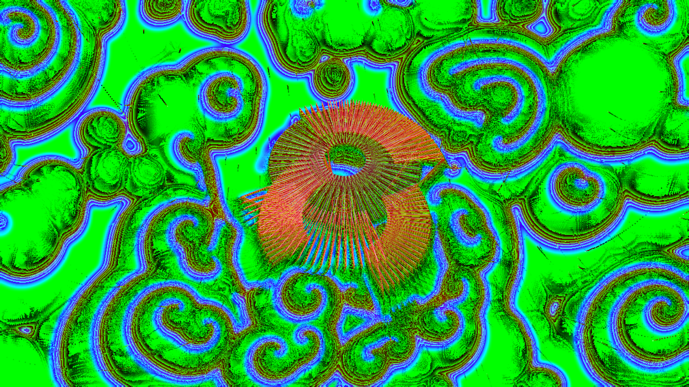
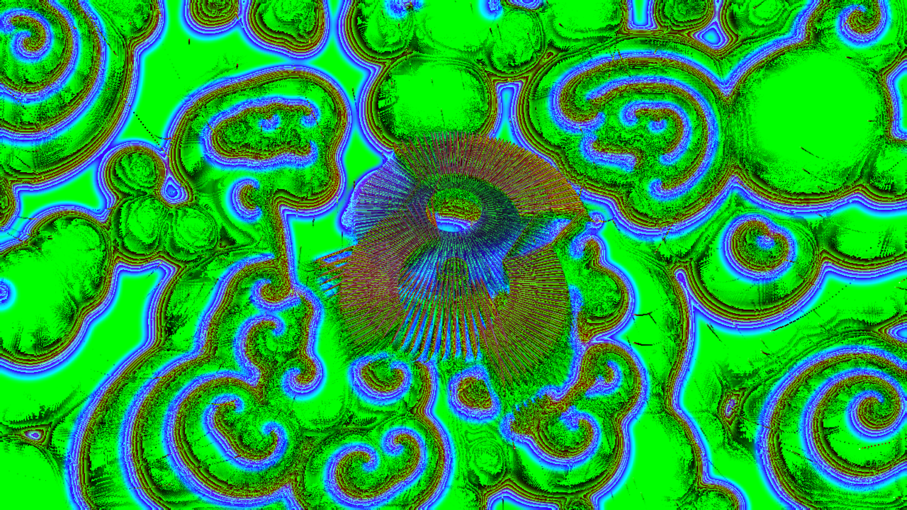
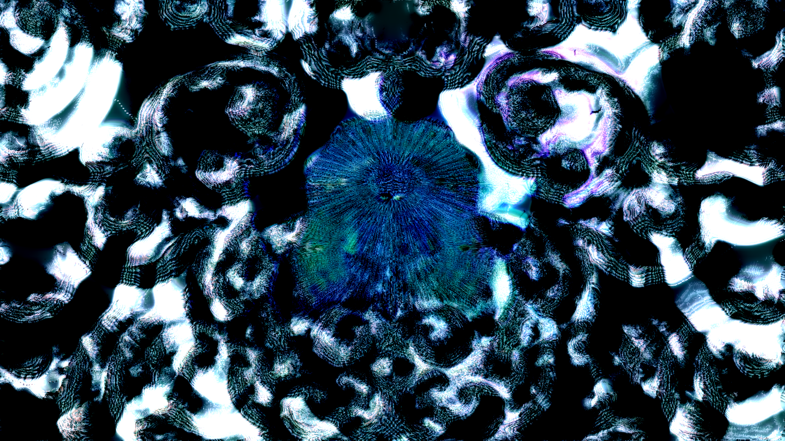
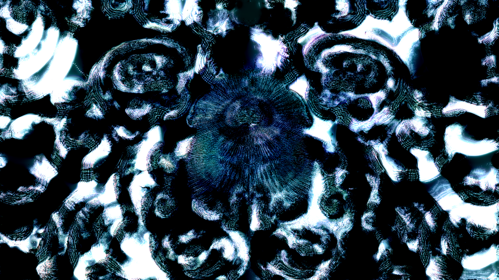

Final-output qualification is now recorded below; historical intermediate/shared-package comparisons remain preserved with their limitations.

# I06 — Fresh wave-point host inputs

Candidate0021 copies wave-point time/FPS/frame/progress/audio values from the freshly loaded wave-frame context before wave-frame code executes. This follows MilkDrop2 `milkdropfs.cpp:2526–2545,2613–2624`; neither main-equation writes nor later wave-frame writes replace that snapshot. Q/T still copy after wave-frame execution. Main variables remain writable.

The actual EEL/GL regression fails baseline at bass1 overwritten in main to.25. It passes after for all ten host inputs, with main inputs changed to other values, wave-frame bass/time changed to99, and preserved Q/T/replay counts. No extra assignment count, allocation, pass or evaluation is added. All45 normal controls pass.

The one supplied lexical original is Shreyas - Carnival loavthephysyq.milk, SHA da5440792b7f6e1dd987024e72261fa90a3ea455354bd0daf38a1075fcdffeef. Main per_frame_2 scales time by.1; enabled wave point hue equations read time. Candidate restores fresh host time for those wave points while keeping main/per-pixel time policy separate. Actual Native4K impact is not credited until a matched before/expected replay. A finite host-input diagnostic is also required. Final capture/timing/integration remain pending.

## Corrected original4K comparison

The first controller’s shared-package before/after rows were invalid: installing both APKs before rendering left only the second artifact installed. No comparison conclusion is taken from those rows. A new controller now installs the selected role immediately before every run, checks the captured-user package and exact installed base.apk SHA256, then preserves all strict runtime checks. Four verified480-frame original runs complete with Native Standard1280×720 canvas and exact selected RGB repeats.

The source correction visibly changes the admitted original; numerical extent and run timings are in the verified records. Timing variability is substantial; no universal or physical-TV speed claim follows. A separate finite diagnostic overlay is running with unique before/after package IDs. Final acceptance/integration remains pending.

## Completed finite diagnostic

Eight combined480-frame diagnostic runs completed with exact selected RGB repeats at3840×2160, Native Standard1280×720 canvas. Unique role package IDs preserve the admitted native AAR bytes and all stock assets; only the declared test presets/index are added. See [diagnostic records](diagnostic-results.json).

The source regression, verified unchanged original comparison and finite diagnostic now support focused acceptance. No additional evaluation, assignment count, pass or resource is introduced. Original timing variability prevents a physical-TV or universal performance claim. Final combined validation remains pending.

## Capture qualification correction (2026-10-08)

The historical capture worker checked only GL_FRAMEBUFFER_BINDING (draw binding). Native direct rendering can leave an internal feedback FBO bound to GL_READ_FRAMEBUFFER, so the saved PNGs are not verified final presented output. Their intermediate geometry differences and timings remain evidence at that stage; claims of final Native4K appearance/brightness acceptance are suspended. Fresh worker APKs now explicitly select read framebuffer0 for capture and restore the prior binding; the native AAR and preset bytes are unchanged. Source/evaluator/known-FBO regression controls remain valid. Existing artifacts are retained; new final-output replays will be separately recorded.

## Final-output replay — I06

Four480-frame runs now explicitly capture read framebuffer0, check the installed APK hash per run and retain exact native AAR/preset bytes. All eight selected RGB frames repeat exactly within each role. The illustrated common frame is479, selected for the largest measured difference among the eight captures. These are source-instrumented GLES final-output images; no Windows pixel-identity claim follows. [Final records](final-I06-results.json).

## Final-output finite diagnostic — wave-time

Four480-frame runs explicitly capture read framebuffer0 and verify the installed APK hash per run. All eight selected RGB repeats are exact. Native AAR and stock assets are preserved except the declared private fixture/index overlay. [Final records](final-diagnostic-wave-time-results.json).

The combined0021 patch isolates this original witness: Carnival scales main time by.1 but has no per-pixel aspectx/aspecty reads, so the I05 input correction has no identified trigger in this witness.
