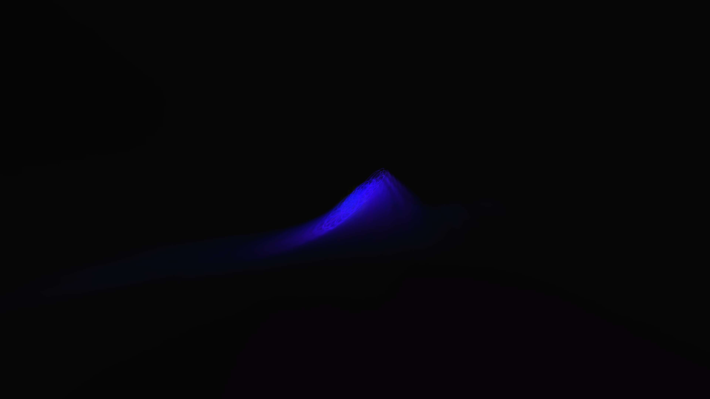

# I08 — Centered custom-wave input windows

Candidate patch0017 restores valid original oscilloscope windows without restoring the out-of-bounds behavior repaired upstream. Focused Native Standard4K appearance/timing acceptance passes; final sanitizer/Android/review/integration gates remain pending.

MilkDrop2 `milkdropfs.cpp:2643–2654` starts the left/right oscilloscope channels at `(480-nSamples)/2 ∓ sep/2`, using signed integer division. The original copies static `samples` directly into the wave-frame context at line2545; the earlier subtraction at line2606 is overwritten by line2631 and does not determine the final point count. The current library’s prefix sampling starts both channels at0 and ignores oscilloscope separation.

The candidate applies centered offsets only when both complete windows fit the480 input samples. Oversized requests retain upstream resampling, invalid original offsets retain the safe prefix behavior, and spectrum behavior remains unchanged. Sample counts, smoothing coefficients, scales, rendered styles and prepared Native replay remain unchanged. No new sample, equation evaluation, render pass or texture is added.

The real-EEL/GL regression fails before on a finite two-point480-sample ramp: first value1 is0 rather than239/480×.004=.0019916667. It passes after for centered windows, positive/negative separation, large valid separation, full480 windows, preserved512-sample resampling, invalid-separation fallback and spectrum. Point counters verify that dual-target replay evaluates each point only once and restores the authored context. The existing bounds regression’s two-point expected endpoint is updated from prefix index1 to centered index240 (.96 with its unnormalized ramp); all unsafe/count/endpoint assertions remain intact.

The handoff supplies508 conditional candidates. `Mig_304 - geiss remix 2.milk` is now confirmed affected in the frozen Native4K replay. Prefer an unchanged enabled small oscilloscope whose point equations actually consume value1/value2: `Mig_304 - geiss remix 2.milk` uses152 samples and sep8 directly in position and colour; `shifter - ice ripples.milk` uses22 samples in border injection alpha. Short-sample geometric waves that overwrite positions and ignore both values may be lexical false positives.

The candidate requires a matched Native Standard4K before/after replay with exact audio/clock/seed and capture repeats, plus no observed slowdown in the selected witness. These captures will represent source-corrected TV input semantics within the retained Native policy, not original Windows/D3D output. I19’s separate sample-cap hypothesis is absent from this candidate’s shipping series.

## Actual Native 4K before/expected captures

The unchanged original uses152 samples and sep8. Before, duplicated mono channels both begin at0 and produce a mostly diagonal new trace. Source-corrected offsets160/168 separate the channel phase and produce the loop structure its point equations define. At frame239:

These are unbrightened3840×2160 GLES captures from the same original bytes,480-frame frozen mono PCM/clock/seed protocol, Native Standard1280×720 canvas and separate source-bound producer identities. The corrected screenshot represents the expected TV appearance under the original window arithmetic within the retained Native policy; it is not a Windows/D3D capture. RGB byte MAE is0.805 over the full frame at239; the local trace changes substantially. All eight selected full-resolution RGB frames repeat exactly within both roles.

Serialized360-frame mean/p90 pairs before are2.363/2.719 and2.490/3.423 ms; after2.253/2.527 and2.581/3.616 ms. The ranges overlap and show no consistent slowdown. Guest PSS ranges72,297–72,504 KiB before and72,375–72,523 KiB after; this is not all host GPU memory. No universal or physical-TV performance claim follows. All39 normal renderer controls pass, retaining bounds protection, line behavior and replay. Final-head sanitizer/Android/review gates remain open.

Normalized blank context lines in the generated patch text preserve the applied production source bytes; all17 patches still apply cleanly. The captured candidate is the original8e46 source snapshot, independently identified in its manifest, not a relabelled newer build.
