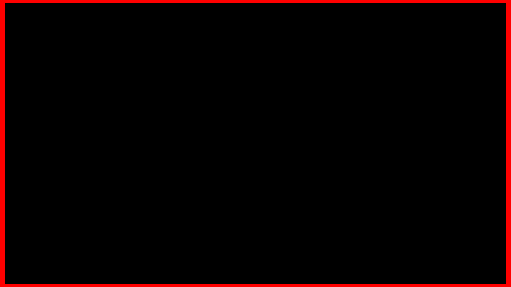

# I09 — Named EEL constant precision

Candidate0020 removes only the float suffix from the existing original decimal expansions of `$pi`3.141592653589793, `$e`2.71828183 and `$phi`1.61803399. Both Scanner.l and checked-in Scanner.c are updated; Android disables Flex/Bison regeneration. Do not substitute longer e/phi values or alter later float geometry/shader casts.

Original `ns-eel2/nseel-compiler.c:1077` expands those same decimals without intermediate float rounding. Current float literals promote a rounded float into the double evaluator, so `$pi` is3.1415927410125732 rather than3.141592653589793. The actual compiler/evaluator regression fails before on `$pi` and passes afterward for lowercase/uppercase named tokens, exact decimal tokens and the prior lone-dot control. All43 normal renderer/evaluator controls pass; all20 patches apply to a clean pinned export.

Full static9606 scan found no named-constant EEL references, so no stock original is claimed affected. A derived finite visual witness should amplify `($pi-3.141592653589793)*10000000` into a red border width; before approximately.107423, source-compatible after.02. This remains a declared synthetic diagnostic, not an invented affected-original census or Windows screenshot. Native4K diagnostic capture and final integration remain pending.

No new evaluation, allocation, pass, vertex or per-frame operation is added. This correction belongs upstream in projectm-eval, while the TV ordered patch preserves thread-local RNG, lone-dot handling and the exact original decimal contract.

## Actual amplified4K diagnostic

Four480-frame source-bound private-overlay runs complete with Native Standard1280×720 canvas and exact selected RGB repeats. Both preserve all stock AAR/native/asset bytes except the declared appended index row and one test preset in the worker APK (9607 entries). No shipping preset is modified. The same normalized outer-border formula amplifies only the original named-pi rounding error.

The candidate removes the amplified excess border width, as the scalar compiler oracle predicts. This is a finite synthetic demonstration, not a stock affected-original claim or a Windows screenshot. Strict GL/preset/frame/cleanup checks and repeated output identities pass. Source correction adds no evaluation, allocation or pass. Final integration checks remain pending.
