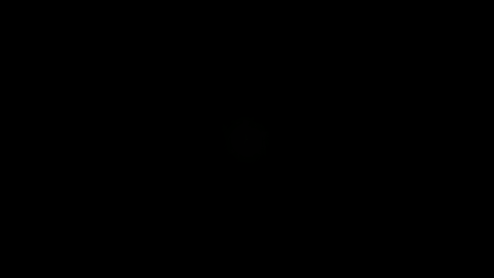
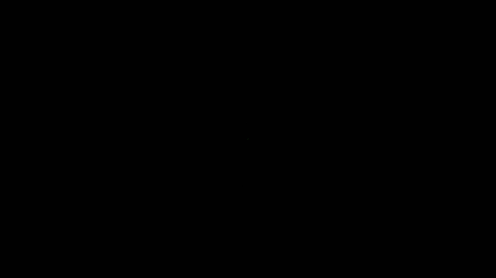
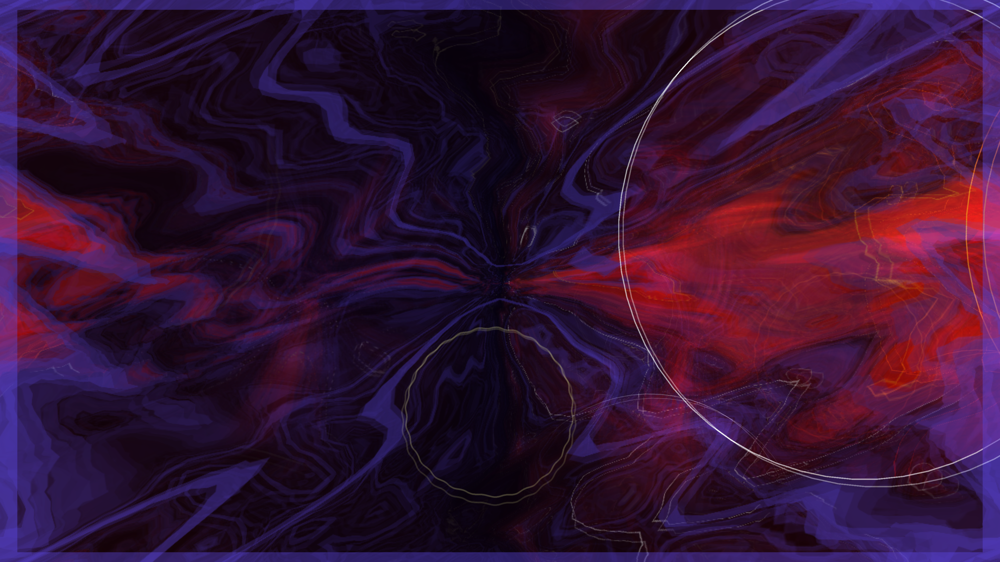
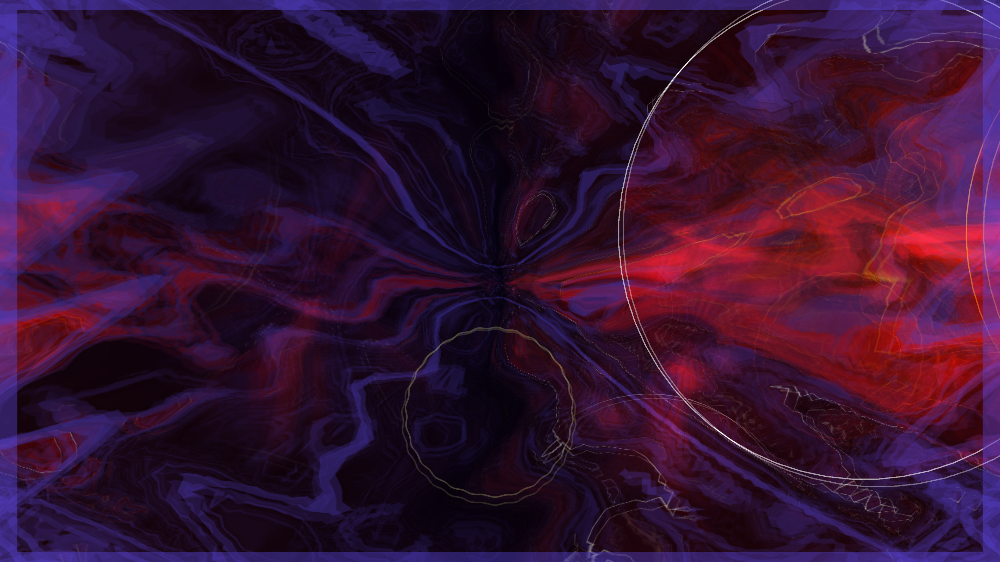
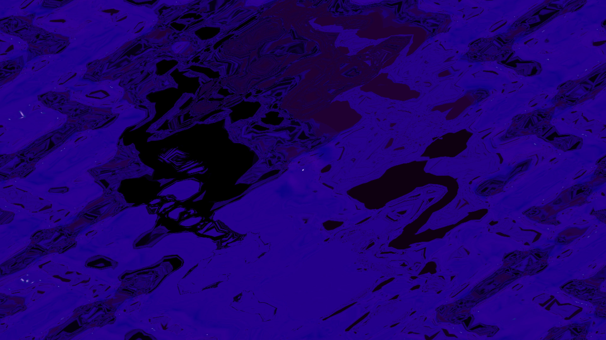
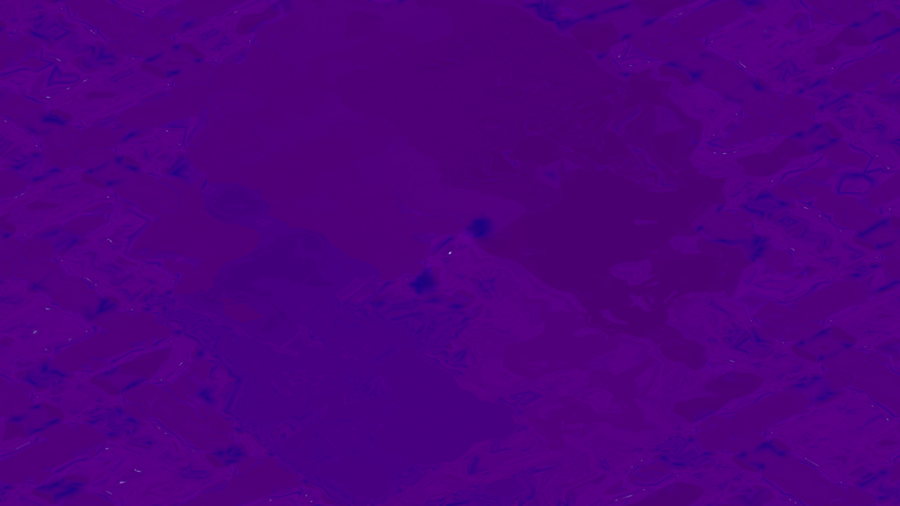
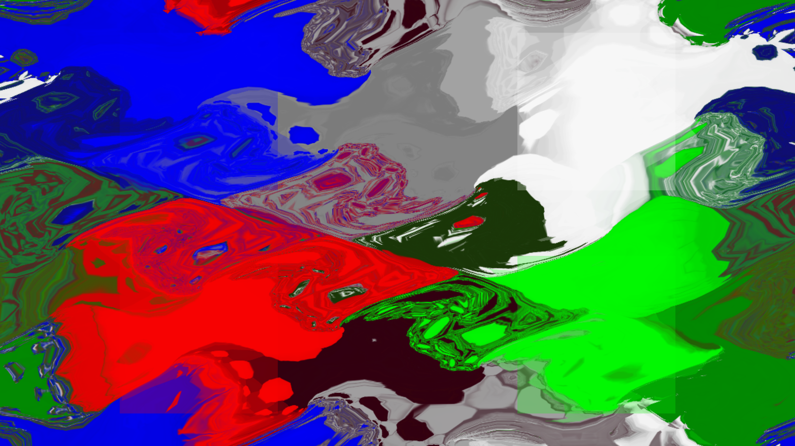
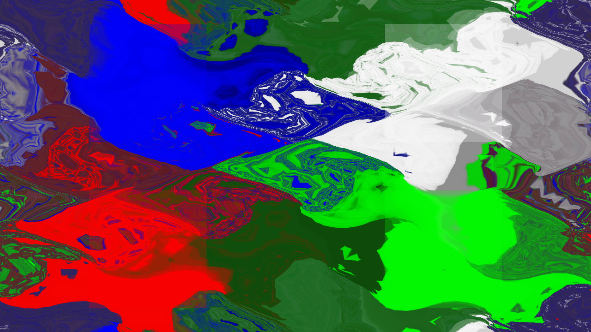
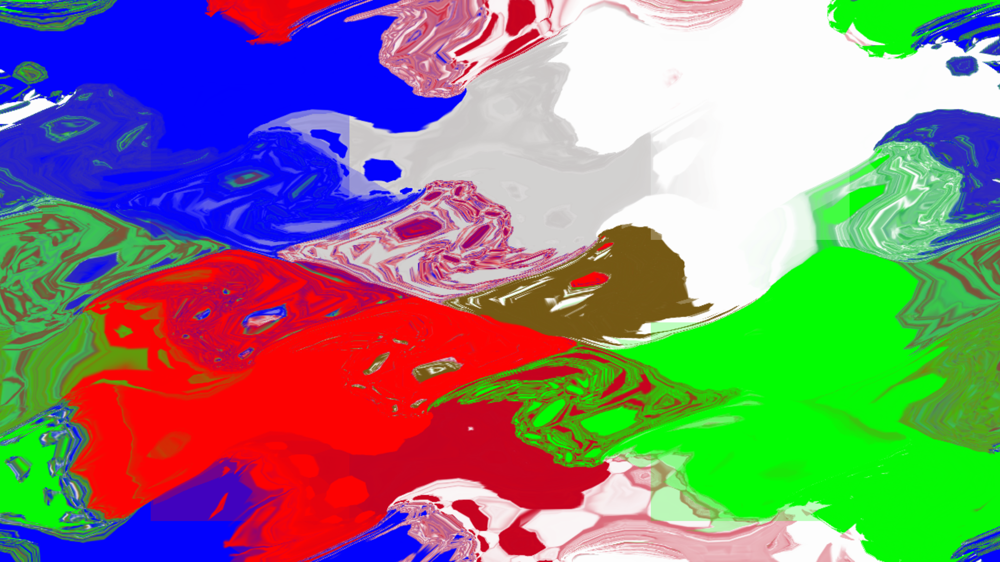

# I10 — Legacy physical oscillator Y

Candidate0023 changes the signs of the four physical-Y deformation terms only in the actual legacy/default warp program. A compile-time variant uses the same four trig calls and arithmetic count: no runtime branch, extra uniform, vertex, draw, target or pass. The ordinary custom vertex producer remains the same preprocessed formula. A custom shader that fails compilation correctly falls back to the corrected legacy variant. Original custom `data/warp_vs.fx` is absent, so its mapping is not inferred from the proven fixed-function path.

The correction preserves positions, initial/original UV, per-pixel equation inputs/traversal, triangle indices, CPU float rotation sine/cosine, negative zoom power and prepared-mesh replay. I11's diagonal and I12's traversal remain separate findings.

## Executable source proof

The regression captures the production warp vertex outputs with transform feedback before raster interpolation. It independently evaluates MilkDrop2 `milkdropfs.cpp:1882–1898` in the current physical legacy mapping. Baseline fails at path0, warp1/time0/node0. Candidate passes legacy, compiled custom and failed-custom fallback paths, positive/negative/zero/large warp, three times, per-frame/per-pixel inputs and prepared replay. Original UV varying remains unchanged; replay repeats outputs without reexecuting point equations. The custom path is checked against its preserved positive-Y contract, not an invented original custom-VS oracle.

[Source RED](source-red.txt) · [Full normal suite47/47](source-normal.txt). The complete23-patch series applies to a fresh pinned engine. These are source/GL controls, not Android or Windows visual proof.

## Original and remaining validation

The stronger original candidate is `BrainStain-sunrays.milk`, SHA256 `b3ebf1ab3f1132d2215e493fe9942693b0e70361c5c269cf86cff890520e2ef5`: legacy warp, no per-pixel equations, warp50, warp scale62, no later warp replacement. The1737 lexical candidates are not an affected census. Exact-original Native Standard4K before/expected captures, finite asymmetric feedback diagnostic, repeat and focused cost qualification remain pending. Final combined integration remains pending.

## Final-output original — sunrays

Four480-frame final-output runs preserve exact original/native AAR bytes and check installed APK SHA per row. All eight selected RGB captures repeat exactly. [Records](sunrays-results.json). The same illustrated frame239 maximizes the observed difference among selected captures.

## Final-output original — chemlock

Four480-frame final-output runs preserve exact original/native AAR bytes and check installed APK SHA per row. All eight selected RGB captures repeat exactly. [Records](chemlock-results.json). The same illustrated frame180 maximizes the observed difference among selected captures.

## Final-output original — fish

Four480-frame final-output runs preserve exact original/native AAR bytes and check installed APK SHA per row. All eight selected RGB captures repeat exactly. [Records](fish-results.json). The same illustrated frame150 maximizes the observed difference among selected captures.

## Finite final-output diagnostic — legacy

Four480-frame Native4K runs repeat all eight RGB captures exactly per role. Private diagnostic APKs preserve native AAR/stock asset bytes except the declared fixture/index additions. The finite legacy colored field changes as predicted by the source-stage Y-sign control.

[Records](diagnostic-legacy-results.json).

## Finite final-output diagnostic — custom

Four480-frame Native4K runs repeat all eight RGB captures exactly per role. Private diagnostic APKs preserve native AAR/stock asset bytes except the declared fixture/index additions. Compiled custom before/after RGB is identical in every selected frame, proving the protected path unchanged in this witness.

[Records](diagnostic-custom-results.json).

## Original projection check

Original support.cpp:180 sets D3DXMatrixOrthoLH width2/height−2, with identity world/view transforms. Legacy milkdropfs.cpp:2056 also negates emitted mesh Y. D3D viewport Y then places original source row0 at the physical bottom; current GL orthogonalProjection places current row0 at the physical top. This independently establishes the legacy physical mapping used by the oscillator/diagonal controls. No original custom-VS projection is inferred.

## Focused render cost

Twelve ordered ABBA runs measured before3.9413ms and after3.4500ms mean serialized onDrawFrame+glFinish, with candidate lower in all three cycles. No observed slowdown in this witness; variability prevents a universal speedup or physical-TV claim. Same shader work/pass/resource counts. [Timing records](initial-clean-timings.json). Focused source/original/finite/custom-path Native4K acceptance is supported; final combined integration remains pending.
