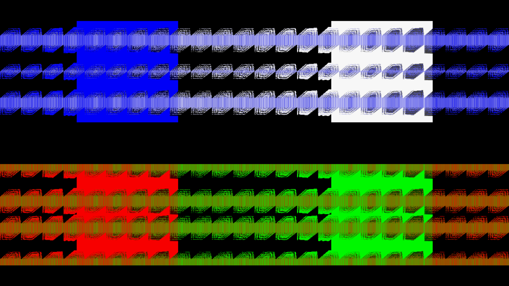
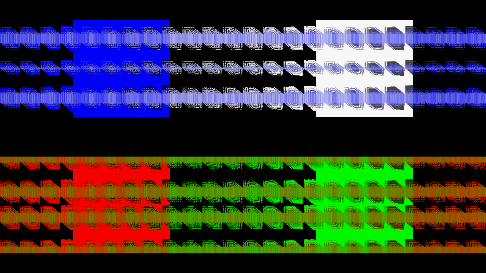
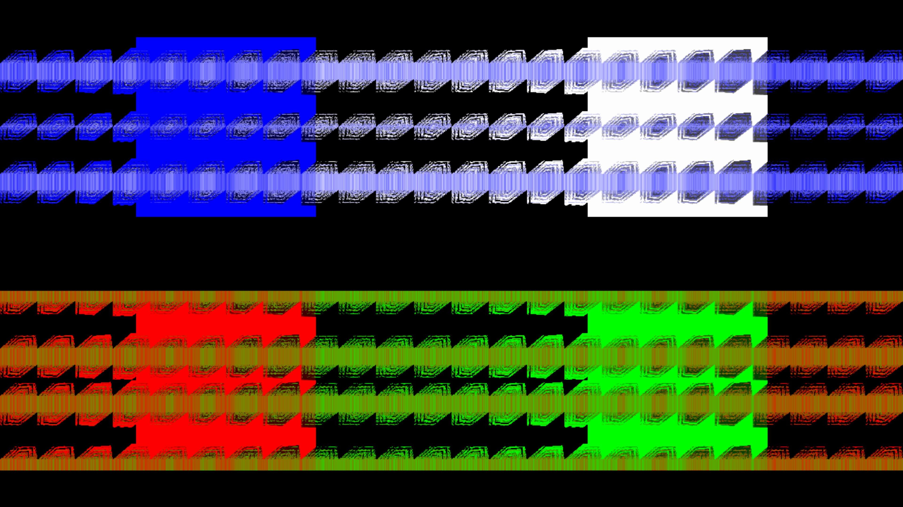

# I11 — Legacy physical triangle diagonal

Candidate0024 selects the opposite AD cell diagonal only for the actual compiled legacy/default path. Custom warp keeps BC; failed custom compilation uses legacy. It selects six offsets once per mesh initialization and fills the existing index buffer: identical vertices, indices, triangles, winding sequence, quadrant order and draw/pass counts. A cached compiled-path flag prevents stale topology if the path changes at fixed dimensions. No second persistent index buffer, texture or target is added. Source initialization bookkeeping changes still require focused cost qualification.

## Executable proof

The test uses the actual production mesh/warp shader and an asymmetric corner field: A/B/C displacement0, D displacement1. At raw cell local(.3125,.3125), the original physical legacy diagonal contributes.3125; the previous diagonal contributes0. On a known64×48 gradient feedback target, that is red90 versus10 at the same pixel. Baseline fails; candidate passes. It also reads actual indices across all quadrants, checks identical288-index count and winding, exercises legacy→custom→failed-custom→legacy without size changes, preserves custom/affine output and prepared replay.

[Source RED](source-red.txt) · [Full normal suite48/48](source-normal.txt). All24 patches apply to a fresh pinned source. I10's oscillators are disabled in this witness (warp0); equation traversal and per-vertex values are unchanged. Source-stage GL proof is not Windows pixel-identity certification.

## Original and remaining validation

The stronger original candidate is `07.milk`, SHA256 `ec440dc5d1409388d8b55c17e683bbe8e1cd5effac1060faefdb71e222ad7849`: nonlinear radial/angle per-pixel zoom and explicit warp0. The878 lexical candidates are not an affected census. Exact-original Native4K captures, finite corner-field diagnostic and repeat/cost qualification remain pending, as do final combined integration gates.

## Final-output Native4K — original

Four480-frame runs preserve declared preset and native artifact bytes, checking installed APK SHA per row. All eight RGB captures repeat exactly within each role. The nonlinear legacy field exposes the source-correct diagonal change. [Records](original-results.json).

## Final-output Native4K — legacy

Four480-frame runs preserve declared preset and native artifact bytes, checking installed APK SHA per row. All eight RGB captures repeat exactly within each role. The nonlinear legacy field exposes the source-correct diagonal change. [Records](legacy-results.json).

## Final-output Native4K — custom

Four480-frame runs preserve declared preset and native artifact bytes, checking installed APK SHA per row. All eight RGB captures repeat exactly within each role. Compiled custom before/after selected RGB is exactly identical. [Records](custom-results.json).

## Original projection check

Original support.cpp:180 sets D3DXMatrixOrthoLH width2/height−2, with identity world/view transforms. Legacy milkdropfs.cpp:2056 also negates emitted mesh Y. D3D viewport Y then places original source row0 at the physical bottom; current GL orthogonalProjection places current row0 at the physical top. This independently establishes the legacy physical mapping used by the oscillator/diagonal controls. No original custom-VS projection is inferred.

## Initial candidate cost and cache revision

The original diagonal-only candidate63ed4ef4 measured before3.24687ms and after3.38769ms: +.14082ms/+4.337%, with all three cycles slower (6.84%,3.12%,3.07%). It is not accepted as performance-safe. [Preserved timing records](initial-clean-timings.json).

The existing viewport cache fields were never updated, so unchanged radius/angle/grid/index data rebuilt every frame. The revised0024 records viewport, aspect and actual compiled-path keys, while retaining dynamic equations/uploads each frame. A cache aspect/grid/viewport invalidation test passes; omitting the aspect key fails with a stale radius. Full49 controls pass. Native equivalence against the original diagonal candidate, refreshed cost and final integration remain pending; no performance claim is made for the revision yet.
