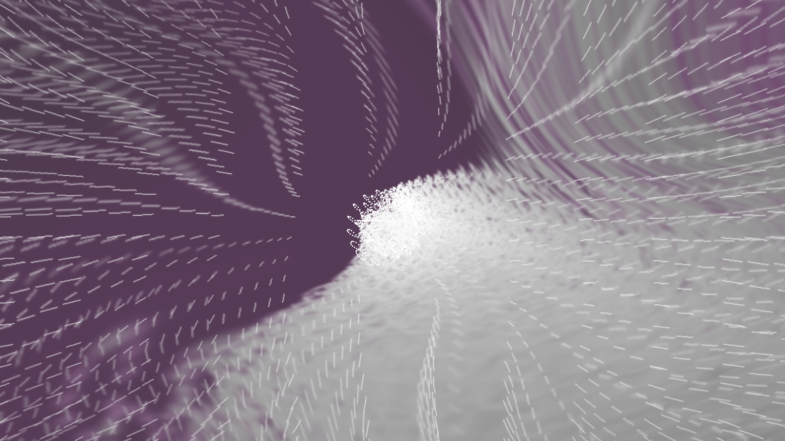
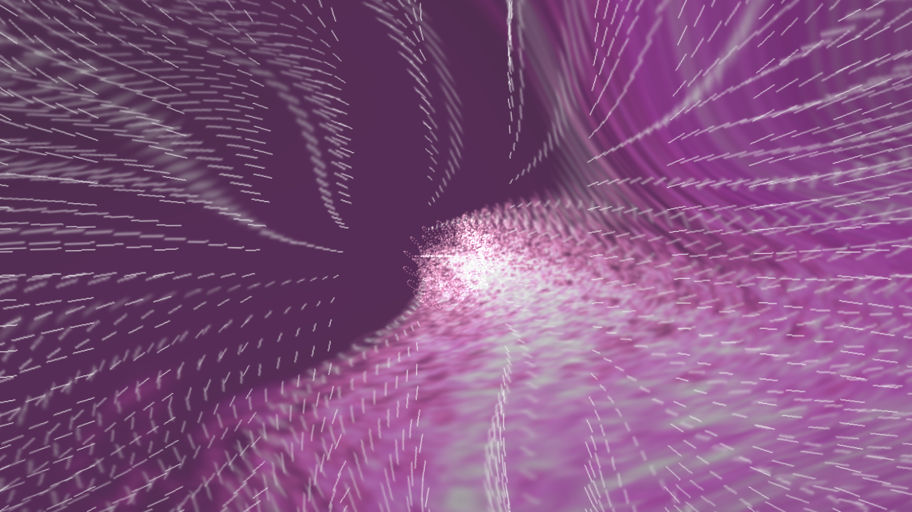

# I17 — Built-in waveform opacity

Patch0016 passes focused source and Native 4K acceptance. Review, CI, merge/publication and the remaining findings stay open.

Both MilkDrop 2 reference files have SHA256 `68749d31bb6b3020ca89b1e7630fd704e58a5de8dd6275c9f5ea005c6586a7d9`. Lines2882–2995 multiply mode-adjusted alpha by an unbounded volume ramp, replace mode3 alpha with the size coefficient, and clamp only the final result. Lines3315–3317 skip final alpha below .004. MilkDrop3 remains a separate source reference.

Current baseline15 TV patches retain projectM’s volume function, which replaces mode attenuation with `wave_a` and saturates the ramp prematurely. Mode3 also multiplies `wave_a` where the original replaces it. These operations coexist with useful TV size buckets and Native line/dot compensation; those policies are preserved.

| Control | Baseline | Source expectation / candidate |
|---|---:|---:|
| Mode2, alpha .8, vol .85, bounds .75/.95, matched256 canvas | .4 | .028 |
| Circle, alpha .1, vol2.2, bounds .75/.95 | .1 | .725 |
| Mode3, alpha .5, treble1, matched256 canvas | .04875 | .0975 |
| Mode1, alpha .003, no modulation | Draw .00375 | Skip below .004 |

The new real-GL attribute regression fails baseline on the first row and passes candidate. It also checks mode3 with authored alpha0, above-bound amplification, below-bound suppression, clamp, nonmodulated attenuation, and threshold boundaries. In float arithmetic `.0032f × 1.25f` is slightly below `.004f`; the exact threshold test uses mode0 alpha `.004f`. Native quad attribute checks use a3840×2160 render context and1024×768 reference, preserving its distinct coefficients. These checks are stage evidence, not full-resolution output screenshots.

All38 normal renderer controls pass after the candidate; all37 pre-existing sanitizer controls pass at baseline with the new test failing as expected. All16 patches apply to a clean pinned export. Test logs are linked alongside this file. Further sanitizer/host/JVM/Android/docs validation remains required.

The static handoff supplies5,300 conditional candidates. `Happening.milk` is now confirmed affected in the frozen Native 4K replay. `Happening.milk` is selected for the first unchanged-original replay because it uses mode2 with volume modulation and no custom waveform/shape/shader layers. Its expected corrected appearance has fainter newly injected dots while retaining Native dot sizing and authored feedback; the exact visibility depends on the actual audio volume.

No pass, texture, sample or repeated equation evaluation is added. Threshold suppression can remove work, but a no-performance-regression claim requires matched Native 4K timings. Captures must compare baseline15 and candidate16 under the same PCM, seed, clock and Native Standard state. They represent source-corrected TV output, not original Windows/D3D screenshots.

The source predictor in the separate predictor worktree still models the baseline behavior. Its historical identity is preserved; it cannot claim agreement with candidate16 until its versioned opacity contract is updated and qualified.

## Actual Native 4K captures

The following are real3840×2160 GLES framebuffer captures from unchanged `Happening.milk`, frame210, frozen clock210/30, seed12345 and the same unsigned mono PCM. Both roles report **Standard ·1280×720 canvas**. The candidate restores the source opacity operations within the retained TV policy; it is the expected TV appearance, not a screenshot of the Windows renderer.

Before (baseline15 patches):

After (candidate16 patches):

The original loses colour in its excessive glow. Corrected injection is fainter and retains more colour while keeping the same broad feedback geometry. Mean RGB byte difference at this frame is15.30; this is a pixel diagnostic, not a perceptual score or a whole-corpus result. All eight captured frames120/150/180/210/239/300/390/479 repeat byte for byte within each role, across480 rendered frames per run.

| Role | Run0 mean / p90 ms | Run1 mean / p90 ms |
|---|---:|---:|
| Before |6.309 /7.112 |5.040 /6.188 |
| After |4.643 /4.919 |4.653 /4.807 |

These360-frame measurements exclude capture encoding and include `onDrawFrame` plus `glFinish`. No slowdown is observed in this witness. Guest PSS ranges70,473–71,449 KiB before and70,679–70,744 KiB after; it excludes some host GPU memory. No physical-TV speedup or universal bound is claimed.

The selected API36 emulator failed strict surface-init GL validation with0x502 before rendering; its preserved failed manifest is separate. A new task-owned API34 ARM64 emulator boots at physical3840×2160 with host GPU/HVF,8192 MiB guest RAM and Apple M4 Pro/GLES3.0. No GL check was weakened. An initial host assertion expected an outdated internal status spelling; the producer had completed successfully with the current public `Standard ·1280×720 canvas` string. The corrected controller verifies/reuses that successful row without changing or rerendering it; subsequent rows use the same frozen worker/request.

Full identities, four successful manifests, capture hashes and timing limits are in the adjacent JSON records. Source baseline`120547f3` and candidate`e5dd1b09` package identical asset inventories. These are independently built source-instrumented AARs, not shipping-byte identities. All38 normal and38 sanitizer renderer controls and329 host controls pass; Android debug core/app and JVM checks pass. The macOS native runner skips its separate EGL/GLES transition-overlay test. Strict docs and final release checks remain open.
