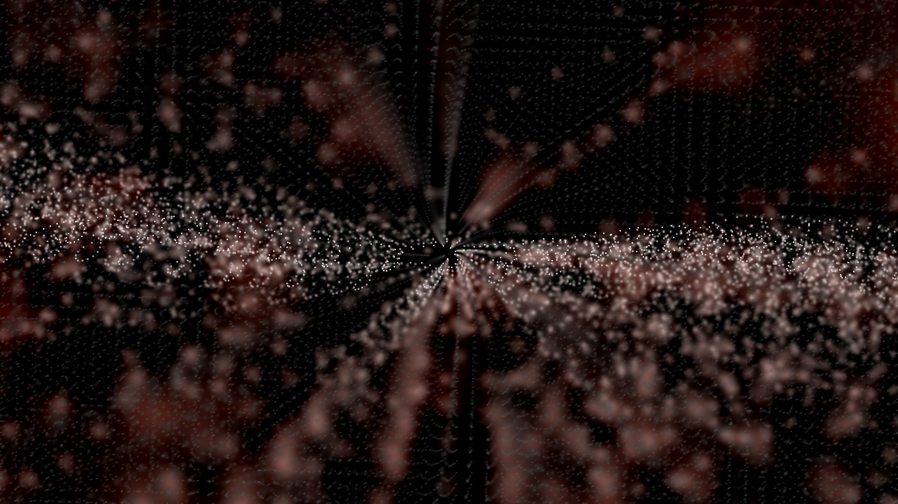
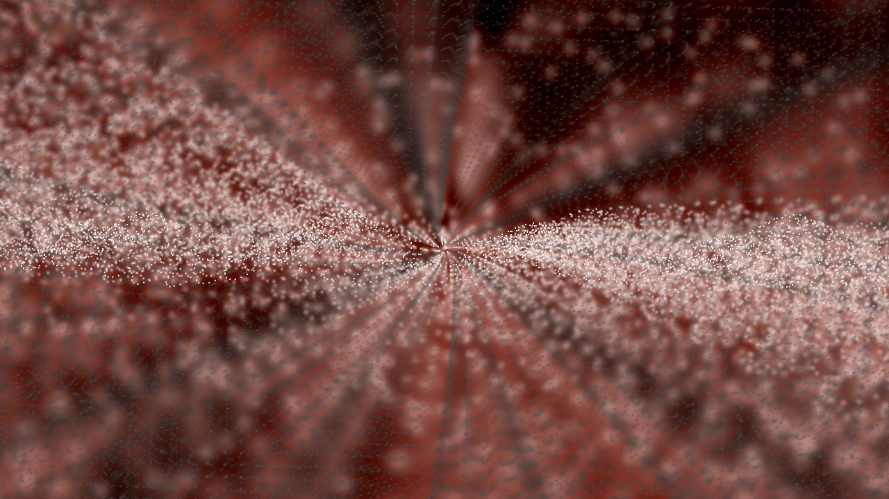

# I19 — Waveform sample counts: tradeoff investigation

Candidate patch0017 reproduces the source cap within the TV reference policy. Source-count regression fails before (160 versus85 at width256) and39 normal renderer controls pass after. Actual Native 4K before/expected captures, measured performance and final disposition remain pending.

MilkDrop2 `milkdropfs.cpp:3008–3011,3113–3121` caps raw mode4 points at `min(480, canvasWidth/3)` and raw mode6/7 points at `min(240, canvasWidth/3)`. Current projectM instead divides the raw sample budget by three when that budget exceeds the width limit. Width256 therefore gives160 rather than85 for mode4 and80 rather than85 for modes6/7. Width1024 gives160 rather than341 for mode4; modes6/7 agree at240.

Retain `SampleDecisionWidth`, which makes sample decisions follow the TV reference-equivalent width. Replacing it with physical4K width would undo earlier sample-density/brightness fixes. With active Native Standard at3840×2160 and authored/reference1280×720, the **source-corrected rule within the TV policy** gives426 raw mode4 points rather than160. With the fallback1024×768 reference it gives394 rather than160 (equivalent width1182). Modes6/7 already agree at240 in those contexts.

This is not automatically a safe production fix: mode4 smoothing output grows from319 to851 points at the Native authored width, and Native replay submits that geometry twice. Authored momentum and audio windows change, so matching the old pixels would defeat the requested source semantics. The user guide records earlier brightness measurements on `$$$ Royal - Mashup (103)` under a160-point reference policy; those old measurements cannot certify the new426-point rule.

The handoff identifies3,643 lexical candidates. The unchanged original `$$$ Royal - Mashup (103).milk`, SHA256 `08ead3db478aa81c0e29efccc0d9c38bbe69180435123531cbafbf2beb347463`, is the primary before/expected witness because it directly overlaps the documented earlier4K brightness repair. It is not yet confirmed affected in this audit by execution or rendering.

Next: add source-count execution controls at256/1024 and both4K reference contexts; build an isolated hypothetical count correction retaining the TV rule; capture the exact original and repeats with unchanged PCM/clock/seed; measure matched Native Standard4K costs. If the extra geometry creates measurable slowdown or fidelity loss, present those captures and measurements here for owner disposition and keep the shipping rule.

The candidate leaves spectrum mode8 unchanged and uses a two-point safety minimum for tiny widths below6, outside the original’s defined line-smoothing context. Native authored and presentation sample decisions are equal at1280×720 and3840×2160 with that reference. The source regression verifies those contexts as well as the fallback reference, matched canvases and unreferenced4K.

## Concrete 4K policy decision

The corrected count **visibly revises an earlier Native brightness checkpoint**. At frame239, mean RGB byte level grows25.99→85.39 (about3.29×), with MAE61.21. The field is denser and much brighter, with less dark separation. More source-correct points are expected to inject more energy; it is not legitimate to call this a TV-fidelity win solely because the count matches source arithmetic. Preserving the earlier160-point appearance while restoring426 authored points would require another energy/geometry policy and could itself lose fidelity. No original Windows/D3D image is available to settle artistic intent.

Before, exact unchanged Royal103, Native Standard4K:

Hypothetical source-correct426-point cap within the same Native policy:

Both roles render480 frames twice with the same PCM, clock, seed and assets. All eight selected full-resolution RGB captures repeat exactly within each role. Timing mean/p90 pairs are6.131/7.078 and7.759/10.267 ms before,5.778/6.525 and6.294/7.407 ms after. The ranges overlap; these noisy emulator samples show no consistent slowdown and do not establish a speedup or zero cost. The earlier geometry work estimate still grows319→851 submitted smoothed points before Native replay. Physical-TV performance remains unmeasured.

**Temporary disposition:** retain the shipping sample rule while completing matched authored/resolution comparisons. The owner correctly clarified that the reported brightness comparison was against previous4K output, not an authored reference. This comparison alone cannot establish whether the corrected cap loses fidelity or restores the intended brightness. The hypothesis is preserved outside the shipping series, and other findings continue independently. The hypothetical patch, source commit, full worker identities and successful manifests remain available for the decision; no existing frozen run is rewritten.

## Matched authored and resolution-band results

The owner asked whether the brightness change was relative to authored output and whether it persists across resolutions. A24-run comparison now covers both roles and repeats at six additional profiles. Every job renders480 frames; all eight selected RGB frames repeat exactly per role/profile. At frame239:

| Context | Previous mean RGB | Source-cap mean RGB |
|---|---:|---:|
| Authored256×144, no reference |93.40 |88.16 |
| Authored1024×768, no reference |32.30 |68.20 |
| Authored1280×720, no reference |25.99 |85.39 |
| Fallback1280×720,1024×768 reference |33.83 |89.23 |
| Fallback1920×1080,1024×768 reference |35.38 |88.12 |
| Native2560×1440,1280×720 canvas |26.02 |85.42 |
| Native3840×2160,1280×720 canvas |25.99 |85.39 |

The source cap reduces points at width256 (160→85), increases them at width1024 (160→341) and1280 (160→426), and uses the same426 at Native1440/2160. It therefore does not blindly brighten every resolution. The corrected Native4K output reproduces the corrected1280×720 authored brightness; the previous Native output similarly matched its own incorrect160-point authored budget. Both roles preserve the TV scaling policy.

Expected authored view under the source-correct426-point rule:

Area-downsampling the corrected4K output to1280×720 gives RGB byte MAE0.69–1.03 across all eight selected frames versus its own authored reference; before is0.77–1.03. These small nonzero residuals are backend/raster diagnostics, not Windows image identity or a universal perceptual guarantee. The new data does **not** demonstrate Native-specific fidelity loss from the count correction. Source-count accuracy is established in the defined controls; original Windows artistic intent is not separately replayed.

The lower-band timing rows can overlap parent GL tests, so they are not accepted as isolated performance evidence. A separate12-run4K ABBA timing comparison is running with no concurrent parent GL tests/builds. Keep the shipping decision open until those results are checked. See `resolution-bands.json` for full capture/producer identities and the frozen controller alongside this file.

## Final I19 disposition: source fidelity versus measured cost

The clean12-run4K comparison uses three ABBA cycles, six runs per role, with no concurrent parent GL tests/builds. All eight selected full-resolution RGB frames remain identical within each role over all six repeats. Mean serialized frame time is **6.1846 ms before versus6.3428 ms after**, a **+0.1581 ms /2.56%** average change. ABBA cycle changes are+1.26%,+1.46%,+4.86%; individual paired changes range−1.20% to+6.53%. Variability remains substantial; this is not a universal or physical-TV cost bound.

The authored/Native brightness agreement rules out the initially suspected Native-specific brightness regression in this witness. The corrected cap is source-accurate at all seven tested contexts; it does not brighten every size. However, the clean timing data does not satisfy the owner’s condition of no performance impact. **Defer the shipping change for owner followup on the source-fidelity gain versus this small measured cost.** Keep the original shipping sample policy while preserving the exact proposal, before/expected/authored screenshots, counter controls and source-bound worker identities. Do not compensate alpha to conceal the added energy; that would introduce another fidelity policy.

`proposed-width-cap.patch` is the hypothesis applied at `6b3162f8`, not a current shipping patch. Its old0017 label is historical; current shipping0017 is the independent custom-wave input-window correction. Apply/renumber the proposal only after a deliberate disposition, then rerun final-head validation. See `clean4k-timings.json` for the complete measured rows and capture hashes. No more I19 runs are required absent a new change or unresolved concern.
