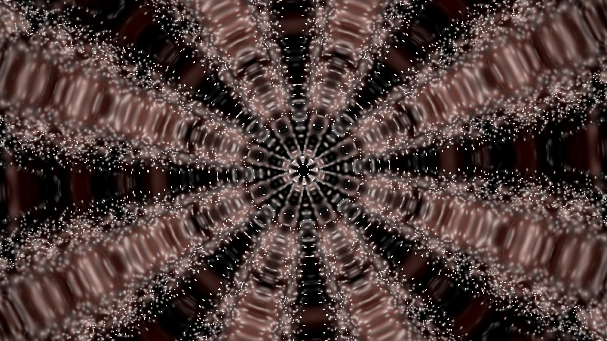
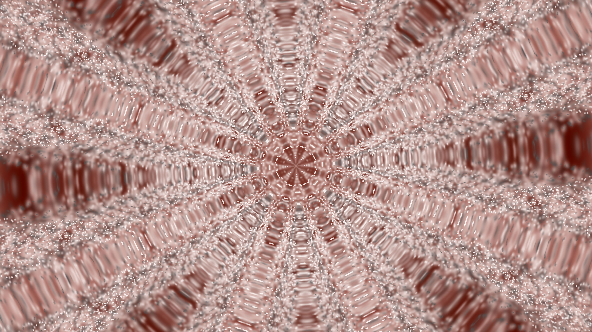
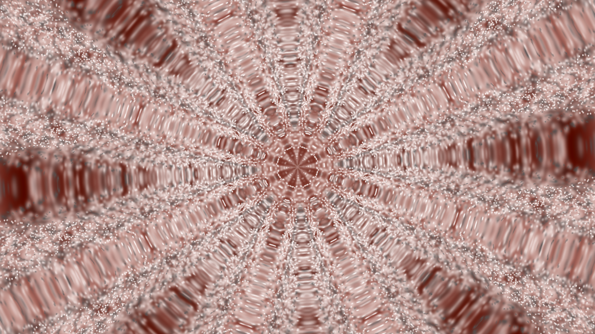

# I19 — Source sample caps: owner decision required

The source-correct sample cap is preserved as [a proposal](proposed-width-cap.patch), outside the shipping0016–0022 repair series. It restores MilkDrop2's width-dependent raw count for modes4/6/7 while preserving TV reference-equivalent sizing and safe tiny-canvas handling. The real source controls passed; no changes to preset/audio bytes or authored equations are proposed.

## Fidelity and brightness

The confirmed original is `$$$ Royal - Mashup (103).milk`, SHA256 `08ead3db478aa81c0e29efccc0d9c38bbe69180435123531cbafbf2beb347463`. At Native4K's1280×720 authored canvas, source-correct mode4 emits426 raw/851 smoothed points rather than160 raw/319 smoothed points. More overlapping additive strokes brighten this preset. That difference is between the old Native output and the source-derived output; brightness alone does not demonstrate fidelity loss.

Fresh final-output captures explicitly read framebuffer0 and verify installed APK/native AAR/preset hashes. Twenty-eight480-frame runs across seven contexts completed with exact repeats of all eight selected RGB frames. Mean RGB at the same frame239 is:

| Context | Previous Native sample policy | Source-correct cap |
|---|---:|---:|
| authored256 | 171.080 | 135.551 |
| authored1024 | 90.760 | 154.852 |
| authored1280 | 63.935 | 154.689 |
| fallback720 | 77.797 | 156.406 |
| fallback1080 | 80.291 | 156.246 |
| native1440 | 63.877 | 154.685 |
| native2160 | 63.851 | 154.714 |

Source-correct authored1280 and Native4K averages differ by only0.025 on a0–255 channel scale. These are close measured averages, not pixel identity or universal fidelity proof. At authored256 the corrected cap actually darkens the preset: the original budget is85 raw points, while the previous policy emitted160. Therefore the change does not make every resolution brighter.

[Final Native4K records](final-I19-results.json) · [Matched final-output resolution records](final-resolution-bands.json).

## Performance tradeoff

The preserved clean12-run ABBA timing experiment measured mean serialized onDrawFrame+glFinish6.1846ms before and6.3428ms after: +.1581ms/+2.56%. Cycle differences were1.26%,1.46% and4.86%. Timing excludes capture/PNG work and measures this emulator's engine, not physical-TV FPS. The original capture-helper defect does not invalidate those render timings. Fresh screenshot replays overlap some host build/analysis work and are not substituted for that clean timing experiment. See [clean timing records](clean4k-timings.json).

The choice is to adopt the original width-dependent point count with this measured extra workload, or retain the current lower-cost Native policy and its different overlap/brightness. The proposal remains deferred under the instruction to avoid performance loss; no shipping renderer change is made for I19. One original is confirmed, not an affected census across3643 lexical candidates.

## Historical evidence qualification

Earlier before/after comparisons used distinct packages and correct native artifacts, but their Java worker read an internal feedback framebuffer rather than final presented output. Keep them as intermediate-stage source evidence. The earlier mean85.39 Native/authored claim describes that stage and is superseded for final presentation by the records above. Existing resolution-band artifacts/helpers remain frozen; the refreshed workers only correct capture and isolated APK identity, preserving native AAR/preset bytes. These screenshots are source-derived GLES expectations, not original Windows/D3D captures.
