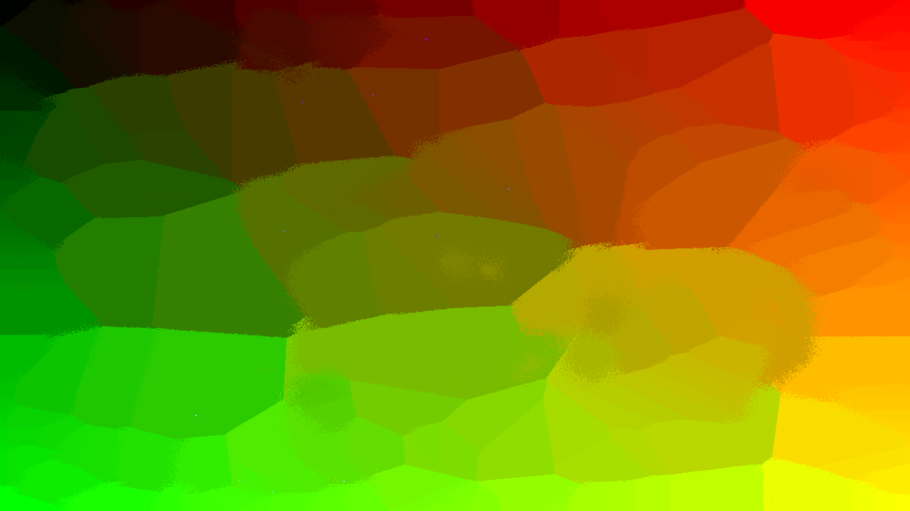
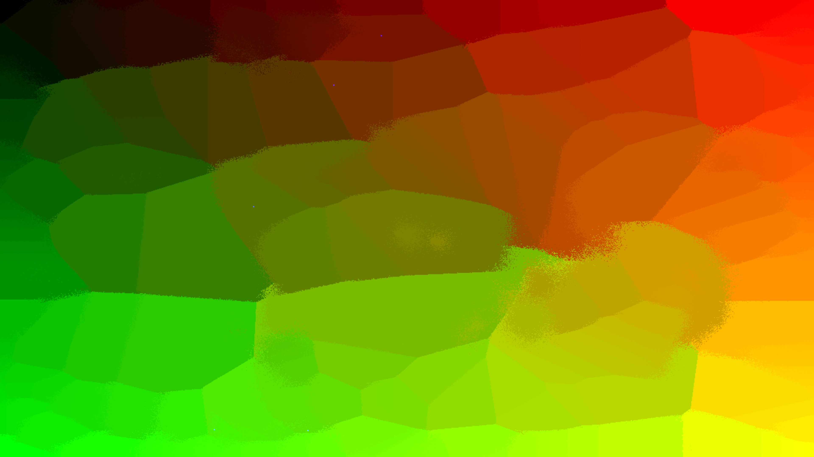

# I22 — Discrete custom dots

Candidate patch0018 passes the source-stage regressions and40 normal renderer controls. Native4K captures/timings and final integration remain pending.

MilkDrop2 `milkdropfs.cpp:2722–2726` smooths custom waves only when dots are off. The baseline library always smooths, turning two finite authored points(.25,.5)/(.75,.5) into three submitted points including a midpoint. Candidate0018 submits only authored dot points, preserving maximum buffer capacity, point/color ordering, Native dot styles and prepared replay. Ordinary line smoothing remains2N−1 and Native quads retain their smoothed segment count.

Original line2634 also permits one custom dot. Its normalized `sample` input is0/0, so the candidate preserves it as NaN rather than inventing0. A point program that overwrites position/color independently of that input can render a finite authored point. The real-EEL/GL test traces NaN while emitting the independently finite point; all0/1/2-dot, thick/thin and line cases are covered. Invalid geometry or color derived from NaN remains an unsupported appearance domain, not a claimed portable original render. No raw/nonfinite equation value is repaired silently.

The new draw-hook regression fails before on the interpolated two-point midpoint and passes after. It reads actual submitted VBO endpoints, counts authored/native draws, verifies one execution per point and checks line smoothing plus empty/single-line suppression. No test-only code is added to production.

The handoff supplies1,875 lexical candidates. No original is credited before runtime. Primary unchanged witness: **shifter - mosaic mitosis.milk**, SHA256 `8a9c95567882bf3fd2644e28cb2e0067b62f52b38cb9d10cc4ada34c90710419`. Its enabled custom wave1 has12 dots and point code folding time-driven sine positions, adding random jitter and randomized alpha. Before smoothing submits23 dots; original source expects12. Point RNG is consumed only for the12 authored points in both roles, and must remain frozen. Source-corrected appearance removes the11 unauthored particles while preserving the true particle positions. The other waveform/shape/feedback components are kept intact.

Expected performance: existing two-or-more-point dots avoid interpolation and submit fewer vertices; supported single-dot programs now perform their missing authored evaluation/draw. Neither path adds a render target or Native replay evaluation. Native4K timings remain required, and no whole-corpus or physical-TV claim is established by the stage controls.

## Captured candidate and unresolved qualification

Two480-frame source-bound Native Standard4K replays per role repeat all eight selected RGB frames exactly. The original mosaic preset has a localized particle change; most of its opaque background is unchanged. Frame479 before/expected:

The source-derived candidate removes unauthored particles while retaining point RNG and Native styles. These are GLES captures, not original Windows renders. Full-frame RGB MAE at479 is.578; earlier selected frames are often much closer. This is not a heavily changed whole-frame witness; a stronger original particle preset remains required for the final issue report.

Performance is **not accepted yet**. Initial mean pairs before2.820/2.240 ms versus after3.430/2.479 ms warrant further checking. A12-run clean comparison has a corrected-role outlier of16.46 ms mean/32.67 ms p90 amid roughly2–4 ms jobs. All its selected RGB frames still repeat exactly. Preserve that run, investigate external/backend interference, and measure another strongly exposed original without silently discarding unfavorable data. Until then retain the change as an unqualified candidate; do not claim zero performance cost.

The dedicated single-point test independently fails when the old guard is restored, and also fails when a finite0 sample is substituted; restored candidate passes. The final41-test normal suite passes. A gamma-only test for the next finding has been staged but has not yet been built or run. Final source/sanitizer/Android/docs/review gates remain open.
