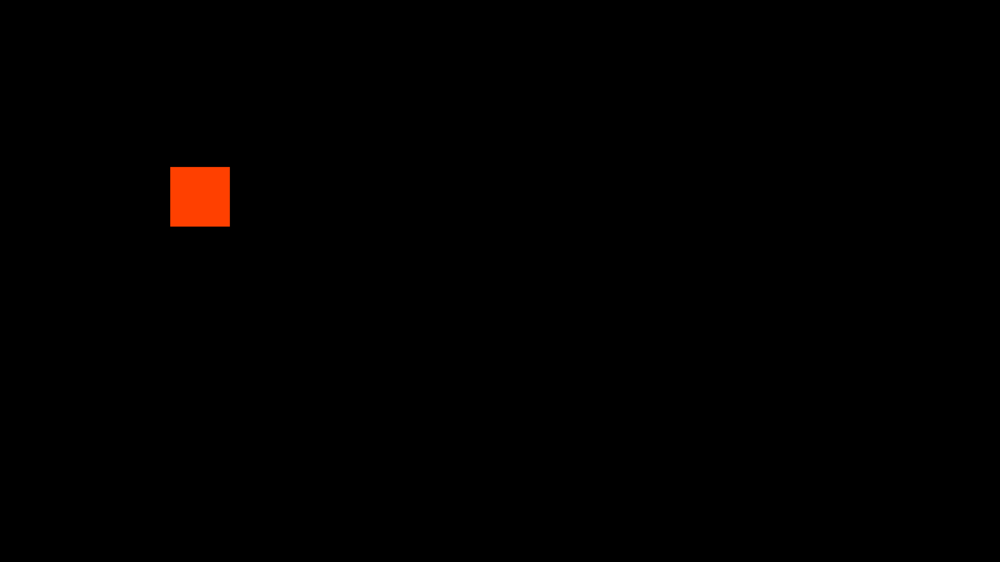
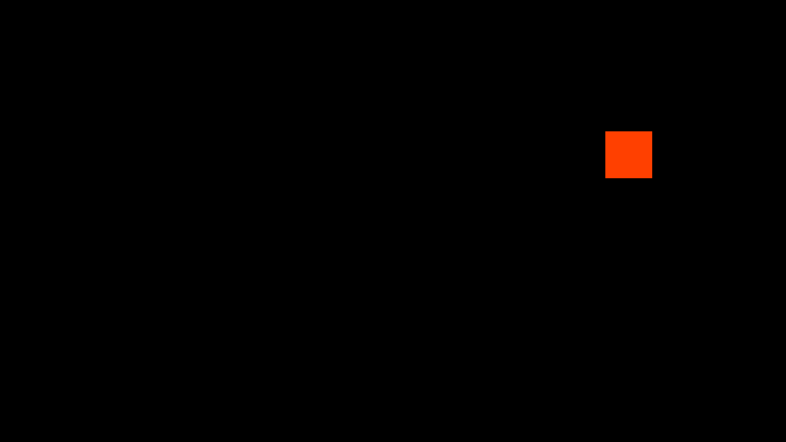

# I29 — Negative odd echo orientation

Candidate0022 restores original horizontal U flip whenever signed orientation%2 is nonzero, including−1/−3 and equivalent finite negative values. Preserve signed modulo4, original vertical predicate, truncation/valid-input guard, zoom, alpha, gamma/tint and float diffuse policies. No pass, resource or added vertex is introduced.

The actual textured GL test fails before at orientation−7 and passes after across−7/−5/−3/−1/0/1/2/3/4/5. A known64×64 field has left red64 and right red192; active echo1/zoom1 must swap those halves for any odd orientation. All46 normal controls pass after correcting the fractional negative-orientation test input,22 patches apply. No literal-negative bundled orientation was found in the original scan; dynamic values remain possible. Native4K finite edge-field diagnostic and final integration remain pending; do not invent an affected-original census.

## Display-control regression correction

The initial full run passed45/46, failing dynamic-display-controls. Its fixture supplied−1+.75=−.25 (which truncates to0) but compared against static−1. Before0022 both orientations happened to omit horizontal flipping, hiding the mismatch. The corrected fixture uses fractional values away from zero and expands negative odd inputs. The corrected full run passes46/46; both original failure and corrected logs are retained. The independent known-field echo test already passed.

## Capture qualification correction (2026-10-08)

The historical capture worker checked only GL_FRAMEBUFFER_BINDING (draw binding). Native direct rendering can leave an internal feedback FBO bound to GL_READ_FRAMEBUFFER, so the saved PNGs are not verified final presented output. Their intermediate geometry differences and timings remain evidence at that stage; claims of final Native4K appearance/brightness acceptance are suspended. Fresh worker APKs now explicitly select read framebuffer0 for capture and restore the prior binding; the native AAR and preset bytes are unchanged. Source/evaluator/known-FBO regression controls remain valid. Existing artifacts are retained; new final-output replays will be separately recorded.

## Verified final-output Native4K diagnostic

Four480-frame replays now explicitly capture read framebuffer0; every selected frame records the prior nonzero internal read binding and the corrected zero capture binding. RGB repeats match exactly. Echo alpha1/zoom1/orientation−1 correctly moves the finite orange square from the left to the right, preserving Y. The before/after native AARs are unchanged from the source-bound workers. This causal test also confirms the capture defect and its correction; the static-input v1 and equation-input v2 intermediate captures are preserved under build/audit.

[Final records](final-results.json). No stock negative-orientation preset is confirmed. Focused source/finite final-output acceptance passes; final combined integration remains pending.

[Initial full-suite failure](normal-initial-failed.txt) · [Corrected46/46 run](normal-corrected.txt).
