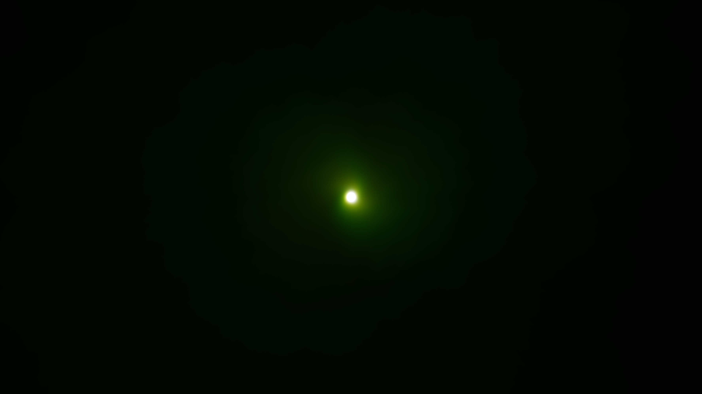

# I31 — Gamma-only pass count

Candidate0019 restores MilkDrop2’s gamma-only epsilon `.001f` from `milkdropfs.cpp:4245`, preserving echo redraws’ `.0001f`, current float diffuse precision, live gamma, blend behavior and tint fix0014. Native4K output/timing and final integration remain pending.

The real-GL draw/attribute regression fails before at gamma1.0005: two passes instead of one. It passes after at the gamma boundary cases0/1/1.00005/1.0005/1.0011/2/2.001/2.0011/8, including uploaded per-pass float diffuse weights. Echo branch pass counts are tested unchanged. All42 normal renderer controls pass; all19 ordered patches apply cleanly.

The unchanged original **suksma - type o negative - world coming down.milk**, SHA256 `1eae0591633d591883bf3dc5340bed937d4ba80ef566ffb8ce668cef3bf919ed`, is the narrow source witness: loaded float gamma2.000999927520752, no echo, composite version0, tint0 and no overriding gamma/echo equations. Original count is two passes, current baseline three. The initial68 handoff candidates are not an impact census; most fail this branch/boundary condition.

Do not invent a brightness improvement. Ideal total float weights agree, but per-pass RGBA8 rounding can differ and original byte-packed diffuse remains separate I30. An identical captured image is a valid result if count/weights prove the correction. This candidate adds no pass or allocation and can remove one fullscreen pass in the narrow boundary interval. Actual Native4K measurements still determine the focused acceptance claim.

## Native4K result

All four480-frame original-preset runs complete with Native Standard1280×720 canvas, strict GL/name/cleanup checks and identical selected-frame repeats. Every one of the eight before/after full-resolution RGB frames is also byte-identical. This is a valid result: the narrow pass/weight difference is the causal oracle, and no visible brightness improvement is invented.

Mean/p90 timings before3.343/3.986 and3.272/4.183 ms versus after3.440/4.347 and3.332/4.148 ms are close with variable scheduling; no speedup or universal zero-cost claim is established. Production work removes a pass at the admitted boundary and adds no computation/resource. Count and image qualification pass; final timing/integration disposition remains open.

## Validation correction — original comparison invalid

The first I31 before/after controller installed both artifacts under the same application ID before rendering. The second installation replaced the first, so both labeled roles actually used the candidate. Its image identity and timing rows **do not prove before/after behavior** and are invalid as a comparison. Preserve those files for traceability; do not relabel them as valid baseline evidence. The source-stage pass/count/weight regression remains valid. A new controller installs each role immediately before its run, verifies the installed APK byte hash through the captured Android user, and writes new `verified-i31` directories. Final I31 appearance/timing qualification is pending the corrected run.

## Verified rerun

The corrected controller installs and hashes each role immediately before rendering. Four new480-frame Native Standard4K runs complete and all eight selected RGB frames are byte-identical both across roles and within repeats. This now constitutes a valid admitted image-equality result. Candidate timing means2.642/2.603 ms versus baseline around3 ms show no slowdown in this witness; no universal speedup is claimed. See verified manifests/results. Source count/weight controls, unchanged appearance and focused runtime qualification pass; final integration remains open.

