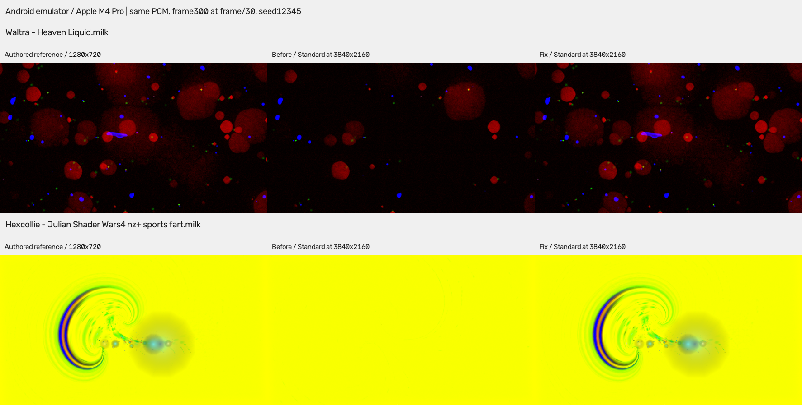
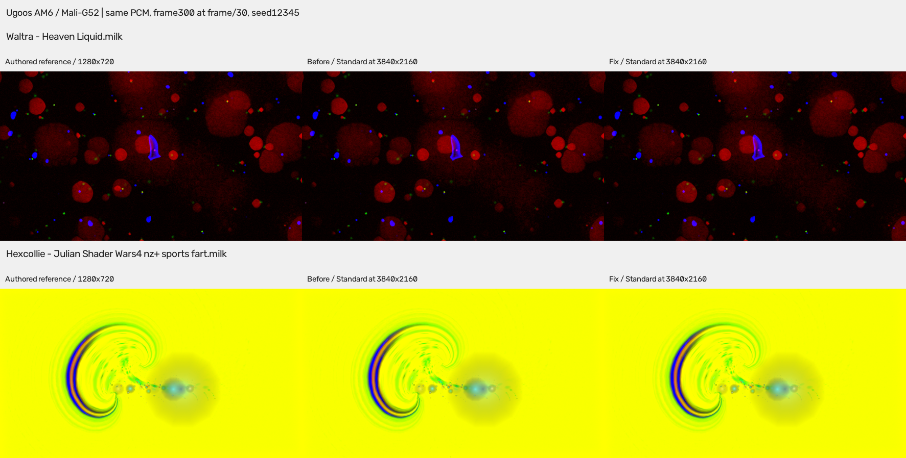

# Native trails geometry fix: evidence

Patch0043 addresses two separate defects: native geometry was fed back through a reduced reconstruction, losing faint authored geometry; the tested Android emulator also lost shape drawing unless per-vertex input divisors were explicitly restored. Geometry is evaluated once, drawn into the authored feedback target, and replayed at native size for sharp presentation. The existing canvas buffers alternate roles; no new full-size feedback texture is added. The unused injection shader is removed.

## Source and comparison boundary

The physical baseline is `feat/native-trails-production` at `3763293f7bf5b9403becd64cb741ba4afa7f46af` (patches1–42), subsequently merged into main. The final actual-core candidate is `640e0b0a1aa72a8766d62e17a61628eca59a6890` (patches1–43). Subsequent validation-tool and main engine-identity-label commits do not change this renderer component. Instrumented workers use the real core AAR but deterministic PCM, seed12345 and frame/30 clock; they are not byte-identical release artifacts.

Each final device matrix has20 jobs: two presets, authored/repeat/candidate-authored, native-off before/after, Standard before/after/repeat, Medium and High. All eight repeat/off control pairs per device are byte-exact at the eight selected capture frames. Each render checks480 frames for GL errors and preset identity and verifies core/context cleanup. `actual-core-comparison.json` records the compiled sources, AAR identities, audio hash, metrics and timings.

## Before and after screenshots

These are captured frame300, not artistic reconstructions. Every panel uses the same audio, clock, seed and preset. Original captures are resized with area interpolation to the same display dimensions; colors, exposure, gamma and contrast are unchanged. `screenshot-receipts.json` records the original PNG hashes and source commits.

### Android emulator: Apple M4 Pro / OpenGL ES translator

Across the eight captures, Waltra's average brightness ratio changes from0.4727 to1.0001; Hexcollie's average contrast ratio changes from0.0513 to0.9996. Standard, Medium and High recover the missing structure. These ratios are averages of individual capture ratios, not ratios of aggregate means.

### Physical Ugoos AM6: Mali-G52 / 32-bit Android9

The Mali driver did not exhibit the dramatic emulator collapse. Its Standard image error changes from0.001760 to0.000863 for Waltra and0.000323 to0.000277 for Hexcollie. This supports a driver-specific input-state problem in addition to the authored recurrence defect; it does not establish the exact upstream translator bug.

## Physical timing and limits

The following means measure `onDrawFrame` plus `glFinish` over360 frames at3840×2160, excluding capture encoding/transport. They are serialized engine timings, not app FPS or a thermal benchmark.

| AM6 preset | Previous Standard | Corrected Standard | Corrected Medium | Corrected High |
| --- | ---: | ---: | ---: | ---: |
| Waltra |67.45ms|66.62ms|247.22ms|247.44ms|
| Hexcollie |46.22ms|47.37ms|229.28ms|229.50ms|

Standard differences are small and should not be presented as a performance improvement. Medium/High at forced4K are expensive on this GPU. The normal app uses Auto and may lower rendering resolution; a universal4K frame-rate claim is unsupported.

## Wider Mac matrix

The preceding renderer component at `01f808e5` completed976 jobs across160 presets on Apple M4 Pro / desktop OpenGL4.1. All320 authored/native-off control profiles match the supplied archive byte-for-byte. `mac-160-comparison.csv` compares all three gain levels with that archive; `validation-receipt.json` preserves source/driver/protocol identities.

The four recorded Mac exceptions generally have lower pixel error after the change, but their brightness/contrast metrics are mixed and differences remain. Halfbreak EFFECTAMT4PORT has higher aggregate pixel error even though its brightness/contrast errors decrease; frame300 preserves the blue structure more closely, while phase/hue differences elsewhere increase pixel distance. Near-black and chaotic presets require visual interpretation. This is not a whole9606-preset fidelity claim, and the Mac matrix predates removal of the unused injection shader; final actual-AAR witness matrices validate the compiled final component separately.

## Regression and application checks

- 261 host tests pass, including faint authored recurrence, native sharpness, explicit stale vertex inputs, textured fills/borders, batch overflow/order, single equation evaluation, gain changes, resize and re-enable.
- 15 native regression executables pass, plus engine tests; the separate EGL/GLES fade-overlay test is unavailable on this macOS host.
- App30 and core54 JVM tests pass; APK/AAR builds and all43 patch applications pass.
- 46 Native trails validator tests and82 release-tooling tests pass; the user guide builds with `mkdocs build --strict`.
- The isolated emulator setup test passes Standard default, D-pad Medium, High, persistence across restart, rapid allocation generations and diagnostics. Uninstrumented emulator playback records about30fps. Physical normal startup and Home/return rendering also record about30fps at Auto2560×1440 with no sound; this is a smoke, not a matched4K FPS comparison. Projectivy intercepts the global Menu key on this TV, so settings/persistence controls are verified through the isolated emulator test. The TV inactivity timeout and task preset override are restored, and the original foreground app is returned.

## Reference research

[Khronos OpenGL ES3.0.6](https://registry.khronos.org/OpenGL/specs/es/3.0/es_spec_3.0.pdf) sections2.9–2.11 define divisor0 as per-vertex input and retain divisors in VAO state. A nonzero divisor on an ordinary one-instance draw can supply constant inputs and degenerate filled geometry. The matched single-variable emulator experiment restores drawing by resetting shape input divisors; evaluated CPU vertices are unchanged.

The inspected [AOSP gfxstream divisor implementation](https://android.googlesource.com/platform/hardware/google/gfxstream/+/d047a57228332d995d36600792fa9ccc26cf8ae6/host/gl/glestranslator/GLES_V2/GLESv30Imp.cpp) updates guest binding/divisor state and dispatches to the host. Its current context declares a zero default. This source revision has not been tied to the installed emulator37.1.11, so it is explanatory context rather than proof of a particular upstream fault. Unsupported private divisor getter readings were excluded from the evidence.
