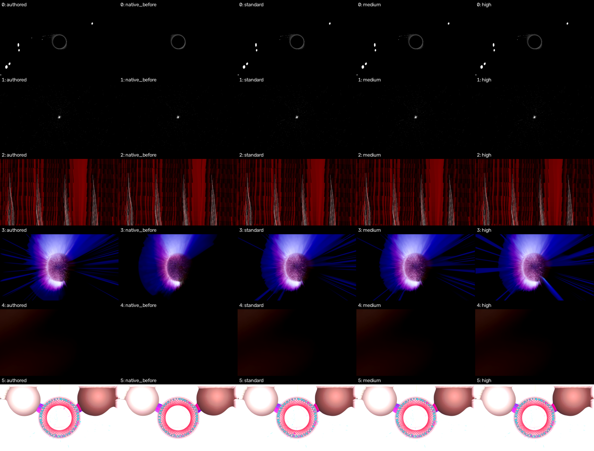
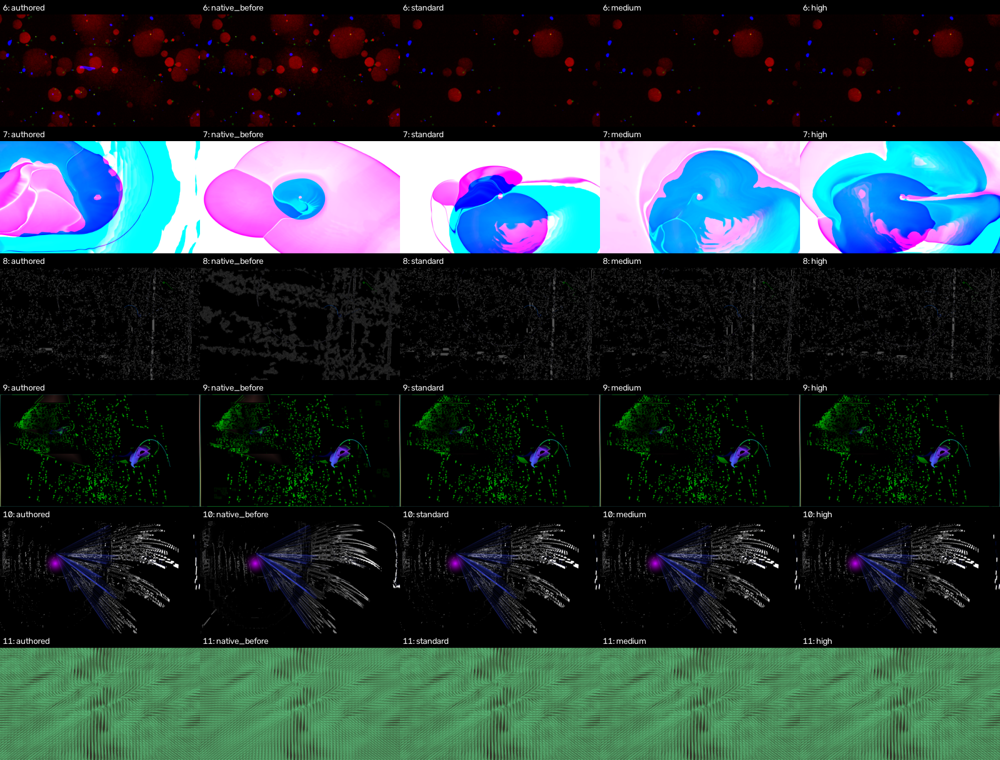
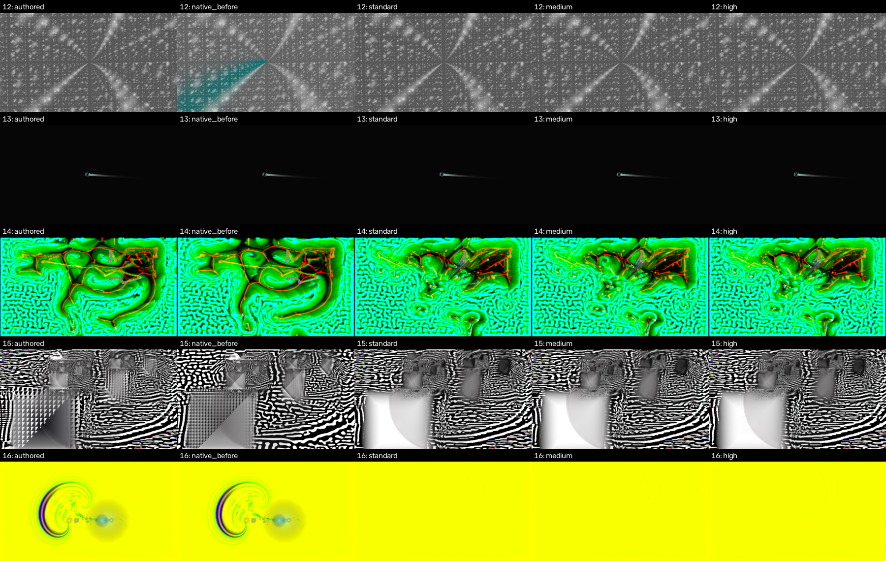

# Native trails production focused matrix (preliminary)

This is the frozen 17-preset × 8-profile actual-core Android worker matrix on the owned 4K host emulator. Candidate source is `55ee02f02e8a8a35616ba5ad7ef362dd6f3f0e70`; baseline is released v2.3.3 source `6e71ac2a18a95463fbe3a21c05e6dd4027cb74a0`. The workers instrument deterministic time, RNG and capture controls, so their bytes differ from shipping AARs. `summary.json` records the source, instrumentation, AAR, native library, assets, audio, request and capture identities and measurement limits.

All 136 jobs completed and passed capture integrity, preset identity and worker GL checks. All eight full native RGB capture hashes matched in each of the 51 repeat/off/default control pairs. These checks establish trustworthy measurements; they do not certify brightness or visual fidelity.

Royal 191 and Fed quadratrail recover the authored line brightness. The initial visual review also identifies unresolved regressions: Waltra Heaven Liquid averages about 47% of authored luma and shows fewer particles, while Hexcollie Julian Shader Wars4 loses its visible spiral despite a similar average luma. Large pixel differences on chaotic shader presets also need review. These are known visual exceptions rather than universal brightness certification. The owner authorized a post-merge engineering handover for rare exceptions if the broader evidence supports the overall improvement. Of these 17 risk-selected witnesses, 13 have a lower mean per-frame absolute luma error against authored than old Native; four do not. This subset cannot estimate their prevalence in all 9,606 presets. Targeted research and a broader Mac selection from the historical corpus remain separate evidence.

`per-preset.csv` contains diagnostics at the common 1182 × 665 metric size. Contact sheets show frame 300, with columns authored, old Native, Standard, Medium and High. Full lossless captures remain in the ignored local `build/native-trails/focused-v1` and `summary-v1` directories. Timing uses serialized draw plus `glFinish` in an emulator and is not TV app FPS.

