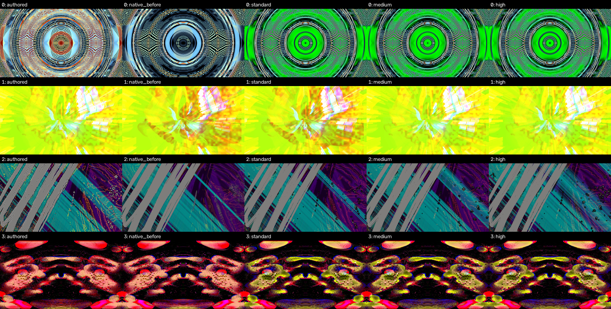
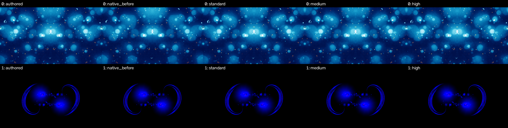

# Broad Native trails Mac validation

The corpus-derived selection covers 160 presets: all 67 historical failures, the 17 named witnesses, eight recorded reasons from each brightness/clipping/feedback/motion/blur/source-complexity tail, and 24 deterministic shader/blur/motion strata samples. Reasons overlap. Historical measurements select risks only; all comparisons here are fresh matched captures.

All **976 jobs** completed: authored, old Native, candidate off, Standard, Medium and High for every preset, plus 16 authored repeats. All 176 repeat/off control pairs match all eight full native RGB hashes. Every job checked GL during its 480 frames; enabled jobs required an active scale-3 canvas. Driver: Apple M4 Pro, OpenGL `4.1 Metal - 89.4`. This uses Apple's OpenGL driver, not a native Metal engine.

Standard has lower mean per-frame absolute luma error against authored on **129/160** presets, equal error on 17, and higher error on 14. Four cases worsen by more than 0.01 normalized luma; that cutoff prioritizes research and is not a visual acceptance threshold. Matched frame-300 review confirms color/pattern changes on those cases, especially computer-is-your-friend and shimmy-grid-nz+6. See the research handover. Waltra and Hexcollie match closely on this Mac path but remain known Android/GLES exceptions.

The enriched sample does not estimate prevalence in the full 9,606-preset Android corpus. Mean brightness is insufficient to establish structure or complete temporal fidelity. Native hashes/metrics come from eight streamed full-size RGB frames; all eight reduced lossless PNGs are independently verified on reuse, while full native frame 300 is additionally retained in the pilot. Other native bytes are not retained for independent rehash. Timing under concurrent GPU contexts and capture work is not TV app FPS.

The full local capture summary hash and omitted-array scope are in `summary.json`. `protocol.json` freezes source/patch, worker, PCM, texture, selector and capture identities. `selection.json` preserves historical joins and risk reasons; `per-preset.csv` holds per-preset diagnostics. Candidate renderer source is `55ee02f0` with shipping patch 0042 `be3f39da…`; later branch changes add allocation guards, documentation and main's beta category metadata without changing that renderer, preset files or textures.

A host disk-full interruption caused two PNG-write failures. Those failed attempts were retained separately, verified successes were reused under the unchanged protocol, and the affected/incomplete jobs were rerun. The final terminal matrix has zero failures. The infrastructure recovery receipt remains with the local evidence.

Rows below are: computer-is-your-friend, rediculator-qrem-glob, shimmy-grid-nz+6, and don't-know-but-yes-this-bored. Columns: authored, old Native, Standard, Medium, High.

