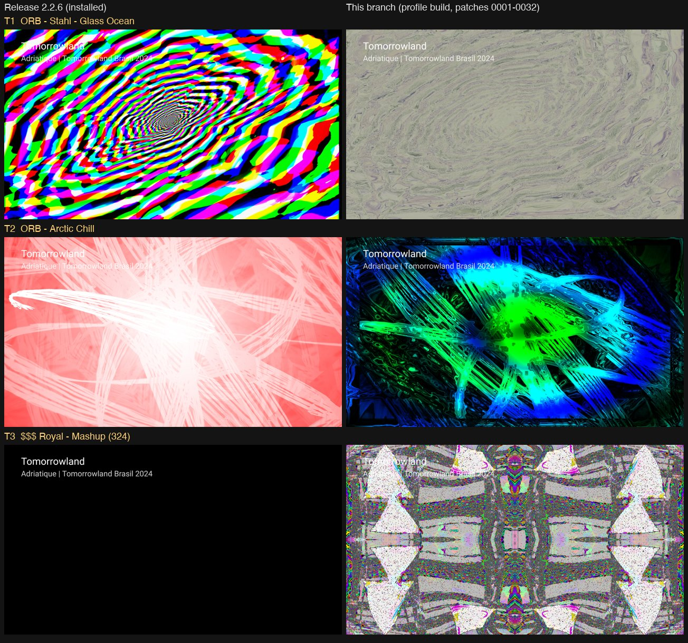

# Native shader translator fixes (patches 0030–0032)

Evidence for three projectM translator bugs that made bundled presets fall back to the default shader or read undefined values. Collected on 2026-10-04 against `main` at `4fc66208` (patches 0001–0029) and this branch (0001–0032).

| Patch | Bug | Example |
|---|---|---|
| 0030 | A shader that assigns to a uniform (`q18 = 1;` is `_qe.y = 1;`) wrote an uninitialized local copy, so the bank's other components and compound assignments (`time *= 0.4`) read undefined values | `$$$ Royal - Mashup (324)` |
| 0031 | Flat initializer lists such as `const float4 samples[5] = {...20 values...}` were emitted as one `vec4` constructor of 20 scalars, which GLSL rejects; global arrays were initialized as `samples[5] = ...` | `ORB - Stahl - Glass Ocean` |
| 0032 | `= sampler_state {...}` was removed only from the comment-stripped search copy, so `shader_body` was replaced at a shifted position in the real source | `ORB - Arctic Chill` |

## Bundled-preset translation (all 9,606 presets)

Every preset was loaded once through the patched engine (host build, macOS OpenGL 3.2 core). A scratch hook in `MilkdropShader::TranspileHLSLShader` (`scripts/dump-instrumentation.diff`) saved the exact HLSL handed to the parser for every attempt; a second attempt for the same shader means the authored shader failed and the fallback was compiled. That gives 15,576 authored warp/composite shaders per state. Each authored source was then translated with the hlslparser of that state for **GLSL ES 3.00** (the Android target) and compiled with `glslangValidator -S frag`.

| | main (0001–0029) | this branch (0001–0032) |
|---|---:|---:|
| Authored shaders that compile as GLSL ES 3.00 | 15,245 | 15,347 |
| HLSL parse failures | 258 | 210 |
| Rejected by the GLSL ES compiler | 65 | 11 |
| Generator errors | 8 | 8 |
| Engine fallbacks on desktop GL (composite and warp retranslations) | 225 | 130 |

102 shaders compile only with the branch and none the other way round ([newly-compiling-gles300.tsv](newly-compiling-gles300.tsv)); 95 fewer fallbacks on the desktop engine and none new. All 102 belong to the presets listed for T1 and T2 in the handoff document. Desktop fallbacks undercount warp shaders: the warp pass falls back without a second translation, so the GLSL ES column is the comparable measure.

Against the handoff lists (source hashes of all listed presets matched):

- **T1 (56 presets):** 54 compile with the branch. `ORB - Stahl - Tantalum Gran random tex …` still fails to parse (`sampler_rand01` undeclared, a random-texture issue); `sonar cow.milk` never reaches shader translation.
- **T2 (51 presets):** 48 compile. The two `EoS - glowsticks … dictatutorial rt roam3` presets and `midgitstraights of majillaen - featy sweet` still fail to parse (`sampler_rand00` undeclared).
- **T3 (23 presets):** compile results are unchanged (22 compile; `EVET - Spiracology 2` is rejected by GLSL ES for an unrelated int/float operand). With main, 426 translated shaders declared an uninitialized uniform copy; with the branch none does — every copy is initialized from the uniform at the start of `main()`.

## AM6 (Ugoos AM6, Mali-G52 MP6, Android 9)

Release 2.2.6 (installed, versionCode 44) against the branch's profile build (`nl.neerdael.projectmtv.profile`), each preset pinned with `debug.projectmtv.preset`, music playing in SmartTube (audio level 0.11–0.49 in `VisualizerRenderer: STATS`), screenshot 18 s after launch. Logcat confirmed the pinned preset loaded in every capture. The release frames for T1 and T2 are consistent with the fallback composite shader (offline, these shaders fail to translate with main), and the T3 preset stays black; with the branch each preset renders its own composite shader. Frame rates are not comparable: the release app keeps the owner's settings (full frame rate), the profile build uses defaults (half rate). No MilkDrop reference capture exists, so these images show that the authored shaders run, not that they match MilkDrop pixel for pixel.

## Reproducing

The scripts were run from a session scratch directory; adjust the hard-coded paths.

- `scripts/ScratchCorpusDump.cpp`: a GTest (added temporarily to `projectM-unittest`) that loads every preset in `$PM_CORPUS_DIR` under a CGL context, with `PM_DUMP_HLSL_DIR` set for the hook.
- `scripts/dump-both.sh`: builds and dumps the branch and the 0001–0029 baseline.
- `scripts/translate.cpp`: translates each dumped source to GLSL ES 3.00; built once against each state's `vendor/hlslparser/src`.
- `scripts/compare_dumps.py`: fallback and `glslangValidator` comparison.
