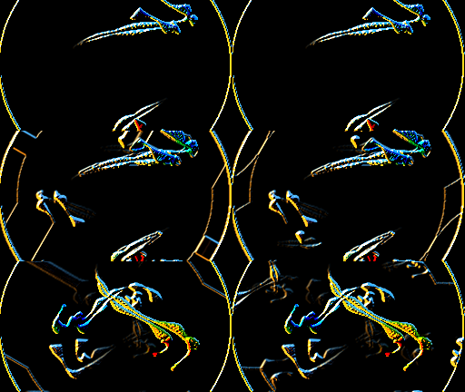
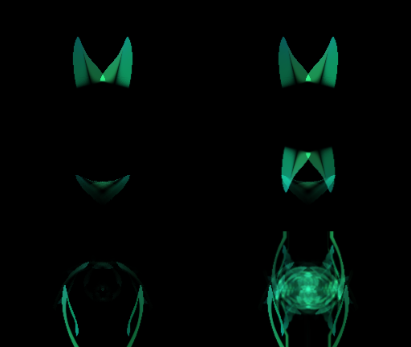
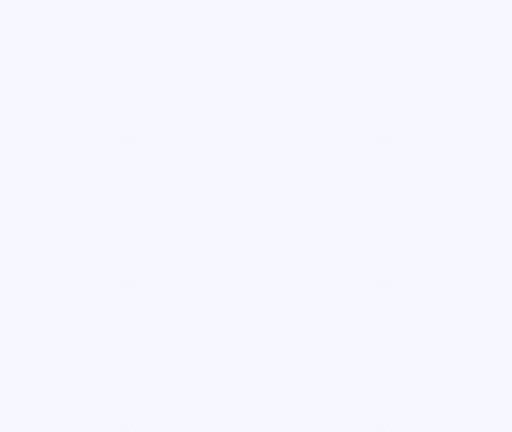

# Predictor-established engine corrections

Three native changes repair the handoff reports dated 2026-10-06. Authored preset bytes, public Java/JNI APIs and routine release version inputs are unchanged. Patches 0045–0047 are local ProjectM TV corrections against upstream 4.1.7 plus the earlier series.

| Defect | Production repair | Direct Android evidence |
|---|---|---|
| Main-textured shapes inherit an unrelated sampler | Instance-owned repeat/linear sampler at every fill; named-image descriptors retain their requested modes | Exact `widest swing.milk`: effective clamp/linear becomes repeat/linear at all three observed draws |
| Blur safety guard collapses the interval | Expand maxima upward; share progressive float32 coefficient calculation and default an unsupported triplet to `[0,1]` | Exact Flexi edit4b: actual horizontal normalization changes from `+Inf/-Inf` to finite scale `10.0000038` and bias `-9.5000038` |
| Negative motion zoom with unit zoom exponent | Use the signed zoom directly in the shared warp vertex source; other power paths remain unchanged | Exact Hexcollie stripped: actual input zoom is negative and exponent is 1; 3,234 NaN UV components per frame become finite, matching signed CPU UVs within `1.12e-7` |

The blur typo also exists in the inspected MilkDrop3 reference; its repair is not an upstream backport. MilkDrop3 restores linear/repeat sampling before custom shapes, and its CPU `powf` preserves the negative base at exponent 1. Khronos documents [sampler-object precedence](https://raw.githubusercontent.com/KhronosGroup/OpenGL-Refpages/main/es3.0/glBindSampler.xml) and the [undefined negative-base GLSL power domain](https://raw.githubusercontent.com/KhronosGroup/OpenGL-Refpages/main/es3.0/pow.xml).

## Matched actual-AAR observations

[Android summary](android-summary.json) records published 2.3.8 AAR/native hashes, the unpublished candidate release AAR/native hashes, PCM/clock/helper identities, effective sampler state, uniform bit patterns, UV counts, source hashes and selected full-frame statistics. Capture scope: a task-owned API36 ARM64 TV emulator, Google GLES3 translator on Apple M4 Pro, 256×144, 48×32 mesh, 30 Hz and 60 frames. Standard Native trails is inactive at this height. Three-frame state observers are checked against plain captures, and the three-frame prefix matches the 60-frame capture. They do not establish 4K Native-trails appearance.

The published AAR and native library are byte-identical to the handoff. The UV observer adds transform-feedback output to the original program at link time, then replays that same active program with its actual VBO/uniforms as points under rasterizer discard before the original indexed draw. It observes downstream UVs, not exported intermediate powers. Blur observers query uniforms/read pixels and restore state; shape observers only query state. Original final pixels are bit-identical between plain and observed runs for every before/after case.

The host logs an initial `GL_INVALID_OPERATION` before binding the capture framebuffer in most plain and observed runs. Its origin remains unlocalized. The host records and consumes this error separately; post-bind/readback errors and later-frame pre-bind errors are zero. This is a capture limitation, not a claim of universally error-free AAR rendering.

Candidate provenance uses a committed base plus the task patch bytes. Final patch text removes trailing spaces on blank context lines only; applied source hashes identify unchanged production code independently of that text normalization. Historical build patch hashes are preserved alongside final patch hashes. Artifact/source identities must be refreshed if production code changes after these captures.

Before is left, candidate is right; rows are frames 1, 2 and 59:

| Shape sampler | Signed zoom | Blur bounds |
|---|---|---|
|  |  |  |

The Hexcollie reflected history returns after the first frame. Shape feedback changes as its requested repeat sampling takes effect. Their before/after RGB differences measure change, not Windows accuracy. The exact Flexi blur witness is pixel-identical over all 60 frames even though raw normalization is repaired: its decoded getter masks the old interval defect. Synthetic raw-bank controls are therefore required alongside getter checks.

[Nine candidate controls](nine-candidates.json) preserve hashes, successful three-frame load/render results and actual blur uniforms. Eight candidates have observed nonfinite normalization before repair and none afterward. EVET Scanazoic is the negative control: its statically suspicious level does not produce an observed invalid used normalizer. Observations are capped at 12 blur passes per run and do not certify nine visible defects.

## Regression checks

- `tools/check-patch-series.sh`: all 47 patches apply to the pinned recursive source.
- `tools/projectm-host-tests.sh`: 261/261 pass, with FLEX/BISON discovery disabled in the host cache to match Android's pre-generated parser.
- `core/src/test/native/run_native_tests.sh`: engine/Native policy assertions and all 23 projectM controls pass with ASan/UBSan on macOS. The separate EGL transition-overlay control is skipped locally because EGL/GLES development libraries are unavailable; Linux CI runs it.
- `shape-sampler-regressions`: actual draw observation and asymmetric 2×2 bilinear oracle; five inherited sampler states, wrap0/1, multiple shapes/instances, preceding untextured draws, named fw/fc/pw/pc modes, independent contexts, and lexical blur timing versus actual allocation. `shape-sampler-preset` checks the unchanged hash-pinned widest witness.
- `blur-range-regressions`: production bounds/coefficient producer; equal, narrow, reversed, nested, float32 threshold neighbors, extreme finite, nonfinite, narrowing overflow, and progressive-cancellation inputs. `blur-range-render` checks level1/2/3 getters and raw banks, then nine hash-pinned candidates. Existing SOIL JPEG signed-shift UBSan diagnostics were independently reproduced by decoding `cells.jpg` without blur code; no decoder change is included.
- `warp-zoom-regressions`: transform-feedback UVs from the actual production vertex file, linked to both legacy/custom interfaces; 40 controls each cover signed zoom fields and ordinary positive/unit/nonunit zoom with stretch, warp, rotation and translation. Negative nonunit power domains remain outside the repair.
- `./gradlew testDebugUnitTest`: 84 JVM tests pass. Debug and release APK/AAR builds pass; profile builds use separate IDs for device checks. GLSL ES3.00 warp vertex/fragment linkage passes `glslangValidator -l`.
- `build/docs-env/bin/mkdocs build --strict`: guide builds without warnings. README, guide sources, architecture, attribution, contributor guidance, release instructions, PR template and other Markdown inventory were evaluated; relevant behavior/test guidance is updated.

## Limits and predictor identity handoff

Host/emulator controls do not establish Windows appearance, every GPU, full-corpus behavior or performance improvement. Physical-TV observations and final publication are separate gates. Keep old 2.3.8/2.3.10 identities and their inherited sampler/collapsed-blur/undefined-power policies frozen. A new published engine identity must select explicit repeat/linear shapes, separated/coherent safe blur bounds and signed negative unit-exponent zoom; never reuse an old observed sampler or undefined-coordinate policy under new hashes. The source-only forecast implementation lives in the separate predictor PR and is not modified by this native repair.
