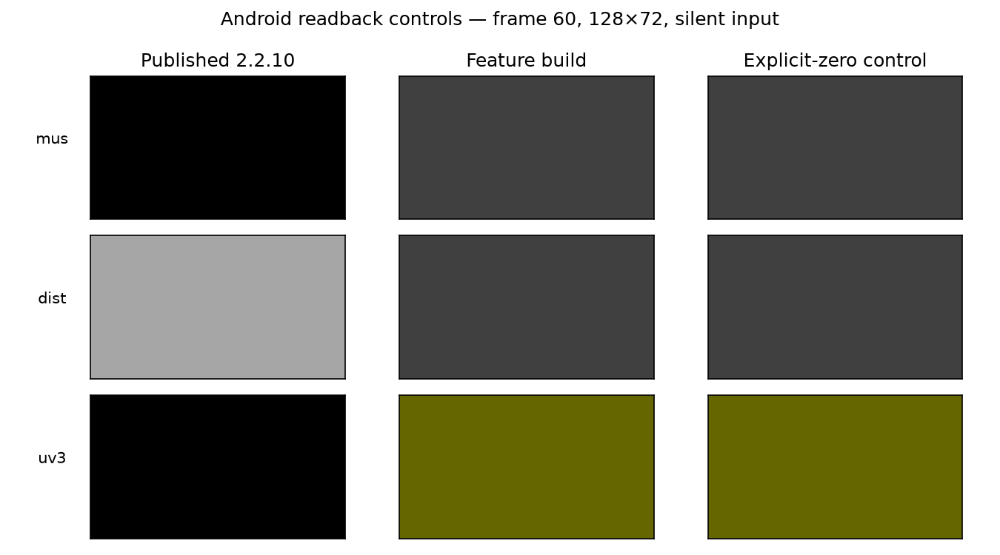

# Shader initialization evidence

The dedicated `feat/shader-initialization` branch extracts the bounded-selector
proof from PR #25 and fixes three implicit external shader inputs. Authored presets
are unchanged. The four exact source hashes are in the native initialization manifest
and analyzer fixture.

## Root cause and target policy

Legacy Microsoft compilation reflects `mus`, `dist_c` and `uv3` as external
constants with no source default. The old core emits ordinary uninitialized GLSL
globals. The fix preserves scalar/vector float globals without an initializer as
uniform inputs, then reuses the existing initialized invocation copy for writes.
GLES initializes unbound uniforms to zero at program link. Locals and explicit
static/const/initialized storage retain their rules; a later assignment does not
move before an earlier read. This defines core behavior without claiming parity
with arbitrary D3D9 device register history.

The ludicrous-speed equation proof establishes post-frame q29 in0..7 and the
shader proof establishes selector0..3. Missing cases, changed recurrences, invalid
conversions and mutation cannot borrow the proof. Runtime scalar/grid guards retain
its premise. Imported analysis is limited to source audit/evaluation; scoring and
visual-pipeline/review-APK features remain outside this branch.

## Bounded Android controls

`android-controls.json` pins the baseline AAR/native library, feature AAR/native
library, runner/clock-adapter hashes, each source and output hash, and driver metadata.
The baseline is published core2.2.10 at8b706203. The feature control uses the exact
local Debug AAR built from this branch's native changes. This is a separate,
task-owned API34 ARM64 emulator; no existing TV, running emulator or saved corpus
measurement was modified.

Each control runs60RGB8/RGBA8 readbacks at128x72,30fps, mesh48x32, explicit silence
and an instrumented deterministic clock. The core binaries themselves are unchanged
by the instrumentation. These are finite numerical controls, not whole-preset
appearance certification or TV fps measurements.

| Input | Baseline implicit, final RGBA | Fixed implicit, final RGBA | Explicit-zero control |
|---|---|---|---|
| mus |0,0,0,255|64,64,64,255|64,64,64,255|
| dist_c |166,166,166,255|64,64,64,255|64,64,64,255|
| uv3 |0,0,0,255|102,102,0,255|102,102,0,255|

All60frames of each fixed implicit case exactly match its explicit-zero control.
All60frames of the explicit nonzero initializer controls match baseline and fixed
builds. Separate native driver tests supply nonzero uniforms through the GL API and
verify that writable copies preserve those inputs and reset each invocation.

## Validation and limits

Native tests compile the exact four authored shader sections directly; exceptions
fail instead of being accepted through fallback. Both parser and initialization
witness hashes are checked when each CTest runs. Native numerical controls cover
read-only/first-read/self-read globals, helper sharing, mixed declarations in both
orders, and local/static/initialized controls. Android/JVM and source-analysis
checks are recorded in the PR.

The original315-source recheck with fresh reader/translator bodies retains3random-
sampler diagnostic gaps under the historical binding context. The16parser gaps
were cleared by main's separately merged PR #29 and must not be attributed to this
initialization change. These counts measure source parsing/lowering, not visual
prediction success. Raw sources, translator outputs, rows and captures remain under
ignored `build/`; committed reports retain hashes and scope.
