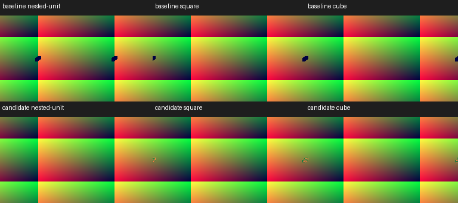

# Tulip negative-power investigation

Research on 2026-10-08 preserves `idiot - Great Tulip Majesty (txtr wrap).milk`,
SHA256 `c897d68693aab8c505d7cf4ea93047ca160b296691936ef712314364e3cc4879`.
Its fractional negative powers remain an unresolved appearance domain. Related
controls establish a native compatibility defect for **defined integer nested
powers**, corrected by patch 0015. The original Tulip's 30 captured frames are
byte-identical before and after that correction on the tested backend.

## MilkDrop2 comparison

The requested `../milkdrop2` checkout is `f05b0d811a87a17c4624170c26c93bac39b05bde`.
Its entire `src/vis_milk2/milkdropfs.cpp` is byte-identical to the original 2.25c
`vis_milk2/milkdropfs.cpp` (SHA256
`68749d31bb6b3020ca89b1e7630fd704e58a5de8dd6275c9f5ea005c6586a7d9`).

At line 1877 MilkDrop computes
`powf(fZoom, powf(fZoomExp, radius * 2.0f - 1.0f))` after converting evaluated
parameters to float. Lines 1880–1938 propagate the result through reciprocal zoom,
stretch, warp, rotation and translation into the vertex UVs. The triangle-list
submission copies these vertices without a finite-value repair; its optional
culling concerns transition alpha, not invalid UVs. No custom `_matherr` handler
was found in the inspected source tree.

The reference supports finite negative bases raised to integer nested exponents.
GLSL ES `pow` has no defined negative-base domain, including integer exponents
([GLSL ES 3.00 §8.2](https://registry.khronos.org/OpenGL/specs/es/3.0/GLSL_ES_Specification_3.00.pdf)).
The old 0006 specialization covered authored `zoomExp == 1` only. It missed a
nested exponent of one produced by a different authored exponent, and squares
and cubes. An epsilon around one or an absolute-value substitution would change
authored mathematics and is not used.

## Frozen numerical probes

The original one-second mono transport PCM, clock, seed and 48×32 mesh are
retained. The copied frozen source model and hash-identified 13-patch equation
reader produce the emitted equation inputs; patches 0014 and 0015 do not change
EEL execution. This older reader identity is recorded separately from the current
published v2.3.25 AAR. The probe retains all 48,510 original vertices across 30
frames, plus seven named scalar controls, and preserves IEEE-754 bits in raw
files. Rotation/warp/stretch/translation are neutralized only in the separate UV
transport probe, not in the full-preset replay.

ARM64 Bionic executes the original CPU expression with float inputs, round to
nearest, `-O0 -ffp-contract=off -fno-builtin-powf`. This is not original Windows
CRT bit certification. The exact production vertex source is linked as GLSL ES
3.00 and measured through transform feedback. Separate mediump/highp scalar
programs expose the unmodified GLSL expression. The owned API34 emulator reports
Apple M4 Pro/GLES 3.0 and 23-bit mediump precision. All probe streams repeat
byte for byte.

| Control (`zoom=-.09`) | Nested exponent | CPU effective zoom | Baseline production UV | Corrected production UV |
|---|---:|---:|---|---|
| Authored exponent 1 | 1 | −.09 | finite, matching | finite, matching |
| Authored 1.0001, radius .5 | 1 | −.09 | NaN | finite, matching |
| Authored 2, radius 1 | 2 | .0081 | NaN | finite, matching |
| Authored 3, radius 1 | 3 | −.0007290001 | NaN | finite, matching |
| Authored 1.0001, radius .3 | nonintegral | NaN | NaN | NaN |

Positive and zero controls remain separate. For the **exact Tulip input**,
each of all 30 frames contains 33 CPU NaN effective zooms and 33 GPU NaN UV pairs,
before and after correction. The two globally unit nested exponents occur at
positive-zoom vertices. The original's negative vertices therefore do not provide
a finite source-only appearance interpretation.

## Interpolation and sampling

Separate 16×16 experiments transmit NaN/Inf coordinates, inspect fragment
`isnan`/`isinf`, then sample a known 4×4 RGBA8 texture. Finite coordinates return
the independently declared RGBA 60/60/37/255. One or two NaN triangle vertices
contaminate the interpolated UVs across that triangle on this backend.
With NaNs in both axes, repeat addressing returns 70/85/47/255; clamp returns
100/160/77/255. These observations repeat, but do **not** establish a portable
colour or original D3D9 sampler outcome. Invalid sampling is not assumed black.
The source predictor's `unresolved warp power domain` guard remains appropriate
for this fractional case; no full visual forecast or randomized streak credit
is assigned, and no shared/frozen run is changed.

## Repair and rendered controls

Patch 0015 computes negative effective zoom after the final per-pixel/per-frame
float conversion, following MilkDrop's CPU expression. It stores the result,
including NaN/Inf, in an instance-owned float buffer at attribute 9. Positive
zoom keeps its existing shader calculation. The prepared mesh reuses the buffer
without re-executing equations. Raw authored zoom/exponent fields are unchanged.
The additional buffer costs four bytes per vertex; nonunit negative vertices
require two CPU power calls. No frame-time or TV performance claim is made.

Three independently defined shader UV controls fail before and pass afterward.
The portable regression uses binary-exact zoom −.5 and positions .25/.125;
its nested-unit/square/cube UVs remain exact through binary16 transport. The
separate ARM research probes above retain zoom −.09 and their full IEEE records.
Linux CI exposed the original fixture's unsuitable fixed absolute tolerance for
UV magnitudes near205: mediump results19.0156/−205.375/−136.625 differed from
32-bit references19.0185/−205.261/−136.674. The tolerance remains .002; test
inputs now isolate domain correctness from precision loss at large coordinates.
Local Linux Mesa and macOS pass, and the old shader still fails all three cases.
No production precision or arithmetic change was made for this fixture repair.
Integrated real-mesh controls check emitted values, NaN preservation, per-frame
and per-pixel equations, legacy/custom programs, resize and prepared replay.
Separately named diagnostic presets make every vertex a valid negative-power
case and visualize UVs; blue 64 throughout proves the requested warp/composite
programs remain active. They preserve the same audio, dimensions, mesh and clock.

The unchanged original plus cold repeat is replayed through the full published
v2.3.25 AAR and candidate JNI. All original RGB bytes match, SHA256
`6470e6683ab028ad24261588b76f3f59f77b1b07e3c65fe3e6bdd4e726a9b723`.
Both artifacts retain all 9,691 asset entries byte for byte. Baseline AAR SHA256:
`f9c920b76a616a24b6754d350db4eac73cd425aef4106474a3dadea3df4579c3`.
Local candidate AAR SHA256:
`ba0c04ac1a6330810559f179aa68b97b5bcc628cb1b85cd6826abae3f278829e`.

Normal and ASan/UBSan renderer suites pass 37/37 controls each; both-ABI release
core/APK builds and 137 JVM tests pass. All 15 patches apply to a clean export.
The macOS runner skips its separate EGL/GLES transition-overlay test; Linux CI
remains a separate gate. 329 host controls, a fresh recursive both-ABI debug-core build and strict MkDocs
also pass. Final Codex review, CI, merge and publication remain separate gates.
No original Windows/D3DX GPU replay, physical-TV timing or full preset matrix
is claimed. See [results.json](results.json) for source identities, IEEE bits,
per-frame counts and artifact/capture hashes. Raw streams and probe/harness source
remain under the task worktree's `build/tulip/` and are not committed.
