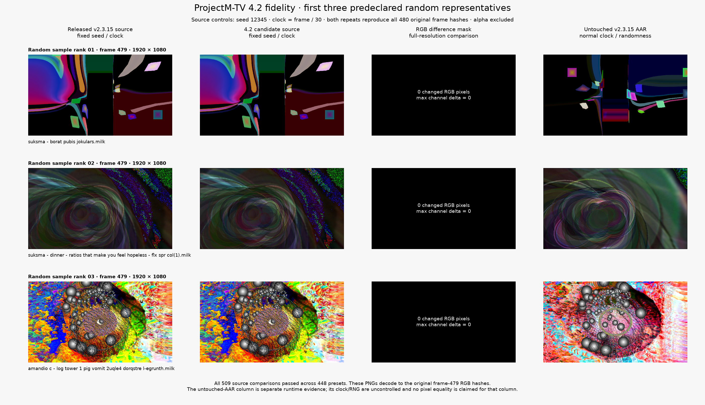
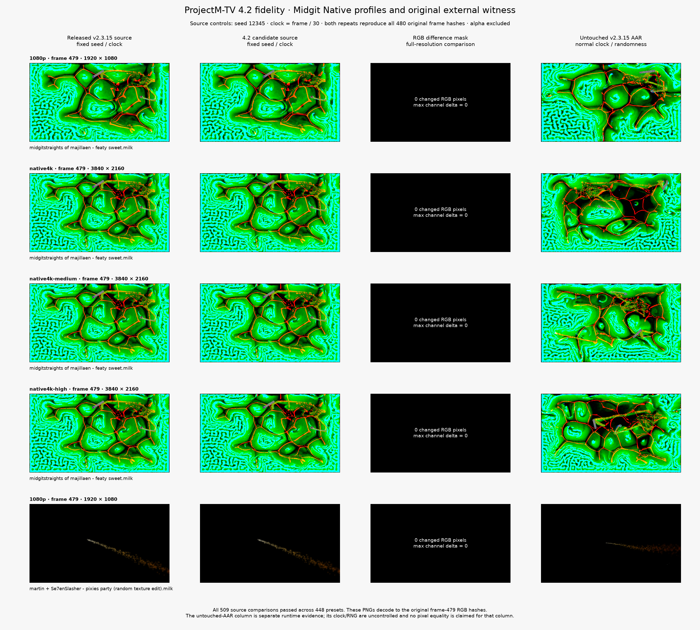

# Completed release-bound fidelity validation

Current integration update (2026-10-07): main PR #50 merged as `dd59a791` and published **v2.3.16**. Its verified unchanged AAR SHA256 is `08e5a1c9c3df1433407769ace6e8fc379566d50402258eef98fe948cb5f708cd`. Custom-pack app/JNI changes are being integrated; historical patch 0050 is ported as current 0010. The v2.3.15 matrix below remains an immutable completed checkpoint. It does not certify the new renderer or latest baseline; fresh source/runtime/image validation and final review/CI remain required.

Validated 2026-10-07 on the task-owned API34 ARM64 Android emulator with Apple M4 Pro host GPU acceleration, GLES 3.0 / GLSL ES 3.00. The user explicitly waived physical-TV validation for this migration. This is one backend's coverage, not a universal device or performance claim.

The baseline is the unchanged published **ProjectM-TV v2.3.15 AAR**, SHA256 `fa4bdd657a592b41eeef7d75c82982bf1fecf5404b99aba8ebba5c56f6a91327`, verified against the release digest/checksums, source `43023889ec38cf1250f3bfcaaf079a840acbdf76`, all 49 historical patches and the complete asset catalog. It is not stock libprojectM. Candidate renderer source is `c3872be3fec33318265172b5b41972aa9571efb7`, upstream `6f64807467e312034883a4389e6aa80a675458bc`, evaluator `22fb0cfd8f2dfbcd2b68f2443e7f44e19b32c09a`, with nine compatibility patches. Later task commits change documentation/evidence and historical comparison orchestration; production renderer files remain unchanged.

## Scope and results

| Check | Completed result |
|---|---|
| Preset selection | 100 unbiased random presets + 351 required bundled patch regressions − 4 overlaps = 447 bundled presets; one recovered external witness adds a supplemental preset |
| Profiles | 448 base 1080p cases + 61 source-bound 4K cases = 509 preset/profile comparisons |
| Fixed-seed source fidelity | 509 comparisons × two engines × two repeats = 2,036 runs; every full-resolution RGB frame 0–479 matches exactly across both engines and repeats |
| Recorded source frames | 977,280 full-frame RGB hashes; zero changed RGB frames; seed 12345, clock frame/30, identical frozen PCM and mesh 48×32 |
| Unchanged-AAR runtime | 509 runs / 244,320 frame hashes verified using production JNI and its normal uncontrolled clock/RNG; no deterministic pixel-equality claim for these runs |
| Positive image proof | All 48 predeclared source replays reproduce their original complete 480-frame streams; all 96 frame-120/479 PNGs decode to those recorded RGB hashes |
| Final gate | [summary.json](summary.json): `status=pass`, source equality, unchanged-release runtime and image proof complete; no failed, invalid or differing jobs |

The 4K additions are 17 owner controls at Standard/Medium/High, two further native issue witnesses at Standard, and eight additional historical q2160 cases at Standard (the ninth is already in the owner matrix). Standard 4K uses the frozen 1024×768 reference; Medium/High use 1280×720. Native Trails status and actual backend identity are checked for every run. Midgit passes 1080p and all three 4K profiles at every frame in both repeats.

The external `martin + Se7enSlasher - pixies party (random texture edit).milk` witness is a private supplemental APK asset overlay with a separately derived index. Its AAR/native bytes and all original presets/textures remain unchanged. It is excluded from the unchanged primary asset-bundle claim and is not shipped in the app/core assets. Original provenance/licensing is retained in the [regression inventory](../patch-regressions/README.md) and [third-party notices](../../../../THIRD_PARTY.md).

## Authentic images

The first two columns show fixed-seed source controls from the verified release source and 4.2. Their decoded full-resolution RGB pixels and all four original/replay streams match. The difference masks contain zero changed RGB pixels. The last column shows the untouched AAR in normal operation; its clock/RNG differ and that column has no pixel-equality claim. Display thumbnails do not replace the full-resolution hash comparisons.

Midgit is shown at 1080p and 4K Standard/Medium/High, followed by the exact recovered external witness. Each displayed source pair has zero changed RGB pixels and both repeats reproduce its original complete stream. The right column remains separately labelled uncontrolled released-AAR runtime evidence. [Exact figure/input identities](midgit-native-and-external-proof.json).

## Retained evidence

- [Source certificate](source-certificate.json): all 509 comparisons, all four run identities and stream/manifest/request/row digests; independently reverified from disk.
- [Released runtime certificate](released-runtime-certificate.json): all 509 original-AAR jobs and representative image identities; independently reverified from disk.
- [Image-proof certificate](positive-image-certificate.json): all 48 source replays, 96 PNG/RGB identities and original job keys.
- [Figure identities](random-three-proof.json): exact PNG inputs, decoded RGB digests and figure digest.
- [Readable protocol overview](protocol-overview.json), plus exact frozen [protocol](protocol.json.gz) and [selection](selection.json.gz) archives. Decompress with `gzip -dc`; the overview records both compressed and original file digests. Compression preserves the frozen bytes.

Protocol canonical SHA256: `7eaf62a6dba9804a31df9154208859845f663cb685d32728132682af8f7ddbb5`. Original protocol-file SHA256: `64a2ac7652e762bcd13cb5d7c8c657e828fa2d65517b60f013386db49f45679a`. The [runner and reproduction commands](../random-100/README.md) preserve the release, workers, catalog, PCM, profiles and helper hashes. Raw job hashes/PNGs, task binaries, audio and full build logs remain in ignored `build/upstream-rebase/random100-round2-final/`; absolute paths in the archived protocol refer to that producer workspace, not another machine's installation.

## Limits and remaining repository gates

RGB8 is compared; alpha is excluded. This certifies the declared seed, audio, frames, preset/profile union and API34 ARM64 GPU backend. It does not certify all 9,606 presets, other devices/ABIs, causal performance gains, universal GLES 3.0 float-framebuffer support or deterministic behavior of the shipping AAR. The complete patch series adds no GLES 3.2 runtime requirement on this backend; floating-color capabilities are required for Native UV storage and are advertised here.

Validation evidence is complete. Final-head GitHub Codex review, required reviewed-PR CI, merge, automatic publication and Milkbeat update are separate gates; this document does not claim those gates have completed.
