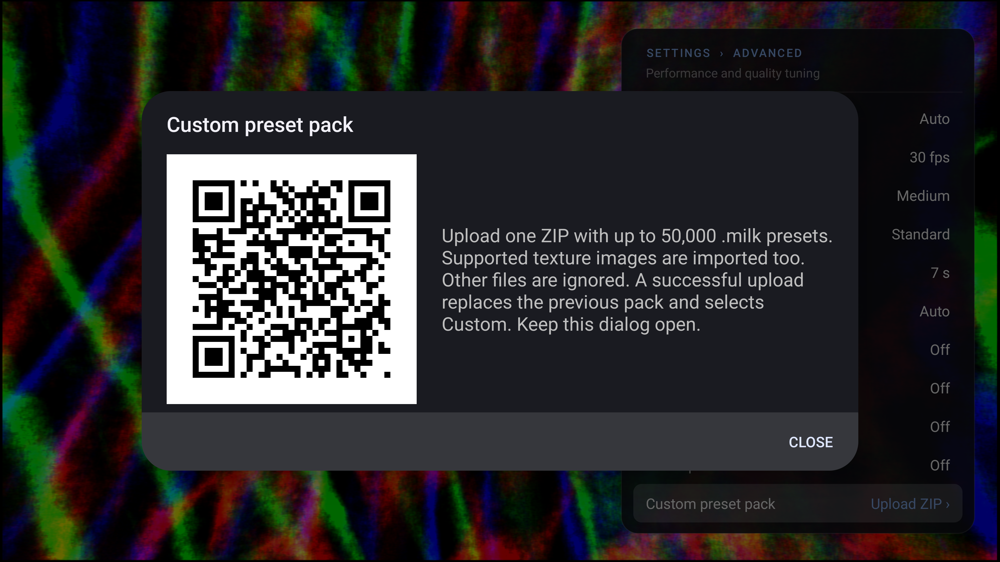

# Main PR #50 synchronization checkpoint

Main `dd59a791fd2af6b7ad2fffcb389e0bc178905959` is incorporated by migration `1f0a43df`. Historical 0050 is retained as 0010, preserving 4.2 shader-cache, frame-time and texture-callback interfaces. This baseline is unchanged published **ProjectM-TV v2.3.16**.

[Verified release manifest](verified-release.json) records all 50 ordered source patches, canonical/versioned AAR equality, GitHub digest/checksums and all 9,686 shipping assets (9,606 presets). AAR SHA256: `08e5a1c9c3df1433407769ace6e8fc379566d50402258eef98fe948cb5f708cd`.

## Completed checks

- Both ARM ABIs: debug/release core AAR and release APK builds pass. Debug JVM tests: 63 app + 71 core, no failures/errors/skips. Strict MkDocs passes.
- [31 ASan/UBSan real-GL controls](native-ctest.log.txt) and [31 normal controls](native-normal-ctest.log.txt) pass, including per-preset texture lookup, duplicate names, bundled fallback, reset/reload, interrupted fades, hard cuts and C API transition retirement. The new target explicitly links macOS OpenGL under the 4.2 dependency graph.
- Native engine/policy and real-JVM CheckJNI Unicode controls pass. The initial full runner stopped at the missing OpenGL link; its failed log is preserved locally. The subsequent complete CTest results cover the renderer suite.
- [Custom pack journey](pack-journey2.log.txt) passes on the task-owned API34 host-GPU emulator: D-pad, rendered QR decode, 50,000 nested presets with uploaded PNGs, replacement, rendering during import, category isolation, Random/Previous, invalid ZIP preservation and listener close. [Cold restart](pack-restart.log.txt) retains the pack, selection and rendered replacement image.
- The first UI attempt retained touch mode and never focused Advanced. The test now establishes keyboard mode and checks focus before remote activation. Product behavior is unchanged.

## Latest-baseline fidelity in progress

Six new private workers build and verify their AAR/APK payloads. Protocol `0e462a837e79c5e44bd2c2712bf12f565a6b1171ee16e62e6ee29fe1afa68305`, frozen in ignored `build/upstream-rebase/random100-main50-final/`, requires the same unbiased 100 random presets and original regression union: 448 unique presets, 509 profile cases, 2,036 fixed-seed source runs, 509 unchanged-AAR runtime runs and 48 image-proof replays. All source frames 0–479 use seed 12345 and frame/30 clock. Four initial source runs match exactly; this is not completion of the matrix. The driver stops on failures/differences and preserves evidence.

The [completed v2.3.15 matrix](../fidelity-final/README.md) is an immutable historical checkpoint and does not certify this renderer/latest baseline. Current-head review, CI, merge, publication and Milkbeat update remain separate gates. No full-catalog, other-device or performance claim.
