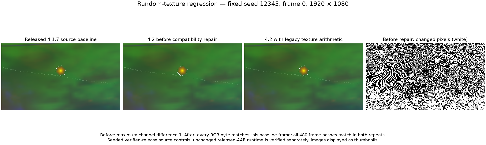

# User-texture compatibility repair

The baseline is the verified source of released ProjectM-TV v2.3.15 (`43023889`, official AAR SHA256 `fa4bdd657a592b41eeef7d75c82982bf1fecf5404b99aba8ebba5c56f6a91327`), with private seed/clock controls. This figure uses authentic GLES3.0 emulator captures from the unchanged `rand tritex - inv play` preset, seed12345, frame0 and1920×1080. It is a causal source comparison; unchanged released-AAR runtime remains a separate gate.

Before repair, both source roles repeated exactly but all480 RGB frame hashes differed. At frame0, maximum channel difference was1, RGB MAE0.198057 and1,101,827 pixels differed. The mask highlights every changed pixel rather than relying on visible differences between thumbnails.

The single native intervention restored the released loader's SOIL2 multiply-alpha arithmetic before the new stbi upload. With that change, all480 frame hashes match the baseline in both repeats. The corrected frame0 RGB bytes also match directly. Production patch0009 adds this compatibility behavior. An independently enumerated60-byte GPU upload regression fails before the repair and passes afterward; all30 native controls pass normally and with ASan/UBSan.

[Proof identities and metrics](proof.json) bind the original full-resolution PNG/RGB hashes, figure hash and diagnostic protocol. The full random-plus-regressions verification is still required; this repair does not certify untested presets, other inputs or devices.
