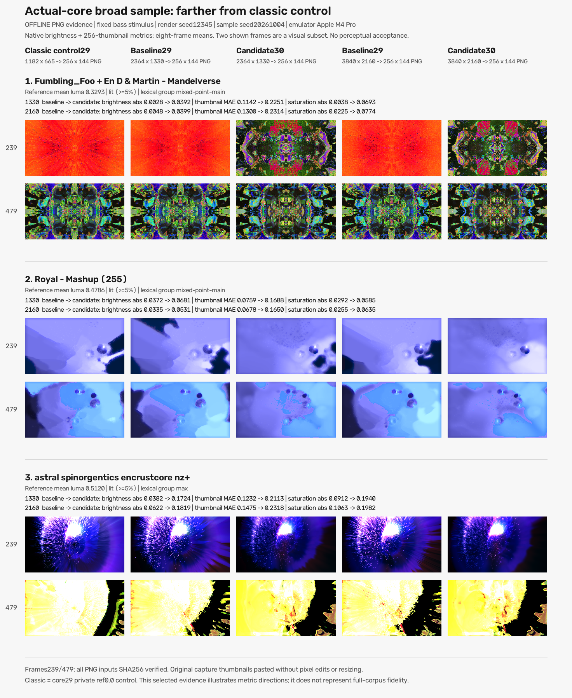
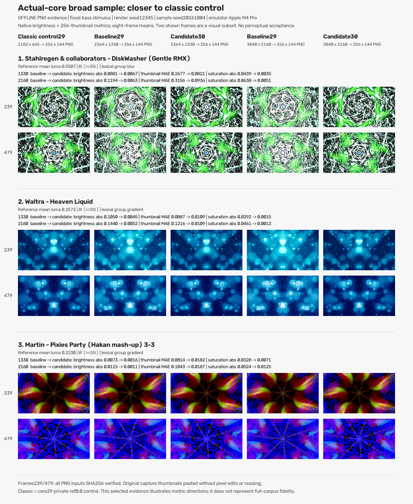
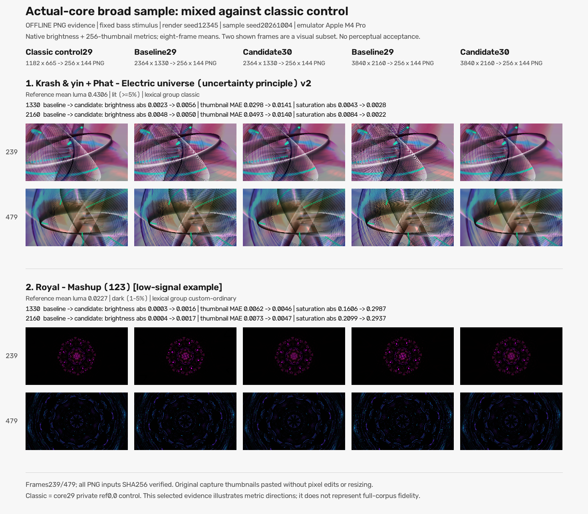

# Native 4K feedback fidelity: engineering handover

Snapshot: 2026-10-04. Audience: the next engineer reproducing and fixing the remaining renderer bugs.

## Outcome and immediate next action

The current Native/diffusion feature is **not merge-ready**. No feature PR has been created. Compilation, repeatability and component tests pass, but actual-core comparisons show both improvements and unresolved changes in brightness, colour and feedback structure. Fix the sampler contract first, then investigate the independent recurrence/filter defects; do not ship the private diagnostic as a general solution.

A controlled raw-point experiment substantially improves Mandelverse and Royal Mashup255. It leaves Royal191, Fed quadratrail and astral nz+ exactly unchanged against the placement-matched P1 control. Therefore there are multiple causes; point routing is one important defect, not a complete explanation.

Auto remains the default. Auto and numeric fixed modes stop at 1330p; explicit Native selects detected panel height only when the RAM limit permits it. **Compensation also runs in eligible presets at Auto at 1330**, because activation depends on reference-area scale, not on the Native UI choice. Do not restrict regression validation to2160p.

Read [AGENTS.md](../../../AGENTS.md), the [historical design](</Users/jneerdael/Scripts/Projectm-TV/docs/superpowers/specs/2026-10-03-native-4k-feedback-diffusion-design.md>), the [current validation ledger](../evidence/0025-feedback-diffusion/current-main-validation/README.md), and the raw-point analysis before editing. Preserve all historical result directories and worktrees.

## Repository, branch and source history

- Primary checkout: `/Users/jneerdael/Scripts/Projectm-TV`.
- Task worktree: `/Users/jneerdael/Scripts/Projectm-TV/.worktrees/native-feedback-recovery`.
- Branch: `feat/native-4k-feedback-recovery`; checkpoints are pushed through personal account `johnneerdael`.
- Git remote observed: `https://github.com/johnneerdael/projectm-android-tv`; README/release URLs use `johnneerdael/ProjectM-TV`. Verify GitHub's current repository metadata before PR operations.
- Branch head at this handover: `c247e94c1fb12471d75a800ee7f8610198f42bc5` (documentation/evidence checkpoint). This is not the candidate runtime source identity.

| Source | Full commit | Role |
| --- | --- | --- |
| Corrected merged main / PR23 | `0625587f12b9cd38c852e2517eb109b027fd6526` | Baseline29; patches0001–0029 |
| Current overwrite-fixed product candidate | `790aaa249d3cabe8e6ab01e5382e046d4b778252` | Candidate30; baseline prerequisites plus0030 |
| First current-main candidate epoch | `5c8b0a2748c88bbb8c95095c550b026c0ddd952f` | Earlier software/hardware pilot and first matrix; before overwrite fix |
| Exact original recovery | `cc3ca3448bc7cb6e16510f1fd123f63f81f1f561` | Historical recovered0025 implementation; not current thirty-patch identity |

The original active worktree was deleted with uncommitted work. Recovery preserved product code, but did not recover its original full raw measurement corpus. See [RECOVERY.md](../evidence/0025-feedback-diffusion/RECOVERY.md) and [NATIVE-4K-PROGRESS.md](../evidence/0025-feedback-diffusion/NATIVE-4K-PROGRESS.md). Old reported numbers are session records, not substituted raw evidence.

The branch incorporated PR23's sampler binding, diagnostics, fresh colour history/framebuffer ownership and per-frame parsing fixes. Diffusion moved from historical patch0025 to0030; prerequisite0025 now supplies shader-compilation cleanup. Compare to corrected baseline29 to attribute diffusion effects. The older baseline24 corpus cannot provide that causal comparison.

Never bump routine app release versions. Do not commit changes inside `third_party/projectm`; generate an ordered patch against the pinned engine plus prerequisites. Never remove any Git worktree unless explicitly asked, even after merge. Preserve unrelated changes, including the tracked generated `build/reports/problems/problems-report.html`.

## Device and process ownership

| Resource | Ownership / allowed use |
| --- | --- |
| `emulator-5580` and `.worktrees/quad-lines-follow-ups` | Corpus owner's environment. Do not restart, kill, reconfigure, install into, reset or otherwise alter it. Read already-produced receipts only. |
| `emulator-5582` | This task's targeted emulator. Raw-point lease is released and it is available for another owned targeted experiment. Verify launch identity and no active lease before any use. |
| Physical `192.168.51.53` | Sole approved physical TV. **Never remotely wake it.** Stop/defer when asleep; no wake key, HDMI-CEC or restart workaround. |
| Any other device | No authorization established. |

Owned launch metadata: `build/native-4k-current-main/emulator/launch.json`. AVD: `ProjectM_Native4K_API34_20261004`, under the task's `emulator/avds/` directory. Hardware epoch used `-port 5582`, host graphics, Vulkan disabled, 2 cores, 2048 MB, no window/audio/snapshot. Historical recorded PID 15197 is evidence, not permission to act on whichever process now has that PID.

Observed renderer: `Android Emulator OpenGL ES Translator (Apple M4 Pro)`. Earlier SwiftShader jobs are a separate software epoch. The emulator is not a Mali-G52 TV or SHIELD. Synthetic logical time does not measure achievable hardware FPS.

## Product behavior and code map

- App: framework Java/XML, package `com.example.projectm.visualizer`, installed ID `nl.neerdael.projectmtv`.
- Core API: `nl.neerdael.projectm.core`; `ProjectMCore.init`, `VisualizerView`, `VisualizerRenderer`, `ProjectMJNI`.
- Actual native units: `core/src/main/cpp/{native-lib.cpp,snapshot_fade.cpp,preset_prewarm.cpp}`.
- GL lifecycle calls run on the GL thread; other JNI requests queue atomics/mutex-protected audio/settings. Preserve this boundary.
- projectM: pinned v4.1.7, upstream commit `e0b0a967f0ffd7d332106c366668ed271718472b`, recursive projectm-eval, local ordered patch series.
- Core Android CMake statically links projectM into `libprojectmtv.so`; production ARMv7/ARM64 ABIs remain packaged.

`QualityController.NATIVE_HEIGHT=-1` is separate from Auto0 and numeric heights. Native is offered only when physical panel height exceeds1330 and enabled RAM limits permit the whole panel. Invalid saved Native uses Auto. Legacy numeric1440/2160 choices remain capped or fall back to Auto, never silently opt into Native.

RAM thresholds use reported MiB: under1600→1080p, under2600→1260p, under3600→1440p, otherwise no RAM cap. Disabling Memory limit removes only that RAM cap. Auto/numeric modes still cap at 1330. Native does not lower its surface for FPS or memory-pressure events; Auto transitions can still lower internal blend resolution. Skip-slow rules still apply to fixed modes.

### Current patch0030 algorithm

[0030-feedback-diffusion-compensation.patch](../../../tools/projectm-patches/0030-feedback-diffusion-compensation.patch) adds `FeedbackDiffusion.{cpp,hpp}`, renderer integration and tests. Product patch SHA256 at candidate790aaa24:

```text
aee139f8a33d4b495ac31a313a090bd7f42ff6be4dfbe99c376720a1d873daa3
```

For scale `s=max(1,sqrt(renderArea/referenceArea))`, requested added variance is `(s²-1)/6` render pixels² per axis, capped at 1.9. At variance ≤ 2/3, the shader averages three bilinear taps; above that it averages four symmetric diagonal taps. Weights sum to1. This is the uniform-average3/4-tap stencil, not the earlier nine-tap proof of concept or a phase-aware kernel.

Placement is hybrid. After motion vectors draw into the raw previous canvas, the filter substitutes the first y-flip before warp input (P1). Otherwise it substitutes the required final y-flip, supplies that filtered texture to compositing, and caches it as next frame's warp input (P2). Resize, initial-image seeding and scale/reference changes invalidate cached input.

The pass overwrites its target with blending disabled, uses a linear/clamp sampler, invalidates overwritten attachment contents, and caches uniform locations. A shader-compilation failure retains the ordinary copy path. No reference or render at/below reference area disables compensation. Minimum motion-vector length scales only while compensation is active.

Eligibility tokenizes source once at load. Recognized point-only feedback, explicit undisplaced `uv_orig` main reads and peak-plus-sharpen patterns are excluded. Mixed point/bilinear warps can remain eligible. This is a conservative syntactic gate, not a complete parser or semantic proof; it can miss aliases or exclude otherwise useful compensation. Skipping a warp leaves its original resolution dependence.

## The runtime is the real core boundary

These are **actual ProjectM TV core Android AARs**, loaded by Android Framework Instrumentation and exercised through public production JNI, not a stock/direct-libprojectM desktop worker. Both normal roles include the three production native units and complete packaged assets. Worker APKs contain the same native ELF bytes as their corresponding AARs.

The observers privately change RNG and time, and expose seed/clock/reference control. They are instrumented laboratory builds, not byte-identical shipping APK/AARs. They do not establish production RNG parity. Core and engine share one logical clock; `NowSeconds` and engine time must not diverge.

The true classic control is baseline29 with an intentional private `projectm_opengl_set_line_reference_size(...,0,0)` at 1182×665. This differs from the first matrix's1182×665 near-reference run, which retained normal1024×768 reference settings. Classic0 is the appropriate controlled authored-size comparator here, but one aspect ratio/device/seed is still not a universal fidelity oracle.

All laboratory roles currently use the dedicated package `nl.neerdael.projectmtv.corecorpus`, installed sequentially on the owned emulator. Do not install them over the production app or into the corpus owner's emulator. Earlier tools/docs with different package names describe other epochs.

### Artifact identities

Metadata includes full backend dictionaries: ordered patch names/hashes, original and instrumented core source hashes, harness source hashes, instrumentation diffs, assets, private modifications and native-library identity. Preserve dictionaries, not only these short role labels.

| Role | Worker metadata path from worktree root | ARM64 ELF SHA256 |
| --- | --- | --- |
| Baseline29 | `build/follow-ups/core-corpus/worker-baseline.json` | `8412ae670f8511c48b89b358d10dcc9fd81ec760353722d7cdfd86ea60efc5d2` |
| Candidate30 / fixed-P2 | `build/follow-ups/core-corpus/worker-candidate.json` | `f902758cf2146bc8e0cd9cfd68125414c7ebc2d3a3c6dd317d9f66cbd80d5be2` |
| Classic29 ref0 | `build/native-4k-current-main/classic-reference-control/worker-baseline.json` | `5799cb91efd021a9040537a6964245ed3ac31b2e01919820ef98618b76d2c9dc` |
| P1-only diagnostic | `build/native-4k-current-main/p1-experiment/worker-candidate.json` | `b0b8ffdee688ce1c69a3b2cbd40905898821c573954ab98394c53e892629dd31` |
| Raw-point/P1 diagnostic | `build/native-4k-current-main/raw-point-experiment/worker-candidate.json` | `ee9c8bae0b7987071ef3db8b8ac85b27fc0a5e605ba6e0b4efe4db61c2cf4d04` |

| Role | APK SHA256 | AAR SHA256 |
| --- | --- | --- |
| Baseline29 | `fcede0eae549e1a93fb914e9cd2484713d3c55911f40cc5239dc4cd768eaf198` | `8a09eb5655eda7223790d2216782168bd30491a5a4c1af50e88c3ce5134553e4` |
| Candidate30 fixed | `bd54359c26e61badb34758518662ad03723c32962a1fe57dbb9300b1f4f3b30c` | `dc3c4007e74d30617eded85195d0a17a9cbe903873a57e88d4727330bcc0a8d5` |
| Classic29 ref0 | `c0c2fc7c3da96c2a36ac3a29ea0cb56524d0759202f787ad8def513ead4663fd` | `967fea0657c8174296da3333f9be5a83b7346ed448cca40070ee472c98350583` |
| P1-only | `1c41464200c12febf5883ceea0cc8307580003edf6cda3eb934094402cfd28ac` | `7ade259eafdadb7884028c56b5fbd6c002f735ba5bfa181554518fa1b4db6375` |
| Raw-point/P1 | `946d4f02ee5e487eb224d2d792a6722938243b666f9f4890df123dc4b0089ad7` | `9c85538a686d39729762880086439777cffa3dbdfd68979be110c37743fe3500` |

The first [actual-aar-proof.json](../evidence/0025-feedback-diffusion/current-main-validation/actual-aar-proof.json) describes candidate5c8b0a27; do not mistake its old candidate hashes for790aaa24. Current fixed/P1/raw/classic AAR/APK checks, metadata hashes and compile-command hashes are in `build/native-4k-current-main/raw-point-controls/artifact-proof.json`. [raw-point-worker.json](../evidence/0025-feedback-diffusion/current-main-validation/raw-point-worker.json) and [raw-point-build-verification.json](../evidence/0025-feedback-diffusion/current-main-validation/raw-point-build-verification.json) preserve the private build identity.

Canonical broader provenance is `broad-sample/source-identity-backup/`, including frozen worker dictionaries, provider/adapter sources, production core source and preset bytes. `final-results-manifest.json` inventories all retained results; `independent-final-audit.json` verifies runtime identity, protocol/payload/file hashes, audio, geometry and frame traces. Raw controls additionally have `source-results-manifest.json`, `reuse-index.json` and `post-run-audit.json`.

### Common inputs and timing

- Seed: 12345; frame time=`(frame+1)/30.0`; each job starts a fresh process/core/context.
- 480 frames/job:120 warm-up frames plus360 measured frames, i.e.4s warm-up plus12s measurement.
- Selected captures:120,150,180,210,239,300,390,479. Earlier window uses the first five;12s summaries here use all eight, unless a historical protocol says otherwise.
- Full input:1470 unsigned 8-bit mono samples per frame. Production `addWaveform` preserves its normal latest576-sample tail. Do not feed only576 while claiming matching full1470 input; that changes the source waveform identity.
- 480-frame PCM:705600bytes, SHA256 `14a59e75249dee0dd15d74487688c248c6a4a4b24a843b6d6f612ccc5c408dbc`.
- 240-frame PCM:352800bytes, SHA256 `38a09d906e93452d4af5ebea36fcdc684a8383eacbd162d2d61b4ed3fbd2674c`.
- Signal files are under the relevant work's `signals/`, originally validated against `targeted-matrix/signals/`. Preserve those actual bytes instead of regenerating a vaguely similar beat.
- Pin exactly the requested preset; full-index/skip-mask checks verify the requested name through all480 frames. Prewarm is paused through actual `onMemoryPressure` for 20 logical seconds; this 16 s job remains within that pause.

| Protocol | Digest stored in protocol.json |
| --- | --- |
| Broad1330 | `cf63808aab7a1b78582372a0e68467273b7fa5484c26919ec702920fd1f48c8f` |
| Broad2160 | `23bf17637dbef31bdb1ad7f988fb6907d6482fd805f8248367a7fff5af05b92a` |
| Broad classic0 | `2beb6052e81d200667618c150338b4d78c42c131ad405c2e4ad19e17ccbcd0d9` |
| Raw1330 | `c161c67e405f57310229e8d38e993768a6d4d21ed463e1b54a054f0a2094f19e` |
| Raw2160 | `c1c2b4fb5453cf146184ddd85e66e29843545c8de4199c422400ad2e1f73f1f3` |
| Raw classic0 | `32f621456a5611c667f147c994b7fed10e1949a7cbcc6aec9d645d20714d3af6` |

These are canonical protocol-object digests, not necessarily SHA256 of pretty-printed JSON bytes. Provider SHA256: `a29c40ba919487f0fd748c0fc50421346c85983ce40b2711897a2a14766801a7`. Selection digest: `5dd15e070ebf11f5e695ff43496fe3ecd27e5476ce6110be7a16978e8f636aab`.

## Completed broader screen and its limits

The frozen64-case selection uses5114 source-hash-verified successful old baseline24 receipts. Old pixels/metrics are **not** reused as baseline29/candidate30 results. The owner corpus was partial; it is neither all 9,606 presets nor a random sample of every success/failure.

Selection seed20261004, approximate filename families and lexical warp-source groups diversify the sample. Chosen counts: classic9, custom-ordinary9, main-only9, point8, mixed-point-main8, blur8, max8, gradient5. The four previously targeted presets were excluded. Success filtering, incomplete owner coverage, equal stratum quotas, coarse alias-insensitive classification and approximate families all bias selection. Source labels are not causal mechanisms or fidelity predictions.

512 new baseline/candidate jobs plus128 classic-reference jobs completed: **640 successes,640 distinct PIDs,307200 traced frames,5120 selected-native hashes**. All selected-frame repeat pairs are exact. Broad retention has8320 checked files /273577547bytes and **zero full RGB captures**; it retains256×144 lossless thumbnails, native brightness/RGB/clip/black metrics and native frame hashes. Unread/unretained frames are not pixel-hashed.

| Profile | Closer | Farther | Mixed | Tie |
| --- | ---: | ---: | ---: | ---: |
|1330 |29 |13 |12 |10 |
|2160 |30 |12 |12 |10 |

Classification compares candidate and baseline distance to classic0 using arithmetic means of eight per-frame native-luma absolute errors and256×144 RGB thumbnail MAEs. Both primary metrics must improve or be nonopposing for “closer”; opposing directions are “mixed”; numerical equality within1e-9 gives “tie”. There is **no perceptual acceptance tolerance**. A higher/lower global mean can hide regional or temporal defects.

At2160,41 cases improve thumbnail MAE but only31 improve native-luma error. Mean error reductions therefore cannot erase the12 farther /12 mixed cases. Across both sizes,108 candidate/baseline preset-profiles change and20 are selected-frame identical; brightness shifts include12 darkened>5percentage points. This is a bug triage screen, not historical1182-image MAE, a full-corpus rate, a TV FPS measurement or proof of authored fidelity.

Offline [visual review assessment](../../../build/native-4k-current-main/broad-sample/visual-review/assessment.json) uses eight illustrative cases. Sheets show unchanged256×144 thumbnail pixels at frames239/479; summary metrics still average all eight captures. No gamma/contrast enhancement or resizing was applied. Royal123 is a dark-reference mixed control; low signal requires particular care.







The sheets originate at `build/native-4k-current-main/broad-sample/visual-review/`. Publication owner must preserve the PNGs and their `manifest.json` / `assessment.json` at the linked evidence destination. Their selection intentionally illustrates extremes and disagreements, not prevalence.

## Raw point-sampler diagnostic: what it establishes

The controlled experiment has84 logical slots:60 newly rendered jobs plus24 exactly compatible reused placement rows. Audit verifies42 fresh-process repeat pairs and672 retained native RGB captures; all12 preset/size cases succeed and repeat exactly. Reuse is receipt-checked against APK/core/observer/source/PCM/size/frames/GPU, not inferred from filenames. Follow `reuse-index.json` to original placement row paths.

Six source presets, never rewritten:

| Preset filename | Bytes | SHA256 |
| --- | ---: | --- |
| `$$$ Royal - Mashup (191).milk` |5858 | `d1c0d1554cdda7e9e7add156ff94bc76de147fdc699afa5036e994a83f2615fe` |
| `Fumbling_Foo & Flexi, Martin, Orb - Acid Mandala v1c.milk` |24396 | `163034eb002666dfd1966444dedd1a47853131e915a5cb2745bd09ff52a4e230` |
| `Fed - quadratrail.milk` |5934 | `2bdf01d1500258f71d077e5fb225d5e4be97f9b15a1af48b5705ff61982104d0` |
| `Fumbling_Foo + En D & Martin - Mandelverse.milk` |21055 | `e67d288f3c6bd0957a2dc9ce10ae5c4639e15db29827e761331e2abd46319eb6` |
| `$$$ Royal - Mashup (255).milk` |10867 | `4994529a1dfd4081c92b99a90960c264a727e2c49257604137455546085137bd` |
| `astral spinorgentics encrustcore nz+.milk` |22132 | `e94d07220b1e2dcde7279449639d19ec1ebda39a4e90a17b15f4b405a4574dfb` |

Roles: classic29 ref0 at 1182×665; fixed candidate hybrid; P1-only candidate; raw-point/P1 candidate, each twice. Diagnostic raw-point **keeps P1 placement** and additionally routes actual WarpShader descriptor samplers whose `FilterMode()==GL_NEAREST` to an unfiltered y-flipped previous texture. Other descriptors retain the filtered main input. This catches aliases by bound sampler mode instead of lexical names.

It stores a weak raw texture reference in `PresetState`, reuses the existing CopyTexture framebuffer/final flip, and refreshes raw input after first frame, resize, invalidation or motion-vector drawing. Blur source/timing remain unchanged. The private patch and source dictionaries record the exact modification. It is not shipping-byte identity and is not integrated into product patch0030.

### Placement-matched2160 results against true classic0

Metrics below use native brightness and **1182×665 area-reduced raw RGB MAE**, averaged over eight selected frames in the12s window. They cannot be substituted into the broad256×144 screen's aggregates.

| Preset | P1 image MAE → raw-point | P1 luma ratio → raw-point | Interpretation |
| --- | --- | --- | --- |
| Mandelverse |0.232887→0.126945 |0.876307→1.035145 | Large routing-related improvement; still substantial image error |
| Royal255 |0.164935→0.091703 |0.952404→0.957718 | Image structure improves; brightness alone did not reveal the defect |
| Acid Mandala |0.046319→0.043111 |0.915554→0.932142 | Modest improvement; remaining centre/colour error |
| Royal191 |0.022558→0.022558 |0.316025→0.316025 | Selected frames exactly unchanged; severe darkening remains |
| Fed quadratrail |0.002850→0.002850 |0.526501→0.526501 | Exactly unchanged; low total-image MAE hides brightness loss |
| astral nz+ |0.232362→0.232362 |0.644844→0.644844 | Exactly unchanged; another independent failure |

At1330, Mandelverse MAE improves0.232984→0.122977, ratio0.879049→1.015299. Royal255 improves image MAE0.168713→0.120102 but brightness ratio worsens0.946644→0.884681; even the routing control can improve one metric while worsening another. Inspect raw frames and per-frame/region errors, not only aggregate ratios.

### Proven contract violations and bounded conclusions

**Point samples currently read globally filtered state.** In eligible mixed warps, product `mainTexture` is the diffusion texture and the shader descriptor binding sends point samplers to that same texture. Point filtering at the sampler does not undo the earlier global blur. The sampler setting may remain GL_NEAREST while its contents have already been altered.

**Mandelverse stores data in colour channels.** `warp_11` decodes `sampler_pc_main(...).gb` through `fstep2`; `warp_74` writes encoded distance via `ret.gb=PutDist(dist)`. Averaging those encoded channels changes the represented state, rather than merely smoothing displayed colour. Raw-point versus P1 isolates this routing change and makes a large image difference. It strongly supports this bug mechanism; it does not make the remaining MAE vanish.

**Blur/main inputs diverge.** In current `MilkdropPreset::RenderFrame`, compensated warp `mainTexture` is filtered, while the blur chain is made from the raw previous framebuffer at existing timing. A preset subtracting GetBlur from GetPixel consequently receives inputs with different added footprints. This source-path mismatch is proved by code; its contribution to each visual defect is **not yet isolated**.

**Changing output placement is not enough.** The earlier Royal191/Fed/Acid placement controls compare hybrid fixed-P2 with P1-only, preserving clock/audio/core. Brightness/MAE shifts are small and the major deficits remain. P1 can sharpen compositing without fixing recurrence. Raw-point versus hybrid changes both routing and placement; use raw-point versus P1 for causal routing statements.

## Filter hypotheses: do not present as confirmed causes

1. Bilinear variance is phase-dependent: one-axis sampling at fractional phase `f` has variance `f(1-f)`, while1/6 is its uniform-phase average. Feedback displacement is preset-dependent and correlated over time; the uniform-average compensation need not match each read's actual missing footprint.
2. The three tap centres `(0,-a),(a,a/2),(-a,a/2)` have zero mean and intended second moments but are not centrally symmetric. Their centre distribution has mixed third moment `E[x²y]=a³/3` and `E[y³]=-a³/4`. Effective bilinear reconstruction adds its own phase behavior. Rotation/skew effects in nonlinear feedback are plausible, but not established as the cause of any named preset's loss.
3. Four equal diagonal taps preserve constants, but an averaging kernel can still have negative high-frequency transfer response. For integer offsets the ideal response contains `cos(kx*a)*cos(ky*a)`; fractional bilinear taps alter it. Positive weights are not proof of a nonnegative spectrum or equivalent peak retention.
4. Nonlinear max trails, sharpening, saturate, quantized/encoded state and sampler mixtures do not commute with uniform blur. Matching second moment cannot prove equivalent recurrence. True per-read footprint compensation may be required, but its fidelity and cost have not been implemented/accepted.
5. Raw-main/blur consistency and motion-vector minimum scaling are separate variables. Hold routing and placement fixed while testing them; do not combine every proposed fix into one unidentifiable experiment.

Do not “correct” brightness by a scalar gain, change preset equations, whitelist individual filenames or silently alter sampler semantics. Preserve faithful calculations and test generalized renderer contracts.

## Reproduce from the retained working setup

All commands below assume the task worktree root. They describe the already-used adapters; **no GPU/device jobs were run to author this handover**. Read-only result inspection needs no emulator. Running adapters that install/render requires verifying ownership and an awake approved target first.

Dependencies: JDK21, Gradle8.14.2/AGP8.12.0, SDK platform34, NDK27.3.13750724, CMake3.22.1, Git, recursive pinned sources. Existing Python is `build/preset-lab-venv/bin/python` with numpy/OpenCV. Android SDK is `/Users/jneerdael/Library/Android/sdk`. The private builder also needs `build/follow-ups/pristine-source/projectm` at the pinned commit and its projectm-eval submodule; it refuses a different upstream identity.

The builder archives source snapshots, applies patches in isolated scratch with `GIT_CEILING_DIRECTORIES`, privately instruments core and engine time/RNG, freezes identity, then builds native code and the instrumentation APK. Frozen destination directories refuse overwrites. A failed old standalone `git apply` inherited an enclosing worktree and skipped a scratch hunk; never drop the ceiling guard or compilation/source proof checks.

### Read and verify before rendering

```sh
pwd
git branch --show-current
git status --short
```

```sh
build/preset-lab-venv/bin/python - <<'CHECK'
import json
from pathlib import Path
root = Path('build/native-4k-current-main')
for name in ['broad-sample/independent-final-audit.json',
             'raw-point-controls/post-run-audit.json']:
    data = json.loads((root / name).read_text())
    print(name, data.get('state'), data.get('jobs', data.get('native_rows')))
for case in json.loads((root / 'raw-point-controls/analysis.json').read_text())['cases']:
    if case['profile'] == '2160':
        print(case['preset']['path'],
              {role: item['windows']['12']['errors']['image_mae_1182_rgb01']
               for role, item in case['roles'].items()})
CHECK
```

### Build adapters and location assumptions

| Adapter | Correct execution location / behavior |
| --- | --- |
| `docs/superpowers/evidence/0025-feedback-diffusion/shared-core-corpus/build.py` | Provider, own relative-root assumption; builds supplied baseline/candidate commit in private scratch. Inspect CLI before a new build. |
| `build/native-4k-current-main/build_classic_reference.py` | ROOT=`Path.cwd()`; run from repository root; hard-pins0625587f and privately sets reference0,0. Evidence copy is in current-main-validation. |
| `build/native-4k-current-main/build_p1_experiment.py` | ROOT=`Path.cwd()`; run from repository root; hard-pins790aaa24 and `diffuseAtOutput=false`. |
| `build/native-4k-current-main/build_raw_point_experiment.py` | ROOT=`Path(__file__).resolve().parents[2]`; **must remain at this build depth**. Archived evidence copy is not executable in place. Pins790aaa24, builds P1/raw routing and verifies AAR/APK ELF identity. |
| `build/native-4k-current-main/broad_sample.py` | Relative-file ROOT; freezes selection and1330/2160 protocols, validates owned launch, completes/resumes compact512 jobs. |
| `build/native-4k-current-main/broad_reference.py` | Relative-file ROOT; needs completed512 normal jobs; freezes classic0 comparator and computes640-job aggregates. |
| `build/native-4k-current-main/raw-point-controls/run.py` | WORK=file parent, ROOT=WORK.parents[2]; six presets, immutable protocols, compatible24-slot reuse, native captures, post-run analysis. |
| Current-validation `placement_controls.py` | ROOT=cwd; `work.mkdir(exist_ok=False)` means it cannot be blindly rerun into the existing placement directory. |

The historical build commands were:

```sh
build/preset-lab-venv/bin/python build/native-4k-current-main/build_classic_reference.py
build/preset-lab-venv/bin/python build/native-4k-current-main/build_p1_experiment.py
build/preset-lab-venv/bin/python build/native-4k-current-main/build_raw_point_experiment.py
```

They are not idempotent overwrite commands. For a new source or experiment, copy/adapt into a new owned epoch/output directory, freeze its source/protocol dictionaries, record the adapter hash, and retain old directories. Preserve the required relative-root depth or make root explicit. Do not delete old builds to make the commands succeed.

For the original unchanged launch/protocol and released lease, these working runners resume/inspect their existing jobs:

```sh
build/preset-lab-venv/bin/python build/native-4k-current-main/broad_sample.py
build/preset-lab-venv/bin/python build/native-4k-current-main/broad_reference.py
build/preset-lab-venv/bin/python build/native-4k-current-main/raw-point-controls/run.py
```

Even a cached run performs launch/device/artifact guards and can install roles; do not use it as an offline inspector. A new launch/AVD/PID, script, PCM, core or artifact invalidates immutable protocols. Create a new epoch rather than weakening the guard or editing old protocol.json. Use the JSON inspection command above when only reading results.

## Backups, manifests and portability

External backup base: `/Users/jneerdael/Scripts/Projectm-TV-recovery-2026-10-04/current-main-validation/`. These files are outside Git worktrees and must be preserved separately.

| Archive | Bytes | SHA256 / scope |
| --- | ---: | --- |
| `software-pilot-raw.zip` |45897099 | `3c22c4355c495195bb0631cfc764a469ac2bda282179be7dc8d85d207559d299`;4 SwiftShader jobs /64 captures, partial software pilot |
| `first-matrix-raw.zip` |756249348 | `45cf287f8d61833b2c9168dcaafa0f140234200bb067e6f0dcb4dd05b426d8b7`;48 Apple M4 Pro jobs /384 raw captures, pre-overwrite candidate epoch |
| `broad64-core29-core30-classic29-results.zip` |271956750 | `2261ac954554bf407a3dc641c4dae542c6d4eaf9f092105d8df951754fa27ac3`;9075 archive members, normal/classic compact results and provenance |

Broad archive CRC verification passed. Backup-ready manifest digest is `711ddb90b2795e5aef0b0c694ff4d68cb4634193b4ea46058f8a2fcf1a0ad7e9`; final result manifest object digest is `65b503c1b3162e64689afec7594a69d71503583e1ed527816dcc4346a35f30fe`. These have different scopes. External broad provenance directory also preserves the visual sheets; see `visual-review/external-backup-copy.json` for exact files/checksums.

Raw-point manifest digest: `6da66eb2dbb93c25613bf0cf1c2cff16509702e8b3e4cb992f21b9a0a8d8c807`. Raw-point backup is complete in two CRC-verified archives: `raw-point-controls.zip` (2165511738 bytes, SHA256 `1f979407f513820e638707a00a063fff86224759c7738873a62f660398c0274e`) preserves the 60 newly rendered jobs; `raw-point-reuse-closure.zip` (436982947 bytes, SHA256 `9c376cfb05cdb3891ae3a8247b9d9d98e6759e4001e1657406ff600b9955767b`) preserves the 24 reused placement jobs and diagnostic build/worker closure. Saving just its own directory is insufficient:24 reused slots live in placement-controls. Preserve the reuse closure, working adapters, all worker metadata/identities, source snapshots/private diffs, signals, protocols, raw RGB files and row hashes before deleting any temporary data. Record archive bytes/SHA/CRC and destination once completed.

Retained source/result paths embed this machine's absolute checkout. Moving a bundle requires resolving those paths while verifying original bytes; never relabel old measurements as a new protocol or silently rewrite their identity. The checked-in JSONL/evidence subset is not a replacement for full raw archives.

## Validation already recorded, and what it does not prove

- 190/190 native upstream component tests pass after overwrite correction. The alpha test first produced red64 for source red128/alpha128, then passed after disabling blend. This proves target overwrite semantics. Production main surfaces use RGBA colour attachments; blur levels use RGB. It does **not** prove that the principal brightness/fidelity losses were caused by blending.
- The core/app debug JVM command succeeded with existing tests reported up-to-date. Do not describe this as a fresh device test or rerun of every test body.
- Matched core AARs compiled successfully with all three production native units; runtime APK/AAR ELF and observer identities are independently checked.
- Strict MkDocs build passed without warnings/errors using the existing documentation environment; `git diff --check` passed for the documentation checkpoint. User-guide/README describe Native opt-in, defaults and limits; architecture describes the candidate and evidence caveats.
- 640-job broad repeatability and84-slot raw-control audits validate recorded input/artifact/result consistency, not universal perception, unretained full-frame pixels, TV performance or thermal safety.

## Original requirements and remaining acceptance gates

The historical design is retained read-only in the **primary checkout**, at `docs/superpowers/specs/2026-10-03-native-4k-feedback-diffusion-design.md`; it is absent from this recovery worktree/main. Its header says productisation has not started and names an old patch number/nine-tap kernel. Those progress/design claims are obsolete. This handover and current evidence supersede its claimed state, while its requirements provide the acceptance baseline until deliberately revised.

| Gate | Original requirement | Current status / required evidence |
| --- | --- | --- |
| F1 | No pass without reference or at `s<=1`; full frames byte-identical to matched baseline for ref0, `s=1`, `s<1`; `line-compare --baseline` reports `legacy_changed: []` | Component/off checks and selected near-reference repeats do not complete full-frame actual-core parity. Still pending. |
| F2 | Exact added `(s²-1)/6` per-axis variance including bilinear taps | Kernel component tests pass within the supported cap. This is an average-model property, not a per-read fidelity proof. |
| F3 | Filter previous-frame warp input after shapes/waves/vectors, leaving composite unblurred | Current hybrid P2 can feed filtered composite. Historical design allows a measured cost fallback, but its fidelity/cost acceptance is still unresolved. P1-only is diagnostic, not accepted shipping. |
| F4 | Follow current scale independent of render-size switching frequency/frame rate | Exercise resize/reference changes, cache invalidation and controlled rate/resize schedules. Do not assume source logic proves runtime parity. |
| F5 | Valid to `s~3.5`, `V<=1.9`; explicit warning/clamp or larger design above that | Product caps variance and logs warning. Extreme sizes and size-band driver behavior still need explicit coverage. |
| F6 | Explicit Native at panel size; default cap unchanged until cost/regressions resolved | Sentinel/panel/RAM behavior and JVM coverage exist; tests were up-to-date. Actual TV detection and journeys remain pending. |
| F7 | Deliberately failed optional shader compiles fall back without crash or black frames, using exact normal path | Exception fallback exists; intentionally induce real-driver failure and compare exact ordinary output. Pending. |
| N1 | AM6 Mali-G52 MP6: at most 10% FPS loss at 2160 and 5% at 1330 on six reference presets | Not measured for this implementation. Original AM6 target is not the currently approved AM9 TV; that distinction must stay explicit. No substitute emulator verdict. |
| N2 | No new per-frame CPU allocation; cache uniform locations | Uniform locations cached. Raw diagnostic reuses storage, but inspect/measure stable and resized frame allocation; P1 extra pass remains a cost issue. |
| N3 | GLSL ES3.00, matching precision for cross-stage uniforms, highp coordinates | Candidate uses ES300/highp. Shader linking/failure gates must be verified on actual drivers. |
| N4 | Engine-contained class and small RenderFrame hook, reference API/LineScale only | Product class/hook lives in 0030; private raw routing expands state/binding code and needs architecture/upstream assessment. |

N1 protocol: profile beside release, same pinned preset/render height/live audio, alternating 60-second runs after 25-second warm-up. Read `VisualizerRenderer: STATS` and, on the original AM6, `/sys/class/mpgpu/utilization` without su. Six historical preset labels: Royal Mashup103, TonyMilkdrop I Like Cartoon, fat cancer tour, Flexi alien complex03, Royal Mashup191 and Acid Mandala v1c. Resolve the exact six asset filenames from the historical reference-set inventory and freeze their hashes; several names have variants. Test1330 and2160. Restore properties/settings afterward; never remotely wake a TV. Do not assume that sysfs path exists on the currently approved TV or that AM9 results certify AM6/Tegra.

Original fidelity/Q1 scope: the 24-preset PR14 set, 18-preset control set, 20 of 51 Royal191-form recurrences, 40 of 414 gradient-advection presets with fixed sampling seed, and the regression list. Compare classic1182x665 using image MAE, native luma/centre RGB, saturation and sharpness with deterministic repeats and 4 s / 12 s windows. For a worse preset, measure authored size at roughly±0.5–2% to estimate its own size-band noise; do not call a chaotic trajectory change a regression without that control. No preset should exceed its own noise unless explicitly listed and accepted. Current 64-case thumbnail triage is supplementary, not completion of that gate.

The historical Q1 options include a per-preset table. The current user's faithful-calculation rule forbids solving this through preset rewrites, scalar brightness gain or per-filename whitelists. Investigate generalized sampling contracts instead. SHIELD/Tegra cost and fidelity remain open (historical Q3).

## Prioritized fix and acceptance plan

1. **Preserve evidence first.** Complete raw-point backup including reused rows; checkpoint/push adapters, summaries and this handover without staging generated reports, APK/AARs or credentials. Freeze a new experimental epoch for any new source.
2. **Generalize raw point-state preservation.** Add meaningful binding tests for point/clamp/wrap aliases and mixed main reads, including encoded channels. Route based on actual descriptor sampler semantics, not preset names. Preserve no-reference, below-reference, shader-failure and context-loss paths. Do not merge the P1 diagnostic as the product solution.
3. **Keep the cost constraint visible.** Reusing existing raw flip storage avoids per-frame allocations, but P1-only adds an input pass. Determine whether raw/filtered ownership can fit current hybrid cost, or whether a carefully measured MRT approach can supply both. Both are research directions, not accepted designs; drivers and bandwidth may defeat an apparent pass-count win.
4. **Isolate blur/main mismatch.** With routing/placement fixed, compare raw blur source versus a consistent filtered source, holding blur dimensions, timing and mipmap behavior fixed. Measure effects on both nonlinear sharpen and ordinary blur presets. A change can improve one recurrence while damaging another.
5. **Investigate unaffected failures.** Royal191, Fed and astral remain exactly unchanged by raw routing. Use stage probes/diagnostic presets for phase dependence, peak response,3-tap asymmetry,4-tap spectrum, motion minimum and noise/quantization. Test one variable per experiment against matched baseline29/classic0.
6. **Recheck fidelity beyond thumbnails.** Capture full native frames for difficult farther/mixed cases and representative unchanged/control groups, repeat, compare1182 area-reduced image error plus regional/native brightness, colour, contrast, sharpness and temporal evolution. Include4s/12s and longer buildup where relevant. Preserve every unclassified failure/fallback, not just successful examples.
7. **Recheck all activation bands.** No-reference/off path, below/at reference, just above reference,3→4 tap boundary,1330,2160, variance cap/extreme sizes; resize/reference changes, preset blends, new contexts and incomplete shader compilation. Exact identity claims require captured bytes and named scope.
8. **Finish device/cost gates.** N1 physical cost, F1 full-frame fidelity and F7 real-driver shader-failure/size-band coverage remain pending. Use the recovered historical gate thresholds below; do not invent numerical budgets from emulator logical FPS.
9. **Validate the actual TV and SHIELD gap.** Only the approved awake TV may be used; compare release/profile with matched preset/audio/render size and alternating runs, capture logs/memory/temperature as feasible, restore debug properties/settings. SHIELD coverage is open; another device needs explicit authorization. No remote wake.
10. **Reevaluate docs and finish repository workflow only after acceptance.** Keep defaults unchanged until justified. Update README, guide, architecture and factual PR release notes for the final diff. Open the feature PR when ready; require passing CI, completed Codex review of the final head, dispositions for every finding and normal protected merge. Monitor APK/core release and Milkbeat update; preserve the worktree.


## Latest analysis: same-variance kernel control

After the routing control, 24 actual-core Gaussian diagnostic jobs completed,
with all 12 repeat pairs exact. A symmetric five-texel separable Gaussian
implemented as nine bilinear fetches keeps DC gain and measured variance
matched. Its exported C++ moment checks pass, but its truncated frequency
response still has negative lobes at 4K. It is a diagnostic, not a selected fix.

Against exact classic29/ref0, Acid Mandala's 1330 RGB MAE changes
0.05669→0.04545 and its 2160 MAE 0.04311→0.04195. Royal255 improves at 1330
(0.12010→0.09784) but worsens at 2160 (0.09170→0.11241); its native luma
ratio worsens 0.958→0.861. Fed remains 0.513×, Royal191 0.314× and astral
0.635× in native luma. Kernel shape affects feedback but does not resolve the
primary dimming. Do not choose a uniform filter solely by its second moment.

Full results and audits: `build/native-4k-current-main/gaussian-kernel-controls/`
(`analysis.json`, `kernel-moment-proof.json`, `post-run-audit.json`). No production
source was changed and no gain tuning or preset rewriting was used. Nine
fetches are a structural cost increase; emulator time includes capture/I/O and
is not a TV FPS measurement. Emulator5582 is released after this experiment.

## Questions the next engineer must resolve

- Can the raw point contract be preserved with existing hybrid storage/pass cost, including motion-vector frames and composite point samplers, without a P1-only cost regression?
- Which shaders require raw encoded state versus extra bilinear smoothing, and how can per-read semantics be preserved without filename gates or broad false exclusions?
- Does consistent blur/main input improve nonlinear feedback, or must distinct source footprints remain intentional for some operations?
- Can phase/per-read footprint correction be both faithful and affordable, versus a uniform stencil whose moment match loses peaks or skews higher moments?
- Which visible differences reflect shader/sampler contracts, aspect ratio, quantization, stochastic trajectory or unavoidable sampling changes? Repeatability alone does not answer this.
- Which historical requirements need a deliberate documented design revision, especially F3 input-only filtering versus the current hybrid composite? What device coverage remains authorized?
- Is raw-point backup durable and complete, and are the linked visual sheets/provenance published alongside this handover?

The next deliverable is a controlled, reviewed renderer correction with preserved evidence and explicit limits. Passing builds and lower average errors alone do not establish Native fidelity.

## Production point-routing correction checkpoint

Patch0030 now preserves raw previous feedback for compiled nearest-filtered warp descriptors while bilinear reads receive compensation. It selects input placement P1 only when compensation is active and a compiled point-main descriptor exists; other warps retain the existing hybrid/P2 path. The raw flip is reused unless first-frame, resize, injected image or motion-vector updates invalidate it. The cached descriptor flag may conservatively include optimized-away helper reads; no claim of executed-branch reflection or measured subset cost is made.

Patch SHA256: `f7d11eca0c311be9586dc76235efb886d448d533ef42965f45bf2f8192a2093a`. Packed-state and mixed-routing tests failed before the change and passed afterwards; the complete host native suite reports **193/193**. Physical application and reversal against baseline29 passed; all 15 patched files match the compiled candidate source. [Production source/test proof](../evidence/0025-feedback-diffusion/current-main-validation/raw-point-production/production-patch-proof.json). These are component/source proofs; actual-core runtime validation of this production change is still pending. Earlier broad64 numbers remain the overwrite-fixed790aaa24 epoch, not measurements of this correction.

Actual Android core build for production correction: source `02504a3acee96aa992f5097e341c317f0c586198`, APK SHA256 `72be73e82fd4978a1951a711b085659dc4695d2277db33d99d0ff5c1bea8f054`, AAR SHA256 `eafc5434cdde1809217239242eedebd57c3751a7d54782cf7c7dfedba10d8abf`, core ELF SHA256 `17394124df8772420a8e4c414c8bf073dcc52b189e4c1ae9eb13679496e528a3`. APK and release AAR contain the same core ELF. [Artifact proof](../evidence/0025-feedback-diffusion/current-main-validation/raw-point-production/actual-aar-proof.json). This establishes the build identity; the new matched broad runtime epoch is in progress.

Gaussian diagnostic raw jobs are now backed up at `/Users/jneerdael/Scripts/Projectm-TV-recovery-2026-10-04/current-main-validation/gaussian-kernel-controls.zip`:870156168 bytes,551 members, CRC verified, SHA256 `ac50b52e3b697bf505358b85520530c87a2f1705982509bd7727ed10421f9ccc`. Reused references remain in the two raw-point backup archives described above. This diagnostic was not adopted into production.

## Integration update: merged translator/evaluator fixes and PR28

PR26 is merged at `ce9b80aa`; PR27 is merged at `f435dd7c58ea1f16d9d182ecfc5632b77f5b6f98`. Main now has35 prerequisite patches. PR28’s single-pass raw/filtered routing is the implementation candidate owned by the other session; it targets this recovery feature branch, not main. Its current integrated commit is `1b2c266331c9624ef7027da86d825096d243e86a`, with diffusion numbered0036. Our earlier02504a3a conditional-P1 implementation is superseded by that candidate. We are not editing either diffusion implementation.

Fresh actual-core APK/AAR builds of main35 and PR28candidate36 succeeded; [paired artifact proof](../evidence/0025-feedback-diffusion/current-main-validation/merged-main35/current-pair-aar-proof.json). Runtime validation is a new epoch. Historical broad64 and private diagnostic results above remain tied to their recorded main29-era source identities. PR28’s96 selected-frame equality demonstrates the old routing mechanism, not full-stream/current-main/corpus-wide fidelity. Its TV cost work belongs to the patch owner; no duplicate TV benchmark is being started here.

The remaining brightness analysis has identified an additional intermediate8-bit quantization step before nonlinear warp evaluation. Host actual-filter probes show that localized faint signals can disappear despite constant-colour DC conservation. This is a measured operation-level effect, not proof that it explains any particular preset’s regression. A private filtered-attachment-only FP16 control is being prepared; raw feedback, canvas/blur formats, kernel, timing and preset source stay unchanged. Max/peak recurrence and blur/main mismatch remain hypotheses requiring causal measurements.
