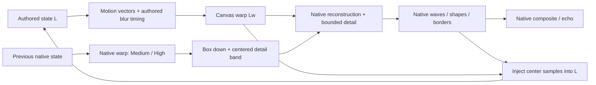

# Native trails and automatic native-capable quality

Owner scope: one Native `:core`; Standard/Medium/High trails; resolution always
automatic up to native4K, based on targetFPS and live memory headroom; no manual
RAM limiter. This supersedes the original detail-layer plan’s fixed-Native opt-in,
Auto1330 cap and retained capped-AAR requirements. Physical TV performance and
universal background-process survival require device evidence; do not infer them
from the host suite.

## Feedback pipeline

MilkDrop feedback relies on bilinear resampling at its authored canvas. At4K,
ordinary native feedback supplies a smaller footprint in picture units. The
prototype found darkening/structure changes on Royal191, Fed, Tartan, astral,
Motion Blur and Acid Mandala. Historical prototype numbers are in
[the plan](../plans/2026-10-05-native-4k-feedback-detail-layer.md) and
[clipping evidence](../evidence/0025-feedback-diffusion/detail-layer/results/clipping-fix/README.md).

Standard skips native warp and detail intermediates. Mesh equations run once;
the second draw uses that prepared mesh and the same per-frame shader randomness.
Motion vectors also enter L; their normalized map is written by the canvas warp.
Blur timing follows projectM: previous-canvas blur before warp unless the warp
reads blur, when it updates after warp. Native viewport is restored after canvas
initialization before native copies/draws. Replacing a UV map invalidates vector
consumption until it is populated again.

At renderW×H with reference1280×720, useS=round(sqrt(W*H/(1280*720))). RequireS≥2
and both dimensions divisible byS. L hasW/S×H/S pixels:1280×720 at4K (S3), and at
1440p (S2). Scaled transitions use their actual integer canvas for texsize, blur,
line width and sample decisions. Unsupported canvases or shader/resource failure
fall back to0038. Every preset owns its L/resources; mode-class changes release
old resources before allocation. Resize rebuilds L from the scaled native frame.

For eachS×S block/channel, r=Hw-bilinear_up(box(Hw)), d=r-mean_block(r),
b=bilinear_up(Lw). Choose one gain g≤alpha fitting all positive/negative pixel
headroom, then Hc=b+g*d. This preserves mean_block(b) beforeRGBA8 quantization.
Independent clipping would reintroduce positive energy; forcing raw Lw means
would change the bilinear reconstruction. Geometry injection samples the middle
native pixel for oddS and the middle2×2 average for evenS, preserving centered
geometry without spreading every dot across the entire block.

## Levels and memory

| Level | Gain cap | Work |
|---|---:|---|
| Standard |0| Canvas warp, upscale and geometry injection; no native warp |
| Medium |0.5| Native warp, down, centered/bounded combine and injection |
| High |1| Same passes as Medium, larger detail gain |

Retain Medium as the requested intermediate detail amount, not a performance
preset. Its pass topology equals High. The limiter can make both gains smaller
near black/white. New matched-capture checks and timings must substantiate their
visible differences; historical High brightness includes bias before PR35 and
must not be treated as current acceptance.

Raw feedback-layer texture storage at4K: Standard has two canvas textures plus
canvas flip (about11.1MB decimal); Medium/High add a canvas-down texture and one
native Hc texture (about36.9MB extra per preset). This excludes the normal engine,
blur/mipmaps, surfaces, pools, shader programs and textures. A transition can hold
two presets. The quality controller uses conservative aggregate estimates,
not these minimum feedback-only numbers as total process memory.

## Automatic quality

Reuse QualityController’s FPS hysteresis, settling, CPU-bound checks and
per-preset probe backoff. Auto is the only mode, and its ladder can reach the full
panel on every device tier. Deprecated fixed/static-RAM inputs normalize toAuto;
public names remain for consumers. Standard is the Android JNI default; trails
are activated above1330p and retained as a preference at lower sizes.

An ActivityManager sampler initialized by ProjectMCore.init uses application
context and runs on the existing ~1sFPS callback. The available-memory reading
already accounts for current app/other-process usage. Before growth, estimate
additional rendering allocations for the candidate size/level, budget two
presets for enabled transitions and temporary resize overlap. A reserve of
max(totalRAM/5, Android.threshold+128MiB), with64MiB recovery margin, provides
headroom. Current policy estimates32bytes/pixel/preset for Standard and40 for
native detail; these are conservative factors, not measured bounds. Invalid
samples forbid growth. Low-memory/reserve checks precede FPS settling; healthy
memory and candidate-safeFPS samples are required before upward probes. Recovery
can restore resolution after pressure. Memory downshifts flush the native texture
pool and pause prewarming through existing JNI hooks.

Use [Android MemoryInfo](https://developer.android.com/reference/android/app/ActivityManager.MemoryInfo)
and [Android memory guidance](https://developer.android.com/topic/performance/memory)
for the platform inputs. Android/vendor process priority and allocation outside
the estimate still vary; this policy cannot certify that a background music app
will never be killed. Measure the music process and playback during live checks.

## API and publication

projectM’s additive CAPI sets feedback detail alpha (negative/nonfinite off,
0..1 enabled) and exposes actual active scale/off/canvas/shader-resource fallback.
It defaults off for engine compatibility. Android JNI `setNativeTrails(-1/0/1/2)`
sets Off/Standard/Medium/High; newcore defaultsStandard, with thread-safe inputs
applied on GL thread. `getNativeTrailsStatus` reports last-rendered active canvas
or selected level/inactive/fallback. No environment switches or readbacks ship.

Publish one Native AAR under canonical core filenames; retire separate capped
and core-native artifacts. Keep historical releases immutable. Milkbeat dispatch
and canonical filenames remain, while its host settings must agree with the new
always-Auto controller. See [release workflow](../../RELEASING.md).

## Validation status

Production0042be3f39da:253/253 host and253/253ASan/UBSan tests,42patchesapply;
scoped review accepts viewport/motion-map fixes. Direct persistentL comparison
covers20 animated geometry-free frames (maxMAE0.236111/255, tolerance0.5/255);
reconstructed-output maxMAE0.34592/255. Four explicit-off hashes match a fresh
0001–0041 engine. First-frame blur fixture can emit a macOS zero-texture warning;
its image/GL checks pass, which is not a zero-warning or all-driver claim.

The prototype’s39 GPU limiter cases and8 runner tests also pass. Released2.3.3
Native AAR hash4001148a… was verified and completed an uninstrumented480-frame
Acid4K smoke. That smoke does not prove deterministic fidelity.

Automatic-quality JVM checks42passed, including pending-allocation and preserved/recreated-context cases. The17-preset production-AAR matrix, liveAM6
music/memory/FPS checks, final CI/Codex review, merge and release verification
remain task gates; append their actual evidence before declaring completion.
Use [focused validation](../../../tools/native-trails/README.md) and
[profiling](../../PROFILING.md). Do not rerun the whole corpus merely to replace
this owner-approved focused validation scope.

## Allocation acknowledgement and resume

Managed rendering publishes dimensions, trails and transition duration as one
JNI budget request. GL applies allocation-changing settings only when the surface
acknowledges those dimensions; mismatched requests hold rendering. Context
recreation requests a fresh review generation; stale queued UI configurations
cannot acknowledge it. The host revalidates complete replacement memory before
releasing the first-frame guard, and confirms an actual preset frame before FPS
data can count as resident allocation. Pending initial allocations retain full
budget accounting if settings change before that first rendered sample.

A preserved-context resume also samples current memory before rendering resumes.
The controller resets stale growth credit and always republishes a chosen height
for acknowledgement, even unchanged. These integration paths must be exercised
in the app and Milkbeat, separately from fixed-size offscreen fidelity profiles.
