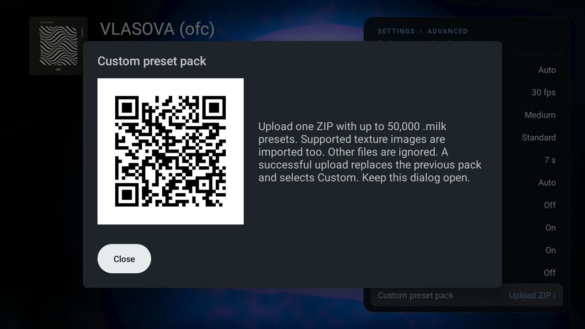

# Custom preset packs

Upload your own MilkDrop presets and textures to the TV from a phone or computer on the same network. No file picker, USB stick or storage permission is needed.

## Upload a pack

1. Put your `.milk` files and any texture images in one ZIP. Folders inside the ZIP are fine.
2. On the TV open **Settings › Advanced › Custom preset pack**. A QR code appears.
3. Scan it with a phone on the same Wi-Fi or Ethernet network. The browser opens an **Upload preset pack** page.
4. Choose the ZIP and select **Upload ZIP**. Keep the TV dialog open while it imports; the TV shows *Importing: N presets…*.
5. When it finishes, the TV shows *Imported N presets and M textures. Custom is now selected.*

*The QR code in the capture is an example and no longer active; scan the code your own TV shows.*

## What gets imported

| Item | Limit |
|---|---|
| Presets | Up to **50,000** `.milk` files (any case, nested folders), 8 MiB each |
| Textures | Up to 5,000 images: PNG, JPG/JPEG, TGA, BMP/DIB, DDS, 64 MiB each |
| ZIP | 2 GiB compressed, 4 GiB extracted presets and images, 250,000 entries |
| Other files | Ignored |

Presets refer to images by name without extension, ignoring case (`sampler_clouds` finds `Clouds.PNG`). **Texture names must therefore be unique ignoring case and extension across the whole ZIP**, even in different folders. Some DDS compression formats are not supported by every TV GPU.

## How packs behave

- **One pack at a time.** A successful upload replaces the previous pack.
- **Custom** plays only the pack's presets and becomes the selected mood. **All** plays bundled and custom presets together. **Chill**, **Normal** and **Intense** keep using only the scored bundled library.
- **Textures:** a custom preset uses its pack's images first and falls back to the bundled textures. Bundled presets keep using bundled images. During a blend from one pack to another, each preset keeps its own images. This needs an [engine change](engine/patches.md#0010-each-preset-keeps-its-own-textures), because MilkDrop only ever had one texture folder.
- **Skips** for presets that fail to load, stay black or run too slowly apply to custom presets as well.
- **Persistence.** The pack and the Custom selection survive restarts and app updates. Packs are excluded from Android backup, so upload the ZIP again after reinstalling, clearing app data or restoring onto another TV.
- **Safety.** An invalid ZIP, cancellation or insufficient storage leaves the previous pack in place. Replacing a pack temporarily needs room for the old pack, the incoming ZIP and the new pack.

## Network and privacy

- The listener runs **only while the dialog is open**. Closing the dialog or leaving the app stops it and cancels an unfinished upload.
- Each time the dialog opens it uses a new random port and a random 128-bit session path, shown only inside the QR code.
- It binds a private IPv4 address on Wi-Fi (preferred) or Ethernet. VPN and point-to-point interfaces are never used. Guest networks that isolate clients may block the phone from reaching the TV.
- The page must be opened at the address in the QR code. Only one import runs at a time, and a transfer may take up to one hour.
- The upload uses plain HTTP on your local network and is not encrypted. Use a network you trust.

## Make presets for the TV

See [Writing presets](authoring/index.md) for how presets work, and [Test and predict presets](authoring/testing.md) for checking a pack before you upload it.
