# Patch catalog

ProjectM TV Engine is projectM at commit `6f6480746` (unreleased 4.2 master) plus **15 ordered patches** in [`tools/projectm-patches/`](https://github.com/johnneerdael/ProjectM-TV/tree/main/tools/projectm-patches). They are applied when the native library is built; the upstream source is never edited in place.

Most patches are about **MilkDrop 2 authenticity**. projectM is a clean-room reimplementation of MilkDrop on OpenGL, and over the years small differences crept in: in how equation code is accepted, how HLSL becomes GLSL, where Direct3D 9 and OpenGL put pixel centres, and which per-frame variables are actually read. Each entry below names what projectM did differently, what MilkDrop 2 does (citing its released source where we checked it), what the patch changes, and the preset that shows it.

Two patches deliberately go beyond MilkDrop 2. [0010](#0010-each-preset-keeps-its-own-textures) adds correct behaviour for something MilkDrop never supported: presets whose textures live in different folders. [0005](#0005-blur-ranges-that-cannot-collapse) repairs a MilkDrop 2 typo instead of reproducing it.

!!! info "How the images were made"
    The images for 0001–0014 come from the [current-patch proof](https://github.com/johnneerdael/ProjectM-TV/pull/55). A preset is rendered by real libprojectM on a GPU-accelerated Android TV emulator: GLES 3.0, frozen audio, seed 12345, a frame/30 clock, frames 0–119, each role captured twice with byte-identical results. *Without* means the full series minus only that patch (a single-patch ablation); *with* is the full series at that recorded 14-patch checkpoint. Images are unbrightened and rendered at 512×288 (some at 256×144) with quad lines and Native trails off. They establish cause and effect for that preset on that GPU. They are not Windows reference renders, and they do not certify every preset or every TV.

## At a glance

| Patch | What it fixes | Witness |
|---|---|---|
| [0001](#0001-tv-rendering-and-preset-compatibility) | MilkDrop's tolerant equation loading; sampler, random-texture and blur-target fixes; resolution independence; TV rendering | `161.milk` |
| [0002](#0002-hlsl-compatibility-and-exact-float-literals) | HLSL that Microsoft's compiler accepted | `Flexi - madness portal.milk` |
| [0003](#0003-evaluator-lone-dot-and-per-thread-random) | NS-EEL's lone `.` number; undisturbed `rand()` | `Stahlregen - funky Blur (lotus mix) …` |
| [0004](#0004-textured-shapes-sample-with-wrap-and-bilinear-filtering) | Wrap/bilinear sampling for textured shapes | `widest swing.milk` |
| [0005](#0005-blur-ranges-that-cannot-collapse) | A usable blur range when min ≈ max | `flexi - a julia fractal for hexcollie embossed (Jelly).milk` |
| [0006](#0006-negative-zoom-mirrors) | Mirroring by negative zoom | `Hexcollie - This is where we begin stripped.milk` |
| [0007](#0007-per-frame-waveform-controls) | Per-frame `wave_mode`, dots, thickness, additive | `Hexcollie - now entering the wormhole2 …` |
| [0008](#0008-per-frame-display-filters) | Per-frame gamma, echo, brighten, darken, solarize, invert | synthetic control |
| [0009](#0009-premultiplied-user-textures) | Released texture bytes after projectM's image-loader change | `suksma - chemosynthetic nosferatu … rand tritex - inv play.milk` |
| [0010](#0010-each-preset-keeps-its-own-textures) | Beyond MilkDrop 2: per-pack texture folders that blend without swapping images | Aurora SOL / LUNA packs |
| [0011](#0011-huge-rotation-values) | CPU sine/cosine for `rot` | `EoS_Phat_PeterP_Sentinel_Aware_6 …` |
| [0012](#0012-tiny-shapes-land-on-the-right-pixels) | Direct3D 9 pixel centres for custom shapes | `amandio c - the green machine 2 … btbam covers sepultura.milk` |
| [0013](#0013-composite-reads-the-exact-feedback-texel) | Exact texel reads in custom composites | `DemonLD_-_Toxic_water_diffusion …` |
| [0014](#0014-legacy-colour-shading-and-mode-1-spirals) | Authored `fShader` tint amount; mode-1 spiral opacity and open shape | `BrainStain- boiling-mix2(redi jedi full carb mix).milk` |
| [0015](#0015-negative-warp-powers-use-milkdrop-cpu-maths) | CPU-defined negative nested powers beyond authored exponent one | synthetic nested-unit, square and cube controls |
| [0016](#0016-built-in-wave-opacity) | Mode opacity, volume amplification and faint-wave threshold | `Happening.milk`, source controls and repeated Native 4K captures |
| [0017](#0017-custom-wave-input-windows) | Valid centered oscilloscope windows and channel separation | `Mig_304 - geiss remix 2.milk`, input controls and repeated Native4K captures |
| [0018](#0018-discrete-custom-dots) | Authored custom dot counts; finite single-dot programs | source controls; Native4K acceptance pending |
| [0019](#0019-gamma-only-pass-count) | Original gamma-only epsilon; echo unchanged | boundary controls; Native4K acceptance pending |
| [0020](#0020-named-eel-constants) | Original double decimal precision of named constants | scalar controls; synthetic4K proof pending |
| [0021](#0021-original-equation-inputs) | Inverse per-pixel aspect; fresh wave-point host input snapshot | source controls; Native4K acceptance pending |

## 0001 — TV rendering and preset compatibility

The largest patch consolidates 27 historical patches from the projectM 4.1.7 era, ported onto 4.2 master's new Mesh and shader-cache ownership.

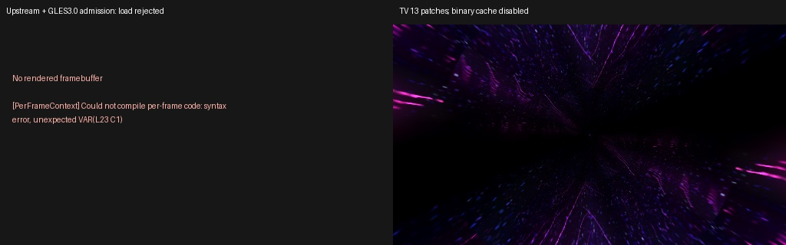

### Equation code is loaded like MilkDrop

**projectM:** a compile error in *any* equation block aborts the whole preset. Upstream 4.2 refuses to load `161.milk` (`[PerFrameContext] Could not compile per-frame code: syntax error`).

**MilkDrop 2:** `CState::StripLinefeedCharsAndComments` and `CState::RecompileExpressions` (`state.cpp`) join numbered lines, strip comments, and simply *leave out* a block that still fails to compile.

**ProjectM TV:** code the evaluator accepts is untouched. Rejected code is retried once in MilkDrop's form: numbered records joined, `//` and `\\` comments removed, and a `;` inside parentheses with no following operand read as a space (as NS-EEL does). A block that still fails is left out:

- failed preset init leaves `q` variables at 0;
- failed wave/shape init leaves `t` variables at 0;
- failed per-frame, per-pixel or per-point code does not run.

Only a *parse* error in the file fails the load. Each omission is logged as `Preset code left out (<preset>): <reason> (line N, column M)`. Source inventory: 62 bundled presets had raw equation code projectM rejected.

### Shader samplers and random textures

- **`sampler_state` blocks** no longer break the shader. projectM stripped them only from a search copy, so `shader_body` was replaced at the wrong offset and the stage fell back to a default shader (51 bundled presets, for example `ORB - Arctic Chill`). The block fields are still ignored, as in projectM: the sampler *name* prefix chooses filtering and wrap.
- **Warp texture unit 0** is reserved for the unqualified main sampler, so named point/clamp/wrap aliases keep their requested modes.
- **Random textures `rand00`–`rand15`**: each alias now gets its requested sampler mode and filename filter (`pc_rand00_red`), and the emitted short alias binds the same texture unit. ProjectM TV also keeps one image per slot for the whole preset load, shared by the warp and composite shaders and kept across shader reloads. That sharing is **not** MilkDrop 2 behaviour: MilkDrop chooses separately for each shader (`plugin.cpp:2927`). See [Textures](../authoring/textures.md#random-textures-rand00-to-rand15).

### Rendering state

- **Blur framebuffer ownership.** Allocating blur textures unbinds the read and draw targets. projectM saved the bindings *after* allocation, so when a warp shader sampled blur, the waves and borders drawn next went to framebuffer 0. Witness: `midgitstraights of majillaen - featy sweet.milk`. On Mali the error is silent, because framebuffer 0 is a valid target.
- **Fresh feedback** starts as transparent black instead of undefined memory.
- **A resize keeps history.** Old colour contents are scaled into new textures, so a resolution change does not restart every feedback preset.

### Resolution independence and Native trails

Quad lines, reference-scaled blur and wave counts, virtual `texsize` and Native trails, which address the resolution-scaling part of projectM issue [#682](https://github.com/projectM-visualizer/projectm/issues/682) (the round joins and caps it suggests are not implemented). They are explained on their own page: [Rendering MilkDrop at 4K](resolution.md).

### TV performance work

Program-binary and translated-GLSL caches for background prewarming, batched custom-shape uploads, a texture pool, an outgoing-preset frame divisor for blends, and tile-GPU framebuffer invalidation. See [How a frame reaches your TV](pipeline.md). Historical speedups were measured on the 4.1.7 engine and are not claimed for 4.2.

### GLES 3.0

Unmodified upstream at the pin requires GLES 3.2. 0001 admits GLES 3.0, which most TV boxes provide. Observed upstream master `e98fca85` has since made the same change.

## 0002 — HLSL compatibility and exact float literals

MilkDrop 2 compiled preset shaders with Microsoft's HLSL compiler. projectM translates them to GLSL, and a translation failure silently replaces the authored shader with a default one, so the preset looks completely different.

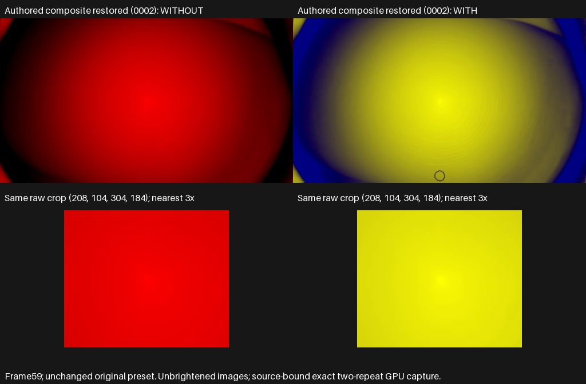

`Flexi - madness portal.milk` becomes a plain red disc when its composite cannot translate, because it declares a local variable named `sample`. With 0002 the authored yellow and blue composite renders. Removing only 0002 changes 120 of 120 frames.

| What MilkDrop's compiler accepted | projectM before | ProjectM TV |
|---|---|---|
| Writing to a uniform inside a shader (`q18 = 1;`, `time *= 0.4;`) | Uninitialized local copy per function: other components and other functions read garbage (426 translated shaders) | One global copy per assigned uniform, initialized from the uniform at the start of `main()` |
| Flat array initializers `const float4 samples[5] = {…20 values…}` | Emitted as one `vec4[]` of 20 scalars, rejected by GLSL (56 bundled presets) | Grouped into element constructors; ambiguous layouts fail loudly instead of being guessed |
| A local named `sample`; `#define` macros; `(float2(x,y)).x` | Parse failure or changed precedence (16 bundled witnesses) | Contextual identifiers, token-replacement macros with authored spacing, full postfix parsing |
| Plain uninitialized globals (`float mus;`) | Undefined GLSL globals | External inputs that read 0 (the D3D9 compiler treated them as constants) |
| Float literals such as `4194304.0` | Printed with 6 significant digits (`4.1943e+06` = 4194300) | Exact float32 round trip; nonfinite literals fail the stage instead of becoming an identifier named `inf` |

In an earlier corpus pass over 15,576 authored shaders, historical patches 0030–0032 (now split between 0001 and 0002) made 102 more shaders compile and lost none.

## 0003 — Evaluator: lone dot and per-thread random

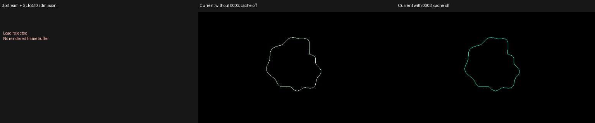

**Lone `.`** NS-EEL accepts `.` as a number (0). projectm-eval requires a digit, so `zoom=zoom+.10*sin(rad+.+15.15)` is a syntax error. Upstream rejects the Stahlregen *funky Blur* presets entirely. With 0001 alone their per-pixel block is dropped; removing only 0003 changes 120 of 120 frames of the unchanged preset. The image shows a synthetic fixture that makes the effect easy to see: the dropped block changes the wave colour. With 0003 the block runs as on MilkDrop. Seven bundled presets use the construction.

**Per-thread `rand()`.** The evaluator's Mersenne Twister state was process-wide. ProjectM TV compiles upcoming presets on a background thread, so that work could advance the live preset's random stream. Each thread now has its own fixed-seed stream; the algorithm is unchanged.

## 0004 — Textured shapes sample with wrap and bilinear filtering

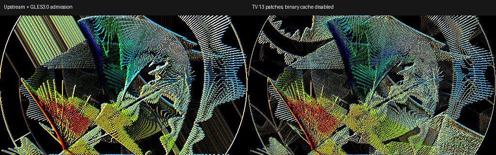

**projectM:** a custom shape with `textured=1` bound the main texture but inherited whatever sampler object was left on unit 0 (clamp, or nearest after the first instance). **MilkDrop 2** restores wrap/linear sampler state after the warp shader (`RestoreShaderParams`), but on frames where it computes blur levels, the blur passes then set unit 0 back to clamp (`milkdropfs.cpp:1611`) and nothing resets it before `DrawCustomShapes()`. So MilkDrop's textured shapes wrap on frames without blur and clamp on frames with blur. **ProjectM TV** gives every main-textured fill its own repeat/linear sampler, including geometry replayed for Native trails. That removes projectM's unpredictable nearest/clamp mix, but for presets that use blur it wraps where MilkDrop 2 clamps. Removing only 0004 changes 119 of 120 frames of `widest swing.milk`.

## 0005 — Blur ranges that cannot collapse

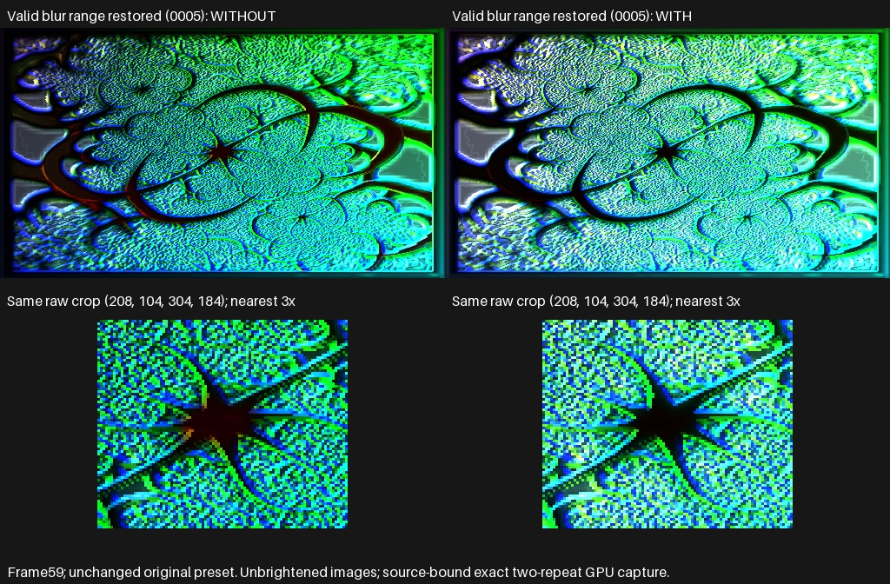

`blur1_min`…`blur3_max` define the colour range stored in each blur texture. **MilkDrop 2** `CPlugin::GetSafeBlurMinMax` (`milkdropfs.cpp` 1551–1583) tries to push a too-narrow interval (`max − min < 0.1`) apart, but a typo sets *both* bounds to `avg − 0.05`, collapsing it. projectM reproduces the collapse, and the decode divides by zero.

**ProjectM TV** expands the upper bound upward, keeps the clamp-then-expand order, and falls back to a coherent 0–1 range for nonfinite or unrepresentable inputs. This **deliberately differs from MilkDrop 2** where MilkDrop produced a degenerate blur. `flexi - a julia fractal for hexcollie embossed (Jelly)` sets blur3 to 0.49–0.52 after blur2 0.78–0.91. Without 0005 it is darker, with altered embossing (frame 59 MAE 38.5). For other witnesses, such as `Cope - The Cloud`, the repair changes nothing visible.

## 0006 — Negative zoom mirrors

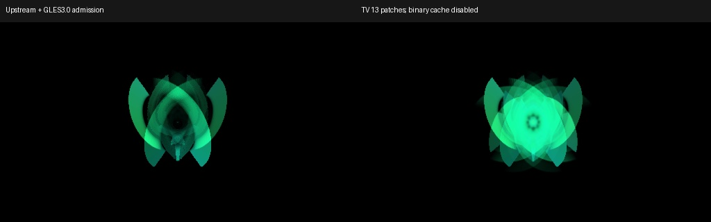

**MilkDrop 2** computes the zoom on the CPU: `powf(fZoom, powf(fZoomExp, rad*2-1))` (`milkdropfs.cpp` 1877). With `zoomexp = 1`, a negative zoom stays negative and reflects the image through the warp centre. **projectM** evaluates `pow` in GLSL, which is undefined for a negative base: 3,234 NaN UV components per frame for the witness. **Patch0006** uses the signed value when the authored exponent is exactly 1. [0015](#0015-negative-warp-powers-use-milkdrop-cpu-maths) extends the CPU calculation to other negative nested powers; fractional-domain appearance remains unresolved.

## 0007 — Per-frame waveform controls

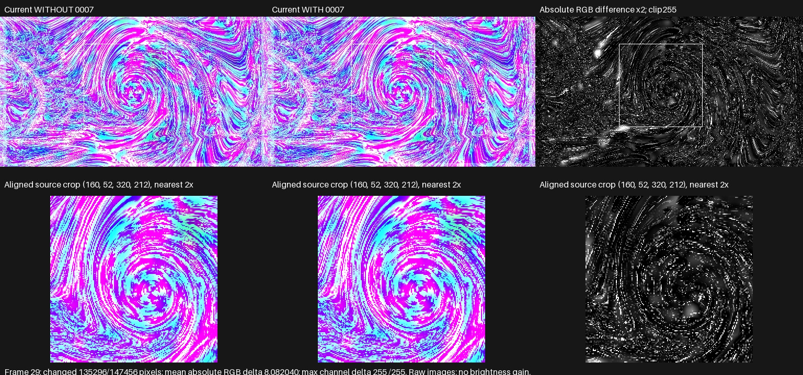

**projectM** read `wave_mode`, `wave_usedots`, `wave_thick` and `wave_additive` from the preset file only; per-frame changes were ignored. **MilkDrop 2** reads the evaluated value every frame: `(int)(*var_pf_wave_mode) % NUM_WAVES` (`milkdropfs.cpp` 2852). **ProjectM TV** consumes the evaluated values and rebuilds the wave when the mode changes. The witness sets `wave_mode=q8%7` per frame; without 0007, 135,296 of 147,456 pixels differ at frame 29.

projectM has 16 waveform modes, MilkDrop 2 has 8. The value wraps modulo 16 here and modulo 8 on MilkDrop 2, so `wave_mode=9` is mode 1 on Windows and projectM's mode 9 here. Negative remainders draw nothing.

## 0008 — Per-frame display filters

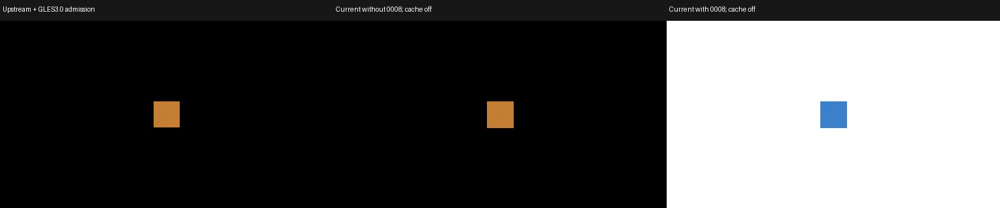

`gamma`, `echo_alpha`, `echo_zoom`, `echo_orient`, `brighten`, `darken`, `solarize` and `invert` are per-frame variables in **MilkDrop 2** (`milkdropfs.cpp` 527–540). **projectM** used only the preset file's values, and allocated the filters only when the file's default was on, so a preset could never switch one on from code. **ProjectM TV** reads them every frame, with MilkDrop's order (brighten, darken, solarize, invert), clamps (gamma 0–8, echo zoom 0.001–1000) and echo orientation modulo 4. MilkDrop 2 uses the evaluated values for presets without a composite shader (composite version 0). For shader-version presets without `comp_` code it bakes the file values into a generated shader; ProjectM TV uses the evaluated values for every built-in composite. Neither applies these effects with a custom composite shader. The tested original witness (`idiot - Forty Six and 2`) did not activate the difference under the proof audio, so the image shows a synthetic equation-only control.

## 0009 — Premultiplied user textures

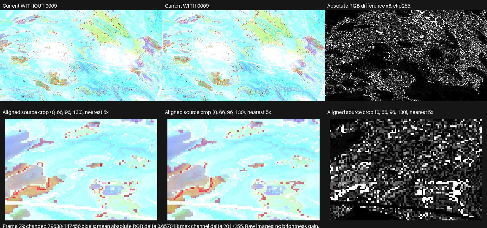

ProjectM TV's releases based on projectM 4.1.7 loaded images with SOIL2 and premultiplied colour by alpha. 4.2 switched to stb_image without premultiplying, so presets that sample transparent textures changed. In feedback presets, even a 1-level byte difference grows: frame 29 of the witness shows a mean 3.66 and a maximum 201 channel difference. ProjectM TV restores the released bytes, `(rgb·alpha + 128) >> 8` per channel. Whether MilkDrop 2's D3DX loader premultiplied is not verified.

## 0010 — Each preset keeps its own textures

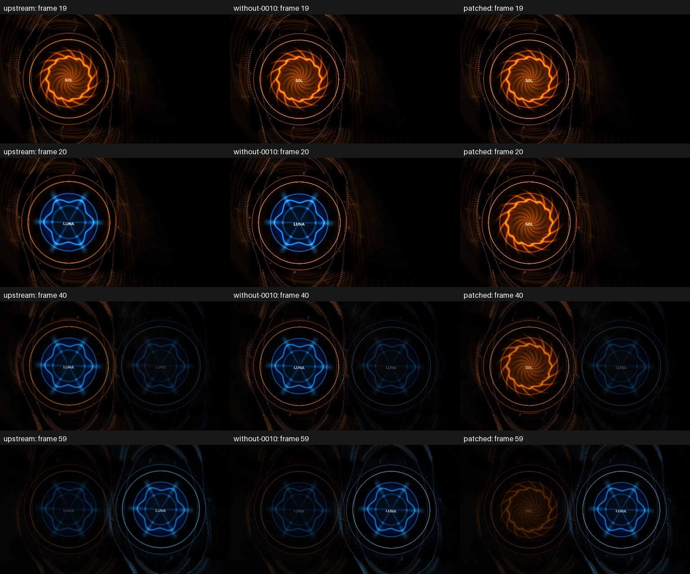

This is where ProjectM TV Engine deliberately goes beyond MilkDrop 2. MilkDrop read every texture from one folder, so the question of *which* folder a preset's images come from never arose. [Custom packs](../custom-packs.md) introduce exactly that: a pack's presets prefer the pack's own images, with the bundled textures as fallback. Upstream projectM has one global texture search path, and changing it reloads every texture. During a blend from pack A to pack B, a same-named image in the outgoing preset would therefore switch to B's file.

With 0010, each preset keeps the texture paths it was loaded with until it retires: an added per-preset lookup contract for a situation MilkDrop did not support. In the test, two packs created with the predictor tools each use the same image name. Upstream swaps SOL's orange emblem for LUNA's blue at frame 20; ProjectM TV keeps SOL's.

## 0011 — Huge rotation values

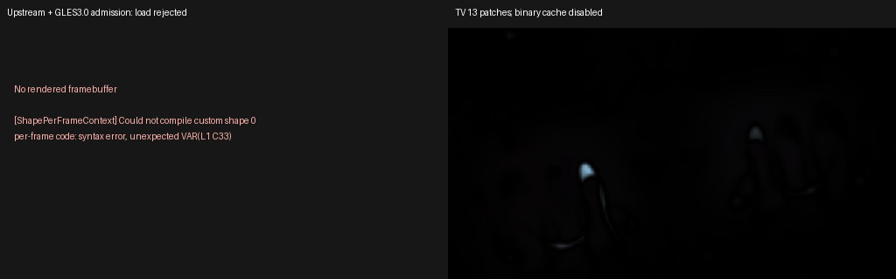

**MilkDrop 2** converts `rot` to float and computes `sinf`/`cosf` on the CPU (`milkdropfs.cpp` 1813, 1905–1906). **projectM** computes them in the vertex shader. On the observed GLES driver, `sin`/`cos` of ±10,000,000 both returned 0, collapsing the feedback to the rotation centre. ProjectM TV computes them on the CPU after float conversion, valid up to `FLT_MAX`. The witness uses per-pixel `rot=10000000`; upstream additionally fails to load it, because of a shape equation that 0001 handles. Large-argument trig inside your *own* shader code is still driver-dependent.

## 0012 — Tiny shapes land on the right pixels

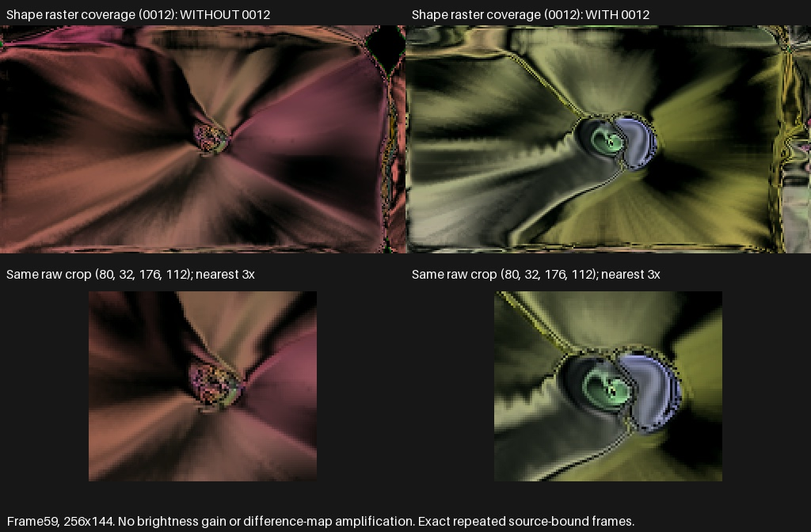

Direct3D 9 samples integer pixel centres; OpenGL samples half-integers. **MilkDrop 2** `DrawCustomShapes` (`milkdropfs.cpp` 2298) places shapes in D3D9 coordinates, so a shape with `rad=.002` at `x=y=.5` covers one pixel under the Direct3D 9 rasterization rules and zero pixels in projectM. Feedback presets that seed their image with many tiny shapes lose them entirely. ProjectM TV shifts shape fills and outlines by half a destination pixel per render target. Equations, radii, colours and UVs are unchanged. In `amandio c - the green machine 2 skin lard bone beacon nz+ btbam covers sepultura.milk`, 34,365 of 36,864 pixels differ by more than 16 at frame 59.

## 0013 — Composite reads the exact feedback texel

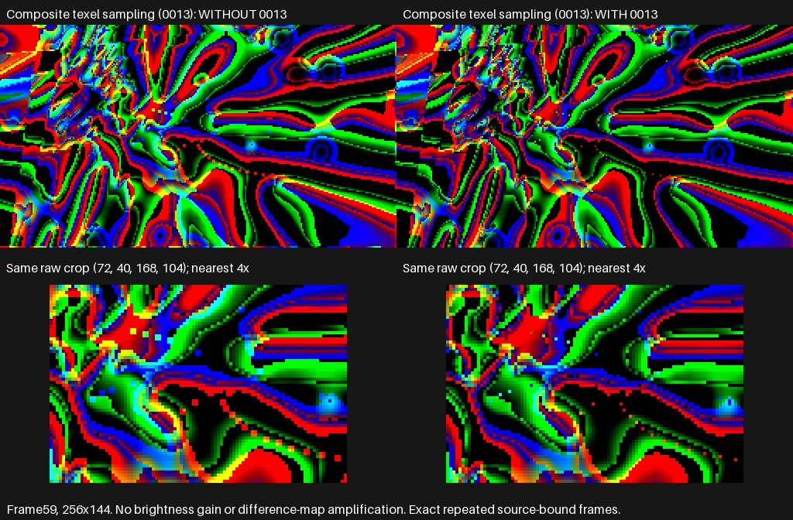

**MilkDrop 2** `plugin.cpp` shifts the composite grid by −½ pixel (the D3D9 convention) and keeps the UVs. **projectM**'s GL mesh is already unbiased, yet it *also* added +½ texel to the UVs, so every `tex2D(sampler_main, uv)` in a custom composite read between four texels. That is a hidden 2×2 blur: a single 255 feedback texel became four pixels of 64. ProjectM TV removes the redundant bias. In `DemonLD_-_Toxic_water_diffusion …` the bugged window was about 18% brighter at frame 59 (mean luma 57.0 against 48.4). The fix does not always darken a preset; it removes the blur.

## 0014 — Legacy colour shading and mode-1 spirals

Three differences in the classic (non-shader) rendering path, found while investigating why a preset looked darker than expected (`milkdropfs.cpp` 2927–2946, 3359–3365, 4117–4144):

| Stage | MilkDrop 2 | projectM | ProjectM TV |
|---|---|---|---|
| Legacy hue shading | No tint when `fShader` ≤ 0.001; otherwise the animated corner colours are mixed with white by `fShader` | Always the full animated tint | Respects the authored amount and threshold |
| Mode-1 waveform opacity | Alpha × 1.25, then volume modulation and clamp | Multiplier missing | Multiplier restored before the clamp |
| Mode-1 waveform shape | Open line strip | Closed loop with an extra segment | Open, as in MilkDrop |

The witness, `BrainStain- boiling-mix2(redi jedi full carb mix).milk`, can still look sparse and dark after the fix: its video echo shows only a zoomed crop of the image and its darken filter squares the colours, exactly as authored. The investigation also showed that the source predictor shared these mistaken assumptions, so agreement with the predictor is not proof of MilkDrop behaviour. [Evidence](https://github.com/johnneerdael/ProjectM-TV/blob/main/docs/superpowers/evidence/brainstain-dark-output/README.md).

## Fixed upstream, dropped from the series

Rebasing onto 4.2 master retired nine historical patches because upstream had already made the same fix:

| Historical | Fix | Upstream |
|---|---|---|
| 0001 | Plasma transition float overflow | `0227b7a61` (issue #872) |
| 0008 | HLSL float remainder types and operator precedence | PR [#1031](https://github.com/projectM-visualizer/projectm/pull/1031), contributed from this project |
| 0017 | `projectm_pcm_get_max_samples()` returns 576 | PR #1032 |
| 0018 | Parenthesized constructor expressions | PR #948 |
| 0019 | Quadratic number scanning in the HLSL parser | PR #1030 |
| 0020 | projectm-eval 1.0.7: NS-EEL's 0.00001 comparison/division tolerance | evaluator `22fb0cfd` |
| 0021 | Self-referencing shader macro infinite loop | `c1469f0e5` |
| 0022 | Custom waveform out-of-bounds read | in the pin |
| 0027 | Preset exception diagnostics | in the pin |

projectM **v4.1.8** (tagged 2026-10-06) backports most of these parser and waveform fixes, but not the plasma transition fix. It also uses a newer evaluator commit (`e8c311e`, a float-scanner fix) that our pin does not include; its visible impact is unverified.

## 0015 — Negative warp powers use MilkDrop CPU maths

**MilkDrop 2** computes `powf(zoom, powf(zoomexp, rad*2-1))` on CPU after float conversion (`milkdropfs.cpp:1877–1938`). A nested integer exponent can have a finite signed or squared/cubed result even when authored `zoomexp` is not one. **The old GPU branch** returns NaN for these defined controls on the observed GLES backend because GLSL does not define any negative-base `pow`. **ProjectM TV** prepares the negative result on CPU and supplies it through an instance-owned float buffer at attribute 9. Positive zoom keeps its shader path; raw equation values and prepared-mesh replay are unchanged.

These separate proof images use full published v2.3.25 and candidate AARs at 256×144, 48×32 mesh, 30 frozen frames and the same mono PCM/clock/seed on API 34/Apple M4 Pro/GLES3. Named diagnostic copies activate nested exponents 1/2/3 at selected vertices; constant blue 64 verifies their custom warp/composite programs. They are not the 120-frame single-patch ablations described above. Direct UV controls fail before/pass after, and real-mesh controls check values, NaNs, resize and replay. The buffer adds four bytes per vertex and nonunit negative vertices need two CPU powers; performance is unmeasured.

The exact **Great Tulip Majesty (txtr wrap)** witness has 33 fractional-domain NaNs per frame in both the original CPU expression and GPU path. Its30-frame original/repeat AAR replay is byte-identical after this correction. NaN/Inf are retained, with no epsilon or absolute-value substitution. Invalid interpolation and sampling observations are backend-bound, so the source predictor's unresolved guard remains appropriate. [Source, IEEE bits and capture evidence](https://github.com/johnneerdael/ProjectM-TV/blob/main/docs/superpowers/evidence/tulip-negative-zoom-power/README.md).

## 0016 — Built-in wave opacity

MilkDrop multiplies the mode-adjusted alpha by an unbounded volume ramp, then clamps the result. Mode 3 replaces its starting alpha with the canvas coefficient times `1.3 × treb²`; mode 1 retains its `1.25` multiplier. ProjectM TV now preserves these operations and skips built-in waves below final alpha `0.004`, including the Native quad path. Existing reference-size buckets, above-reference line/dot sizing and Native geometry replay remain in use. A matched mode-2 control changes alpha from `0.4` to `0.028`. Repeated Native Standard 4K captures confirm the effect on `Happening.milk`, with no observed slowdown in that witness. See the [audit evidence](https://github.com/johnneerdael/ProjectM-TV/blob/main/docs/superpowers/evidence/milkdrop-audit-repairs/I17/README.md).

## 0017 — Custom wave input windows

MilkDrop centers a custom oscilloscope’s requested window and shifts its two channels in opposite directions by `sep/2`. ProjectM’s prefix sampling ignored those offsets. ProjectM TV now restores the offsets when both complete windows fit the 480-sample input. Oversized requests retain upstream resampling; invalid original offsets retain the safe prefix fallback. Spectrum sampling, point counts, smoothing and Native prepared replay remain unchanged. The finite two-point ramp control changes the first input from 0 to `239/480 × .004`, and passes with signed separation and safe-bound controls. Repeated Native Standard4K captures confirm the separated-channel loop effect in Mig304, with no consistent slowdown in the measured witness. See [I08](https://github.com/johnneerdael/ProjectM-TV/blob/main/docs/superpowers/evidence/milkdrop-audit-repairs/I08/README.md).

The separate I19 source sample-cap proposal is preserved with real 4K before/expected captures, outside the shipping patch series. Brightness relative to the previous 4K output alone does not prove fidelity loss; matched authored and resolution-band comparisons remain in progress in [I19](https://github.com/johnneerdael/ProjectM-TV/blob/main/docs/superpowers/evidence/milkdrop-audit-repairs/I19/README.md).

## 0018 — Discrete custom dots

Custom dots retain their authored point/color count, following MilkDrop’s distinction between points and smoothed lines. The old library inserted smoothing midpoints into point waves. A finite two-point control now submits two points in both authored and Native draws; ordinary lines retain their smoothing. One-dot programs may emit finite positions/colors while the undefined normalized sample input remains NaN. Invalid appearance derived from that NaN is not promised. Source controls and40 normal renderer checks pass; Native4K acceptance remains pending in [I22](https://github.com/johnneerdael/ProjectM-TV/blob/main/docs/superpowers/evidence/milkdrop-audit-repairs/I22/README.md).

## 0019 — Gamma-only pass count

MilkDrop’s gamma-only output uses a `.001` epsilon, while echo redraws use `.0001`. Candidate0019 restores that distinction and can remove one redundant fullscreen pass near integer gamma. Per-pass weight/count controls and42 normal renderer checks pass; actual Native4K output may remain visually identical. Float diffuse precision and echo/tint behavior remain unchanged. [I31 evidence](https://github.com/johnneerdael/ProjectM-TV/blob/main/docs/superpowers/evidence/milkdrop-audit-repairs/I31/README.md).

## 0020 — Named EEL constants

The original named pi/e/phi decimal expansions now enter the double evaluator without intermediate float rounding. Both lexer source and the checked-in scanner are updated; e/phi retain the original abbreviated decimals. Later geometry/shader casts, RNG and lone-dot handling remain unchanged. No stock named-constant reference was found; a synthetic4K diagnostic is pending. [I09 evidence](https://github.com/johnneerdael/ProjectM-TV/blob/main/docs/superpowers/evidence/milkdrop-audit-repairs/I09/README.md).

## 0021 — Original equation inputs

Per-pixel equations receive inverse aspect factors, matching the original input contract while keeping the TV shader canvas. Custom-wave points receive fresh wave-frame time/audio inputs before wave-frame code; main-equation writes remain local to that main context. Q/T propagation and Native one-evaluation replay are preserved. Source controls and45 normal checks pass; Native4K qualification is pending in [I05](https://github.com/johnneerdael/ProjectM-TV/blob/main/docs/superpowers/evidence/milkdrop-audit-repairs/I05/README.md) and [I06](https://github.com/johnneerdael/ProjectM-TV/blob/main/docs/superpowers/evidence/milkdrop-audit-repairs/I06/README.md).

## Known remaining differences from MilkDrop 2

- `sampler_state { … }` fields are ignored; the sampler name prefix selects the mode (as in MilkDrop).
- In warp shaders, an unqualified `sampler_main` follows the preset's `wrap` setting; MilkDrop 2 ignores `wrap` there and uses the name prefix, which defaults to wrapping.
- `randNN` images are shared between the warp and composite shaders for a preset load; MilkDrop 2 picks separately per shader.
- Uninitialized shader globals read 0, not whatever a D3D9 constant register held.
- Fractional negative warp powers have nonfinite coordinates and unresolved appearance. Negative-base `pow` inside authored shaders remains undefined in GLSL.
- Nonfinite `rot` is unsupported.
- `wave_mode` wraps at 16 projectM modes, not 8.
- Blur ranges narrower than 0.1 are repaired instead of collapsing.
- Some reference-scale effects remain resolution-dependent at 4K unless Native trails or diffusion compensation is active ([details](resolution.md#what-this-does-not-fix)).
- HLSL translator edge cases: decimal→double→float double rounding and unchecked integer narrowing.
- Textured custom shapes always wrap; MilkDrop 2 clamps them on frames where blur levels are computed.
- Line modes 4/6/7 retain projectM’s divided-budget sample policy pending I19 qualification. Wave modes 2, 3 and 5 use projectM's size buckets instead of MilkDrop's exact-width fade table.
- Thick custom waves and shape outlines are offset by half a pixel; MilkDrop 2 offsets them by one canvas pixel, and its custom-wave dot size also grows on canvases 1024 px and wider.
- `echo_orient` of −1 or −3 flips horizontally in MilkDrop 2 (`n % 2` is nonzero); projectM does not flip.
- `decay` above 1 is clamped to 1; MilkDrop 2 wraps it to nearly black.
- Per-pixel code visits mesh rows in the opposite vertical order, so stateful per-pixel code can differ; the animated warp sine pattern is vertically mirrored.
- No Windows reference renders exist in this project's evidence, so identical Windows appearance is never claimed.

These differences were found by auditing the [source predictor](../predictor.md) against MilkDrop 2's code; they are candidates for future engine patches.

The full assessment, including upstream contribution notes, is [`docs/UPSTREAM_PATCH_VALUE.md`](https://github.com/johnneerdael/ProjectM-TV/blob/main/docs/UPSTREAM_PATCH_VALUE.md).
