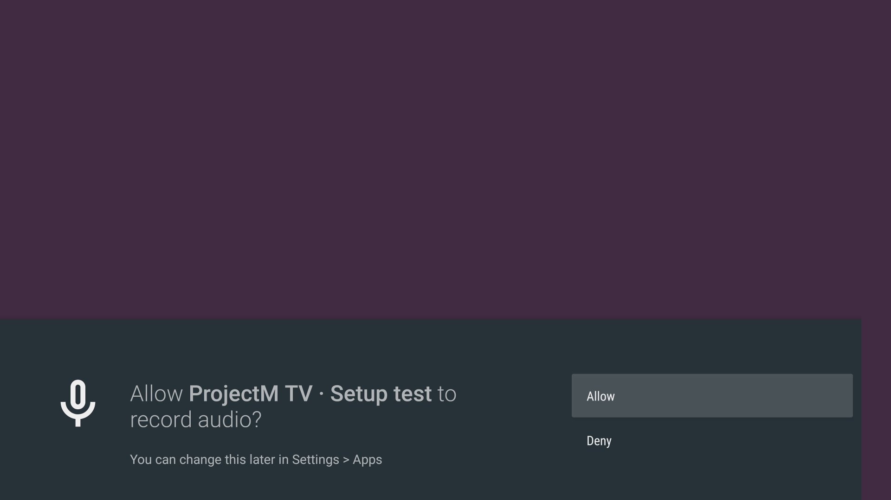
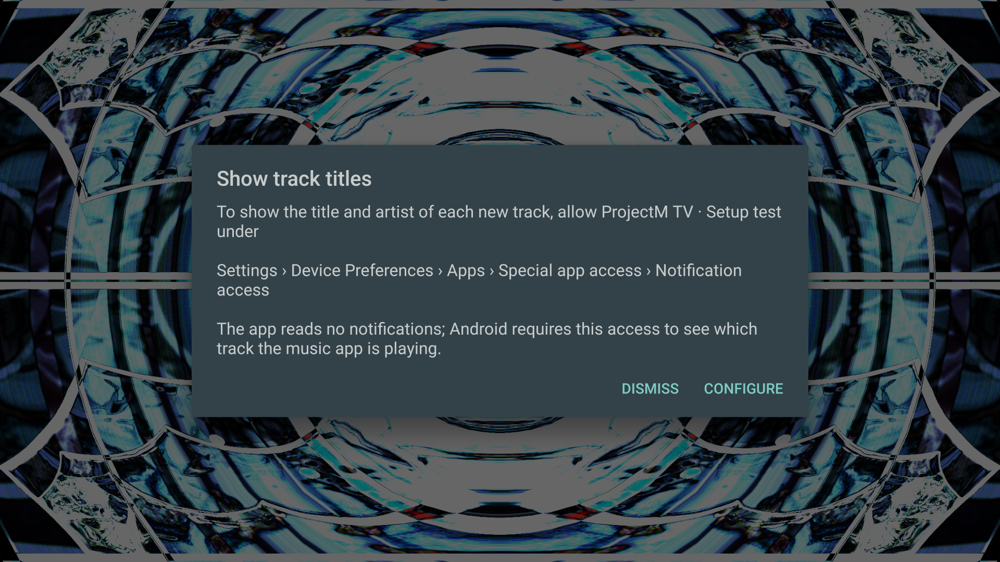
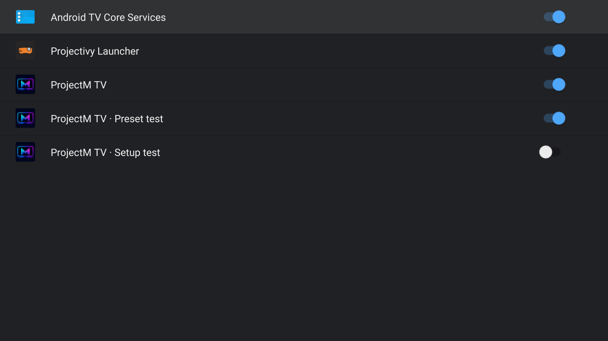
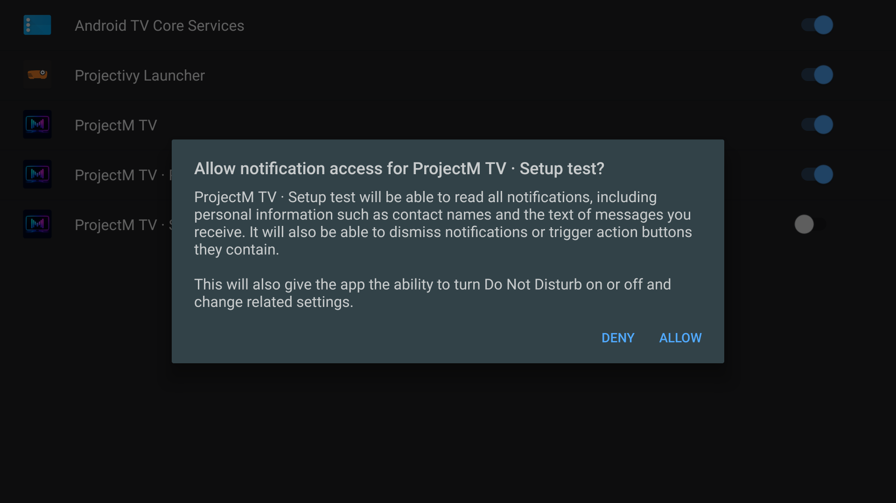
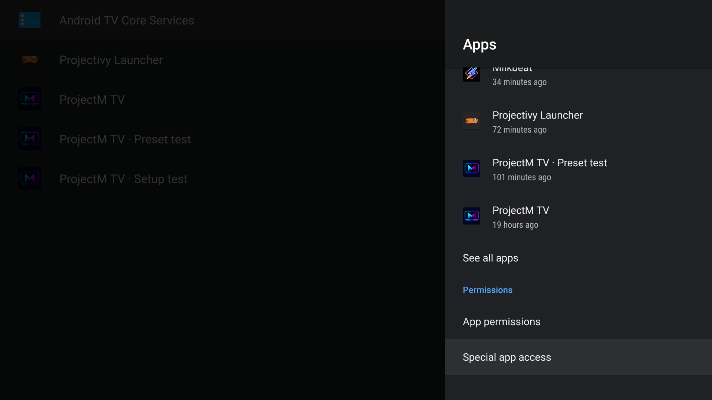
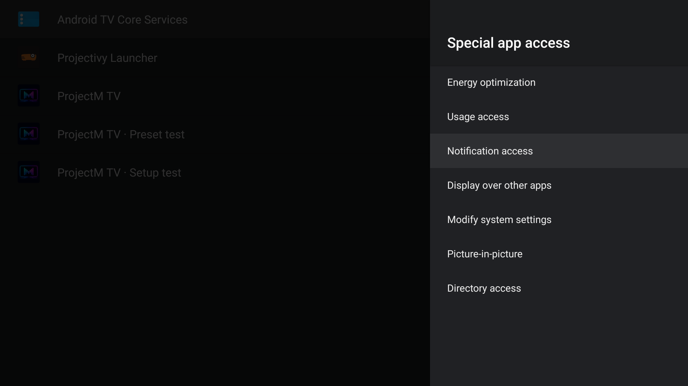
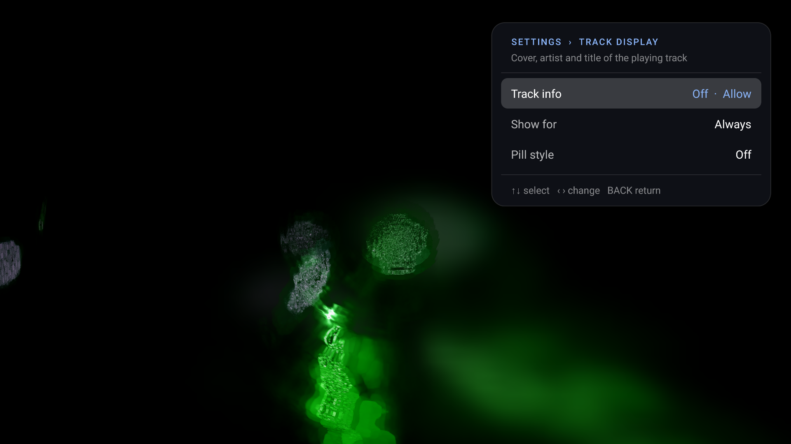
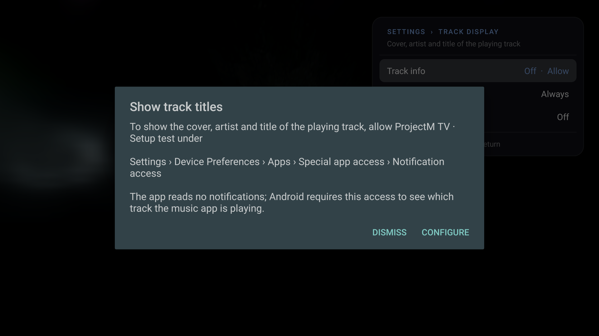

# Install and get started

## Requirements

- Android TV or Google TV running Android 5.0 or later.
- OpenGL ES 3.0.
- At least 2 GB RAM is highly recommended.
- A music app playing on the same device. Verified with Spotify, SoundCloud, SmartTube and [Milkbeat](https://github.com/johnneerdael/Milkbeat); other apps have not been verified.

ProjectM TV visualizes another app's music. It does not play music itself or use the microphone.

## Install on the TV

1. Install **Downloader by AFTVnews** from the TV's app store.
2. Open Downloader and enter **4821216**.
3. Allow Android to install apps from Downloader when asked.
4. Confirm installation of the downloaded APK.

The code points to the [latest signed APK](https://github.com/johnneerdael/ProjectM-TV/releases/latest/download/projectM-TV.apk). Specific versions are available under [Releases](https://github.com/johnneerdael/ProjectM-TV/releases).

## Install from a computer

```sh
curl -LO https://github.com/johnneerdael/ProjectM-TV/releases/latest/download/projectM-TV.apk
adb install -r projectM-TV.apk
```

Production releases use the same permanent signing key. An APK built with your own debug key cannot update a production installation directly.

## First launch: allow the music visualizer

Start a track in your music app **on the TV**, then open ProjectM TV. Music playing on a phone or a separate receiver is not available to this app.

Android asks **Allow ProjectM TV to record audio?** Choose **Allow**. Android requires this permission for its audio visualizer API. ProjectM TV attaches to the music player's audio session; it does not use the microphone or save recordings.

[](images/setup/audio-permission.png)

*Screenshots in this walkthrough were captured on an Ugoos AM6. “Setup test” identifies an isolated test installation; on your TV choose **ProjectM TV**. Android menu names and layouts vary by device.*

Wait a second or two while the app finds the player session. A preset can move even before music is detected, so use the **Audio** meter in the settings panel to check that music is reaching the app.

If you selected Deny, allow the permission under Android **Settings → Apps → ProjectM TV → Permissions**, then reopen the app. If the meter remains silent while music plays, see [audio troubleshooting](troubleshooting.md).

## Track titles

Title and artist are optional. After audio permission, a **Show track titles** dialog offers two choices:

- **Configure** opens Android's notification-access settings. On supported Android 11+ devices it tries the page for ProjectM TV directly; otherwise it opens the list of apps, then falls back to Apps or the main Settings screen if necessary.
- **Dismiss** permanently hides the automatic prompt for this installation. It stays dismissed after restarting the app. You can still open it yourself from **Settings → Track display → Track info**.

[](images/setup/track-titles-prompt.png)

### Enable access with Configure

1. Select **Configure**.
2. Find **ProjectM TV** in the notification-access list, unless Android already opened its individual page.
3. Turn its switch on. Read and confirm Android's access prompt if one appears.
4. Press **Back** to return to ProjectM TV. In **Track display**, **Track info** changes to **On** when access is granted.

[](images/setup/notification-access.png)

*Configure opened this list directly on the AM6. The test installation's switch is Off; the other ProjectM TV entries belong to separate installations.*

Android's notification-access permission is broader than the feature needs. ProjectM TV uses it to read the music player's media session for title and artist; it does not read notification contents. Audio visualization continues without this access.

[](images/setup/notification-confirmation.png)

*Android shows this confirmation when you turn on the switch. Choose **Allow** to enable titles, or **Deny** to keep access off.*

Choosing Configure does not grant access automatically or permanently dismiss the reminder. If you return without enabling access, the dialog can appear on a later launch. Choose Dismiss if you prefer to keep titles off.

### Find the setting manually

If your TV opens a more general settings screen, look for **Apps → Special app access → Notification access**. Some devices put Apps under **Device Preferences** first.

**1. Open Apps.** Select **Special app access**. You may need to scroll below the recently opened apps.

[](images/setup/android-apps.png)

**2. Select Notification access.**

[](images/setup/special-app-access.png)

**3. Enable ProjectM TV.** Confirm Android's prompt if shown, and return with Back.

### Reopen setup after Dismiss

Open the app's settings with **Center / Enter / Menu**, select **Track display**, then **Track info**. This reopens the same Configure / Dismiss dialog even when the automatic reminder has been dismissed.

[](images/setup/track-display.png)

[](images/setup/track-titles-manual.png)

The cover, artist and title of the playing track appear in the upper left for as long as it plays; **Settings → Track display** shows them for 10–60 s per track instead, in the lower-left pill, or not at all. **Up / Down / Info** shows the current track again. The preset's name is shown separately in the settings panel.

Covers have only been verified with Spotify and [Milkbeat](https://github.com/johnneerdael/Milkbeat). SoundCloud and SmartTube have been verified to show the artist and title only, without a cover. No other music apps have been verified.

## Choose a preset mood

Open the panel with **Center**, **Enter** or **Menu**, move to **Preset mood**, and use **Left / Right** or **Center** to select a collection. **All** remains the default and uses the full library.

| Collection | Beta score range | Intended starting point |
|---|---|---|
| Chill | 1–30 | Lower activity, gentler viewing |
| Normal | 25–75 | A mix of activity levels |
| Intense | 70–100 | Stronger movement and brightness changes |

The ranges overlap. Your choice is saved; Random, Previous and automatic changes stay within the collection, subject to your TV's skipped presets. A saved Dance choice returns to All after updating.

[](images/setup/main-settings.png)

The predictive preset engine is **beta**. Try it with your own music and viewing preferences; Chill is a prediction, not a guarantee of no flashing. See [Predictive collections](predictive-collections.md) for the scoring method and limits. You can return to All at any time.

## Check audio and picture settings

The main panel shows the current preset, the number of presets in rotation, and an **Audio** meter. **Listening** means audio is arriving; **No sound** can mean music is paused or the player session has not been found. Open **Advanced** for the detailed **Audio** line in Diagnostics.

[](images/setup/advanced-settings.png)

Start with these defaults:

| Setting | Starting value | What to change later |
|---|---|---|
| Auto change | On | Turn Off to stay on the current preset. |
| Preset duration | 30 s | Increase it for longer viewing of each preset. |
| Transition | 7 s on most devices | Shorten it for faster changes. |
| Frame rate | Half the TV's refresh rate, usually 30 fps | A higher target needs more processing time and may lower Auto resolution. |
| Advanced → Transitions | Auto | Keep Auto so blends can adapt to available performance. |
| Advanced → Skip slow / blank presets | On | Leave On to move past presets that fail on this TV. |

If playback stutters, lower **Advanced → Detail** first. The [settings reference](settings.md) explains every row, and [troubleshooting](troubleshooting.md) covers missing audio, titles and slow rendering.

## Updates

**Settings → Advanced → Auto-update** is off by default. When enabled, the app checks GitHub at launch and every six hours while open, downloads a new release and offers an Install row. Android asks you to confirm installation. F-Droid installations use F-Droid for updates.

When Android asks whether ProjectM TV may install unknown apps, enable that permission for ProjectM TV, reopen it, and select **Install** again. This is separate from notification access and is only needed to install an app-downloaded update. You can also download and install the latest APK using Downloader or a computer as described above.

Audio is processed in memory. The app makes no network connections while its auto-update setting is off.

Resolution is always automatic up to the detected panel size, using target FPS and live memory headroom. Native trails defaults to Standard; its saved level remains available while resolution changes. The former manual Resolution and Memory limit controls are removed.
