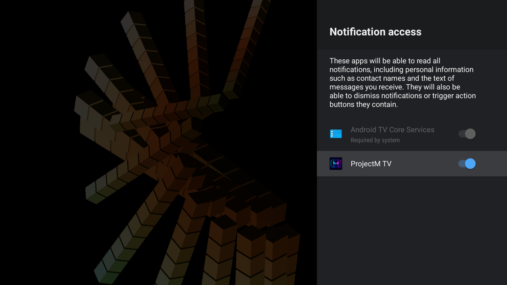

# Install and get started

## Requirements

- Android TV or Google TV running Android 5.0 or later, with OpenGL ES 3.0.
- At least 2 GB of RAM is highly recommended. 4K rendering benefits from 4 GB or more.
- A music app playing **on the same device**. Verified players are Spotify, SoundCloud, SmartTube and [Milkbeat](https://github.com/johnneerdael/Milkbeat); other apps have not been verified.

ProjectM TV visualizes another app's music. It does not play music, and it never uses the microphone.

## Install on the TV

1. Install **Downloader by AFTVnews** from the TV's app store.
2. Open Downloader and enter **4821216**.
3. Allow Android to install apps from Downloader when asked.
4. Confirm installation of the downloaded APK.

The code points to the [latest signed APK](https://github.com/johnneerdael/ProjectM-TV/releases/latest/download/projectM-TV.apk). Every version is available under [Releases](https://github.com/johnneerdael/ProjectM-TV/releases).

## Install from a computer

```sh
curl -LO https://github.com/johnneerdael/ProjectM-TV/releases/latest/download/projectM-TV.apk
adb install -r projectM-TV.apk
```

All production releases use the same permanent signing key. An APK you build yourself with a debug key cannot update a production installation.

## First launch: allow the music visualizer

Start a track in your music app **on the TV**, then open ProjectM TV. Music playing on a phone or on a separate receiver is not available to the app.

Android asks **Allow ProjectM TV to record audio?** Choose **While using the app** (on older Android versions: **Allow**). Android requires this permission for its audio visualizer API. ProjectM TV attaches to the music player's own audio session; it does not use the microphone or save anything. The [engine page](engine/pipeline.md#audio-listening-to-the-player-not-the-room) explains how the player's session is found.

[](images/setup/audio-permission.png)

*The screenshots on this page show the released app on an Android TV 16 emulator. Android menus and wording vary by device and version.*

Finding the player takes a second or two. A preset can move before music is detected, so check the **Audio** meter in the settings panel: **Listening** means music is arriving. If no player is found after a start, a *No audio detected* notice appears in the lower left.

If you selected Deny, allow the permission under Android **Settings › Apps › ProjectM TV › Permissions**, then reopen the app. If the meter stays silent while music plays, see [audio troubleshooting](troubleshooting.md#visuals-do-not-react-to-the-music).

## Track titles (optional)

After the audio permission, a **Show track titles** dialog offers two choices:

- **Configure** opens Android's notification-access settings. On Android 11+ it tries ProjectM TV's own page first, then falls back to the list of apps, Apps, or the main Settings screen.
- **Dismiss** permanently hides the automatic prompt for this installation. You can still open it from **Settings › Track display › Track info**.

[](images/setup/track-titles-prompt.png)

### Enable access with Configure

1. Select **Configure**.
2. Find **ProjectM TV** in the notification-access list, unless Android already opened its page.
3. Turn its switch on. Some Android versions ask you to confirm.
4. Press **Back** to return to ProjectM TV.

[](images/setup/notification-access.png)

[](images/setup/notification-access-enabled.png)

Android's notification-access permission is broader than the feature needs. ProjectM TV uses it only to read the player's media session for cover, title and artist. It does not read notification contents, and visualization works without it.

[](images/setup/notification-confirmation.png)

Choosing Configure does not dismiss the reminder. If you return without enabling access, the dialog can appear again on a later launch.

### Find the setting manually

Look for **Apps › Special app access › Notification access** (these two screenshots are from Android 9). Some devices put Apps under **Device Preferences** first (on the NVIDIA SHIELD: *Settings › Device Preferences › Apps › Special app access › Notification access*).

[](images/setup/android-apps.png)

[](images/setup/special-app-access.png)

### Reopen setup after Dismiss

Open the settings panel with **Center / Enter / Menu**, select **Track display**, then **Track info**. Without access the row reads *Off · Allow* and reopens the same dialog.

[](images/setup/track-display.png)

With access, the cover, artist and title appear in the upper left for as long as the track plays. **Track display** can limit this to 10–60 s per track or switch to a one-line pill in the lower left. **Up / Down / Info** shows the track again.

Covers have been verified with Spotify and Milkbeat. SoundCloud and SmartTube provide artist and title only.

## Pick a preset mood

Open the panel and move to **Preset mood**:

| Mood | What plays |
|---|---|
| **All** (default) | The complete bundled library of 9,606 presets, plus your custom pack if you uploaded one |
| **Chill** | Calmer presets: predicted activity 1–30 |
| **Normal** | Moderate presets: 25–75 |
| **Intense** | Strong movement and brightness changes: 70–100 |
| **Custom** | Only your uploaded pack; appears after an upload |

Moods are predictions from the beta [predictive collections](predictive-collections.md), not guarantees. Chill is a starting point, not a promise of no flashing.

## Good starting settings

The defaults suit most TVs:

| Setting | Default | When to change it |
|---|---|---|
| Auto change | On | Off keeps the current preset |
| Preset duration | 30 s | Longer for slower viewing |
| Advanced › Resolution | Auto, up to the panel's native size | Native or a fixed size to test a preset at full resolution |
| Advanced › Frame rate | Half the refresh rate (30 fps at 60 Hz) | Higher needs more GPU and may lower Auto resolution |
| Advanced › Native trails | Standard | Medium or High for more native detail on 4K panels |
| Advanced › Transitions | Auto | Lightweight on very slow devices |
| Advanced › Skip slow / blank presets | On | Leave on |

If playback stutters, see [Picture quality and performance](picture-quality.md).

## Updates

**Settings › Advanced › Auto-update** is off by default. When on, the app checks GitHub about 10 s after launch and every six hours while open. It downloads a newer stable release, verifies that it is this app with a higher version and the same signing key, and then shows an **Install** row at the top of the panel. Android asks you to confirm, and the first time it may ask you to allow installs from ProjectM TV. Turning the setting off deletes any downloaded update. Installations from F-Droid show *Via F-Droid* and update through F-Droid.

## Privacy

Audio is analysed in memory and never stored or sent anywhere. The app makes network connections only for the opt-in auto-update, and while the [custom pack upload](custom-packs.md) dialog is open, a temporary listener on your local network.
