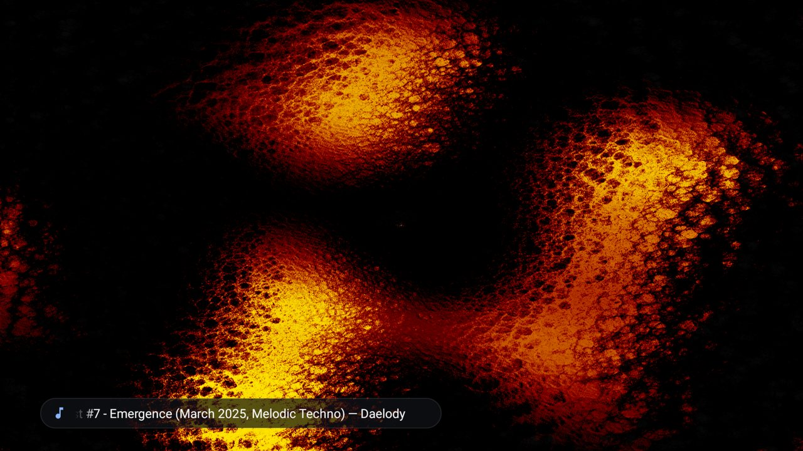

# ProjectM TV user guide

ProjectM TV visualizes music another app plays on Android TV. It runs projectM with 9,606 MilkDrop presets. Start music in your player, open ProjectM TV and control it with your TV remote.

## Start here

- [Install and get started](getting-started.md)
- [Use the remote controls](controls.md)
- [Adjust settings](settings.md)
- [Choose the Dance collection](dance.md)
- [Troubleshoot audio and performance](troubleshooting.md)

## Choose the visuals

| Music category | What it includes |
|---|---|
| **All — default** | The complete 9,606-preset library, in shuffled order |
| **Dance** | 500 existing presets selected for large bass-driven visual changes |

The choice is saved. Your TV's skip list and performance checks still apply, so the eligible count can be lower than the number packaged in a collection.

This guide describes the current source, including the [Native resolution option](settings.md) under evaluation. Auto remains the default. The setup walkthrough uses real screenshots from an earlier isolated test installation on an Ugoos AM6; Android settings can look different on your TV. At least 2 GB of RAM is highly recommended.

## For the curious

The [Dance measurement article](dance-measurement.md) explains the controlled audio experiments, pixel differences, ranking and cache identities. [Build and test](development.md) covers the source and verification tools.

[Project and releases](https://github.com/johnneerdael/ProjectM-TV) · [README quick start](https://github.com/johnneerdael/ProjectM-TV#readme) · [Milkbeat user guide](https://johnneerdael.github.io/Milkbeat/)
