# Preset moods (beta)

!!! warning "Beta"
    Preset moods are an early version of ProjectM TV's predictive preset engine. The current scores come from one short measurement of each preset, and they will be heavily improved in future releases. Better measurements are already being researched, along with [prediction from preset source code](authoring/testing.md#5-predicting-a-preset-from-its-source). Use the moods as a starting point. If a preset feels wrong for its mood, please [report it](https://github.com/johnneerdael/ProjectM-TV/issues).

Open the settings panel and change **Preset mood**:

| Mood | Activity score | Presets | What to expect |
|---|---|---|---|
| **All** (default) | — | 9,606 | The full library, plus your custom pack |
| **Chill** | 1–30 | 2,702 | Slower motion, fewer brightness jumps |
| **Normal** | 25–75 | 4,658 | Moderate activity |
| **Intense** | 70–100 | 2,795 | Strong motion and brightness changes |
| **Custom** | — | your pack | Only your [uploaded presets](custom-packs.md) |

The ranges overlap on purpose: a preset scoring 28 is in both Chill and Normal. Your choice is saved. Automatic changes, **Random** and **Previous** all stay inside the mood. The count shown in the panel excludes presets this TV has skipped. A mood with no eligible presets is not offered.

| Chill | Normal | Intense |
|---|---|---|
| 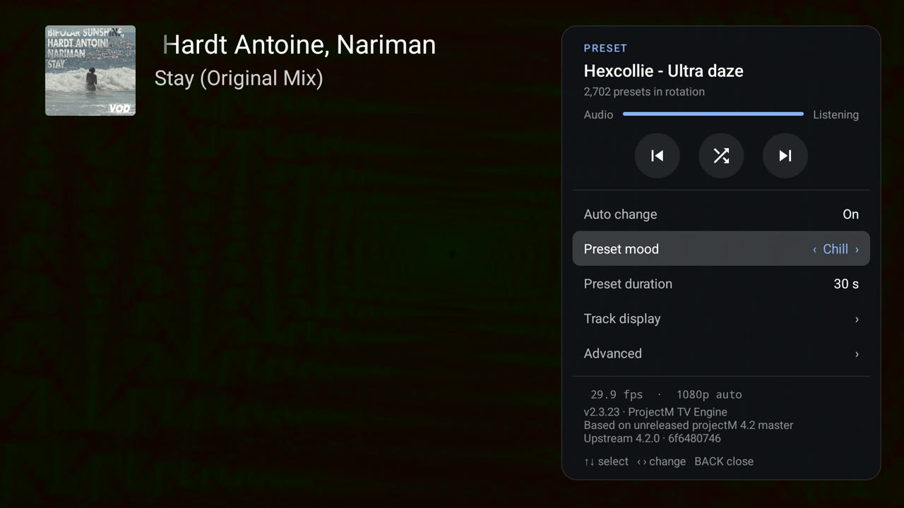 | 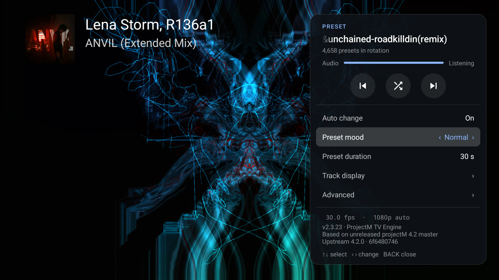 | 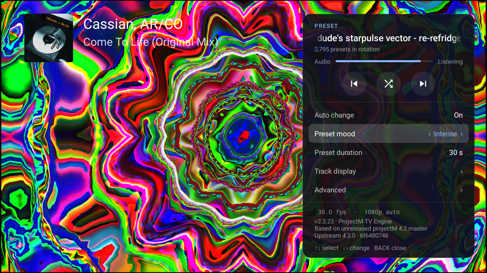 |

## What the moods look like

These captures come from a 1080p Android TV emulator playing different tracks in Milkbeat, with the mood set and a random preset chosen for each. Your music and TV will produce different frames; these show the character of each mood, not a guarantee.

### Chill

| | |
|---|---|
| 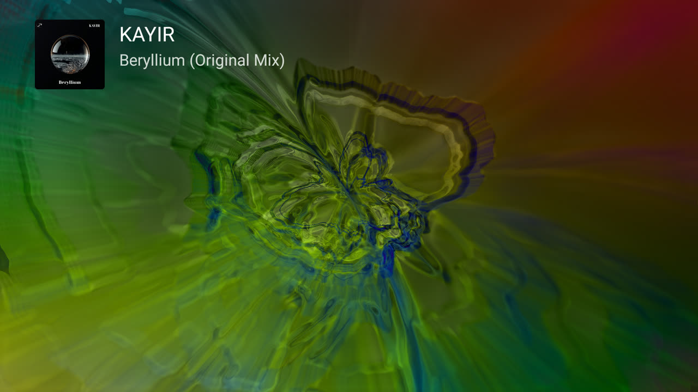 |  |
| *Zylot – The Collective Unconcious (Jelly 5-5)* | *EoS – pointfield 12 deep oceans* |
| 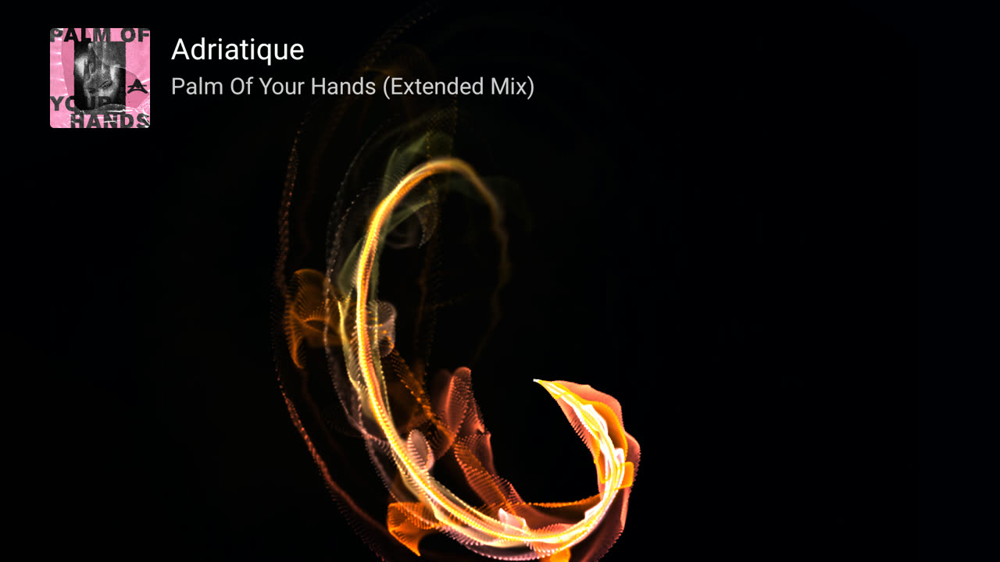 | 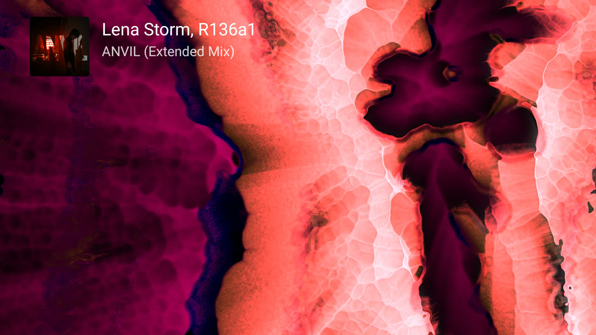 |
| *EoS + Phat – chasers 10 sentinel B* | *LuxXx – Makes Me Cry II (Lifeforms in the Clouds)* |

### Normal

| | |
|---|---|
| 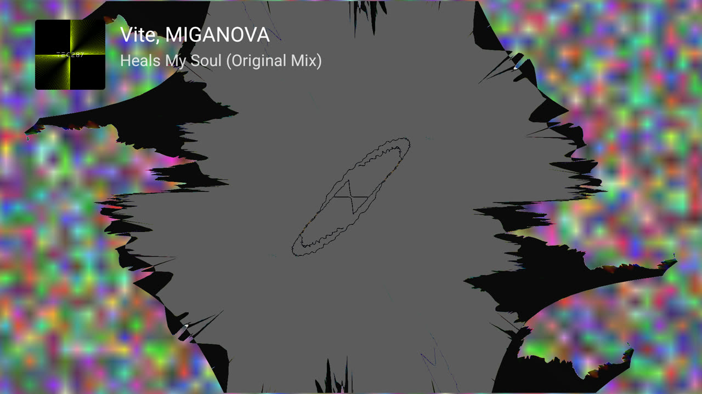 |  |
| *Bdrv Aderrasi – Armada (Battleship) bdrv etAL rolo nz* | *flying hamster – flower borders (version 8) – mash0001* |
| 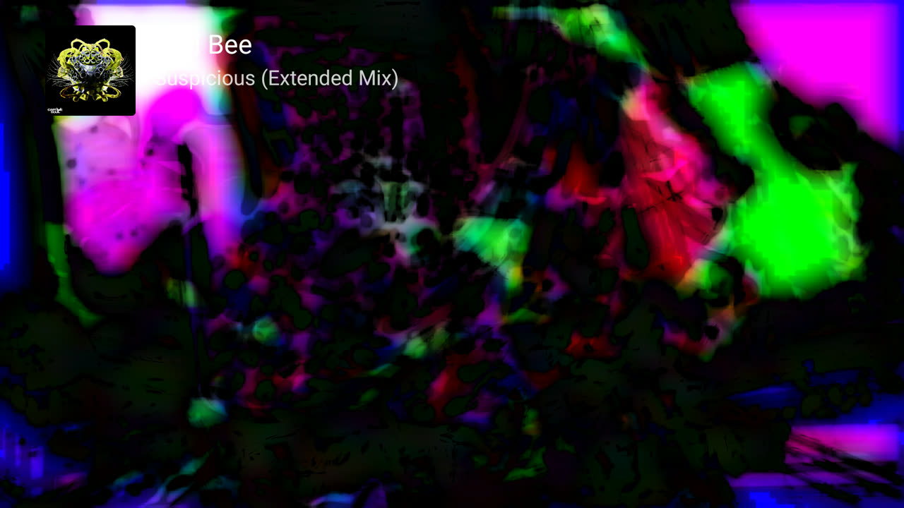 | 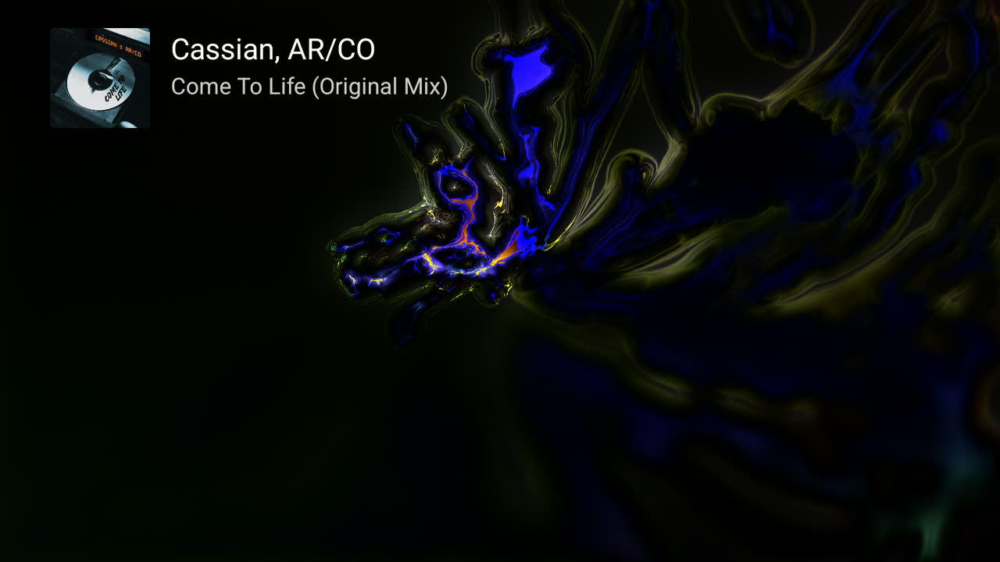 |
| *cortex meat – adm affect non* | *Geiss – Calligraphy (Jelly V3)* |

### Intense

| | |
|---|---|
| 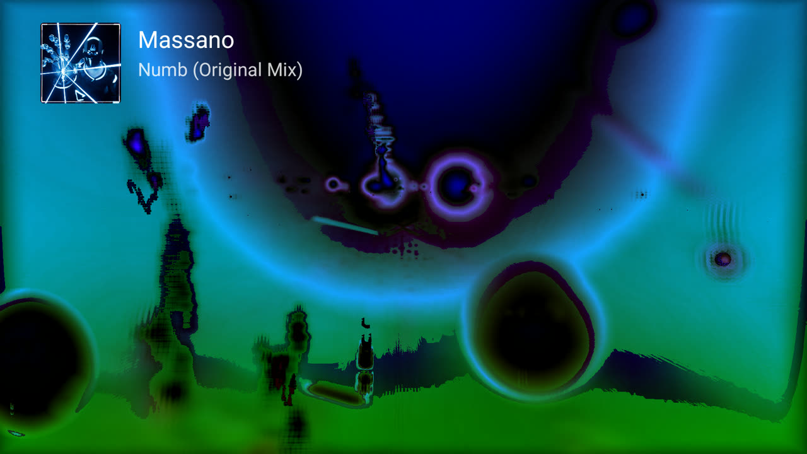 | 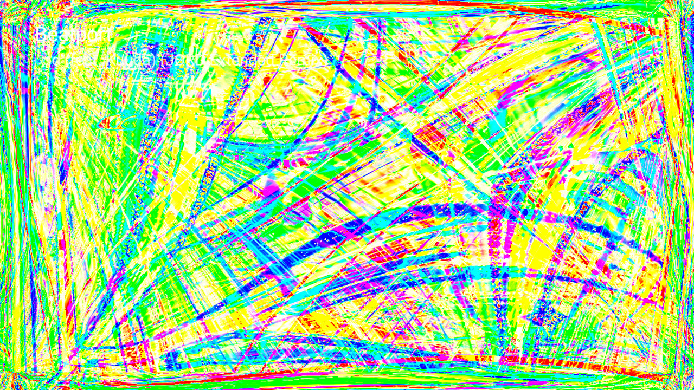 |
| *figurative lesson lard* | *rce-ordinary – microscopic things (crosslinking mix)* |
|  | 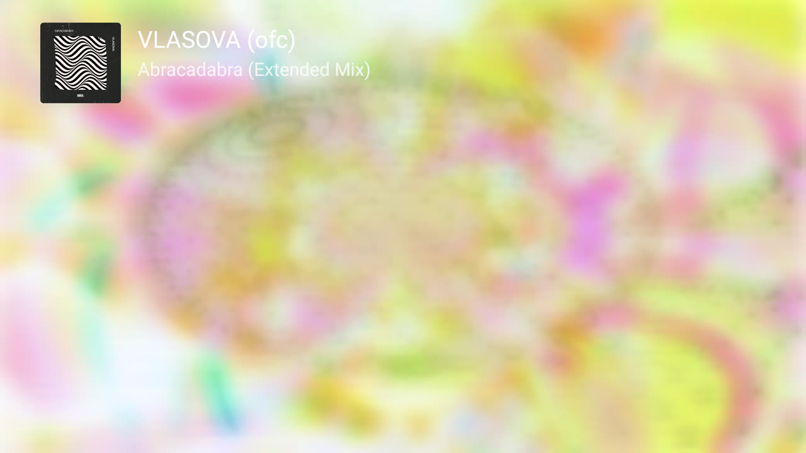 |
| *suksma – coal drapes – mrt fsh behooval roam3 nz+* | *negation entropy (scalar nods)* |

A single still cannot show motion. What separates the moods is how fast and how suddenly these pictures change.

## How the scores are made

The score measures **visual activity**, not musical genre or taste. Each bundled preset was run once through the published ProjectM TV core library (version 2.3.3, in its capped build, which predates the current Native engine based on projectM 4.2) with controlled input:

- 420 frames at 30 fps, at 128×72 pixels with a 48×32 mesh; the first 60 frames are warm-up.
- A synthetic test signal: quiet tones for 0–5 s, a brighter melody for 5–9 s, then melody plus kick-drum pulses for 9–14 s. No real recordings are used or shipped.

Four quantities are measured from the frames:

1. **Coherent brightness transitions per second**: changes of at least 0.1 in normalized brightness over at least 20% of the picture, with the mean brightness also changing by at least 0.1.
2. **Median motion** in screen widths per second, from optical flow sampled at 10 fps.
3. **Mean acceleration** of that motion.
4. **Peak per-pixel change**: the 95th percentile, over frame pairs, of each pair's 95th-percentile brightness change.

They are combined as `4.3673 + Σ weight × log1p(x) / scale`, with weights of about 36.97, 2.47, 50.61 and 23.40. A separate flash term, from paired up-and-down brightness flips, is computed too, and the larger of the two values is used. The raw values are ranked and rescaled so that the least active preset scores 1 and the most active 100. A score therefore places a preset relative to the others; it is not a percentage. The 382 presets that showed no visible activity in the measurement score 1, stay in All, and are left out of the three moods.

The weights were fitted to eight human judgments of real presets. In leave-one-out checks the model placed 4 of 8 in exactly the judged band and 6 of 8 within five points. That is a small calibration set, which is why moods are still beta.

## Known limits

- **One short probe.** Fourteen seconds of synthetic audio cannot show how a preset reacts to every song, or how it develops over minutes.
- **Low resolution.** The probe renders at 128×72; 4K detail and Native trails are not measured.
- **Random inputs.** Random textures and noise differ from run to run.
- **Chill is not a promise.** A Chill preset can still flash on the right music.

Report a mismatch with the preset name (shown in the settings panel), the mood, the song and your TV.

## Predictor development is separate

The current [source predictor](predictor.md) is developing conditional JSON
descriptions of mathematical constructions, materials and audio controls without
rendering frames. Its [export contract](predictor-export.md) is separate from this
measurement bundle. These source traits have not replaced the shipped scores,
and no calibrated source-only Chill/Normal/Intense classifier is claimed.

## For developers

The bundle lives in `core/src/main/assets/preset-genres/`:

- `presets.jsonl` holds each preset's source hash, measurements, score and memberships;
- `manifest.json` holds the model, runtime and signal identities, render settings and checksums;
- one index file per mood.

Verify the bundle with:

```sh
python tools/milk-analyzer/beta_export.py --check --bundle core/src/main/assets/preset-genres
```

The checker recomputes every rank and membership from the recorded measurements and refuses stale source or texture hashes, a different runtime, or a wrong frame schedule. Producing new scores needs an Android emulator and the pinned core library; see the [analyzer README](https://github.com/johnneerdael/ProjectM-TV/blob/main/tools/milk-analyzer/README.md). The app never renders the library itself: it reads the prebuilt indexes.
