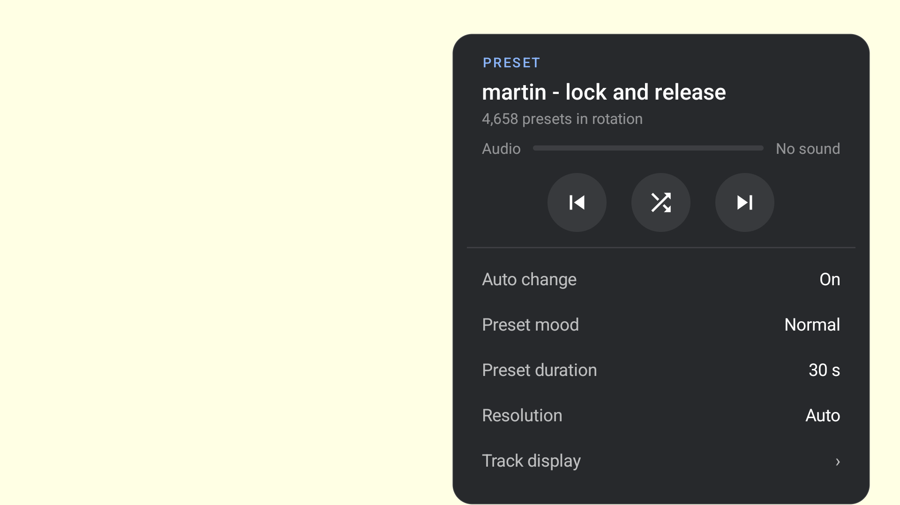

# Predictive collections (beta)

Choose **Preset mood** in the settings panel: **All**, **Chill**, **Normal** or **Intense**. All is the initial default and keeps the full library available. Uploading a [custom ZIP pack](settings.md#custom-preset-pack) selects Custom, which plays only that pack. Custom presets also join All, but never the three scored collections. The choice is saved; automatic changes, Random and Previous stay within your collection, subject to the TV's skip rules. Saved Dance or earlier genre choices return to All.

| Collection | Score range | Packaged presets | Intended starting point |
|---|---|---|---|
| All — default | Unfiltered | 9,606 | The complete library |
| Chill | 1–30 | 2,702 | Lower activity and gentler viewing |
| Normal | 25–75 | 4,658 | Moderate activity, with room at both edges |
| Intense | 70–100 | 2,795 | Stronger movement and brightness changes |



This settings capture is from the isolated API34 emulator test app, with no music playing. It verifies the control label and count, not the appearance or suitability of that preset.

Ranges are inclusive. Scores 25–30 belong to both Chill and Normal; 70–75 belong to both Normal and Intense. Original preset equations and shaders are unchanged.

This is a **beta predictive preset engine**. Scores order activity within this collection; they are not percentages of prediction accuracy. Chill is a useful starting point, not a guarantee of smooth motion or no flashes. Different songs, random images and seeds, resolutions and GPU drivers can change the result. Report a mismatch with the preset name, mood, music, device and render settings so it can be traced back to the model.

## What supplies the predictions

The numerical backend is the standard published **ProjectM-TV:core 2.3.3 AAR**, with its patched JNI renderer and bundled textures. It is not the unpatched upstream library or Preset Lab's private desktop renderer. The release commit, AAR and ARM64 native-library hashes are pinned in `tools/milk-analyzer/profiles/published-core-v2.3.3.json` and copied into the bundle manifest.

Each preset gets one load and 420 frames at 30 fps, a 128×72 GLES3 pbuffer and a 48×32 mesh. A declared clock helper supplies the test timeline; the published native library is unchanged. The first 60 frames are warm-up. A shared synthetic mono reference contains quiet tones for 0–5 seconds, a brighter melodic section for 5–9 seconds, then the melodic section plus low-frequency kick pulses for 9–14 seconds. There are no user recordings in the shipped bundle.

The frozen **2.3.3** AAR used for these predictions has the **capped** rendering policy; its APK used the Native-capable policy. New APK/core releases use the single Native core with automatic resolution. The packaged predictions retain their pinned 2.3.3 measurement identity. This low-resolution probe does not certify appearance or ranking at the TV's render size, including above-reference feedback compensation. The helper calls `srand(12345)`; the evaluator keeps its native thread-local Mersenne Twister seed. Shader/noise and image choices using `random_device` are not fixed by that call. One load does not sample every possible random state or image choice.

## Activity calculation

The frozen direct-delta beta model combines four numerical descriptors:

- Coherent brightness transitions per second, measured on all 30-fps frames. A transition needs a normalized pixel-brightness change of at least 0.1 across at least 20% of the image, plus a mean-brightness change of at least 0.1.
- Median motion in viewport widths per second, using optical flow sampled at 10 fps.
- Mean acceleration from that motion estimate.
- The 95th percentile, over 30-fps frame pairs, of their per-pixel 95th-percentile brightness change. This uses the same pixel coordinates rather than optical-flow matching.

For feature vector `x`, the raw activity is `4.3673 + sum(weight * log1p(x) / scale)`. The weights are approximately `36.9713, 2.4738, 50.6107, 23.4018`; the exact values and scales are in `audience-model-direct-delta-v2.json`. A paired coherent-flash proxy can raise this value. When optical flow lacks a usable result, the record explicitly identifies a temporal-change/spatial-gradient motion proxy. These are numerical activity features, not AI image labels or an independent source-only appearance prediction.

Raw activity remains unclipped. Moving/activity-bearing presets are sorted by it, equal values share an average ordinal position, and those positions are rescaled so the lowest distinct group scores 1 and the highest scores 100. This gives a relative spread rather than measuring distance in an absolute perceptual unit. Rebuilding a changed library can shift scores. A collection with no distinct activity values would receive midpoint scores.

The 382 effects with no visible activity in the probe receive score 1 with an explicit inactive flag, remain in All and are excluded from the three curated groups. Failed or missing results cannot be exported as calm presets.

The model is refitted to these actual native features using the original eight recorded human judgments, mapping Party to Intense. Those judgments came from Milkbeat 0.9.0/core 2.2.2, with device and music mostly unspecified; sample 1's Party lean was tentative and included a possible darkness issue. They are transferred labels, not a matched-condition validation. Leave-one-out base-model diagnostics give 4/8 strict band matches and 6/8 within five points, with large misses for samples 1 and 8. These figures are not accuracy measurements for the final collection ranks. The model remains a small development candidate. Colourfulness, fractal structure, taste and long-term feedback evolution are not separately certified by this score. A 14-second probe can miss later behaviour.

## Evidence and reproducibility

`core/src/main/assets/preset-genres/presets.jsonl` records every preset's full source hash, native memory weight, derived raw activity, original measurement activity, score, activity state and membership. `manifest.json` records beta status, model/runtime/PCM hashes, render settings, collection counts and checksums. The three index files contain original filenames and master-index memory weights. All uses `presets.idx` plus the active custom-pack index, if present.

The scorer stops on a failed measurement; its cause must be diagnosed and the case repaired before continuing. Retry mode accepts only existing unresolved records; it cannot bypass a failure by selecting a different, unmeasured preset. The required metadata transfer is bounded and records a failed measurement if it times out. Diagnostic collection errors remain separate from the measurement. The exporter refuses missing or failed rows, stale source or texture hashes, another AAR flavour, mismatched runtime identities or a wrong frame schedule. Its verifier recalculates ranks and memberships and compares them with the indexes. Checksums alone are insufficient to establish correct membership.

```sh
python tools/milk-analyzer/beta_export.py --check --bundle core/src/main/assets/preset-genres
python -m pytest tools/milk-analyzer/test_beta_collections.py tools/milk-analyzer/test_beta_export.py -q
```

Scoring requires an owned Android emulator, adb, NumPy/OpenCV, the published AAR and prepared Java/clock-helper artifacts. Use the [analyzer README](https://github.com/johnneerdael/ProjectM-TV/blob/main/tools/milk-analyzer/README.md) for preparation and the exact invocation. The other agent's historical corpus is supporting evidence and is not substituted for this run.

New export, after every row is resolved:

```sh
python tools/milk-analyzer/beta_export.py --run build/predictive-beta/scores --aar build/predictive-beta/core.aar --bundle core/src/main/assets/preset-genres
```

No full corpus is rendered during app use. The app reads the prebuilt indexes; subsequent scoring improvements can update them in a new release.


Archived scorer versions retain the first producer's exact source and each
completed row's original evidence identity. The manifest declares both contexts;
all numerical/render inputs must match and the measurement program is compared as
an AST outside diagnostic cleanup and resume bookkeeping. This preserves completed
measurements without silently relabelling them as results from the repaired code.

The initial producer incorrectly applied a motion-compensated brightness model to direct pixel changes. The corrected bundle refits the coefficients to the actual direct-delta vectors rather than renaming that feature. Original measurements and their producer/model identities remain unchanged. A separate `derived_scoring` identity pins the new model, scoring function and the model's calibration evidence/fitter hashes; verification checks both original and derived activity independently. The new scorer uses the corrected model for future runs.
