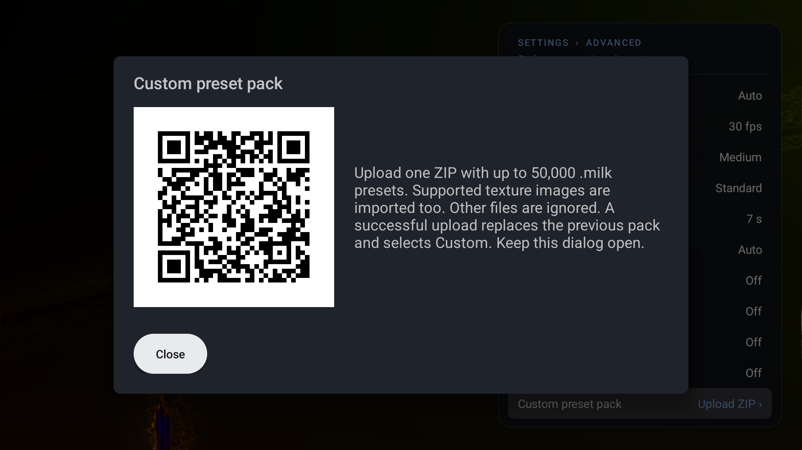
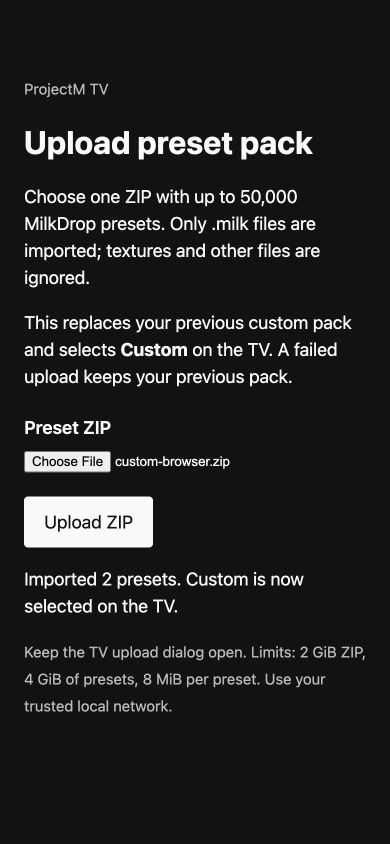

# Settings reference

Open the panel with Center, Enter or Menu. Use Up / Down to select a row and Left / Right to change its value.

The panel identifies **ProjectM TV Engine**, the maintained projectM fork, beside the app version. **Based on unreleased projectM 4.2 master** on the next line identifies the development snapshot. The final line shows its upstream numeric version (`4.2.0`) and pinned commit `6f6480746`; it is not an upstream 4.2 release. Some older setup screenshots below predate this naming.

All is the default preset mood. Your selected collection is saved. The beta predictor uses overlapping score bands: Chill 1–30, Normal 25–75 and Intense 70–100. Saved Dance selections return to All.

| Setting | Values | Default |
|---|---|---|
| Auto change | Off, On | On |
| Preset mood | All, Chill, Normal, Intense, Custom (after upload) | All; Custom after upload |
| Preset duration | 10, 15, 20, 30, 45, 60, 90 s | 30 s |

The APK and the single published core use the Native renderer with **Auto resolution by default**. The controller adjusts render size in real time for the selected target frame rate and available memory, up to the detected full panel size. A 4K panel can render at 3840×2160 even when Android’s menus run at 1080p. Slow or memory-heavy workloads can render lower and are scaled to fill the screen.

**Advanced › Resolution** switches between Auto, 720p, 1080p, 1440p and 4K (only sizes supported by the detected panel), plus Native. Native means the full physical panel: **Native (4K)** requests 3840×2160 on a 4K TV, even with a 1080p Android UI. The choice is saved. Fixed/Native modes keep the requested size regardless of FPS and disable slow-preset skipping so a demanding preset can be tested. Memory protection can still lower the actual render size temporarily and restore it after headroom recovers; check Diagnostics before claiming a 4K run. Auto retains its existing behavior and remembered starting height. There is no manual RAM-limiter control. Old saved fixed-resolution and memory-limit values no longer override the automatic controller. It reserves memory headroom before raising resolution, accounts for the extra rendering allocations of trails and transitions, and lowers resolution under memory pressure. This reduces pressure on the music player; it cannot guarantee that every Android/vendor memory policy will keep every background process alive.

On nominal 4 GB+ devices (at least 3,584 MiB visible to Android), the memory reserve follows Android’s pressure threshold rather than a fixed percentage of total RAM. Smaller devices retain a more conservative reserve. Auto responds to the available memory left by Android and background apps, then checks the rendering growth and temporary resize allocations before increasing resolution. Android reclaims cached apps itself; ProjectM does not close other apps, require root, or add a cleanup setting. It cannot obtain a complete per-app memory inventory on every Android version.

**Native trails** has three values. Standard is the default: at supported render sizes above 1330p, it keeps feedback at an authored canvas (1280×720 at 4K) and draws this frame’s waves, shapes and composite at native resolution. Medium and High add native trail detail with gain caps of 0.5 and 1; both run the same additional passes. Their difference is the amount of detail, not an intended performance saving. The gain is limited near black and white to prevent clipping from adding brightness. Higher levels use additional textures and GPU work, so automatic quality can choose a lower resolution. Waves and shapes use authored-size feedback while the same evaluated geometry is drawn sharply at native size; changing trail level does not run their equations twice.

The trails preference remains available and saved while the controller changes resolution. At smaller render sizes, or when an integer canvas is incompatible, the existing diffusion path is used. Driver shader/resource failures also fall back. **Diagnostics** shows the selected level, actual active canvas or inactive/fallback reason, the current render size, and automatic memory status.

The canonical `projectM-TV-core.aar` now contains this Native core; the separate capped AAR is retired. Embedding apps use the shared automatic controller. See the [development instructions](development.md#core-rendering-policies).

*Track display ›* opens a panel for the playing track:

| Setting | What it does | Default |
|---|---|---|
| Track info | Shows the cover, artist and title of the playing track in the upper left, as Milkbeat does; *Off · Allow* while notification access is missing, select it for how to allow it (see [Track titles](getting-started.md#track-titles)) | On |
| Show for | 10, 20, 30 or 60 s from the start of each track, or *Always* while music plays (it goes when playback stops or pauses) | Always |
| Pill style | Shows the track as one line (*Title — Artist*) in the small pill in the lower left instead | Off |

*Advanced ›* opens a second panel:

| Setting | What it does | Default |
|---|---|---|
| Resolution | Auto; supported fixed sizes (720p, 1080p, 1440p, 4K); Native follows the physical panel. Memory protection remains active | Auto |
| Frame rate | The TV's refresh rate, half or a quarter of it, at least 24 fps (e.g. 30 or 60 fps at 60 Hz) | Half the refresh rate: 30 fps at 60 Hz, 25 at 50 Hz |
| Detail | Mesh detail for preset motion: Minimal, Low, Medium, High, Ultra | Depends on the device |
| Native trails | Standard, Medium, High; active at supported render sizes above 1330p. Medium and High add more trail detail with the same additional rendering work | Standard |
| Transition | How long the blend from one preset to the next takes: Instant, 1–10 s | 7 s (2 s on low-end devices) |
| Transitions | *Auto* blends the two running presets and keeps the frame rate up: when the GPU is the limit, both render at a lower resolution during the blend (75% to start, down to 50%, back up when there is headroom); when the CPU is the limit, the outgoing preset renders every second frame. *Classic* always blends at full resolution. *Lightweight* fades a still image of the old preset for at most 3 s. | Auto |
| Cut on loud beats | Lets projectM cut to the next preset on a loud beat, like MilkDrop, instead of only blending | Off |
| Skip slow presets | In Auto resolution only, skips presets that stay below half the target frame rate even at the lowest resolution, or that a lower resolution does not help (limited by the CPU); such a preset is skipped for good on this TV | On |
| Skip blank presets | Moves on from presets that stay black while music plays; skips them for good the second time | On |
| Auto-update | Checks GitHub for a new release at every launch and every 6 hours while open, and downloads it; an *Install* row then appears at the top of the settings panel. *Via F-Droid* when the app was installed from F-Droid | Off |
| Custom preset pack | Upload one ZIP from a browser on the same network; replaces the previous pack and selects Custom | No pack |
| Skipped presets | Shows how many presets are skipped; select it to reset the list | – |
| Diagnostics | Render size, panel, UI size, frame rate, Native trails level/canvas or fallback, blend (style and resolution), audio source and level, track display (access, corner or pill, how long), update status, device tier | – |

The Advanced screenshot uses this change’s isolated 4K TV emulator with no audio source; Auto is selected and memory budgeting reduces the render size to 540p, where High trails is inactive. The panel scrolls vertically when needed, keeping all rows reachable by D-pad. Main and Track display screenshots use an earlier isolated installation. The tables describe current behavior. See [Predictive collections](predictive-collections.md) for collection details and [Troubleshooting](troubleshooting.md) for audio and performance problems.

## Custom preset pack

Open **Advanced › Custom preset pack** and scan the TV’s QR code with a phone on the same network to open the upload page. Choose a ZIP, select **Upload ZIP**, and keep the TV dialog open until import finishes. Closing the dialog or leaving ProjectM TV stops the listener and cancels an unfinished upload. The temporary QR code changes every time the dialog opens. A reachable IPv4 LAN address is required; Wi-Fi/Ethernet is preferred over VPN interfaces. ZIP transfer has a one-hour total limit. Use trusted local Wi-Fi or Ethernet; HTTP uploads are not encrypted. Guest-network isolation may block access.

One active pack supports up to **50,000 `.milk` files**, including nested folders and `.MILK` extensions. Include up to 5,000 textures as PNG, JPG/JPEG, TGA, BMP/DIB or DDS. Texture stems (filenames without extensions) must be unique ignoring case, even across folders/formats, because presets refer to images by that name. Custom presets prefer their pack’s images and fall back to bundled textures; bundled presets retain bundled textures during All/blends. Unsupported files are ignored. Some DDS compression formats are not supported by all TV GPUs. ZIP limits: 2 GiB compressed, 4 GiB of combined extracted presets/images, 8 MiB per preset, 64 MiB per texture and 250,000 total entries. Replacement temporarily needs storage for the old pack, the incoming ZIP and the new pack. Invalid names, corruption, cancellation and insufficient storage leave the previous pack in place.

A successful import replaces the previous pack and saves **Custom** as the selected mood. Custom plays only uploaded presets. **All** combines bundled and custom presets; **Chill**, **Normal** and **Intense** continue using only their scored bundled presets. Existing load-failure, blank and slow-preset skips apply to custom presets. The pack and selected mood persist across app restarts and updates. Custom packs are excluded from Android backup; upload the ZIP again after reinstalling, clearing app data or restoring onto another device. No file picker or storage permission is needed.

The TV capture uses the task’s isolated API36 Android TV emulator; its QR code is an example and is no longer active. The browser capture uses the same upload endpoint on localhost with a synthetic ZIP. Scan the current QR code displayed by your own TV. These captures verify the controls, not the appearance of uploaded presets.
