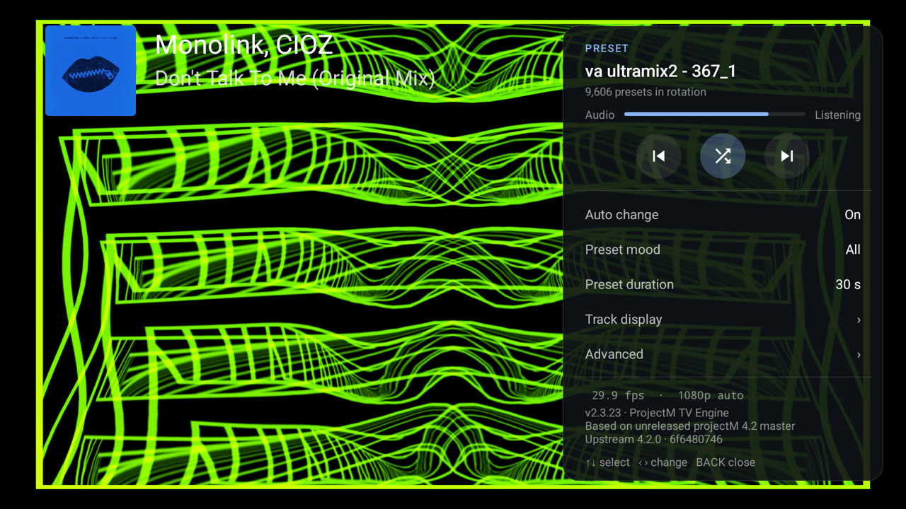
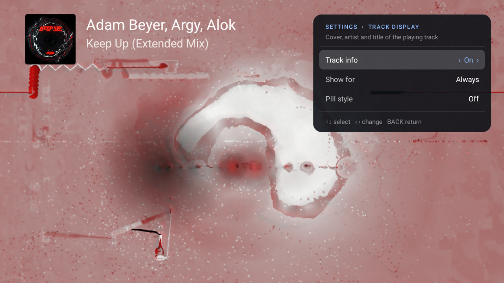
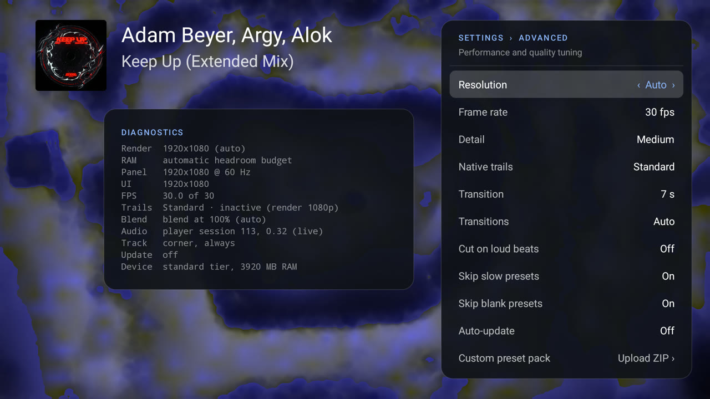

# Settings reference

Open the panel with **Center**, **Enter** or **Menu**. **Up / Down** selects a row and **Left / Right** changes it. Every setting is saved on the TV.

## Main panel

| Setting | Values | Default | What it does |
|---|---|---|---|
| Auto change | Off, On | On | Change presets automatically after *Preset duration* |
| Preset mood | All, Chill, Normal, Intense, Custom | All | Which presets play. A mood with no eligible presets on this TV is not offered. Custom appears after a [pack upload](custom-packs.md). See [Preset moods](predictive-collections.md) |
| Preset duration | 10, 15, 20, 30, 45, 60, 90 s | 30 s | How long each preset plays with Auto change on |
| Track display › | | | Opens the track panel |
| Advanced › | | | Opens performance and quality settings |

## Track display

| Setting | Values | Default | What it does |
|---|---|---|---|
| Track info | Off, On; *Off · Allow* without access | On | Shows cover, artist and title in the upper left. Without notification access, selecting it opens the [setup dialog](getting-started.md#track-titles-optional) |
| Show for | 10 s, 20 s, 30 s, 60 s, Always | Always | How long after a track starts. *Always* keeps it while music plays; it hides 2 s after playback stops or pauses |
| Pill style | Off, On | Off | Shows *Title — Artist* on one line in the small pill in the lower left instead |

## Advanced

| Setting | Values | Default | What it does |
|---|---|---|---|
| Resolution | Auto; 720p, 1080p, 1440p, 4K (up to the panel); Native (*panel*) | Auto | How large ProjectM TV renders. See [Picture quality](picture-quality.md#resolution) |
| Frame rate | The refresh rate, ½ or ¼ of it, at least 24 fps | 30 fps at 60 Hz, 25 at 50 Hz | Target frame rate, paced to the display |
| Detail | Minimal 24×16, Low 32×24, Medium 48×32, High 64×48, Ultra 96×72 | High on SHIELD/Tegra, Low on low-RAM devices, otherwise Medium | Warp mesh size. Per-vertex equations run on the CPU for every mesh point |
| Native trails | Standard, Medium, High | Standard | How feedback is drawn above 1330p. See [Picture quality](picture-quality.md#native-trails) |
| Transition | Instant, 1–10 s | 7 s (2 s on low-RAM devices) | Blend length for automatic changes. Instant cuts without blending and halves the memory reserved for two presets |
| Transitions | Auto, Lightweight, Classic | Auto | How automatic changes blend. See [Picture quality](picture-quality.md#transitions) |
| Cut on loud beats | Off, On | Off | Lets projectM cut to the next preset on a loud beat, as MilkDrop does |
| Skip slow presets | Off, On | On | In Auto resolution, permanently skips presets that stay below half the target frame rate even at the lowest resolution, or that a lower resolution does not help |
| Skip blank presets | Off, On | On | Moves on from presets that stay black while music plays; skips one permanently the second time |
| Auto-update | Off, On; *Via F-Droid* | Off | Checks GitHub for new stable releases. See [Updates](getting-started.md#updates) |
| Custom preset pack | *Upload ZIP ›* | No pack | Upload your own presets from a phone or computer. See [Custom preset packs](custom-packs.md) |
| Skipped presets | *None*, or *N · Reset* | | Shows how many presets this TV skips; select it to clear the list |
| Background compile | Off, On | On | Compiles the shaders of the next, random and previous presets on a second thread with its own OpenGL context, so switches do not pause. *Off* compiles them at the switch instead: the picture can hold for a second or two at each change. Troubleshooting only, see [The app closes at preset changes](troubleshooting.md#the-app-closes-at-preset-changes) |
| Shader binary cache | Off, On | On | Keeps compiled shader programs as driver binaries and reuses them in the background thread's and the render thread's contexts. *Off* always compiles from source. Troubleshooting only, see [The app closes at preset changes](troubleshooting.md#the-app-closes-at-preset-changes) |
| Last exit | *None recorded*, or the reason and how long ago | | The latest time the app ended while on screen, from Android's exit records (Android 11 and later). Select it for the [exit report](#exit-report) |

The Advanced panel scrolls when its rows do not fit; D-pad focus brings each row into view.

## Diagnostics

Opening **Advanced** also shows a **Diagnostics** card beside it with live values:

| Line | Example | Meaning |
|---|---|---|
| Render | `3840x2160 (auto)` | Current render size and mode: *auto*, *native* or *fixed* |
| RAM | `automatic headroom budget` | *resolution reduced for memory headroom* when memory protection is lowering the size |
| Panel | `3840x2160 @ 60 Hz` | The physical display mode |
| UI | `1920x1080` | Android's interface size, often 1080p on a 4K TV |
| FPS | `30.0 of 30` | Measured and target frame rate |
| Trails | `Standard · 1280×720 canvas` | Native trails level and its state: the active canvas, *inactive (render 1080p)*, *canvas fallback* or *shader/resource fallback* |
| Blend | `blend at 75% (auto)` | The transition mode and its current blend scale |
| Audio | `player session 1234, 0.42 (live)` | Where audio comes from: *no capture (permission?)*, *no player session found yet*, *silent / no data* or the live level |
| Track | `corner, always` | Track display state, or *no access* with the Android path to enable it |
| Update | `up to date, checked 14:02` | Auto-update state |
| Device | `standard tier, 3800 MB RAM` | [Device tier](picture-quality.md#device-tiers) and RAM |
| GPU | `Mali-G52` | The graphics chip as its driver names it |

## Exit report

Selecting **Advanced › Last exit** opens **Recent exits**: the device, Android version, GPU and the current state of the two troubleshooting switches (*Now:*), then up to five recent exits of the app, newest first. Each exit shows:

- how long ago and why it ended, as Android recorded it: for example *crashed (native code)*, *killed for low memory*, *killed by signal 11 (SIGSEGV)*, *stopped by the system* or *force stopped*;
- whether the app was *on screen* or only running *in the background* (for example for track titles);
- Android's description and the memory the app used at that moment, when Android provides them;
- for the last process that showed visuals, the **switches** it ran with (which can differ from today's settings) and what the engine was doing: the **render** line (*loading*, *blending into*, *showing* a preset, with its size) and the **prewarm** line (*compiling* a preset in the background, or *idle*), each with the seconds before the exit.

The app keeps those two lines in a small file in its own storage and overwrites them in place; it never sends them anywhere. Android 10 and older have no exit records: the report then shows only the last render and prewarm lines. Take a photo of the report when you report a crash.

## Notices

Small notices can appear in the lower-left pill:

- **No audio detected**: no player session was found after a start. See [Troubleshooting](troubleshooting.md#visuals-do-not-react-to-the-music).
- **ProjectM TV *version* is ready to install: open the settings**: an auto-update has been downloaded. The **Install** row appears at the top of the main panel.
